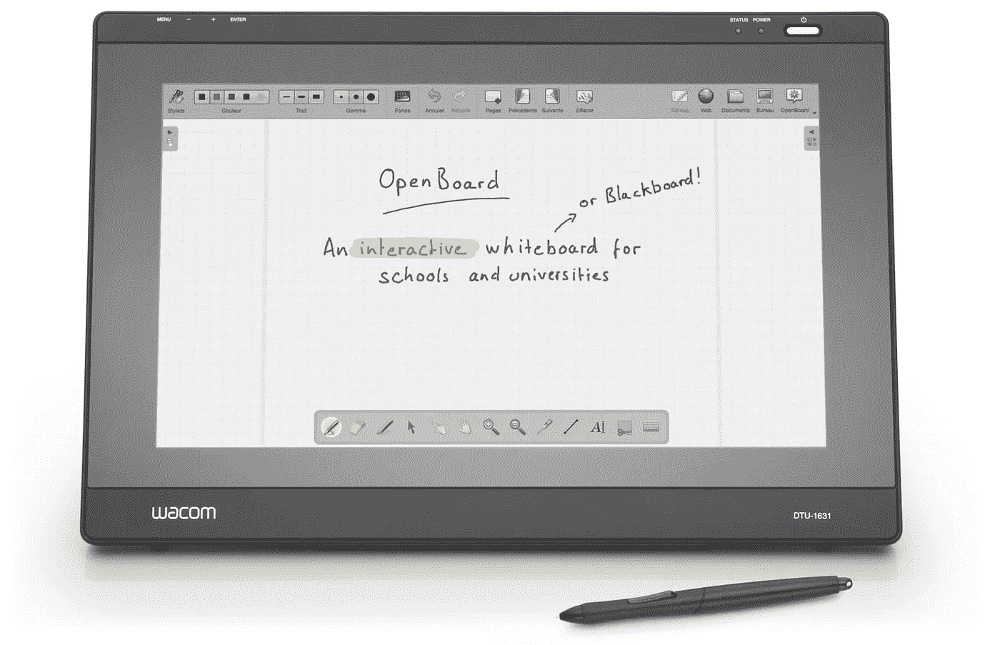
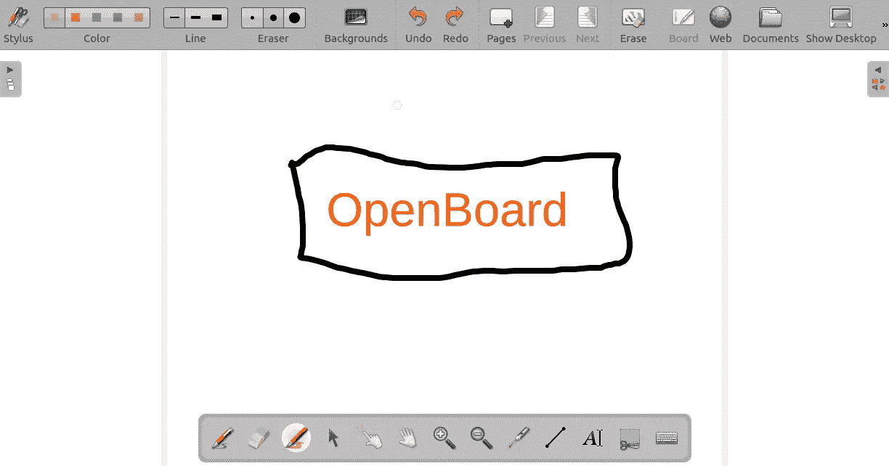
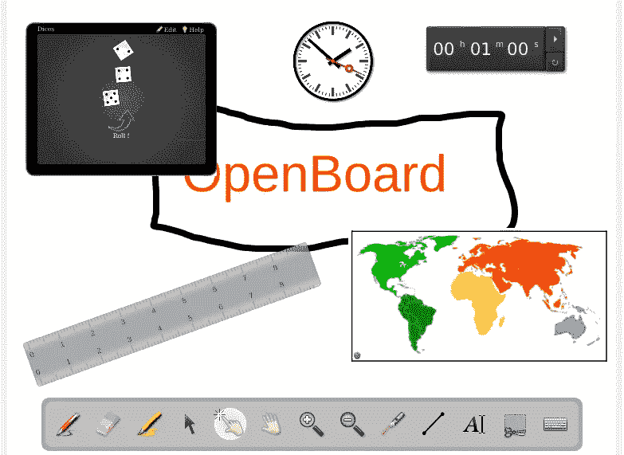

# OpenBoard——本月最佳应用

> 原文：<https://medium.com/hackernoon/openboard-app-of-the-month-90d3c4711a3e>



© openboard.ch

我们学校有一些交互式白板，我们也想在 Ubuntu 下使用。作为软件，我们使用 OpenBoard。对我来说，OpenBoard 是另一个在学校使用的必备软件。如果你没有交互式白板，OpenBoard 也可以很好地使用。

# 安装开放板

你可以直接从[他们的网站](http://openboard.ch/index.en.html)下载安装 OpenBoard。不幸的是，Ubuntu 16.04 目前只有一个版本，18.04 还没有。下载后，您可以安装 OpenBoard，如下所示:

```
$ wget [https://github.com/OpenBoard-org/OpenBoard/releases/download/v1.4.1/openboard_ubuntu_16.04_1.4.1_amd64.deb](https://github.com/OpenBoard-org/OpenBoard/releases/download/v1.4.1/openboard_ubuntu_16.04_1.4.1_amd64.deb)$ sudo dpkg -i openboard_ubuntu_16.04_1.4.1_amd64.deb
```

# 特征

## 使用方便

OpenBoard 提供了一个排列清晰的界面，你可以在其中快速找到自己的路。在屏幕底部，你会发现各种工具，如钢笔，荧光笔，激光笔等..在上边缘，您可以调整颜色、线条粗细或页面和页面背景的高级设置。如果需要，您可以在右侧显示库(图像、声音、视频等)。



## 迷你应用

OpenBoard 提供了一些迷你应用，其中一些非常有用。有钟表、倒计时、OpenStreetMap、谷歌地图、计算器、尺子等小工具。此外，还有骰子、魔盒等小型互动应用。可用。这些可以单独配置并集成到您自己的课程中。



## 播客/截屏模式

从 1.4 版本开始，播客或截屏模式也可以在 Linux 版本中使用。这允许您录制您的课程或演示文稿(有声或无声)。如果你愿意，OpenBoard 可以直接在 Youtube 上或者在你自己的网络/内联网上发布这个视频。这个特性当然很有趣，因为它提供了一种全新的可能性，可以让其他人也能学到一课或其中的一部分。

## 其他功能

*   可以为页面设置不同的背景(如方框或线条)
*   视频，音频文件可以集成
*   集成网络图像搜索
*   文档管理，用于组织单个页面和文档

# 结论

如果你的教室里有一个屏幕、一个投影仪甚至一个交互式白板，OpenBoard 是[很棒的软件](https://openschoolsolutions.org/category/app-of-the-month/)，它很容易使用。它提供了许多扩展和设计可能性，因此对您的创造力只有很少的限制。

*最初发表于*[*【openschoolsolutions.org】*](https://openschoolsolutions.org/openboard-app-of-the-month/)*。* ***注册*** *订阅我们的时事通讯，获取免费的 PDF 格式，并为您的课堂提供出色的开源应用程序，或者在 Twitter 上关注*[*@ OpenSchoolZ*](https://twitter.com/OpenSchoolZ)*。*