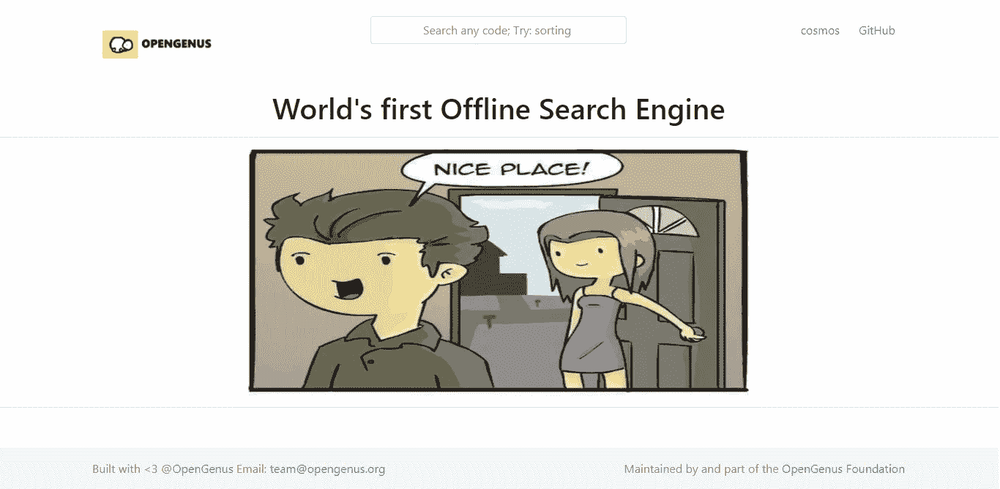
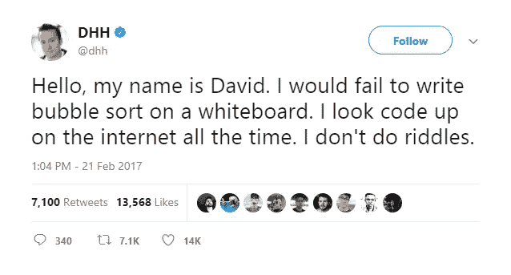

# 离线工作的搜索引擎——open genus Quark

> 原文：<https://medium.com/hackernoon/opengenus-foundation-offline-search-engine-e5f60f047ab4>

过去十年以来，我们的世界已经从搜索转向社交。尽管如此，人类在互联网上的基本行为是搜索。这支持了谷歌、必应和其他搜索引擎的高流量。

> 我们能在没有网络的情况下享受搜索吗？

是的。 [OpenGenus](https://hackernoon.com/tagged/opengenus) 基金会的使命是将互联网最好的部分离线，我们有了第一个离线搜索引擎。

最近，我们看到了我们未来的两种面貌。一方面，通过 Project Loon 等创新项目，互联网覆盖范围正在迅速扩大，而且价格日益低廉。另一方面，我们看到了一个连通性有限的世界。反对网络中立和 60%的世界人口被切断联系给我们的未来敲响了警钟。

> 如果你正在读这篇文章，你是幸运的。你喜欢互联网。

互联网的主要用途之一是学习。学习和人类努力的旅程是无止境的。然而，在基本层面上，我们倾向于一遍又一遍地搜索相同的东西，这就是为什么搜索历史如此有效，并且是一种宝贵的信息。

> 每一代学生都在寻找与上一代学生几乎相同的东西。

如果上一代收集了这些信息，那么下一代就可以减少它的搜索时间。

OpenGenus 基金会的核心目标之一是**减少花在搜索上的时间，增加花在学习上的时间**。

这个搜索引擎是几个月前开始的大规模合作的成果。800 多人在历史上留下了印记。

> 我们正在走向一个离线的世界。

The World’s first Offline Search Engine

这是第一个版本，可以看作是即将推出的伟大产品的预览。本搜索引擎为程序员解决了这个问题。编码人员倾向于用他们喜欢的语言搜索特定算法或数据结构的实现。

实现非常有用，因为人们倾向于扩展现有代码来构建下一个大东西。

How can David search if there is no internet?

> 如果没有互联网，DHH 如何搜索泡泡排序？

世界上数百万人也面临着同样的问题。

所有这些疑问答案都是使用开属夸克。

它是一个扩展，只为你离线工作。这是你需要把你的学习提升到下一个层次的下一件事。搜索引擎返回各种算法和数据结构的代码，是让我们对未来放心的完美工具。

最好的部分是 OpenGenus 基金会通过开放的文化运作，你也可以加入并在世界历史上留下印记。这个搜索引擎不跟踪你，所以，你的搜索是私人的。

去搜索让你写代码吧！

你可以通过下载一个 chrome 扩展并点击浏览器上的图标来使用搜索引擎。

> 让我们使我们的未来稳定而伟大

open genus:[OpenGenus.org](http://opengenus.org/)；[GitHub](https://github.com/opengenus)；

世界首个离线搜索引擎:OpenGenus Quark

请继续关注运行 OpenGenus Foundation 的大型组织的进一步令人兴奋的更新。