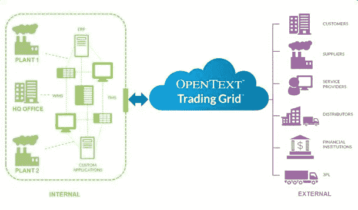

# OpenText:区块链、物联网和人工智能的融合将为供应链自治铺平道路

> 原文：<https://medium.com/hackernoon/opentext-convergence-of-blockchain-iot-ai-will-lay-out-the-path-for-supply-chain-autonomy-fcdd466c4d98>

> 作者:慧贤

> 供应链管理的现状存在一个很大的漏洞——基础设施被分割成线下和线上两部分。结果，这导致产品放错地方和库存管理不善；供应链管理系统既不是单一的实体，也不是透明的。

供应链中有各种节点:

*   原材料的来源
*   加工中的材料
*   制成品
*   交付成品的分销网络

在这四个主要节点之外，供应链从收获资源、产品分销到产品上架销售，沿途经过数百万人。当产品存在缺陷时，制造商很难找到问题的根源。另一个问题源于不道德的供应链管理，以实现成本节约。

随着全球化步伐开始加快，耐克被曝光为“血汗工厂劳工”的缩影。为了节约成本，公司会将生产外包给发展中国家的低成本供应商。反过来，供应商利用其地处偏远的优势雇佣未成年劳工，并严重压低他们的价格。尽管耐克对合同工的工作条件一无所知，但他们直到今天都面临着声誉受损。

供应链管理系统急需改革，而加拿大的科技巨头、搜索引擎的发明者 OpenText (TSE: OTEX)有一个解决方案。OpenText 提出了区块链、物联网和人工智能的融合，以建立一个连接供应链所有节点的单一无缝网络。

**物联网**

传统上，工厂的库存管理和预测严重依赖于每天的库存审计。最糟糕的是，提前交付时间是根据过去与签约分销商的交易预测的。通过在机器上植入传感器和物联网连接，供应链之旅变得“实时”且对制造商完全可见。因此，管理人员可以跟踪天气模式或行驶速度等交货条件，以更好地预测交货提前期。因此，信任是在生态系统中建立的。

此外，关键决策者可以使用收集的数据做出及时的业务决策。正如 OpenText 在一份报告中所述，物联网可以丰富对供应链流程和运输监控的理解，或者为售后服务、更新和维护提供持续的连接。

**区块链**

一家大型消费品公司平均雇佣 60 名员工来审计他们的库存，并获取假设的收益。安永会计师事务所(EY)决定考验一下区块链。EY 在 2017 年发布的报告得出结论，它可以在没有人工的情况下检查股票。区块链被证明不仅仅是一个时髦词，而是具有实际适用性。

据 OpenText 称，区块链可以通过两种方式提高供应链管理的效率。

1.  智能合同:美国财富 100 强公司有超过 60 天的销售未完成。一旦有交付证明，智能合同可以自动触发数字发票和支付。从而提高公司之间的效率和信任度。
2.  公共分布式分类账:区块链提供了一个不可变的登记册来跟踪产品的每一个组成部分和路线。例如，区块链允许高价值货物的可追溯性；取消假冒产品和非法来源的原材料。区块链还实现了供应链系统的透明度，并加强了品牌道德。

**人工智能/机器学习**

2017 年，Gartner 报告称，供应链管理软件的采用率增长了 13.9%，达到 122 亿美元。Gartner 的研究总监 Balaji Abbabatulla 先生表示，加速增长是由于供应链管理技术在交付数字商业战略中发挥的关键作用。

> *“随着* [*人工智能*](https://hackernoon.com/tagged/artificial-intelligence) *的成熟，它可以通过自动化常规任务来带来生产力，并为复杂的决策提供更有效的支持，”他继续说道。*

因此，需要人工智能来实现完全自动化。机器学习可以作为一个层添加到现有系统之上，以学习商业模式和资产的现有行为(来自物联网和[区块链](https://hackernoon.com/tagged/blockchain))。

然后，人工智能会建立反馈回路，使整个系统更加智能。例如，人工智能可以根据在物联网和区块链上收集的消费者行为和交付情况，预测下个月要销售和交付的库存数量。最终，这将降低持有库存和处理未售出产品的成本。

> *“我们的目标是利用人工智能、物联网和区块链等颠覆性技术来转变供应链行业，并为客户的信息提供一个数字保险库，”商业网络战略产品营销总监 Mark Morley 先生告诉 Block Asia。*

他进一步解释说:“我们的主要重点是支持新技术与客户现有系统的集成，并为他们的数据提供机构级安全性。"

随着供应链管理系统的正确实施，它可以导致改善供应链道德和达到最佳生产水平。最重要的是，这将降低生产成本，增加制造部门每个节点的收入。

[汇贤@blockasia.io](mailto:huixian@blockasia.io)

图片来源:谷歌图片

访问 [www.blockasia.io](http://www.blockasia.io) 了解亚洲和世界各地的更多区块链和加密货币新闻。

今天请关注我们在 Facebook.com/BlockAsia.io[和 Twitter.com/block_asia](https://www.facebook.com/BlockAsia.io/)[的最新动态！](https://twitter.com/block_asia)

*原载于 2018 年 12 月 28 日*[*www . block Asia . io*](http://www.blockasia.io/opentext-convergence-of-blockchain-iot-ai-will-lay-out-the-path-for-supply-chain-autonomy/)*。*