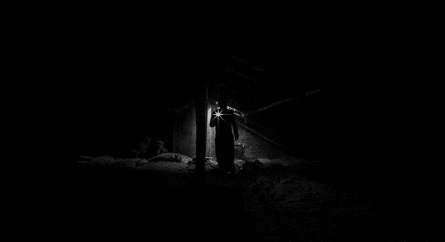
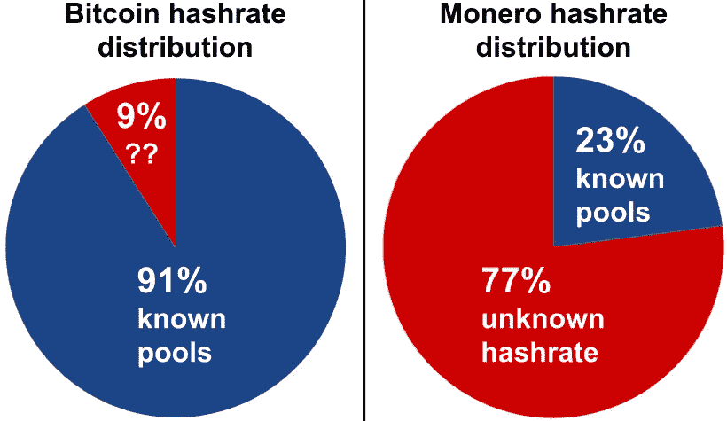
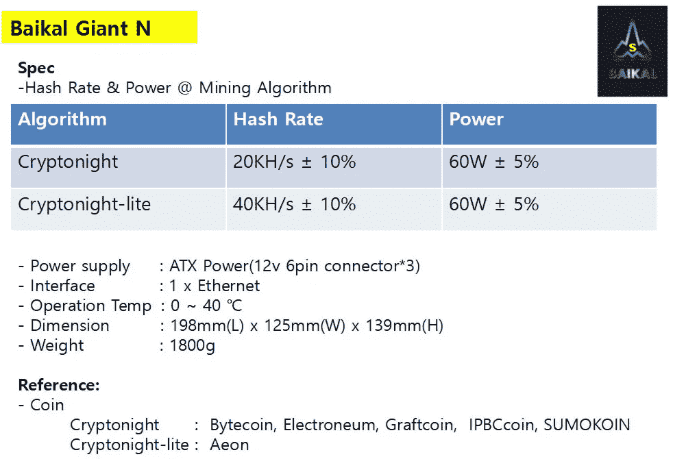
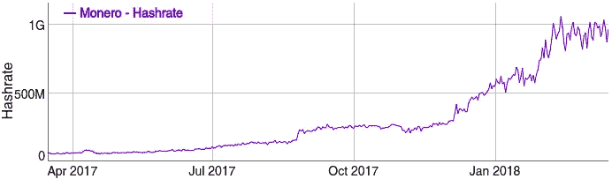
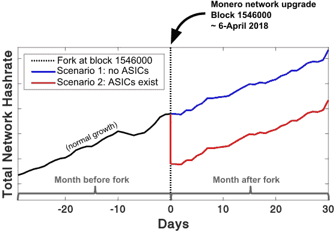
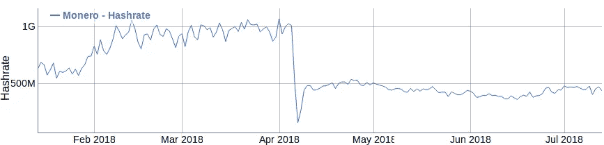

# 2018 年 4 月网络更新期间对 Monero 矿工的机会主义调查

> 原文：<https://medium.com/hackernoon/opportunistic-investigation-of-monero-miners-during-march-2018-network-update-cfd6ad8a027f>

*作者注:2018 年春季计划推出两款 Monero 硬叉。
本文与 Monero 官方网络升级有关，该升级计划于 4 月初在 block 1546000 进行。以下实验与计划于四月底在 1564965 区块进行的 MoneroV 分叉无关(也不受其影响)。*

由于 Monero 的匿名性质，研究其用户和矿工通常极具挑战性。然而，计划于 2018 年 4 月 6 日升级网络的例行硬分叉将附带进行一项实验，以探索 Monero 矿工设备的性质。在分叉时间前后对整个 Monero 网络统计数据的观察将揭示当前 Monero hashrate 是否由 ASIC 采矿引起。

## ***采网分布***

许多加密货币主要是由公共池挖掘的。例如，在撰写本文时，超过 90%的比特币网络的挖掘能力(“hashrate”)来自已知的矿池。另一方面，不到四分之一的 Monero hashrate 可以连接到公共游泳池；我们对其余 77%的来源一无所知。

Figure 1: Comparison of unknown hashrate for Bitcoin and Monero during March 2018\. *Charts generated based on data from [*[*Blockchain.info*](https://blockchain.info/pools)*] and [*[*mineXMR.com*](http://minexmr.com/pools.html)*].*

虽然有很多猜测，但目前还没有办法研究 Monero 的 77%未知 hashrate 的来源。当然，一部分是由于未知池中的典型矿工，一部分是由于僵尸网络。“僵尸网络”是在设备所有者不知情的情况下，在后台挖掘和输出 Monero 的设备集合。许多实例已被记录在案，[[kafe ine 2018](https://www.proofpoint.com/us/threat-insight/post/smominru-monero-mining-botnet-making-millions-operators)&[Kanaracus 2018](https://threatpost.com/new-monero-crypto-mining-botnet-leverages-android-debugging-tool/129777/)]然而，僵尸网络挖掘的整体规模完全未知。此外，有可能被称为 ASICs 的专门机器(下一节将详细介绍)已经秘密地产生了很大一部分散列函数，然而这通常被认为不太可能是 Monero 的。

接下来的两节描述了为比特币采矿开发的设备，以及 Monero 采矿显著不同的方面。根据您对这些主题的熟悉程度，您可能能够快速浏览一些介绍。

## ***挖矿设备介绍:比特币***

当加密货币进入场景时，挖掘只发生在计算机 CPU 上。由于挖矿难度适应了现在的技术，CPU 挖矿在早期是有足够利润的。挖掘效率取决于设备处理一组特定计算的速度——这一速度以“每秒哈希数”来衡量，缩写为 H/s。以比特币统计数据为例，CPU 矿工的哈希能力约为 1，000，000 H/s，为方便起见，写为 1 MH/s。

很快，显卡被重新用于挖掘加密货币。GPU 能够更快地解决采矿问题，大约 100 MH/s。由于网络难度根据 GPU 矿工进行了调整，CPU 矿工无法竞争(即采矿奖励不足以支付设备和电力成本)。

接下来，专用集成电路(ASICs)的建立完全是为了挖掘比特币。这些特殊的设备非常昂贵，比 GPU 快几千倍。例如，Antminer S9 宣传高达 14，000，000 MH/s。到目前为止，网络难度已经增加到可以容纳 ASICs，因此将 CPU 和 GPU 矿工挤出了比特币的业务。[ [美利 2018](https://www.thegeekpub.com/11407/mining-bitcoin-gpu-2018/) ]

## **采矿设备介绍:Monero**

由于潜在的平等主义原则，Monero 社区不赞成 ASICs 及其不可避免的采矿权力集中。【 [Monero Project 2018](https://getmonero.org/2018/02/11/PoW-change-and-key-reuse.html) 】虽然比特币使用的“CPU 硬”哈希算法(SHA-256)可以进行 ASIC 优化，但 Monero 通过使用难以加速的“内存硬”算法(CryptoNight)阻碍了 ASIC 的开发。【 [CryptoNote 2013](https://CryptoNote.org/whitepaper.pdf) 因此，CPU 和 GPU 挖矿对 Monero 来说都是可行的，甚至在 2018 年*。(注意:不同挖掘算法的哈希统计不能直接比较，因为计算是“苹果和橘子”不同的)*

由于 Monero 采矿仍然是 CPU 可访问的，不幸的是，它已被恶意软件大量利用，这些软件窃取受害者的电力和处理能力，为僵尸网络控制器开采 Monero。这些攻击不仅限于服务器和计算机；从手机到平板电脑到电视，个人设备上都发现了未经授权的 Monero 采矿软件。[[Hui 2018](http://blog.netlab.360.com/early-warning-adb-miner-a-mining-botnet-utilizing-android-adb-is-now-rapidly-spreading/)&[hauta la 2018](https://www.cnet.com/news/hackers-monero-iot-devices-china-mine-cryptocurrency/)]这种现象的整体规模尚不可知，因为估计值必须从现场抓获的少数恶意软件实例中逐段拼凑的证据中推断出来。

2018 年 3 月初，当贝加尔矿工宣布推出“Giant N”ASIC 时，Monero 社区感到震惊，该 ASIC 据称计算 CryptoNight 哈希的速度比 GPU 矿工快 25 倍。【图 2；[贝加尔湖 2018](https://www.baikalminer.com/product12.php) 】在撰写本文时，贝加尔湖矿业公司的说法尚未得到独立方的证实。如果任何公司要创建第一个 CryptoNight ASIC，他们可能会在产品发布和销售启动之前使用它们来秘密挖掘，以便在网络难度仍然针对 CPU/GPU 进行调整的同时积累 Monero。如果贝加尔湖的 CryptoNight 矿工是合法的，那么几乎可以肯定的是，他们最近几个月一直在大规模开采。

Figure 2: Screenshot of Baikal Giant N product page. *Archived from [*[*Baikal 2018*](https://www.baikalminer.com/product12.php)*] on* 2018.03.14.

【2018 年 3 月 18 日更新:上周，几家公司突然宣布出售密码之夜 ASIC 矿工，其中包括比特大陆蚂蚁矿工**(广告 220 千赫/秒)，龙币* [*X1*](https://halongmining.com/shop/dragonmint-x1-miner/) *和* [*X2*](https://halongmining.com/shop/dragonmint-x2-miner/) *矿工(248 千赫/秒)，以及* [在网络升级之前，所有产品都处于缺货状态，因此希望开采 Monero 的客户将会大失所望。](http://pascalproject.com/)*

## ****手中的未知多数****

*如图 3 所示，Monero 的网络范围哈希速率在过去一年中呈爆炸式增长，从 2017 年 3 月的 60 MH/s 开始，到 2018 年 2 月保持在 750 MH/s 以上。自然，在 2017 年期间，更多的矿工被吸引到 Monero，因为汇率在此期间上升，从约 12 美元/XMR 上升到约 500 美元/XMR。然而，hashrate 的 10 倍增长代表了一种惊人的巨大的未知矿业力量，这种力量突然从匿名来源而来。*

**

*Figure 3: Total Monero hashrate increased tenfold over the last year, doubling in the last 3 months alone. Plot reproduced with explicit permission from *[*[*bitinfocharts.com*](https://bitinfocharts.com/comparison/monero-hashrate.html#1y)*]**

*许多人不担心这些矿工的本质，认为任何和所有额外的散列能力提高了网络安全性。这忽略了隐形集权的危险。如果大量的神秘哈希来自大规模的僵尸网络或秘密 ASICs，它们产生了不成比例的采矿能力，那么集中化可能会在目前或不久的将来达到灾难性的程度。这个神秘的(潜在的僵尸网络)hashpower 方便地增强了网络安全，实际上可能是一个隐藏了“51%”多数攻击的特洛伊木马。对网络构成的冷漠可能是一个存在主义的错误，导致了 Monero 的毁灭。*

## ****实验****

*即将到来的 Monero 网络升级包括对 CryptoNight 算法[ [Monero GitHub 2018](https://github.com/monero-project/monero/pull/3253) ]的微小调整，这将对 ASICs 产生不同于 GPU/CPU 矿工的影响。这种轻微的变化不会改变算法的难度或行为，CPU/GPU 矿工在随网络升级时会很容易适应新的变体。*

*另一方面，ASICs 根本不能适应新的(小的或大的)变化。你可以把 ASICs 想象成被训练以极快的速度完成一项任务的工人，但是不能学习做其他任何事情。要执行的算法被物理地蚀刻到 ASIC 电路中，因此它们不能被重新编程或改变用途。Monero 开发团队已经表达了在每次网络更新时对挖掘算法进行细微修改的意图。由于 Monero 每 6 个月进行一次例行的硬分叉，这应该会永久地抑制生产 Monero ASICs 的尝试，因为每一次昂贵而冗长的重新设计都会很快变得过时。*

*ASICs 无法与网络的其他部分一起升级，这将很快暴露出它们所谓的存在。当网络的其余部分转向新的变体时，过时的软件(或者在这种情况下，硬件！)会被迅速拒绝。如果现在有 ASICs 开采 Monero，他们将在 1546000 块被封锁，他们的 hashrate 将突然消失！*

**

*Figure 4: Two possible scenarios for the total network hashrate immediately following the March network upgrade. The pseudocode for generating these illustrative timeseries is available at the end of the article.*

*考虑两个互斥的场景:*

*   ***场景一:**CryptoNight ASIC 传言是假的，网络 hashrate 全部来自 CPU/GPU 矿工。*
*   ***场景二:** CryptoNight ASIC 矿工存在，并占未知 hashrate 的一部分。*

*图 4 显示了每个场景下对总网络哈希的期望。图的左侧显示了分叉之前的月份。**的黑色痕迹**显示了一个照常营业的 2018 年 3 月的哈希表，它可能包括也可能不包括 ASICs(直到分叉时我们才会知道)。第 0 天的垂直虚线显示了 4 月 6 日附近的块 1546000，此时使用网络升级硬分叉实现了 CryptoNight 变体。*

*如果现实反映了**场景 1(蓝色轨迹)**，那么就没有 ASICs，所有当前的 hashrate 都来自 CPU/GPU 矿工。这些灵活的矿工将更新他们的软件，并照常进行，而不会对整个 hashrate 趋势产生任何明显的变化。*

*然而，如果**场景 2(红色轨迹)**为真，并且 ASICs 确实存在，那么 hashrate 将会出现相应的急剧下降，并且不会快速恢复。这种不断蒸发的采矿力量将有力地支持隐夜 ASICs 的存在。随着 block 1546000 的临近，Monero 社区应该屏息以待地关注网络散列法。*

*在这两种情况下，当错过硬分叉的设备更新软件时，hashrate 可能会出现短暂的下降(从几小时到几天)。在数周内反弹的下降部分可以归因于 CPU/GPU 矿工，因为重新设计和制造更新的 ASICs 需要几个月的时间。因此，一旦传统的矿工是最新的，就应该使用分叉后 5-10 天的散列来进行前后比较。*

*hashrate 的持续丢失将非常有力地支持 CryptoNight ASICs 的存在(场景 2)。在 Monero fork 之后，其他 CryptoNight 硬币的网络哈希值的增加可能会证实这一点(例如，电子币、字节币、Sumokoin、AEON 等)。升级后不能开采 Monero 的加密之夜芯片的拥有者将会把他们的散列值转移到其他加密货币上，从而使他们的散列值显著增加！*

*如果 CryptoNight ASIC 矿工是真实的，他们的签名应该会在 4 月初的多个加密货币的网络统计中产生反响。ASIC 传言是真的吗？他们已经在默默的领导着 Monero 的采矿了吗？*

*不到两周，我们就知道了！*

# *分叉后更新:*

*当网络硬分叉时，Monero 一半以上的 hashpower 瞬间蒸发，反映了图 4 预测 ASIC 脱落时的红色痕迹。*

**

*The Monero network hashrate decreased sharply after the early-April hard fork. Plot reproduced with explicit permission from *[*[*bitinfocharts.com*](https://bitinfocharts.com/comparison/monero-hashrate.html#1y)*], updated on 13-July 2018.**

## ****参考文献****

*【区块链.信息】[https://blockchain.info/pools](https://blockchain.info/pools)*

*【mineXMR.com】[http://minexmr.com/pools.html](http://minexmr.com/pools.html)*

*【kafe ine 2018】kafe ine，Smominru Monero mining 僵尸网络为运营商制造百万，31-Jan **2018** ，[https://www . proof point . com/us/threat-insight/post/Smominru-Monero-mining-botnet-making-millions-operators](https://www.proofpoint.com/us/threat-insight/post/smominru-monero-mining-botnet-making-millions-operators)*

*【Kanaracus 2018】Christopher Kanaracus，新 Monero 加密挖掘僵尸网络利用 Android 调试工具，2018 年 2 月 5 日**，[https://threat post . com/New-Monero-crypto-mining-botnet-leverages-Android-debugging-tool/129777/](https://threatpost.com/new-monero-crypto-mining-botnet-leverages-android-debugging-tool/129777/)***

***【Monero 项目 2018】debr yune，dnaleor 和 Monero 项目，PoW change，11-2 月 **2018** ，[https://getmonero . org/2018/02/11/PoW-change-and-key-reuse . html](https://getmonero.org/2018/02/11/PoW-change-and-key-reuse.html)***

***【默里 2018】迈克·默里，2018 年用 GPU 挖掘比特币，2-Jan **2018** ，[https://www.thegeekpub.com/11407/mining-bitcoin-gpu-2018/](https://www.thegeekpub.com/11407/mining-bitcoin-gpu-2018/)***

***[crypto note 2013]Nicolas van saber Hagen crypto note v 2.0 白皮书，2013 年 10 月 17 日**，[https://CryptoNote.org/whitepaper.pdf](https://cryptonote.org/whitepaper.pdf)*****

*****[Hui 2018] Wang Hui, ADB.Miner: *恶意代码正在利用开放了 ADB 接口的安卓设备挖矿*, 4-Feb **2018**, [http://blog.netlab.360.com/early-warning-adb-miner-a-mining-botnet-utilizing-android-adb-is-now-rapidly-spreading/](http://blog.netlab.360.com/early-warning-adb-miner-a-mining-botnet-utilizing-android-adb-is-now-rapidly-spreading/)*****

*****【豪塔拉 2018】劳拉·豪塔拉，*黑客感染安卓手机、电视挖掘加密货币*，6-Feb **2018** ，[https://www . CNET . com/news/Hackers-monero-IOT-devices-China-mine-cryptocurrency/](https://www.cnet.com/news/hackers-monero-iot-devices-china-mine-cryptocurrency/)*****

*****【贝加尔湖 2018】贝加尔湖巨型 N 品页面，检索到 14-Mar **2018** ，[https://www.baikalminer.com/product12.php](https://www.baikalminer.com/product12.php)*****

*****【Monero GitHub 2018】Monero Cryptonight 变种，并为 V7 # 3253[https://github.com/monero-project/monero/pull/3253](https://github.com/monero-project/monero/pull/3253)增加一个*****

## *******图 4 中时间序列的伪代码:*******

*****%生成块 1539500 附近的网络散列率的模拟时间序列
% MPKT 2018 年 3 月
%
% y = MX+b+noise()
生成的初始时间序列% ASIC 丢失通过减去常数后叉
%
%在图 4 中:
%黑色和蓝色(场景 1:无 ASIC)轨迹显示 yNoised
%红色轨迹(场景 2:ASIC)显示矢量 yASIC*****

*****%%模拟参数
b = 1000；% (MH/s)，模拟开始时的总网络散列值
numDaysSimulation = 60；%查看以分叉
dHdt = 4 为中心的 2 个月延伸；% (MH/s/day)，正常网络增长趋势
hypotticalasichashrate = 200；%(毫瓦/秒)*****

*****% % Generate time base
day offork = numDaysSimulation/2；%在中途开始分叉
simulation time base = 1:numDaysSimulation；% [1，2，3，…，numDaysSimulation]*****

*****% % Generate time series
y = dHdt * simulation time base+Ho；% y=mx+b，一般增长趋势
yNoised = y+20 * random()；%添加常规~20 MH/s 每日波动
yASIC = yNoised；% Duplicate yNoised before " remove " ASICs
yASIC = yASIC(index>day offork)—hypotechalasichashrate；分叉后假想 ASICs 的退出百分比*****

******2018 年 3 月 28 日更新:最初在 3 月讨论的 1539500 区块的网络升级已正式安排在 2018 年 4 月 6 日至 4 月 6 日左右的 1546000 区块。这篇文章的标题，文字和数字已经更新，以反映 1546000 叉的高度。更多信息和更新的软件可在今天的《getmonero.org 邮报》中找到:“计划于 4 月 6 日进行网络升级”*[*https://getmonero . org/2018/03/28/A-Scheduled-protocol-Upgrade-is-Planned-for-April-6-2018-03-28 . html*](https://getmonero.org/2018/03/28/a-scheduled-protocol-upgrade-is-planned-for-April-6-2018-03-28.html)*****