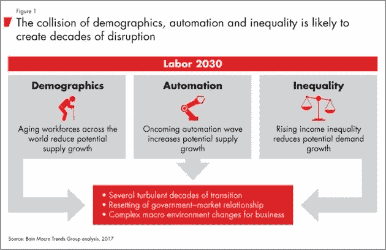

# 塑造工作未来的机遇

> 原文：<https://medium.com/hackernoon/opportunities-shaping-the-future-of-work-44c4621281f3>

Am I over-fitting using Bayesian inference?

为什么像 Flybridge 这样主要以投资基础设施软件而闻名的风险投资公司(例如 [MongoDB](http://www.mogodb.com) )会对投资 [work](https://hackernoon.com/tagged/work) 的未来如此兴奋？主要是因为像阿蕾西娅·罗森伯格这样的人，她不喜欢旅行，除非她在工作。没错，工作。

“这种体验更像是当地人的体验:‘我的杂货店在哪里？最好的瑜伽课是什么？”她观察道建立业务联系和寻找机会需要更多的努力，但这很好，因为回报要多得多。"

通过一个名为[偏远年份](http://www.remoteyear.com)的创新“海外工作”项目，罗森博格花了 12 个月的时间旅行，同时还担任自由创意顾问。这个项目让她沉浸在不同的社区、文化和环境中——包括柬埔寨金边的一所名为 Tiny Toones 的 hip-hop 学校。正是在那里，她偶然发现了一个值得讲述的故事，这个故事变成了一部简短的纪录片，她最近在 Indiegogo 上筹集了 1 万多美元。

对我们来说，罗森博格的职业和个人历程代表着未来。我们和其他人投资的所有基础设施软件都允许您在任何地方安全有效地工作，并为激情项目筹集资金，同时探索世界的不同角落。技术带来了新的工作方式，我们认为这是一个激动人心的机会。

在过去的两年里，我们一直专注于投资那些接受这种新工作方式的初创公司，这是一个我们称之为“未来工作”的实践领域。以下是我们在该领域工作中的一些观察结果:

**1)**

人工智能、机器学习、机器人和区块链等领域的进步已经开始改变工作和劳动力的性质——有时是以令人恐惧的方式。根据[麦肯锡全球研究所的报告](https://www.mckinsey.com/~/media/McKinsey/Global%20Themes/Future%20of%20Organizations/What%20the%20future%20of%20work%20will%20mean%20for%20jobs%20skills%20and%20wages/MGI-Jobs-Lost-Jobs-Gained-Report-December-6-2017.ashx)，到 2030 年，7500-37500 万工人(全球劳动力的 3-14%)需要接受新职业再培训。为什么？因为今天大约 50%的工作活动在技术上是自动化的。贝恩最近制作了[一份类似的研究](http://www.bain.com/publications/articles/labor-2030-the-collision-of-demographics-automation-and-inequality.aspx)，预测劳动力“几十年的中断”(见下图)。由于自动化和信息革命，我们正经历着中等技能的空洞化，因此中产阶级也是如此。

我们在这些挑战中看到了机会——尤其是在职业发展、招聘和学习的交汇点。我们的公司 [Codecademy](https://www.codecademy.com/) ，是一个利用这一趋势的创业公司的很好的例子，帮助教世界编程。如今，公司有机会利用这些新兴技术，为专业人士提供提升技能、促进职业发展、成为独立承包商和追求终身学习所需的工具和资源。

他们的时代已经到来:千禧一代正在统治职场

千禧一代在我们劳动力中的崛起是我们投资理论的核心。千禧一代重视灵活性，在德勤最近的一项调查中表示，“灵活的工作安排有助于提高生产率和员工参与度，同时增强个人福祉、健康和幸福。”

但这并不是千禧一代追求的全部。他们还希望产生影响，并在工作中发现内在价值，并且需要从他们的经理那里听到他们正在产生影响，他们的贡献在更大的范围内有意义。盖洛普调查显示，千禧一代希望得到专业反馈，但只有 19%的人表示他们会定期收到反馈。

[渴望实验室](https://eagerlabs.com/)的创始人肖恩·林赛说:“现在进来的员工已经成长为一代人，他们在历史上从教育环境和课外活动中获得了更多的反馈。“但工作场所缺乏反馈令他们震惊。作为完全的数字原住民，他们可以在网上发布自己午餐的照片，获得的反馈比他们一个月工作中获得的反馈还多。”

有些人可能会说，千禧一代的需求与过去几代人没有太大的不同。正如一位作者讽刺的那样，“每一代人都认为是它发明了性。”没错，但成长为网络原住民的千禧一代的优先事项和文化明显不同于过去几代人。我们对那些在解决普遍需求的同时关注这些差异的创业公司很感兴趣。

**3)** **专注于创造机会，而不是工作替代**

在我们看来，自动化对工作的负面影响被大大夸大了。自动化的兴起不是关于工作或技能替代，而是关于机会创造。正如经济学家劳伦斯·米谢尔(Lawrence Mishel)和乔希·比文斯(Josh Bivens)最近在一篇关于工作和不平等的论文[中所说:“即使机器人取代了某个通勤区的一些工作，其他自动化(可能在投资规模上让机器人自动化相形见绌)也会创造更多的工作。”我们同意。技术和企业家有巨大的机会来培养未来的工人，并更有效地将人才与需求相匹配。](https://www.epi.org/publication/the-zombie-robot-argument-lurches-on-there-is-no-evidence-that-automation-leads-to-joblessness-or-inequality/)

工作方式改变的一个例子是零工经济的兴起。多亏了优步和 Lyft，零工经济已经成为在运输行业为独立工作者和临时工作机会牵线搭桥的主流模式，这种模式也波及到了其他行业。与这一主题相一致，我们投资了一家初创公司 Hyr，这家公司根据需求将员工与开放式餐厅和酒吧轮班联系起来。Hyr 员工使用手机来更好地控制他们的日程和生活。

我们投资组合中的另一个零工经济例子是 [Wethos](https://wethos.co/) ，它将非营利组织与有技能、负担得起的自由职业者相匹配，让专业人士在保持灵活性的同时找到有意义的工作。我们特别喜欢 Wethos 的一点是，它将零工经济机会与对工人寻找目标的日益关注联系起来(也被称为[目的经济](https://www.fastcompany.com/3028410/welcome-to-the-purpose-economy))。演出经济和目的经济交汇处的另一项投资是 [Splice](https://splice.com/) ，这是一个云平台，让艺术家和制作人能够更有效地创作和分享音乐，让音乐人在充满激情的社区环境中表达他们对音乐的热爱的同时，赚取数百万美元。

由于这些公司，个人正在成为自己的老板，随时随地完成他们想要的转变，并在工作中找到更大的目标感。

**4)召集空间、灵活空间、激励空间**

在短短八年时间里，杰西的前公司 WeWork 已经发展成为一家价值 200 亿美元的公司，在世界各地拥有 200 多个共享工作空间。他们把聪明人聚集在一起，让他们以更流畅、更灵活的方式合作，从而做到了这一点。反过来，这也吸引了大公司的注意。去年，Flybridge Boston 将其位于查尔斯河的木质装饰办公室搬到了 WeWork St. James。我们 WeWork 办公室的邻居是保险业巨头 Liberty Mutual。亚马逊已经接管了我们下面的楼层，美国银行、微软和星巴克等公司也将房地产外包给 WeWork，并签约成为租户。这是因为 WeWork 将人们聚集在鼓舞人心的空间，进行合作并完成鼓舞人心的工作。其他企业家正致力于建设下一代鼓舞人心的空间，用于工作、娱乐、吃饭、社交、锻炼和一般的联系。我们继续在这一类别中寻找鼓舞人心的想法和企业家。

简而言之，我们正在积极寻求在这些领域中的每一个领域进行投资:将自动化带到工作场所，从零工和目的经济中产生的机会，迎合千禧一代独特需求的新的鼓舞人心的空间和服务。

我们在这些领域下注，因为我们相信罗森博格的经历并不独特。正如她自己所说的:“我认为未来的工作是员工为自己做出选择的机会，无论是地点、时间还是职位。我认为对于“去工作”是什么样子不再有硬性规定了。我看到员工手中有更多的灵活性。"

如果你有一个工作启动的未来，我们想听听它！联系我们[杰西·米德尔顿](https://medium.com/u/240439e0995f?source=post_page-----44c4621281f3--------------------------------)、[杰夫·布斯冈](https://medium.com/u/e75ab0cfed65?source=post_page-----44c4621281f3--------------------------------)和[阿德里·伯科](https://medium.com/u/80d5a3f3c289?source=post_page-----44c4621281f3--------------------------------)告诉我们更多。