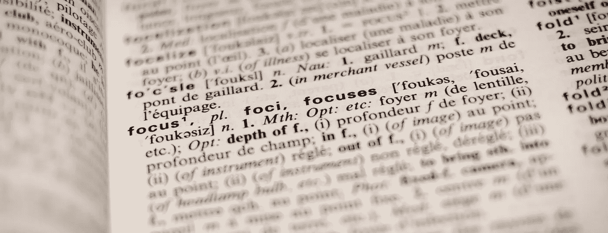
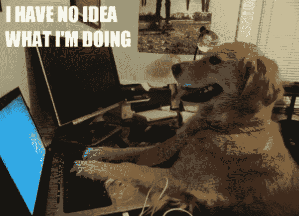

# 使用谷歌云视觉 API 进行光学字符识别

> 原文：<https://medium.com/hackernoon/optical-character-recognition-with-google-cloud-vision-api-255bb8241235>



最近，我一直在 React/React Native 上开发一个交付跟踪应用程序。其中一个功能是允许用户在你的手机上拍摄运输标签的照片，并将该标签转换为我们可以在后端处理的跟踪号码。此功能的目标是最大限度地减少手动输入包裹追踪编码所花费的时间，根据服务的不同，包裹追踪编码的长度在 13-26 个字符之间。在我寻求实现这一功能的过程中，我遇到了一种被称为光学字符识别的技术和一个来自谷歌的令人难以置信的图像识别工具包。在本文中，我将介绍这种方法的基本原理，以及如何将它集成到您的应用程序中。

## 什么是光学字符识别？

光学字符识别(简称 OCR)是一种将文本的数字图像转换成机器可读数据的技术。我们的眼睛通过识别明暗模式来阅读给定介质上的文本，将这些模式转化为字符和单词，然后赋予其意义。OCR 试图模仿我们视觉系统的操作方式，他们的检测算法通常由神经网络提供支持。

有两种方法来执行 OCR:矩阵匹配和特征检测。矩阵匹配是两者中比较简单的；它获取一幅图像，并将其与现有的字符矩阵或模板库进行比较，以生成匹配。特征检测更复杂，因为它寻找像对角线、曲率、交点等一般特征。并将其与图像上特定距离内的其他特征进行比较。

## 输入谷歌云视觉 API

> 谷歌云视觉 API 通过将强大的[机器学习](https://hackernoon.com/tagged/machine-learning)模型封装在一个易于使用的 REST API 中，使开发者能够理解图像的内容。它可以快速地将图像分成数千种类别，检测图像中的单个对象和人脸，并查找和读取图像中包含的印刷文字。

谷歌云视觉 API 采用了以图像识别为中心的极其复杂的机器学习模型，并将其格式化为一个简单的 REST API 接口。它包含了广泛的图像识别工具，您可以将它用于现实世界的应用程序，如对图像进行分类或调节不良内容。出于本文的目的，我将把重点放在 OCR 模块上——它分析图像中的文本，然后将其解析为数据，供我们的计算机使用。

## 它是如何工作的

该工具首先对图像执行布局分析，以分割文本的位置。在检测到大致位置之后，OCR 模块然后对指定位置执行文本识别分析以生成文本。最后，在后处理步骤中，通过将错误输入语言模型或字典来纠正错误。

所有这些都是通过一个卷积神经网络来完成的，在这个网络中，每个神经元只连接到每一层中神经元的一个子集。卷积神经网络是神经网络的一个子集，旨在模仿我们如何识别对象的视觉皮层的层次结构。

比如下图，我们先识别一个特征比如眼睛。然后，我们识别鼻子、嘴、皮毛，然后最终将这些特征结合起来，形成一个狗的心理模型。这几乎是在我们的视觉系统中瞬间发生的，所以当我们这样做时，很难在我们的大脑中区分这些步骤。这里的想法是，重要的不是要素在图像中的位置，而是它相对于空间邻近范围内其他要素的位置。



如果你想更多地了解卷积神经网络是如何工作的，这两篇文章做了很好的分解工作:

[https://medium . freecodecamp . org/an-intuitive-guide-to-convolutionary-neural-networks-260 C2 de 0 a 050](https://medium.freecodecamp.org/an-intuitive-guide-to-convolutional-neural-networks-260c2de0a050)

[https://medium . com/@ ageitgey/machine-learning-is-fun-part-3-deep-learning-and-convolutionary-neural-networks-f 40359318721](/@ageitgey/machine-learning-is-fun-part-3-deep-learning-and-convolutional-neural-networks-f40359318721)

## 与平台集成

正如我们所料，这些模型背后的算法非常复杂，难以理解。幸运的是，所有这些都被谷歌提取出来，打包成一种方便我们使用的格式。

首先，你需要注册他们的平台，获得一个开发者 API 密匙。之后，只需发送一个带有您想要解码的图像的 URL 的`POST`请求。下面是一个使用 axios 的 API 调用示例:

*请求正文:*

```
let body = {
  "requests": [
    {
      "image": {
        "source": {
          "imageUri": "[https://i.imgur.com/Nlot5mR.jpg](https://i.imgur.com/Nlot5mR.jpg)" //image URL
        }
      },
      "features": [
        {
          "type": "TEXT_DETECTION",
          "maxResults": 1
        }
      ]
    }
  ]
}
```

*API 调用:*

```
axios.post('https://vision.googleapis.com/v1/images:annotate?key=YOUR_API_KEY_HERE', body)
  .then((response) => console.log(response));
```

响应返回一个 JSON 对象，其中包含各种数据点，包括检测到的文本、语言、文本位置等。

*样本响应:*

```
{
  "responses": [
    {
      "textAnnotations": [
        {
          "locale": "en",
          "description": "I HAVE NO IDEA\nWHAT TM DOING\n",
          "boundingPoly": {
          "vertices": [
            {
              "x": 11,
              "y": 2
            },
            {
              "x": 257,
              "y": 2
            },
            {
              "x": 257,
              "y": 102
            },
            {
              "x": 11,
              "y": 102
            }
          ]
        }
      },...
```

## 就是这样！

现在，您已经知道光学字符识别的工作原理，足以理解它的使用案例。谷歌的 OCR 模块设置起来非常简单，并且有无限的可能性。这个工具使用与谷歌图片搜索相同的技术，所以你现在可以使用它的所有功能。试一试，开始建造吧！

[https://cloud.google.com/vision/docs/ocr](https://cloud.google.com/vision/docs/ocr)

如果你喜欢这篇文章，请点击👏🏻并分享出来帮助别人找到。感谢阅读！