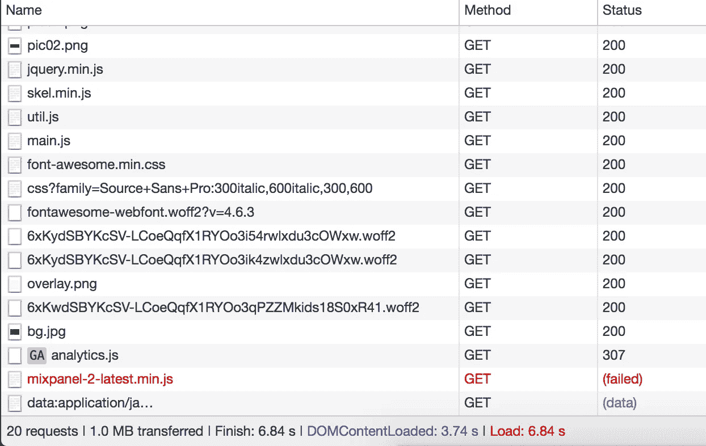
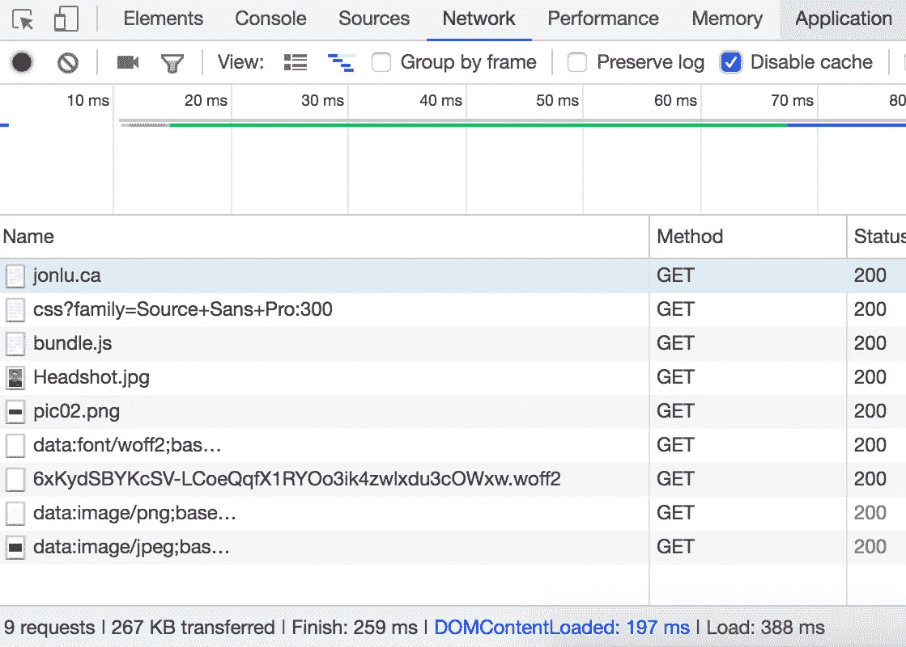
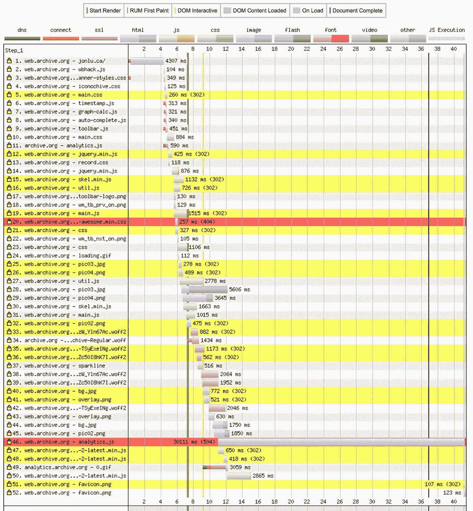

# 10 倍性能提升:优化静态站点

> 原文：<https://medium.com/hackernoon/optimizing-a-static-site-d5ab6899f249>

几个月前，我在美国境外旅行，想向一个朋友展示我个人(静态)网站上的链接。我试着导航到我的网站，但是花的时间比我预期的要长。它绝对没有什么动态——它有动画和一些响应设计，但内容总是保持不变。我对结果感到非常震惊，DOMContentLoaded 用了大约 4 秒，全页面加载用了 6.8 秒。有 20 个对静态站点的请求，总共传输了 1mb 的数据。我习惯了我在洛杉矶的 1Gb/s、低延迟的[互联网](https://hackernoon.com/tagged/internet)连接到我在旧金山的服务器，这让这个庞然大物看起来快如闪电。在意大利，8mb/s，这是一个完全不同的画面。

这是我第一次尝试优化。到目前为止，任何时候我想添加一个库或资源，我都会直接扔进去，用 *src="…"* 指向它。我对任何形式的[性能](https://hackernoon.com/tagged/performance)都毫不在意，从缓存到内联再到延迟加载。

我开始四处寻找有类似经历的人。不幸的是，许多关于静态优化的文献很快就过时了——2010 年或 2011 年的建议讨论了库，或者做出了不再正确的假设，或者只是一遍又一遍地重复相同的准则。

然而，我确实找到了两个很好的信息来源——[高性能浏览器网络](https://hpbn.co)和 [Dan Luu 优化静态网站的类似经验](https://danluu.com/octopress-speedup/)。虽然我在剥离格式和内容方面没有 Dan 走得那么远，但我确实设法让我的页面加载速度提高了大约 10 倍，对于 DOMContentLoaded 来说大约是五分之一秒，对于全页面加载来说只有 388 毫秒(这实际上有点不准确，因为它涉及了下面解释的延迟加载)。

# 该过程

该过程的第一步是对网站进行分析。我想弄清楚什么花费的时间最长，以及如何最好地并行处理一切。我运行了各种工具来分析我的网站，并在世界各地进行测试，包括:

*   [https://tools.pingdom.com/](https://tools.pingdom.com/)
*   [www.webpagetest.org/](http://www.webpagetest.org/)
*   [https://tools.keycdn.com/speed](https://tools.keycdn.com/speed)
*   [https://developers.google.com/web/tools/lighthouse/](https://developers.google.com/web/tools/lighthouse/)
*   https://developers.google.com/speed/pagespeed/insights/
*   【https://webspeedtest.cloudinary.com/ 

其中一些提供了改进的建议，但是当你的静态站点有 50 个请求时，你只能做这么多——从 90 年代留下的间隔 gif 到没有使用的资产(我加载了 6 种字体，只使用了 1 种)。

Timeline for my site — I tested this on the Web Archive as I didn’t screenshot the original one, but it looks similar enough to what I saw a few months ago.

我想改进我能控制的一切——从 javascript 的内容和速度到实际的 web 服务器(Nginx)和 DNS 设置。

# 最佳化

## 缩小和合并资源

我注意到的第一件事是，我对 CSS 和 JS(没有任何形式的 HTTP keepalive)以及各种站点发出了十几个请求，其中一些是 https。这增加了到各种 cdn 或服务器的多次往返，并且一些 JS 文件正在请求其他文件，这导致了上面看到的阻塞级联。

我使用 [webpack](https://webpack.js.org/) 将我所有的资源合并成一个 js 文件。每当我对我的内容进行更改时，它会自动缩小并将我所有的依赖项转换成一个文件。

我尝试了不同的选项——目前，这个 bundle.js 文件在我的站点的中，并且被阻塞了。它的最终大小是 829kb，包括所有非图像资源(字体、css、所有库和依赖项以及 js)。其中绝大部分是字体很棒的字体，占了 829kb 中的 724 kb。

我浏览了字体库，去掉了我正在使用的三个图标——fa-github、fa-envelope 和 fa-code。我使用了一个名为 [fontello](http://fontello.com/) 的服务，只拉出我需要的图标。新的大小只有 94kb。

网站目前的构建方式，如果我们只有样式表，它看起来不会是正确的，所以我接受了单个 bundle.js 的阻塞特性。加载时间约为 118 毫秒，比上面的好一个数量级以上。

这也有一些额外的好处——我不再指向第三方资源或 cdn，因此用户不需要 1)对该资源执行 DNs 查询，2)执行 https 握手，以及 3)实际等待从该资源的完整下载。

虽然 CDNs 和分布式缓存可能对大规模的分布式站点有意义，但对我的小型静态站点没有意义。大约 100 毫秒的额外时间是值得的。

## 压缩资源

我加载了一个 8mb 大小的头像，然后以 10%的宽度/高度显示。这不仅仅是缺乏优化——这几乎是对用户带宽使用的疏忽。

我用 https://webspeedtest.cloudinary.com/的[压缩了我所有的图片——它还建议我切换到](https://webspeedtest.cloudinary.com/)[的 webp](https://developers.google.com/speed/webp/) ，但是我想尽可能地兼容更多的浏览器，所以我坚持使用 jpg。有可能建立一个系统，在这个系统中，webp 只被交付给支持它的浏览器，但是我想尽可能保持简单，并且增加抽象层的好处似乎不值得。

## 改进 Web 服务器— HTTP2、TLS 等

我做的第一件事是过渡到 https——当我开始时，我在端口 80 上运行 Nginx bare，只提供来自/var/www/html 的文件

我首先设置 https，并将所有 http 请求重定向到 https。我从 [Let's Encrypt](https://letsencrypt.org/) 获得了我的 TLS 证书(这是一个伟大的组织，刚刚开始签署[通配符证书](https://community.letsencrypt.org/t/acme-v2-and-wildcard-certificate-support-is-live/55579))!).

仅仅通过添加 http2 指令，Nginx 就能够利用最新 http 特性的所有现代优势。注意，如果你想利用 HTTP2(以前的 SPDY)，你*必须*使用 HTTPS。点击阅读更多相关信息[。](https://hpbn.co/http2/)

您还可以利用 HTTP2 push 指令与*http 2 _ push images/headshot . jpg；*

注意:启用 gzip 和 TLS 可能会给你带来违反[的风险。由于这是一个静态站点，实际的漏洞风险非常低，所以我很乐意保持压缩。](https://en.wikipedia.org/wiki/BREACH)

## 利用缓存和压缩指令

仅仅通过 Nginx 还能完成什么？首先出现的是缓存和压缩指令。

我发送的是原始的、未压缩的 HTML。只穿了一个 gzip 行，我得以从 16000 字节到 8000 字节，减少了 50%。

我们实际上可以进一步提高这个数字——如果将 Nginx 的 *gzip_static 设置为 on，*它将提前查找所有请求文件的预压缩版本。这与我们上面的 webpack 配置密切相关——我们可以在构建时使用 [ZopflicPlugin](https://github.com/webpack-contrib/zopfli-webpack-plugin) 来预压缩我们所有的文件！这节省了计算资源，并允许我们在不牺牲速度的情况下最大化我们的压缩。

此外，我的站点很少更改，所以我希望尽可能长时间地缓存资源。这将使得在后续访问中，用户不需要重新下载所有资产(尤其是 bundle.js)。

我更新后的服务器配置如下所示。注意，我不会触及我所做的所有更改，比如 TCP 设置更改、gzip 指令和文件缓存。如果你想了解更多，请阅读这篇关于调优 Nginx 的文章。

和相应的服务器块

## 惰性装载

最后，对我的实际网站做了一个小小的改动，这将对我的网站产生不可忽视的影响。有 5 张图片直到你按下它们对应的标签才会被看到，但是它们和其他的图片是同时被加载的(因为它们在一个标签中)。

我写了一个简短的脚本，用 *lazyload 类修改每个元素的属性。*这些图像只有在相应的框被点击时才会被加载。

因此，一旦文档完成加载，它将修改标签，使它们从变为，并在后台加载它。

## 未来的改进

还有一些其他的变化可以提高页面加载速度——最明显的是，使用服务人员来缓存和拦截所有请求，使网站即使在离线时也能运行，并在 cdn 上缓存内容，这样用户就不需要在 SF 中与服务器进行完整的往返。这些都是有价值的改变，但对于一个作为在线简历/关于我的页面的个人静态网站来说并不是特别重要。

# 结论

这将我的页面加载时间从 8 秒多提高到了第一次页面加载的 350 毫秒，随后的页面加载时间提高到了 200 毫秒。我真的推荐通读所有的[高性能浏览器网络](https://hpbn.co/#toc)——这是一个相当快速的阅读，提供了一个现代互联网的令人难以置信的好的概述，并在现代互联网模型的每一层进行优化。

我错过了什么吗？看到任何违反最佳实践或可能进一步提高我的绩效的情况了吗？ [*随意伸手— JonLuca De Caro！*](https://jonlu.ca)