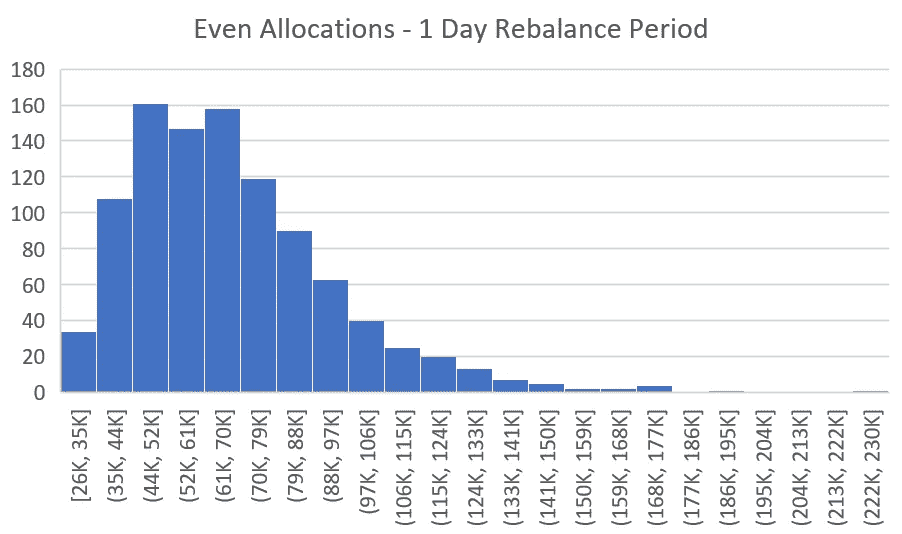
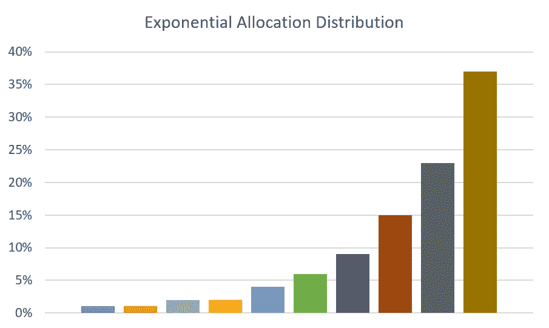

# 优化加密货币再平衡的资产分布

> 原文：<https://medium.com/hackernoon/optimizing-asset-distribution-for-cryptocurrency-rebalancing-d31c7a7d607b>

在我们之前的研究中，所有的[回溯测试](https://blog.shrimpy.io/blog/the-crypto-portfolio-rebalancing-backtest-tool)都是在资产平均分布的情况下进行的。这意味着，如果分配了 5 种加密货币的投资组合，每种资产的选定分配比例为 20%。在重新平衡过程中，每项资产都将重新调整到这一配置。

这项研究正在检验分布模型。我们将研究 3 种不同的分布，以确定最佳分配策略。这些分配策略如下:

*   **甚至**
*   **直线型**
*   **指数型**

# 回溯测试设计和设置

为了评估每种分配策略，我们对历史数据进行了回溯测试。这允许我们创建一个策略在过去表现如何的模拟。在执行每个回溯测试时，使用了以下约束。

## 贸易和数据

市场数据采集时间为 2017 年 5 月 4 日至 2018 年 5 月 3 日。这些数据被用来计算当时交易的价格。每项资产之间的交易路径是先交易到 BTC。这简化了可能具有不同碱基对的交换路径。每笔交易都收取 0.25%的交易费。

## 资产和初始条件

这项研究中的每个投资组合都由 10 个随机选择的资产组成。在每次回溯测试之后，为下一次回溯测试选择 10 个资产的新随机组。对于每个策略类型和重新平衡周期，该过程要完成 1000 次。 [*研究中包含的资产的完整列表可在我们的回溯测试工具中找到。*](https://www.shrimpy.io/backtest)

在每个回溯测试开始时，投资组合被植入一个 5000 美元的初始投资，该初始投资在资产之间分配。 [*我们在之前的文章中概述了使用的重新平衡方法。*](https://hackernoon.com/portfolio-rebalancing-for-cryptocurrency-7a129a968ff4)

关于回测程序和研究设置的更深入的讨论可以在我们之前的文章中找到:

 [## 再平衡与 HODL:技术分析

### 这项研究的目的是描绘一幅公平的画面，说明再平衡作为一种策略如何符合霍德林。为了…

blog.shrimpy.io](https://blog.shrimpy.io/blog/rebalance-vs-hodl-a-technical-analysis) 

# 平均分配分布

This distribution follows an allocation of 10 percent for each asset.

平均分配意味着每种资产在投资组合中占有相同的权重。10 项资产的投资组合将导致每项资产在投资组合中恰好占 10%的权重。每当重新平衡投资组合时，都会进行交易来重新调整投资组合，以匹配这些期望的分配。

This group compares the performance of evenly distributed portfolios which contain 10 assets, but differ by rebalance period. Each histogram incorporates 1,000 backtests, where the x-axis is the value of a portfolio after 1 year which had an initial investment of $5,000\. The y-axis is the number of backtests which fell into the portfolio value buckets that are defined on the x-axis. (Example: A backtest was run with a rebalance period of 1 hour and 10 evenly distributed assets in the portfolio. The results of a backtest was $200k after one year. This would mean you add a 1 to the bottom right chart in the x-axis bucket which has the range of $195k to $214k. This process is then repeated until 1,000 backtests have been run.)

These values represent the median portfolio value in USD, 1 year after an initial investment of $5,000\. Each value corresponds to their respective histogram displayed above.

平均分布的投资组合通过每小时重新平衡，呈现了从 HODL 的 4 万美元中值到 12.3 万美元中值的回报。除了中值更高之外，更频繁的再平衡也带来了更好的利差。虽然使用 HODL 策略的投资组合的价值主要集中在低端，如上述直方图所示，但频繁的再平衡通过将结果分布在更广泛的价值和更高表现的投资组合上，改善了分布。不仅 1 小时再平衡周期的中位数超过了 hodl 的中位数，在 1 小时再平衡策略组的 1000 多次回溯测试中，表现最差的投资组合也超过了 HODL 投资组合的中位数。

> 一年后，平均分布的投资组合每小时调整一次，回报率为 2，360%。

# 线性分配分布

This distribution follows an allocation of 1, 3, 5, 7, 9, 11, 13, 15, 17, 19 percent for each asset.

线性分布仍然具有等于 100%的百分比总和，但是每个资产的权重是不均匀的。它们不均匀的方法是线性的。由于线性可以有多种含义，我们将一个有 10 项资产的投资组合定义为每项资产有 1、3、5、7、9、11、13、15、17、19%的线性分布。每当重新平衡投资组合时，都会进行交易来重新调整投资组合，以匹配这些期望的分配。

This group compares the performance of linearly distributed portfolios which contain 10 assets, but differ by rebalance period. Each histogram incorporates 1,000 backtests, where the x-axis is the value of a portfolio after 1 year which had an initial investment of $5,000\. The y-axis is the number of backtests which fell into the portfolio value buckets that are defined on the x-axis. (Example: A backtest was run with a rebalance period of 1 hour and 10 linearly distributed assets in the portfolio. The results of a backtest was $200k after one year. This would mean you add a 1 to the bottom right chart in the x-axis bucket which has the range of $183k to $204k. This process is then repeated until 1,000 backtests have been run.)

These are the median portfolio values for each set of backtests which are detailed in the histograms above.

与均匀分布相比，线性资产分布的结果在 1 年内呈现出收益下降。中值的降幅从使用 HODL 策略的投资组合的 2000 美元到每 1 小时执行一次再平衡的投资组合的 8000 美元不等。我们还从直方图中看到，线性资产分布降低了结果的分布。结果不是一条平滑的曲线，而是聚集在这个分布的低端。这表明，不仅中位数下降，而且高绩效投资组合也减少了。

> 一年后，每小时重新平衡的线性分布投资组合的回报率为 2，200%。

# 指数分配分布

This distribution follows an allocation of 1, 1, 2, 2, 4, 6, 9, 15, 23, 37 percent for each asset.

我们将要讨论的最后一种分配方法是指数分布。这种方法只是以一种方式分配资产，导致一种资产持有总投资组合价值的最大份额，之后的每种资产持有前一种资产的一小部分。我们定义了一个有 10 项资产的投资组合，每项资产的指数分布为 1、1、2、2、4、6、9、15、23、37%。每当重新平衡投资组合时，都会进行交易来重新调整投资组合，以匹配这些期望的分配。

看到这张分布图时，你的第一反应可能是，它看起来像是一只加密指数基金的配置，该基金按市值跟踪前 10 大资产。这是真的。主要区别在于，前 10 大指数是基于当前市值的，因此每种资产的配置会随着时间的推移而变化。我们的研究在一年的时间内使用了固定分配。虽然这似乎是一个很小的区别，但它可能是一个重要的区别。

This group compares the performance of exponentially distributed portfolios which contain 10 assets, but differ by rebalance period. Each histogram incorporates 1,000 backtests, where the x-axis is the value of a portfolio after 1 year which had an initial investment of $5,000\. The y-axis is the number of backtests which fell into the portfolio value buckets that are defined on the x-axis. (Example: A backtest was run with a rebalance period of 1 hour and 10 exponentially distributed assets in the portfolio. The results of a backtest was $200k after one year. This would mean you add a 1 to the bottom right chart in the x-axis bucket which has the range of $176k to $201k. This process is then repeated until 1,000 backtests have been run.)

These are the median portfolio values for each set of backtests which are detailed in the histograms above.

与均匀分布和线性分布相比，指数资产分布的结果在 1 年内表现出更大的回报率下降。中值的降幅从使用 HODL 策略的投资组合的 3，000 美元到每 1 小时执行一次再平衡的投资组合的 2 万美元不等。我们还从直方图中看到，这些回测延续了利差下降的趋势。结果聚集在这个分布的低端，甚至比探索线性分配分布的回溯测试更多。这表明线性分布的中位数下降，以及高收入投资组合的频率下降。

> 一年后，每小时重新平衡的线性分布投资组合的回报率为 1，760%。

# 结论

结合这项研究的所有结果，我们可以看到在过去一年中，这些策略和再平衡期的投资组合中值表现如何。

These are the median portfolio values for each set of backtests combined across all histograms which were detailed above. Each value represents 1,000 backtests. With a starting portfolio value of $5,000, these median values represent the final value held by the portfolio after 1 year.

该热图表明，在过去一年中，1 小时重新平衡的均匀分布优于非均匀分布。事实上，资金分布越不均衡，投资组合的中位数表现就越差。

> 免责声明:回溯测试检查过去的表现，并不保证未来的表现。

# 用 Shrimpy 重新平衡

过去一年已经证明，重新平衡多样化的投资组合可以提高业绩。Shrimpy 将整个投资组合管理和再平衡过程简化为一个点击式界面。快速选择资产，立即分配多样化的投资组合，并在预定的时间段内重新平衡。最棒的是，Shrimpy 现在完全免费使用！

点击[这里](https://www.shrimpy.io/)报名。

如果你还不确定，试试[的演示](http://www.shrimpy.io/demo)，看看我们能提供的一切！

# 附加阅读

 [## 多样化的加密用户表现更好

### 这是你投资组合的一小步，回报的一大步。我们的上一篇文章讨论了这种关系…

blog.shrimpy.io](https://blog.shrimpy.io/blog/crypto-users-who-diversify-perform-better)  [## 基于资产市值的加密投资组合绩效评估

### “我们相信上帝。所有其他人都必须带数据。”-爱德华兹·戴明

blog.shrimpy.io](https://blog.shrimpy.io/blog/evaluating-crypto-portfolio-performance-based-on-asset-market-capitalization) 

不要忘记查看 [Shrimpy 网站](https://www.shrimpy.io/)，关注我们的 [Twitter](https://twitter.com/ShrimpyApp) 和[脸书](https://www.facebook.com/ShrimpyApp)更新，并向我们在[Telegram](https://t.me/ShrimpyGroup)&[Discord](https://discord.gg/gXyy95y)上的令人惊叹的、活跃的社区提出任何问题。

请留下您的评论，让我们知道您使用 Shrimpy 的经历！

捕虾队