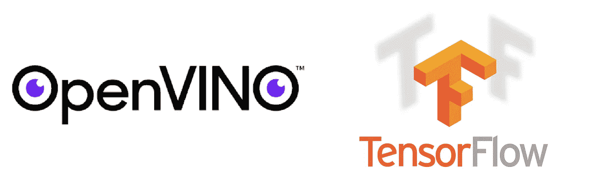
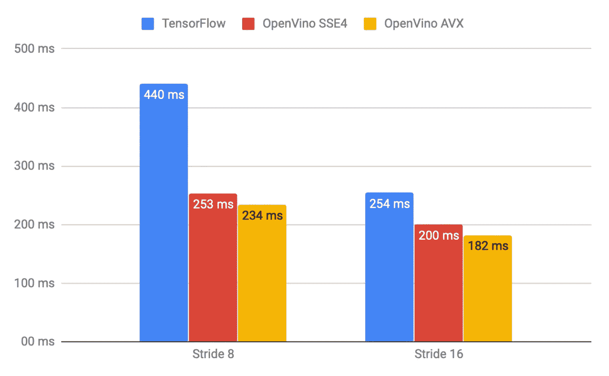

# 利用英特尔的 OpenVINO 为生产优化神经网络

> 原文：<https://medium.com/hackernoon/optimizing-neural-networks-for-production-with-intels-openvino-a7ee3a6883d>

## 在各种神经网络设计框架之间的圣战中，通常缺少一个重要步骤——制作生产就绪和优化的可交付产品。我已经测试了英特尔的 OpenVINO 优化系统，它看起来真的很有前途。



# 介绍

我在 [Skylum](https://skylum.com) 工作——这家公司制作领先的人工智能照片编辑软件 [Luminar](https://skylum.com/luminar) 、[极光 HDR](https://skylum.com/aurorahdr) 和 [Photolemur](https://photolemur.com) 。目前，我们的系统使用 Tensorflow 作为神经计算引擎。为我们的客户提供优化的小型神经网络并不是一个简单的过程。有几件事你必须记住——张量流构建本身的大小、神经模型的大小以及它们的计算速度。TF 在这方面并不完美。在所有优化之后，本机 TensorFlow 推理引擎的大小至少为 60 兆字节，并且优化边缘 CPU 计算的模型也不是完美的。TFLite 是一种廉价的解决方案，而 TF Mobile 擅长于它所做的事情—针对移动 CPU 进行优化。任何主要的图书馆都没有涉及纯桌面优化领域，所以这是我感兴趣的一部分。

作为与[英特尔](https://intel.com)正在进行的合作努力的一部分，我正在积极地寻求将我们的推断转换为 CPU 的原生内容，并随时用于英特尔的 build-it GPU，这是大多数英特尔芯片组目前拥有的。在这里，我报告我的测试结果，他们的 [OpenVINO 优化包](https://software.intel.com/en-us/openvino-toolkit)。

# 技术细节

我选择语义分割任务作为我们软件的一个非常有代表性的问题。例如，它为我们的[人工智能天空增强器](https://www.youtube.com/watch?v=ScbyevtYiiE)滤镜以及一系列即将到来的效果提供动力。显然，我不能报告我们实际的神经网络架构的结果，所以我选择了一个看起来足够接近的架构——deep lab V3+和启用了 ASPP 层的 MobileNetV2 head。为了扩大范围，我选择了这种网络的两个版本——输出步幅为 8 和 16，提供不同的输出分辨率。

为了生成这些图，我使用了官方的 Google 知识库，训练了模型，并使用官方提供的导出脚本导出了冻结的计算图，将输入和输出层分别命名为“input”和“segmap”。使用一个加载和评估冻结的简单 python 脚本测试了结果文件的 TF 性能。pb 图。分辨率为 513x513px，使用的 CPU 是工作频率为 3.70GHz 的英特尔酷睿 i7–8700k CPU

使用 OpenVINO 测试同一型号的性能并不简单，我非常感谢来自英特尔的帮助。首先，我在我的测试系统上安装了 OpenVino，按照官方的说明运行 Ubuntu 16.04。首次尝试运行优化脚本失败。这是我得到的。

```
python mo.py — input_model /data/1.pb — input_shape “(1,513,513,3)” — log_level=DEBUG — data_type FP32 — output segmap — input input — scale 1 — model_name test — framework tf — output_dir ./[ ERROR ]  Stopped shape/value propagation at "GreaterEqual" node.tensorflow.python.framework.errors_impl.InvalidArgumentError: Input 0 of node GreaterEqual was passed int64 from add_1_port_0_ie_placeholder:0 incompatible with expected int32.
```

这里的问题是 OpenVINO 支持的一系列层。当 DeepLab 导出模型时，它实际上包括一系列预处理和后处理操作(调整大小、标准化等)，以尽可能容易地利用模型。它是使用内置的张量流运算来完成的，这种运算有时并不理想，而且写得很差。例如，[他们的调整大小功能和 bug 最近让我很头疼](https://hackernoon.com/how-tensorflows-tf-image-resize-stole-60-days-of-my-life-aba5eb093f35)。因此，我在[英特尔的论坛](https://software.intel.com/en-us/comment/1930073#comment-1930073)寻求帮助，他们的一名员工做了一个 [GitHub repo](https://github.com/FionaZZ92/OpenVINO) +解释。

长话短说——您必须从 TensorFlow 图中删除预处理和后处理操作，只优化实际的神经网络操作。这实际上很有意义，因为用 C++实现这些操作要快得多。

# 推理速度比较

因此，在此之后，我用 TF 引擎和 OpenVINO 引擎对几个版本的 TF 图进行了比较。Fiona 在 GitHub repo 中实际提出的是将 TF 图实际切割成 3 块——预处理、推理和后处理。用 TF 完成前后处理，推理外包给 OpenVINO。

当我使用提供的脚本直接进行比较时，我发现执行时间没有差别。直觉告诉我这不可能是真的，所以我分别测量了这三个阶段。想法是启动两次 TF 引擎是一个耗时的操作，并且考虑到各种 TF 运算符的非理想优化的事实，可能会有开销。那碰巧是真的。

```
time cost preprocess: 0.0021 sec
time cost to inference : 0.1979 sec
time cost postprocess: 0.2642sec
```

使用 Tensorflow 进行后处理实际上比推理本身花费了更多的时间！

为了处理这种情况，我做了一个公平使用比较。我已经删除了在 OpenCV 和 Numpy 中实现的预处理和后处理阶段，并用 TF 和 OpenVINO 对相同的操作堆栈进行了比较。

重要的注意事项是优化的级别。我在这台机器上构建的 Tensorflow 是谷歌回购的官方 TF 1.11，构建时没有 AVX2 和 FMA 优化。OpenVINO 目前在其发行版中提供了两个级别的优化——AVX 级别和 SSE 级别。对于我们的产品，就向后兼容性而言，我们最感兴趣的是 SSE，但是我在这里报告的是两个版本。



Inference speed comparison between TensorFlow and OpenVINO on a DeepLabV3+ / MobileNetV2 / ASPP head network.

正如你所看到的 **OpenVINO 在这场公平的面对面比较中提供了非常显著的速度提升**，幅度为 30–50%，大概是利用了他们对英特尔架构的了解。

# 进一步研究

我仍然有兴趣看看在其他用例中的性能，并可能尝试更“纯粹”的东西，如没有预处理和后处理的 PB 模型，以及更传统的架构，如 ResNet/DenseNet 甚至 VGG。希望这能让我们对 OpenVINO 的能力有所了解。

我对使用英特尔的内置 GPU 测试推理非常感兴趣，但 OpenCL 在不同平台上的可用性是一个问题，所以我将推迟这个问题，直到有更好的一致的多平台生产就绪解决方案。此外，FT16 和 INT8 推理这一非常重要的话题也不在这里讨论。我无法以半精度运行相同的实验，也没有发现 OpenVINO 中提到 INT8 量化优化。

而且，把 OpenVINO 和 TensorRT 做个比较会很酷。你的掌声和关注将激励我做进一步的研究，敬请期待！