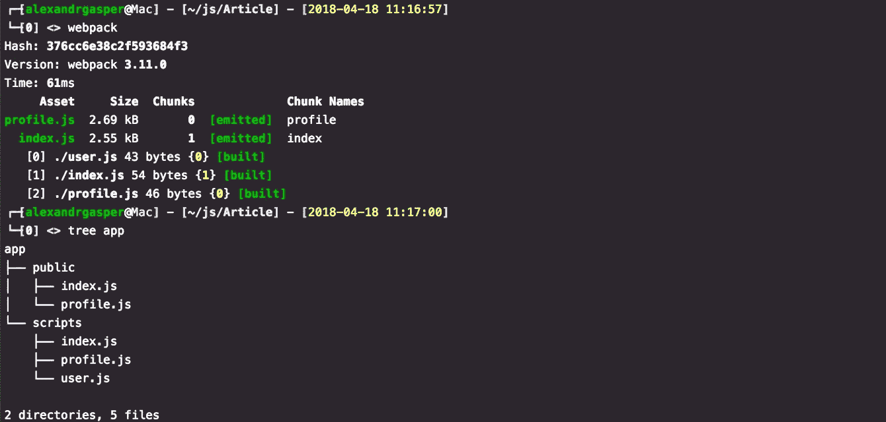
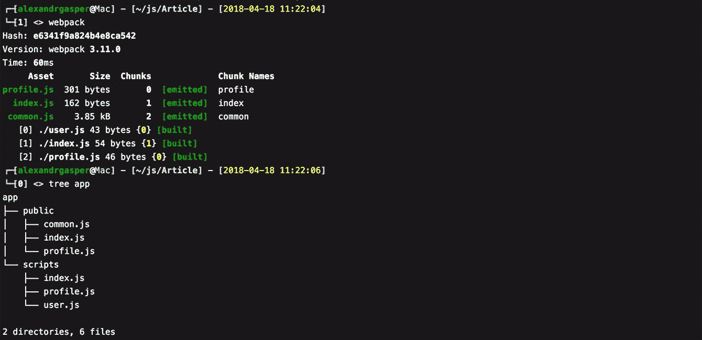
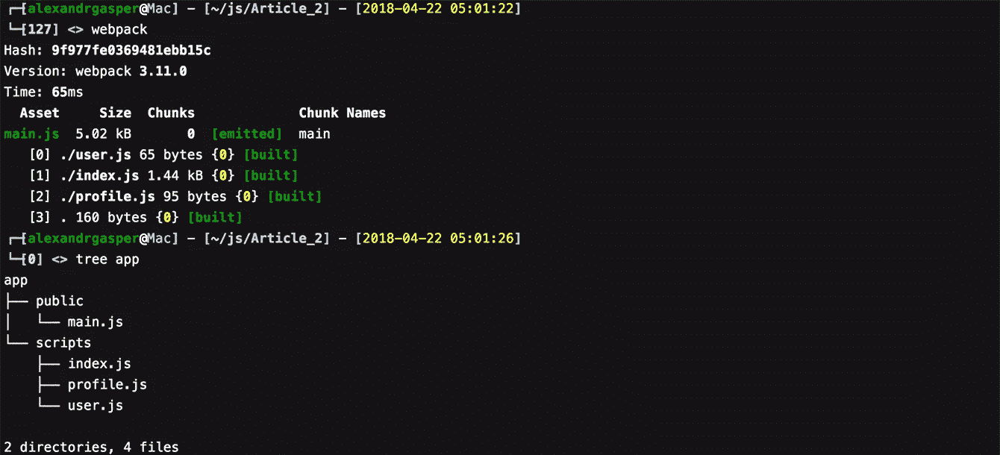
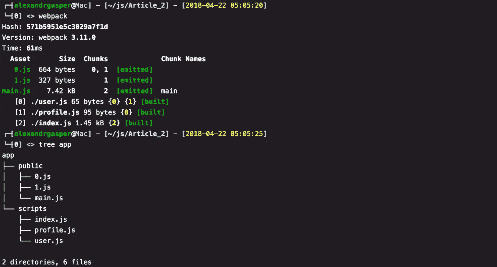
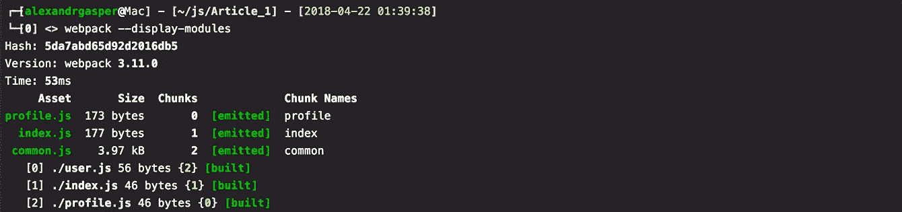
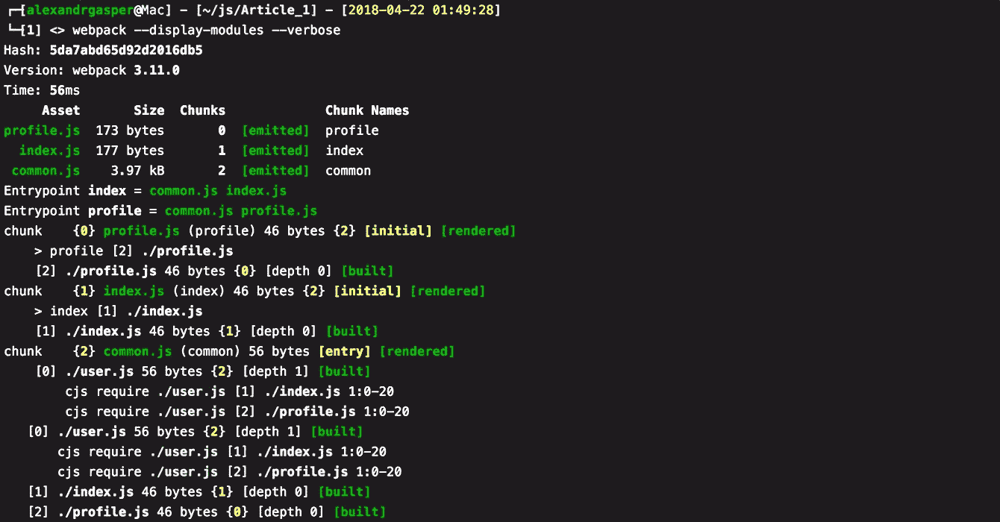
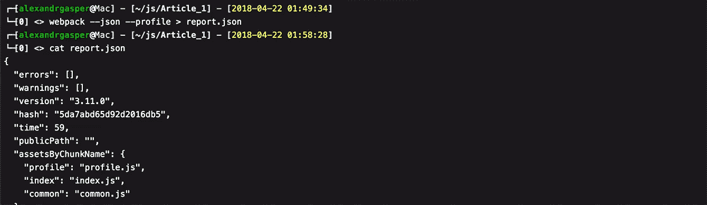
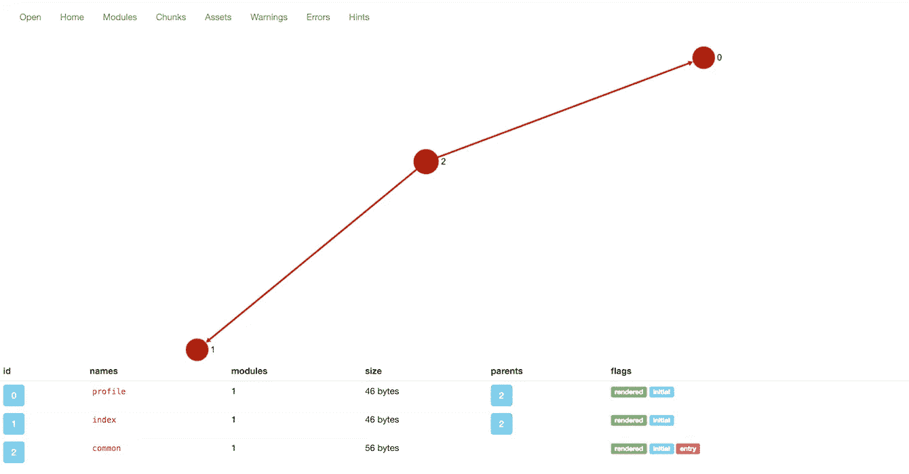

# 优化单页应用程序:三大方法

> 原文：<https://medium.com/hackernoon/optimizing-single-page-applications-top-3-approaches-3cf91b85a052>


在本教程中，我们将向您展示三种优化单页应用程序的好方法，并使用 Webpack 使其快速运行。

随着单页面应用程序的发展趋势，服务器端呈现已经开始失去其流行性。因为所有的逻辑都转移到了前端，所以它仍然主要是一种服务。这种方法现在非常流行，因为它有助于开发人员设计一个可理解的架构，并保持清晰的扩展和支持能力。但是没有什么是完美的。

SPAs 的一个主要缺点是加载速度慢。第一次加载包含整个应用程序的单个包文件需要时间(特别是对于大型应用程序)，因为没有人喜欢等待，所以您可能会因此失去客户。但这实际上不再是 Webpack 的问题了。Webpack 可以非常灵活地配置，允许您在大多数情况下摆脱加载缓慢的问题。在本教程中，我们将使用 Webpack 3.11.0。

阅读我们的[案例研究图片博客](https://steelkiwi.com/projects/improving-website-performance-for-a-photo-blogging/)，了解我们如何优化网站性能和提高页面加载速度。

# 通过使用 Webpack 将包分成几个部分来加速应用程序的方法

# 1.使用 CommonsChunkPlugins 插件

这个插件由 Webpack 提供，允许您在一个文件中查找和存储常用的脚本。这对单页和多页应用程序都非常有用。

**CommonsChunkPlugins** 找到并剪切掉常用的脚本，把你的脚本拆分出来，产生一个 **common.js** 文件，让整个应用更轻便。

假设我们有以下项目:


这里我们有 **index.js，profile.js，**和 **user.js.** 假设 **index.js** 和 **profile.js** 需要 **user.js.**

我们希望 index.js 和 profile.js 分别在不同的页面上工作。通常，我们会这样写:

```
const webpack = require('webpack');

module.exports = {

    context: __dirname + '/scripts',

    entry: {
        index: './index',
        profile: './profile'
    },

    output: {
        path: __dirname + '/app/public',
        filename: '[name].js'
    }

};
```

这将在公共文件夹中产生以下结构:



如果 index.js 和 profile.js 中都需要 user.js，那么在这种配置下，Webpack 会将 user.js 插入到这两个文件中，并且最终应用程序中的代码会重复，这并不好。我们希望将常用的部分放在一个单独的文件中，这样浏览器就能够加载并缓存该文件。

让我们用 **CommonsChunkPlugins** 对此进行优化。为此，我们的 Webpack 配置将是:

```
const webpack = require('webpack');

module.exports = {

    context: __dirname + '/app/scripts',

    entry: {
        index: './index.js',
        profile: './profile.js'
    },

    output: {
        path: __dirname + '/app/public',
        filename: '[name].js'
    },

    plugins: [
        new webpack.optimize.CommonsChunkPlugin({
            name: 'common'
        })
    ]

};
```

让我们看看发生了什么变化:



现在可以看到出现了一个 **common.js** 文件。这个文件包含了我们所有脚本的所有常见的 **require()** 。此外，文件的大小已经大大减少。

当然，一个真实的项目会更复杂，所以当你为应用程序的不同部分使用不同的库时，你会发现这个插件非常有用。

它也是非常可配置的，你可以在同一个应用程序中多次使用它。

https://webpack.js.org/plugins/commons-chunk-plugin/

# 2.动态需求()

无论是否会用到，加载所有的功能都不是一个好主意。我们更喜欢根据要求装载东西。当您的应用程序变得非常大时，您绝对应该考虑拆分您的脚本并在需要时加载部分。在 JavaScript 实现自动化之前，我们需要开发自己的方法，将带有`<script>`标签的新文件动态插入到**文档**中。幸运的是，Webpack 现在可以服务于这个目的，而且是相当自动化的。但是记住，普通的 **require()** 不允许你基于规则加载文件。Webpack 会简单地将它添加到包中或者全部删除。

所以如果你写下这样的话:

```
const location = window.location.pathname;

switch(location) {

    case 'user':
        const user = require('./user');
        user();
        break;

    case 'profile':
        const profile = require('./profile');
        profile();
        break;

    default: alert('No match'); break;

}
```

您可能期望文件会在 **request()，**上动态加载，但是它们不会。相反，这将创建一个包含所有必需脚本的文件，而不考虑规则，因为 Webpack 不会分析**开关**和规则本身。



幸运的是，出于这个目的，Webpack 提供了一个原始的 require with**assure()**函数，其语法如下:

```
const location = window.location.pathname;

switch(location) {

    case 'user':
        require.ensure(['./user'], function(require) {
            const user = require('./user');
            user();
        });
        break;

    case 'profile':
        require.ensure(['./profile'], function(require) {
            const profile = require('./profile');
            profile();
        });
        break;

    default: alert('No match'); break;

}
```

组装后，我们得到:



Webpack 创建块文件 **0.js** 和 **1.js** 。Main.js 将不包含这些文件，它们将只在请求时加载——在我们的例子中，如果文件名与 URL 匹配。因为它们在服务器上，所以不要忘记在 config 中为 outputparameter 指定 publicpath。

我们还将为使用**路由器**库来管理渲染的 **React** 开发者描述这种情况。如果组件与 URL 的某个部分匹配，那么加载带有组件的文件会很棒。问题是没有方便的方法来使用`<Route>`组件中的**require . assure()**。为此，我们使用 react-loadable[(https://github.com/jamiebuilds/react-loadable](https://github.com/jamiebuilds/react-loadable))。有了这个库，您的路线将如下所示:

```
<Router>
    <Route path="/profile" render={() => {
        const Profile = Loadable({
            loader: () => import('./profile'),
            loading: Loading
    });
        return <Profile/>;
    }}/>
</Router>
```

此外，有时您可能喜欢这样写:

```
const location = window.location.pathname;

require.ensure(['/somepath/' + location], function(require) {
    const script = require('/somepath/' + location);
    script();
});
```

这种情况称为动态需求。因为文件名存储在一个变量中，所以对于 Webpack 来说，检测该文件并创建块太复杂了。您需要用静态的**require . assure()**创建一个中间文件，或者使用**捆绑加载器**。我们更倾向于第二种选择:【https://github.com/webpack-contrib/bundle-loader 

# 3.分析您的构建

在这一节中，我们将向您展示(或提醒您)如何使用 Webpack 工具进行分析。

首先，使用键**显示模块**。这将显示有关您的版本存储模块的方式的信息。如果我们在之前的例子中使用 **CommonsChunkPlugins** ，它将显示以下内容:



你可以看到:

**profile.js** 转到了 **{0}** 块，也就是 **profile.js** 条目

**index.js** 到了 **{1}** chunk，也就是 **index.js** (也是一个单独的条目)

**user.js** 转到了 **{2}** 块，这是 **common.js** ，因为这个脚本同时被 **index.js** 和 **profile.js** 使用

但是你可以用**-显示模块——verbose 更深入。这个命令还会告诉你为什么构建是这样组装的。**



下面是关于为什么我们得到这样的 **common.js** 以及它包含了什么的详细信息。

我们总是使用这个命令来跟踪我们的构建，并确保它尽可能的小并且不包含重复。

在大多数情况下，这就足够了。但是对于非常大的项目，其中有上百个模块，从控制台读取所有内容并分析整个应用程序及其所有依赖项是很烦人的。幸运的是，出于这个目的，Webpack 有一个带有图形界面的分析器。要使用它，我们需要首先创建一个 JSON 格式的批量报告:

要使用它，我们需要首先创建一个 JSON 格式的批量报告:



这个 **report.json** 文件包含关于您的构建的所有必要信息。

接下来，去[http://webpack.github.io/analyse](http://webpack.github.io/analyse)上传 **report.json** 。

最后你会得到这个:



这个工具将向您显示关于模块、块、资产、警告和错误的信息。

该分析有助于您避免重复，并保持一切按预期运行。

我们也欢迎您访问我们的[案例研究页面。](https://steelkiwi.com/projects/)在这里，您可以看到我们如何实施技术解决方案来解决业务问题。您也可以向我们的[销售团队](https://steelkiwi.com/contacts/)咨询所有相关问题。