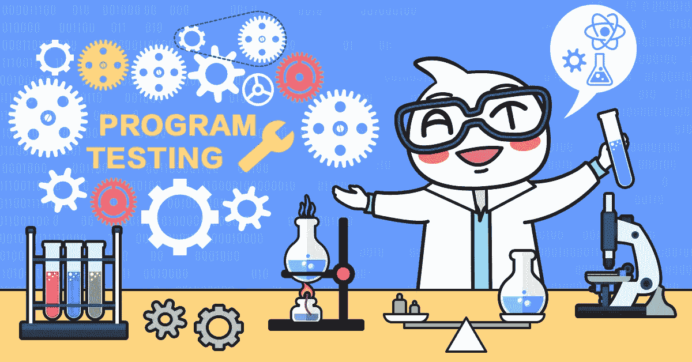
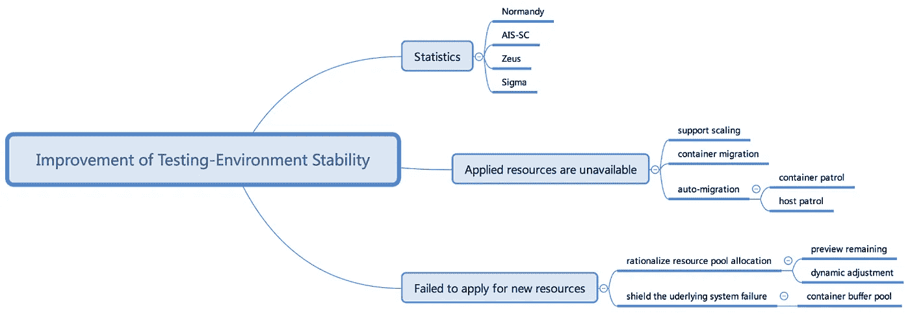
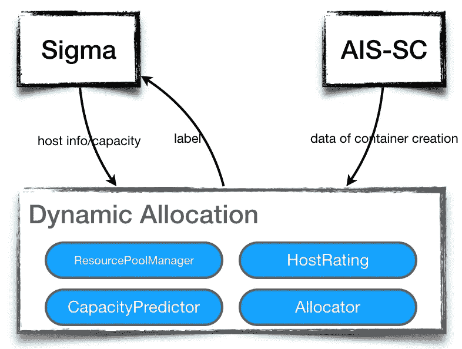
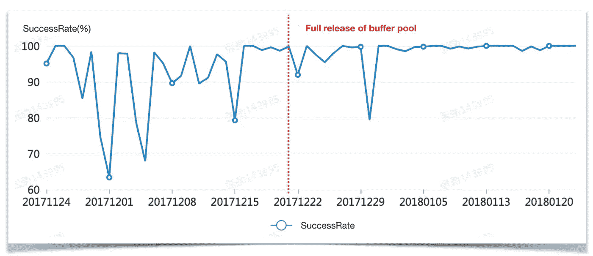
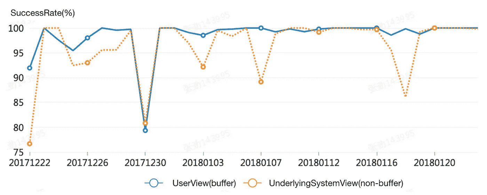

# 通过包含稳定性来优化测试环境

> 原文：<https://medium.com/hackernoon/optimizing-test-environments-by-containing-stability-73d0f625a1b6>

*阿里巴巴技术团队在程序测试方面的最佳实践*

测试环境是任何软件 R&D 过程的一个重要方面，它提供了一个在发布前有效测试新特性的系统。这种系统的稳定性是影响 R&D 效率的最大因素之一。

本文概述了测试环境的主要难点和限制，并介绍了可以有效提高此类系统稳定性的改进方法。阿里巴巴技术团队改善测试环境稳定性的主要目标是优化容器应用的成功率，提高测试环境的稳定性。这篇文章表明，通过解决应用资源可用性和新资源应用的问题，阿里巴巴已经创建了一个更平滑的软件 R&D 过程，并且通过扩展，创建了更好的最终产品。

# 棘手问题

容器应用程序由整个运行时环境组成，是隐藏可用于测试环境的硬件基础设施差异的有效解决方案。这些容器应用程序中的故障通常会暂停 R&D 进程，同时运行测试来找出问题发生的位置和方式。这些测试可以涉及测试环境中的所有系统。

阿里巴巴测试环境容器的问题在半年内发生了多达 10 次，导致数百小时的 R&D 时间浪费。因此，迫切需要显著提高测试环境的稳定性。

在彻底分析了遇到的所有问题后，阿里巴巴确定了测试环境面临的两个主要挑战:

## **已经申请的资源变得不可用**

测试环境的低性能和主机的高虚拟率(超出保修期)容易导致故障。故障主机的容器不会自动迁移，这很可能导致它们的重新部署和重新启动失败。

调度系统的巡查使得故障主机不可调度。由于这些主机仍有无法离线、修复和重用的容器，因此主机资源越来越有限。

## **新资源申请成功率低**

测试环境主机被分组到不同优先级的资源池中，这些资源池不共享资源。测试环境主机的总容量/可用容量的不透明性，加上缺乏警告，导致由于资源不足而导致计划失败。

资源调度系统没有被优化以适应与在线环境显著不同的测试环境，导致低成功率。

# 性能洞察:一切都与数据有关

为了优化测试环境，数据收集是理解主要稳定性问题的关键。阿里巴巴了解测试环境稳定性的方法概述如下:

*Test environment stability factors and platforms*

深入了解测试环境稳定性问题的自上而下的流程包括查看以下平台:

Normandy:运行基本应用程序的平台

大黄蜂:一个资源应用平台

Zeus:双层调度系统

适马:集团资源调度系统

Atom:故障主机替换系统

所有上游和下游系统都有自己独立的数据。这方面的一个主要限制是这些数据没有跨平台集成和兼容。尽管错误分析是在每天、每周和每月的时间框架内进行的，但它仍然是跨平台的碎片，这使得全面的数据分析更具挑战性。

尽管如此，收集的数据帮助团队确定了集装箱可用性和底层系统屏蔽的具体问题，并据此制定了解决方案。这些解决方案包括自动更换容器和屏蔽潜在的系统故障。实施之后，监控测试环境的稳定性，以确定解决方案是否有效。

# 合理分配资源池

资源池分配通常基于以下因素进行合理化:

**逻辑资源池**

主机标签用于指示每个资源池的不同资源和优先级。优先级越高，主机越好。

**集装箱规格估算**

测试环境具有相对较少的容器规格，其中最常见的是转换到双核 4G。其他估计包括:

> -每个资源池的平均每日容器增量。即当日增量: *P0* ，日前增量*m*:*Pm*，日均增量:(*P0*—*Pm*)/*m*。
> 
> -组内每个资源池的计算资源和每日增量份额:
> 
> -每个资源池的预测利润值: *Ti* = *Ri * T* ，其中 *T* 为总利润。

**主机评级**

主机设备可以根据其房间的等级、历史故障次数、硬件配置和发布日期进行调整。

**集装箱配送规则**

基于主机评级和资源池优先级来分发对应于资源池的主机标签。

下面显示了这种资源池动态分配的概要。

*Rationalization of the dynamic allocation of resource pools*

# 自动更换容器

在使用中的容器变得不可用的情况下，将进行自动容器替换。本质上，这个函数在一个稳定的主机上创建一个新的容器，并将原来的容器从出错的主机上脱机。

该过程从适马系统识别故障主机开始，例如磁盘已满或硬件故障的主机。然后，适马通知 Atom 系统，Atom 系统替换故障主机上的容器。然后，Atom 系统初始化 Normandy 系统的主机替代品。最后，通过自动替换清空故障主机，然后进行离线修复。

# 屏蔽底层系统故障

## 嵌入式缓冲池

由于测试环境和在线环境之间的差异，并且为了节省成本，主要使用虚拟主机比率较高的测试环境。这会导致创建和使用容器的问题，因此应用容器缓冲池来防止底层故障影响用户。

缓冲池嵌入到测试环境容器的生产环节的末端，以预生产一批容器，在必要时分配给用户。即使申请缓冲容器失败，原来的生产环节可以继续生产容器。每当用户从缓冲池中获得一个容器时，另一个相同规格的容器就会被异步添加到缓冲池中，以保持其容量或容器数量。

## 缓冲池容量

另一个关键点是制定缓冲容器规格和缓冲池容量，这需要计算每个规格图像资源库的过去应用数量，并按比例决定每个缓冲池的容量。为了确保底层系统停止服务时，整个系统仍然可用，必须确认高峰时间容器应用的数量、允许的服务中断持续时间以及测试环境的主机资源。

此外，应该考虑的另一点是，用户包括普通用户(R&D 和测试人员)和系统用户(比如自动测试系统)，每个用户都有不同的优先级。就测试环境的可用性而言，普通用户通常比系统用户具有更高的优先级。

## 屏蔽功能

为了最小化缓冲池对用户的可能影响，在缓冲池中添加了一些动态开关来屏蔽它的一些功能。例如，可以为特定的应用程序设置容器的主机名是否必须更改。如果主机名不变，一个成功的应用平均用时不到 1s。在这种情况下，如果应用程序不使用缓冲功能，它可以立即被屏蔽。如果缓冲池本身出现故障，快速降级会从整个链路中移除缓冲功能。

在交付缓冲容器之前，缓冲池会对容器是否可用进行额外的检查，以避免服务部署失败。缓冲池定期删除不可用的容器，并添加新的缓冲容器。

# 结果趋势

成功率分析是全面理解优化有效性的关键。如下所示，从 12 月 21 日开始利用缓冲池的全部容量，极大地提高了成功率和稳定性。成功率的下降，比如 12 月 1 日的下降，是由失败的计划造成的。

*Success rate trend of container applications over a two-month period*

根据资源池的预计平衡和警告来调整每个资源池的容量排除了失败调度的可能性，并且显著降低了成功率的波动性。

在缓冲池达到最大容量的一周内，内部错误和缓冲池的低命中率导致成功率波动，在修复错误和提高缓冲池的命中率后，成功率稳定下来。

还通过对用户视角(有缓冲区)和底层系统视角(无缓冲区)进行纵向比较来分析每日成功率。如下所示，缓冲池屏蔽了大多数底层系统故障，并且在缓冲池耗尽时仅导致一天的性能下降。

*Daily success rate comparison of user perspective and bottom layer system perspective*

# 展望未来

尽管优化后成功率有所提高，但仍有三个关键方面需要进一步关注:

**资源池容量的自动调度**

当前的算法不够复杂，无法处理某些情况，例如添加或删除过多的容器导致不正确的余额趋势分析。另一个问题是自动调度导致主机标签混乱的可能性增加。

**动态调整缓冲模板类型和每种类型模板的数量**

缓冲模板的类型和每种类型模板的数量应根据历史应用数据或实时数据进行动态预测和调整。

**扩大缓冲池的容量**

这需要足够的主机资源可用。

此外，测试环境还有以下更普遍的问题，开发解决方案需要更多样的方法:

如何提高整个测试环境的资源利用率？

如何缩短集装箱交付的时间(从用户申请到集装箱交付)？

如何提高应用程序的可调度性？

展望未来，这些是阿里巴巴技术团队将关注的问题。

(Original article by Zhang Jing 张劲)

# 阿里巴巴科技

关于阿里巴巴最新技术的第一手深入信息→在**脸书**上搜索 [**【阿里巴巴科技】**](http://www.facebook.com/AlibabaTechnology)