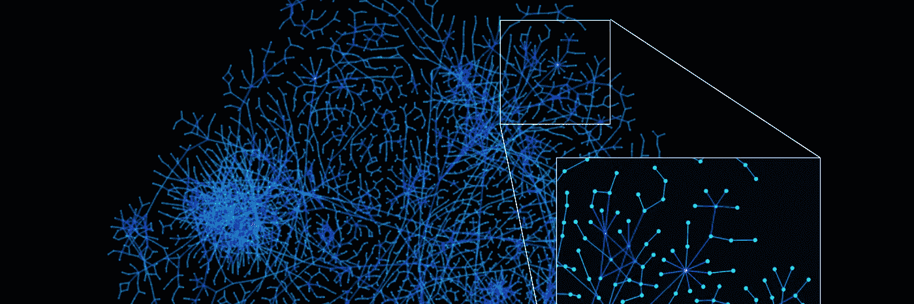
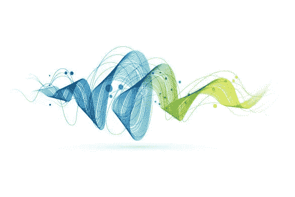

# 作为复杂系统的组织

> 原文：<https://medium.com/hackernoon/organizations-as-complex-systems-75b5f024bff3>

Image Credit: Ricard Solé from the [Complex Systems Lab](https://www.ibe.upf-csic.es/sole) (a long time collaborator with my mentor [Prof. Brian Goodwin](https://www.theguardian.com/theguardian/2009/aug/09/brian-goodwin-obituary))

## 摘自盖亚教育在线课程“[可持续发展设计](https://gaiaeducation.org/elearning/design-for-sustainability/)”中的“[社会设计维度](https://gaiaeducation.org/elearning/design-for-sustainability/social-design/)”。

> *“有一种更简单的方法来组织人类的努力。它需要在这个世界上没有恐惧。生活在充满玩耍和创造力的世界里。寻找一切可能。乐于学习，乐于惊喜。”*
> 
> 玛格丽特·j·惠特利

彼得·圣吉在他的书《必要的革命》中指出“制度很重要。今天的世界不仅仅是由个人塑造的，而是由企业、政府和非政府机构的网络塑造的，这些网络影响着我们制造的产品、我们吃的食物、我们使用的能源以及我们对这些系统所产生的问题的反应。”

虽然有些人认为，组织只有通过使用命令和控制领导以及等级结构才能很好地发挥作用，特别是在危机和混乱的时候，但圣吉认为，“只有通过不同的思维，通过学习如何看待个人和组织所在的更大系统，并促进跨越每一个可以想象的边界的合作，一个可持续的世界才是可能的。这些核心能力——观察系统、跨边界合作、创造与解决问题——形成了思维转变的基础，并最终形成了工具和方法”(Senge，2008)。

促进组织变革。《复杂性科学的教训》 (2001)，Edwin Olson 和 Glenda Eoyang 提出了一套基本观点，将社区和组织视为复杂的适应性系统。复杂和适应性系统的最基本特征是[自组织，](http://en.wikipedia.org/wiki/Self-organization)开放系统基于自身内部动态生成新结构和模式的过程。在自组织系统中，秩序不是来自上面或外面；它来自于系统中各主体的相互作用。所有的生命系统都能够自我组织，所以我们的社区和组织也应该是自我组织的。

我们可以问自己，在什么条件下，一个被视为复杂系统的社区或组织是可持续的。“迄今为止占主导地位的可持续性概念——I)消除负面环境影响，ii)最大限度地利用人力和自然资本——受到了一种完全不同的方法的挑战:iii)可持续性，即维持或增强适应性[复原力](http://en.wikipedia.org/wiki/Resilience_(ecology))，即通过短期扰动和长期变化保持持续运转的能力”(Brinsmead & Hooker， [2011](http://www.johnwoods.ca/HPS/Brinsmead%20Hooker%20ComplexitySustainableDevelopment-2F.pdf) )。

三个因素影响复杂动态系统中出现的模式的位置、形状和力量，从而决定系统的可持续性(Olson & Eoyang，2001:11–15):

*   ***容器/边界*** 为自组织系统设置边界。它将系统的各个部分结合在一起。在容器内，新的关系和结构随着时间的推移而形成。容器可以是物理的(例如，地理位置)、组织的(例如，部门)或概念的(例如，身份或目的)
*   ***显著差异*** 决定了自组织过程中出现的主要模式。两个代理之间的差异可能被系统中的其他代理反映和加强，成为有助于生成系统范围模式的显著差异。在给定的时间内，并不是所有代理之间可能的差异都是显著的。
*   ***转换交换*** 形成系统代理之间的连接，并有助于改变系统组织自身的模式。信息、金钱、能量或其他资源是转换交换的媒介。当资源从一个代理流向另一个代理时，每个代理都会以某种方式进行转换。这些个体变化的模式最终导致系统作为一个整体的适应性。

Image Sours: Systems Dynamics Research Center for Latin America

**注意:**下一批参加“[可持续发展设计](https://gaiaeducation.org/elearning/design-for-sustainability/)”的学生正在报名！课程于 2018 年 10 月 15 日开始，课程的[社会维度](https://gaiaeducation.org/elearning/design-for-sustainability/social-design/)。本节最初由[joséLuis Escorihuela(Ulises)](https://es.linkedin.com/in/josé-luis-escorihuela-ulises-665b7a1b)撰写，并由 Daniel Wahl 于 2016 年修订。