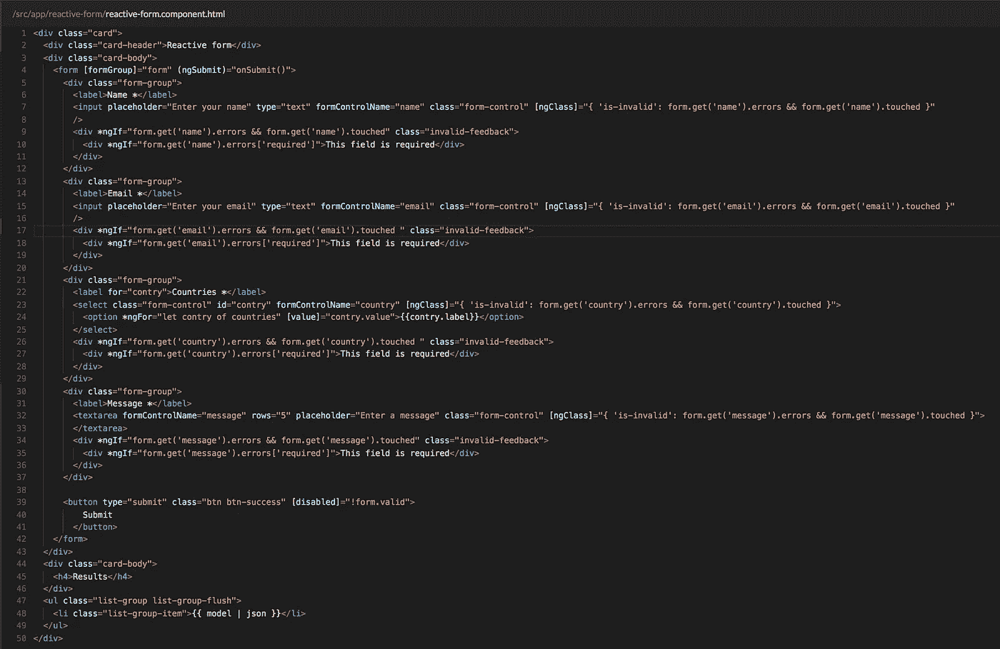
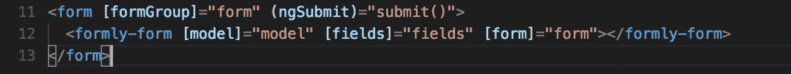
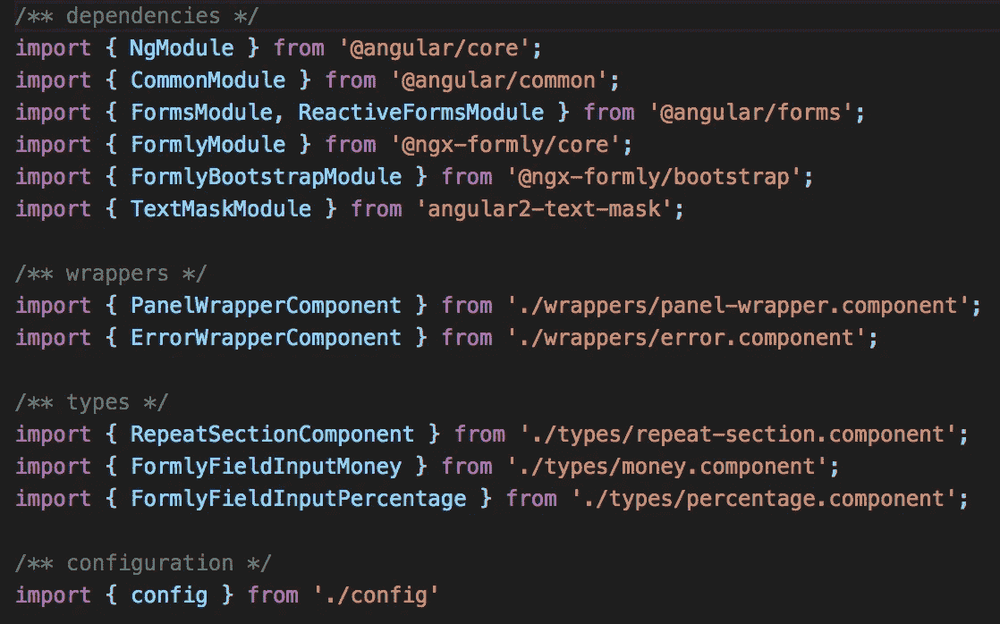
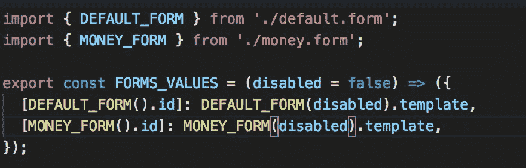

# 使用 NGX Formly 组织您的申请表格

> 原文：<https://medium.com/hackernoon/organize-your-forms-application-using-ngx-fomrly-796150461045>

创建表单是前端世界中最常见的工作之一。Angular 及其反应式表单帮助开发人员创建、组织和控制具有可理解的工作流的表单(您尝试过使用普通 javascript 创建表单验证吗？).

考虑一个常规的用户故事，产品所有者要求您创建一个旅程，其中包括具有 20 多个不同字段的表单、几个组合验证、重复的包装器和多个步骤。此时，您应该想象一下模板有多长，以及保存主要表单信息的组件有多长。(HTML 中的代码有多长？).

幸运的是，有几个开源 Angular 项目为您的应用程序表单提供了一个很好的解决方案，专注于代码的可维护性、可伸缩性和解耦性。(检查[表格](https://formly-js.github.io/ngx-formly/)和[角度模式表格](https://github.com/json-schema-form/angular-schema-form)

在这篇文章中，我将谈论**“NGX Formly”**一个非常酷的库，它将帮助你完成这项任务。此外，我将描述一种使用一些很棒的 Javascript 技术来组织代码的好方法。

## 什么是 NGX Formly？

**NGX Formly** 是一个基于配置对象创建反应式表单的角度库。在 Github 上，你可以找到这个库的所有不同版本，其中包括对 AngularJS 的支持。

换句话说，它可以帮助您将应用程序的模板从这个:



Regular Reactive Form HTML

对此:



Formly form HTML

## 如何开始

如果您想开始使用这个库，我建议从他们的文档站点开始。它包括几个创建良好的代码片段，将帮助您开始使用 **NGX Formly。** [在这里](https://formly-js.github.io/ngx-formly/guide/getting-started)你可以找到快速入门指南。

## 组织您的表单应用程序

整个过程可以总结为三个步骤:

**1。生成一个“uiForm”模块。**
该模块包含开始使用 Formly 所需的所有逻辑。它包括模块导入、表单配置、验证器、包装器、新的表单元素、助手类、服务和表单示意图。

**2。在应用程序中导入“uiForm”模块。**
对于给定的配置，您需要在项目上导入这个配置，并在正确的位置注入所需的服务。在一个常规的 Angular 项目中，服务应该在一个功能模块中提供。

**3。创建一个组件，注入模式服务并开始使用 Formly。**
一切就绪后，最后一步是开始使用我们的 schematics 服务获取字段配置并开始创建令人惊叹的表单。

## 创建“uiForm”模块

作为一个常规规则，每个 Angular 项目都应该包含一个文件夹，其中包含所有要共享的模块。您应该将此代码放在正确的文件夹中。在这个例子中，我将在 **"/src"** 下创建一个名为 **"/src/ui-form"** 的文件夹。

**1。为了实现这种配置，我们需要以下结构:**

```
$: ui-forms/ui-forms.module.ts
$: ui-forms/config.ts
$: ui-forms/ui-forms.service.ts
$: ui-forms/helpers
$: ui-forms/wrappers
$: ui-forms/types
$: ui-forms/schemas
```

**2。创建*用户界面表单模块*。**

这是一个配置模块，公开了开始使用 Formly 所需的所有类。您可以将这个模块看作是表单的包装器，在这里您可以创建所有的表单元素，并有机会在不涉及业务逻辑的情况下生成表单。

您的导入应该如下所示:



注意我是如何将 [TextMaskModule](https://github.com/text-mask/text-mask) 作为依赖项包含进来的。这样做是因为在使用表单时，输入掩码是一项常见的任务。此外，我创建了不同的导入部分来区分每种类型的组件，这不是必需的，但它使您的导入部分更有组织性，并允许这些依赖项用作该模块的索引。

**3。生成配置文件**

在模块的同一层，您应该创建一个名为 **config.ts** 的文件，它应该包含格式配置，包括类型、包装器、验证器、验证消息、操纵器和附加组件。应根据从以下位置导入的接口 **ConfigOption** 键入该配置:

```
**import** { ConfigOption } **from** "@ngx-formly/core";
```

让我们开始创建验证器消息:这个属性允许您创建定制消息。例如，如果您想要一个用于“maxlength”验证的自定义消息，配置对象允许您创建一个函数，该函数接收字段和错误作为参数，并且应该返回一个包含生成的消息的字符串。查看以下示例:

```
**function** maxlengthValidationMessage(err, field) {
  **return** `This value should be less than ${field.templateOptions.maxLength} characters`;
}**const** config = {
  validationMessages: [
    { name: 'maxlength', message: maxlengthValidationMessage }
  ]
}
```

为了保持房间整洁，这些功能应该放在一个单独的文件中。在这个例子中，文件是在**中创建的。/helpers/*** 。当这个文件开始变大时，你应该把它分成不同的文件。在这个项目中，所有的函数都将出现在同一个文件中。

当您完成了验证消息之后，下一步是开始创建定制的验证器。此配置需要自定义函数(如果没有错误，则返回 null)和指定错误的对象。

```
**export function** customValidation(control, type) {
  **if** (/** Error validation */) {
      **return** { customValidation: 'Custom error message' };
    }
  } /** There is no error */
  **return null**;
}**const** config = {
  validators: [
    { name: 'customValidation', validation: customValidation }
  ]
}
```

与 validators 消息相同，您应该为 validators 创建一个文件。在本例中，该文件被放入**。/helpers/*** 安被命名为 **validators.ts**

**4。生成包装组件。**

包装器是包装表单组的组件。这是管理所有表单操作或希望显示自定义错误所必需的。

包装组件看起来像:

```
**@Component**({
  selector: 'formly-wrapper-title',
  template: `
    <h3 class="title">{{ to.label }}</h3>
    <ng-container #fieldComponent></ng-container>
  `,
  styleUrls: ['./formly-wrapper-title.component.scss']
})
**export class** PanelWrapperComponent **extends** FieldWrapper {
  @ViewChild('fieldComponent', {read: ViewContainerRef}) fieldComponent: ViewContainerRef;
}
```

请注意，这是一个常规的角度组件，它扩展了 **FieldWrapper** 类。这使您可以访问以下变量:

```
form: **FormGroup**;
field: **FormlyFieldConfig**;
model: **any**;
options: **FormlyFormOptions**;
**readonly** key: **string**;
**readonly** formControl: **AbstractControl**;
**readonly** to: **FormlyTemplateOptions**;
**readonly** showError: **boolean**;
**readonly** id: **string**;
**readonly** formState: **any**;
```

有了这些变量，您可以完全控制表单。这些变量允许您生成带有表单动作(提交、重置等)的按钮，或者生成定制的错误消息。这里使用最多的变量是**“to”**。它允许访问在**模板选项**上定义的所有属性。

**5。生成类型。**

这些类型是表单元素组件。有两种不同的类型:与静态表单元素相关的类型和动态类型。第一个应该从 **FieldType** 类扩展，第二个应该从 **FieldArrayType** 扩展；

一个新的类型看起来像:

```
**import** { Component } **from** '@angular/core';
**import** { FieldType } **from** '@ngx-formly/core';

**@Component**({
  **selector**: 'formly-new-type',
  **template**: `
   <div class="form-group">
     <input type="text" class="form-control" [formControl]="formControl" [formlyAttributes]="field">
   </div>
 `,
})
**export class** FormlyNewType **extends** FieldType {
}
```

与包装器一样， **FieldType** 类提供了对与 **FieldWrapper** 类相同的变量的访问。因此，您可以在这里显示与该字段相关的自定义错误消息或生成自定义样式。

6。生成模式。

一旦用验证消息、验证器、包装器和类型设置好了所有的项目，就该生成第一个表单模式了。在**里面”。/schemas/*"** 文件夹中，您需要创建一个包含所有表单配置的表单对象。它看起来像这样:



如你所见，FORM_VALUES 是一个允许你在表单对象中生成不同配置的函数。在本例中，我将生成一个带有禁用表单属性的动态字段。

为了生成表单模式，创建了一个新的字段类。这个类允许您按照逻辑顺序为每个字段生成基本的表单配置。你可以在**找到这个职业的新帮手。/helpers/Fields.ts"** 。

这个类看起来像:

```
**export class** Field {
  **public static** *field*(
    type: **string**,
    key: **string**,
    templateOptions?: **FormlyTemplateOptions**,
    options?: **any** ): **FormlyFieldConfig** {
    **return** {
      type,
      key,
      templateOptions,
      ...options
    };
  }

  **public static** *input*(key: **string**, templateOptions?: FormlyTemplateOptions, options?: **any**): FormlyFieldConfig {
    **return this**.*field*('input', key, templateOptions, options);
  }
}
```

正如您所看到的，这个类有不同的方法来帮助您进行字段配置。

使用这个类，字段配置应该如下所示:

```
import { Field } from '../../helpers/fields';export **const** EMAIL = (disabled) => ({
  ...**Field**.email(
    'email', // key
    { // Template Options
      placeholder: 'Enter your email',
      required: true,
      disabled: disabled
    }
  )
});
```

表单架构应该是这样的:

```
import { **PERCENTAGE_INPUT**, **MONEY_INPUT** } from './form-elements';**export** **const** MONEY_FORM = (disabled = false) => ({
  **id**: 'MONEY',
  **template**: [
    {
      **key**: 'money',
      **wrappers**: ['panel'],
      **templateOptions**: {
        label: 'Formly'
      },
      **fieldGroup**: [
        **MONEY_INPUT**(disabled),
        **PERCENTAGE_INPUT**(disabled)
      ]
    }
  ]
});
```

最后，您有三个不同的对象:1)第一个对象(EMAIL)是描述单个表单元素所必需的，2)第二个对象是创建一个表单组(MONEY_FORM)并分配一个表单组标识符，3)第三个对象(FORMS_VALUES)是通过 id 映射所有表单。

7 .**。生成*ui-form . service . ts***

我们需要此服务来确保创建集合的新实例。记住数组和对象是通过引用传递的。这样，当应用程序需要表单配置时，应该会生成集合的新实例。

这可以通过下面的代码来完成:

```
generateCleanConfiguration(clone: object[]) {
    return **JSON.parse**(**JSON.stringify**(clone));
}
```

## 使用我们以前的配置

最后，我们准备开始使用 Formly。为此，我们需要生成一个新的 Angular 组件，用 formly 指令设置我们的 HTML 并获得一个表单模式。

它看起来像这样:

```
/** HTML */<form [formGroup]="form" (ngSubmit)="submit()">
  **<formly-form [model]="model" [fields]="fields" [form]="form"></formly-form>**
</form>/** Component */
import { Component } from '[@angular/core](http://twitter.com/angular/core)';
import { FormGroup } from '[@angular/forms](http://twitter.com/angular/forms)';
import { FormlyFieldConfig } from '[@ngx](http://twitter.com/ngx)-formly/core';
import { FormlyService } from '../ui-form/formly.service';**@Component**({
  selector: 'app-formly',
  templateUrl: './formly.component.html',
  providers: [ FormlyService ]
})
export class FormlyComponent {
  public **form** = new FormGroup({});
  public **fields**: FormlyFieldConfig[] = [
    ...**this.formlyService.getDefaultForm**()
  ];
  public model = {}constructor(private formlyService: **FormlyService**) {}}
```

正如您所看到的，我们的设置就绪后，生成表单只需要 1)一个反应式表单，2)一个使用我们的***ui-formly . service***的字段配置，以及 3)一个存储表单模型的对象。

## 工作项目

您可以在这里找到这个配置的工作示例。在该示例中，您可以检查常规反应式表单组件之间的差异(参见**)。/reactive-form"** 文件夹)和一个 Formly 组件(见**)。/formly"** 文件夹)。

Working reactive form + Formly

感谢阅读，请在 Medium 和 [Twitter](https://twitter.com/thecapnews) 上关注我，或在 [LinkedIn](https://www.linkedin.com/in/cristian-marquez/) 上向我发送连接请求。