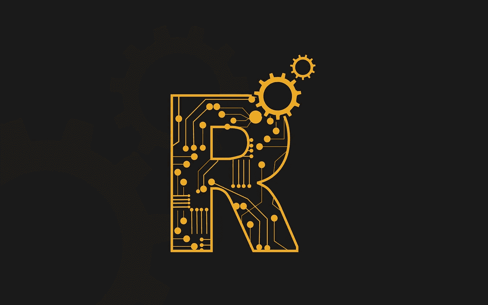

# R 的起源及其在机器学习中的应用(一)

> 原文：<https://medium.com/hackernoon/origin-of-r-and-its-application-in-machine-learning-part-1-179056a208c2>

## 你认为这并不容易，对许多困难的问题来说，这就像一个太平洋(当然不容易😉).

r？！我不应该用 Python 吗？我是不是疯了，才在 R 中尝试这些繁重的计算？我是不是在用一种不是 Python 或者 JavaScript 的语言来装酷？简短的回答:**不，我没醉。**

[unsplash.com](http://unsplash.com)

根据亚瑟·萨缪尔的说法，**机器学习**为计算机提供了无需明确编程就能学习的能力。换句话说，它赋予计算机自主学习和执行正确指令的能力，无需你为它们提供方向。

# **R 编程简述**

# 1.R 是什么？

对于统计编程和应用机器学习来说，r 可能是最强大和最流行的平台之一。

r 是一个用于统计编程和可视化的开源环境。

r 是一个数字，一开始可能会令人困惑。

*   **R 是一种计算机语言**。它是 Lisp 的变体，你可以用它写程序。
*   **R 是翻译**。它可以解析和执行直接输入的或从扩展名为. R 的文件中加载的 R 脚本(程序)。
*   **R 是平台**。它可以创建图形显示在屏幕上或保存到文件中。它还可以准备可以查询和更新的模型。

您可能希望在文件中编写 R 脚本，并使用 R 解释器以批处理模式运行它们，以获得诸如表格或图形之类的结果。您可能希望打开 R 解释器并输入命令来加载数据，以一种特别的方式探索和建模它。

# 2.R 从哪里来？

r 由新西兰奥克兰大学的 Ross Ihaka 和 Robert Gentleman 创建，作为 S 编程语言的实现。开发始于 1993 年。1995 年在 GNU GPL 下发布的 FTP 上有一个版本。更大的核心组和开放源码项目成立于 1997 年。

它最初是作者使用 S 提供的语法在 Lisp 中实现一个统计测试床的实验，随着它的发展，它采用了 S 的更多语法和特性，最终在功能和范围上超越了它。

# 3.R 的关键特性

当你需要分析数据、绘制数据或为数据建立统计模型时，r 是一个可以使用的工具。它是一次性分析原型和学术工作的理想选择，但不适合构建部署在可扩展或可操作环境中的模型。

# 4.R 的好处

R 有三个主要好处:

*   **开源** : R 免费开源。您可以立即下载并开始免费使用它。您可以阅读源代码，从中学习并修改它以满足您的需求。简直太神奇了。
*   **Packages** : R 之所以流行，是因为它有大量非常强大的算法被实现为第三方库，称为 Packages。统计领域的学者将他们的方法作为 R 包发布是很常见的，这意味着您可以直接访问一些最先进的方法。
*   **成熟度** : R 受到专有统计语言 S 的启发，使用并改进了对统计计算有用的习惯用法和隐喻，比如在矩阵、向量和数据框架中工作。

# 5.谁在用 R？

商业公司现在支持 R。例如，Revolution R 是 R 的商业支持版本，具有对企业有用的扩展，如 IDE。Oracle、IBM、Mathematica、MATLAB、SPSS、SAS 等提供了与 R 及其平台的集成。

Revolution Analytics 博客还提供了一长串公开宣布采用该平台的公司名单。

用于数据科学竞赛的 [Kaggle 平台](http://blog.kaggle.com/2011/11/27/kagglers-favorite-tools/)和 [KDnuggets 民意调查](http://www.kdnuggets.com/polls/2013/languages-analytics-data-mining-data-science.html)都指出 R 是最受成功实践数据科学家欢迎的平台。

# 摘要

在这篇文章中，你得到了关于 R 编程的简短描述。本文的第二部分即将推出。和我们在一起。感谢我的写作伙伴 Sazidur Rahman。