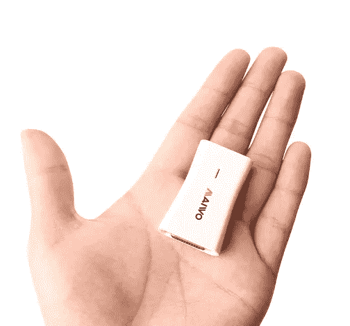

# Osmo-FL2k:一个 15 美元的 DTV 发射机，FM 无线电劫持和 GPS 欺骗设备。

> 原文：<https://medium.com/hackernoon/osmo-fl2k-a-15-dtv-transmitter-fm-radio-hijack-and-gps-spoofing-device-68ac08ba7d76>


Osmo-FL2K，这是最近由 Steve Markgraf 在 OsmoDevCon 2018 上发布的开源软件[，它将一个普通的](https://hackernoon.com/tagged/software) [$15 USB 到 VGA 适配器](https://www.gearbest.com/cables-connectors/pp_1238337.html?lkid=15359150)变成了一个只能传输的软件定义的[无线电](https://hackernoon.com/tagged/radio) (SDR)。在[http://people.osmocom.org/steve-m/fl2k_slides/osmo-fl2k.htm](http://people.osmocom.org/steve-m/fl2k_slides/osmo-fl2k.html)可获得演示的幻灯片

尽管宽带 SDR 接收器目前很便宜，但如果你想要一个 Hack-RF SDR 或类似的能够传输的设备，你至少要花 400 美元。

这种廉价的 USB2VGA 设备和公布的样本代码将允许我们使用欧洲 DVB 标准广播 FM 无线电、DTV 电视、假 GPS 卫星信号或模拟 UMTS 基站。这可用于恶作剧，如干扰同事的无线电，或用于恶意目的，如欺骗用于跟踪贵重商品的 GPS 接收器，或使[船只偏离航线](https://www.newscientist.com/article/2143499-ships-fooled-in-gps-spoofing-attack-suggest-russian-cyberweapon/)。

[gps-sdr-sim](https://github.com/osqzss/gps-sdr-sim) fl2k demo

虽然功率输出较低，但足以劫持几米外的调频广播，或模拟通常在几千公里外发射低功率信号的 GPS 卫星信号。所以要小心，在大多数频率上未经许可的广播在你的国家可能是非法的。最终用户有责任确保他在法定范围内进行测试。


使用 VGA 适配器作为发射器的想法由来已久。
2001 年，埃里克·蒂勒为伊莱扎发行了 [Tempest，它发射的信号可以被调幅收音机接收。一段时间后，法布里斯·贝拉使用 ATI 镭龙 9200SE 传输 DVB-T，PAL 和 NTSC 视频信号。2009 年晚些时候，Bartek Kania 发布了 VGASIG，它允许使用 SDL 和常规显卡实时传输宽带调频广播。但他们都是丑陋的黑客，没有能力传输任意信号，像制造一个真正的特别提款权，直到现在。此外，VGA 端口在笔记本电脑和台式机中越来越不常见。](http://www.erikyyy.de/tempest/)


然而，Osmo-fl2k 允许使用基于 Fresco Logic FL2000 芯片的 USB 3.0 至 VGA 适配器，价格约为 15 美元，作为通用 DAC 和 SDR 发射器，通过避免 HSYNC 和 VSYNC 消隐间隔来产生连续的样本流，从而成为真正的通用 SDR 发射器。

频率范围取决于我们计算机的 USB 3.0 控制器的能力。在 Steve 的测试中，英特尔公司 8 系列 USB xHCI HC(版本 04)达到 157 MS/s，因此实际上可以从 0–157 Mhz 进行传输。但由于我们的 VGA 没有任何类型的滤波，因此可以使用谐波，因为任何 150 Mhz 发射机也会在 300 Mhz、450 Mhz 等频率上发射。通过这种方式，Steve 展示了模拟 900 Mhz GSM/UMTS 电话基站或欺骗 1575 MHz 的 GPS 信号是可能的，其在具有适当频率的谐波的较低频率上传输。


GSM Network Spoofing

GSM 基站只有 TX，所以你不能握手和手机注册；但事实上，它足够精确，可以传输手机可以解码的广播帧，这是非常令人印象深刻的。你仍然可以将它与 RTL- [SDR 接收器加密狗](https://phasenoise.livejournal.com/1723.html)和 [gr-gsm](https://github.com/ptrkrysik/gr-gsm) 连接起来，监控一个便宜的[黄貂鱼状手机探测器/跟踪器设备](https://arstechnica.com/tech-policy/2013/09/meet-the-machines-that-steal-your-phones-data/)的上行频率。

仅支持基于 Fresco Logic FL2000 芯片的器件。通常，它们被标记为通用“USB 3.0 至 VGA”适配器，并宣传为 USB 3.0 的最大分辨率为 1920 × 1080。当心:如果它们被宣传为最大分辨率为 2048 × 1152，支持 Mac OS X，或者只有 USB 2.0 接口，它们包含 DisplayLink 芯片组，并且**与 osmo-fl2k 不兼容**！

警告:你可以找到价格低于 10 美元的无品牌 FL2K 加密狗，但它们没有用，因为它们通常没有所需的 USB 3.0 迹线，需要[复杂的硬件修改来恢复其操作](http://tinyhack.com/2018/05/05/fixing-osmo-fl2k-dongle-that-only-works-in-usb-2-0/)。

确定设备是否兼容的最佳方法是获取制造商的驱动程序下载，并验证它是否引用了 Fresco Logic FL2000。这些设备之一是[迈沃 KCB003](https://www.gearbest.com/cables-connectors/pp_1238337.html?lkid=15359150) 。在 Gearbest 或 [Dealextreme](https://bit.ly/2r9VmnF) 这样的普通中国网上商店，它的价格是 15 美元。



MAiwo KCB003 FL2K based VGA dongle.

# 编译和运行 Osmo-fl2k

下载源代码可从 git.osmocom.org
网址:[http://git.osmocom.org/osmo-fl2k](http://git.osmocom.org/osmo-fl2k)

```
#In order to compile and install the code, you first need to install #the libusb headers if not already present and sox pv tools for FM# On distributions based on debian
sudo apt-get install libusb-1.0-0-dev sox pv#Then you can continue with:git clone git://git.osmocom.org/osmo-fl2k.git
mkdir osmo-fl2k/build
cd osmo-fl2k/build
cmake ../ -DINSTALL_UDEV_RULES=ON
make -j 3
sudo make install
sudo ldconfig#Before being able to use the device as a non-root user, the udev #rules need to be reloaded:sudo udevadm control -R
sudo udevadm trigger
```

快速测试，使用您的 Fresco Logic 2000 加密狗发送调频广播信号。然后你可以在收音机里听到计算机生成的音乐。要将音频输出作为 95 MHz 的单声道宽带 FM 传输，您可以使用以下命令:

```
pacat -r -d alsa_output.pci-0000_00_1b.0.analog-stereo.monitor | \
pv -B 256k | \
sox -t raw  -r 44100 -e signed-integer -L -b 16 -c 2 - -c 1 -e signed-integer -b 16 -t raw - \
biquad 4.76963 -2.98129 0 1 0.78833 0 sinc -15k loudness 5 | \
fl2k_fm - -s 130e6 -c 35e6 -i 44100
```

虽然示例在非常短的距离内工作，不需要将任何东西连接到 VGA 端口，但可以通过将类似天线的电缆连接到红色引脚(三排 15 引脚 VGA 连接器的引脚 1)来增加信号范围。理想的长度是所选频率的四分之一波长。你可以用这个网站计算一下[。](http://wxtofly.net/wavecalc.htm)

一旦调频发射机开始运行，您就可以使用 FL2K 进行其他更复杂的调制，例如(FM-RDS、DAB、DVB-T、GPS、GSM、 [LTE、UMTS)https://github.com/steve-m/fl2k-examples](https://github.com/steve-m/fl2k-examples)

在使用 FL2000 设备传输任何信号之前，Steve 强烈建议您使用频谱分析仪检查产生的频谱，并应用适当的滤波来抑制除所需传输频率之外的任何频率，以符合当地法规。

鸣谢:这篇文章是基于 Erik Thiele 的原创“暴风雨给 Eliza”概念，Steve Markgraf 的 OsmoFL2k 软件和 mars999mini 的 GPS 欺骗演示。