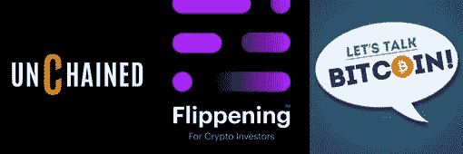
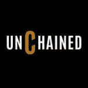
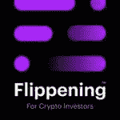
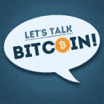

# 我们最喜欢的 4 个区块链和加密播客

> 原文：<https://medium.com/hackernoon/our-4-favorite-blockchain-and-crypto-focused-podcasts-408782bcd41a>

你对[区块链](https://hackernoon.com/tagged/blockchain)、[加密货币](https://hackernoon.com/tagged/cryptocurrency)以及去中心化改变世界的潜力感兴趣吗？我们知道我们是，我们过去的客人中有相当多的人认为区块链有潜力成为一个社会变革，其影响力大于或等于互联网的影响力。

虽然我们尽最大努力让最重要的思想领袖参与加密和去中心化，但这只是我们对技术、伦理和未来整体关注的一部分。但我们也听了一些其他很棒的加密节目，并想把它们推荐给任何区块链的傻瓜，他们正在寻找更多很棒的内容，而不像这个行业的大多数人那样廉价、廉价。

如果你还没有听完我们所有的区块链聚焦剧集，[我们建议现在就听](https://fringe.fm/category/blockchain/)。但事不宜迟，这里是我们最喜欢的补充加密/区块链节目，旨在增压你的知识和这个新兴行业的兴奋。

*注:* [*这是一篇来自 Fringe 的转帖。FM*](https://fringe.fm/our-4-favorite-blockchain-and-crypto-focused-podcasts/)

# 我们最喜欢的 4 个区块链和加密播客

# 1.释放

我有幸看到的第一个关注区块链的播客是劳拉·申的《解放》。与这个领域的许多人不同，这个播客打动了我，这要归功于主持人的新闻诚信。最初由福布斯(劳拉曾在该公司担任区块链专栏作家)资助，它变得如此成功，以至于劳拉能够将它变成她的全职工作。

这一点也不奇怪。凭借在加密领域无与伦比的嘉宾质量，劳拉为每一集带来了游戏和调查印章，这是我们非常尊重的。从顶级区块链项目、对冲基金和风险投资公司的领导人到金融政策和政府方面的关键人物,《被解放了》是一部高质量的作品，如果你的生活中需要更多一点区块链，我们很乐意向我们的听众推荐。你可以在 iTunes[上订阅《解放》](https://itunes.apple.com/us/podcast/unchained-big-ideas-from-worlds-blockchain-cryptocurrency/id1123922160?mt=2)

# 2.翻转

由经济学首席执行官、非常成功的登录页面软件公司 LeadPages 的前创始人 Clay Collins 主持的 Flippening 同样令人印象深刻。我个人了解并尊重 Clay，可以说他的团队投入到 Flippening 的生产质量远远超过了其他行业。他经营一家领先的加密投资者分析/SaaS 公司的事实很少出现，当然不会妨碍他在我们眼中的可信度。

Flippening 已经完成了几个关于 ico、安全令牌的深度系列，并继续从加密货币世界中制作有价值的、独特的内容和见解，特别是当它与投资者相关时。听起来有趣吗？[在 iTunes 上查看 Flippening](https://itunes.apple.com/us/podcast/flippening-for-cryptocurrency-investors-bitcoin-ethereum/id1323372565)。

# 3.我们来谈谈比特币

[Andreas M. Antonopoulos](https://medium.com/u/898f59563d67?source=post_page-----408782bcd41a--------------------------------) 是密码领域最早和最有影响力的领导者之一。Andreas 是比特币的早期倡导者，在区块链和加密货币运动的采用、道德和方向方面是一位非常清晰、深思熟虑的领导者，他和他在《让我们谈论比特币》上的共同主持人是该领域中最懂技术、最有趣的一些人。LTB 有一个与加密相关的节目网络，每个节目都坚持类似的高质量标准，并将最优秀、最聪明的嘉宾和观点直接带给您。如果这是你喜欢的，你不会失望的。

# 4.[震中](https://medium.com/u/1e0bbff6a5dd?source=post_page-----408782bcd41a--------------------------------)

震中是我们的王牌，比以前的任何播客都更注重技术，也更理想主义，它仍然是我们作为一个团队喜欢和经常听的。主持人既谈论比特币、以太坊和加密货币领域的最新新闻和发展，也邀请顶级技术嘉宾讨论进展和发展的来龙去脉。

震中在 iTunes 上有售，如果你对区块链感兴趣，我们建议你试一试，不仅仅是从一般意义上，还可能着眼于区块链的发展，更密切地参与到这个行业中。

## 额外收获:当然，[流苏 FM](https://fringe.fm)

[FringeFM](https://fringe.fm) 是一个探索人类理解边缘的播客，关注塑造我们共同未来的技术、趋势和社会规范。在这里，世界顶尖人物分享了他们对改变我们所知生活的指数技术的融合、方向和伦理的见解和预测。

想象一下，有着相似才能的嘉宾参加的冗长的 TED 演讲，但是能够讨论更广泛的话题，并且不受限制地探索有争议的领域，只要它采用格式。每一集都很有趣，引人入胜，让你停留更长时间，对未来感到兴奋，并有兴趣采取行动。

你可以在 iTunes， [Stitcher](https://fringe.fm/stitcher) ，[covery](https://fringe.fm/overcast)，[任何 Android 应用/平台](https://fringe.fm/android)， [Spotify](https://fringe.fm/spotify) ， [Youtube](https://fringe.fm/youtube) 或[上订阅 FringeFM，就在我们的网站上！](https://fringe.fm)

**像这样？你也可以看看我们的指南** [**最佳健康/长寿、**](https://fringe.fm/our-favorite-4-health-longevity-and-human-optimization-podcasts/) [**科技和未来主义**](https://fringe.fm/our-favorite-4-technology-and-futurism-podcasts/) **和** [**最佳空间聚焦播客**](https://fringe.fm/our-4-favorite-space-focused-podcasts/) **太。**

## 由[流苏乐队](https://fringe.fm)为您带来

在 [FringeFM](https://fringe.fm) 我们探索人类理解的边缘，审视塑造我们共同未来的技术、趋势和社会规范。

在这里，世界顶尖人才分享他们的激情项目，以及基因组学、太空旅行、互联设备、人工智能和其他指数级技术的进步如何融合在一起，创造明天的未来。

**注:** [这是来自 FringeFM 的转贴。](https://fringe.fm/our-favorite-4-technology-and-futurism-podcasts/)

*如果你从这篇文章中得到了可操作的或有价值的东西，或者对圆桌会议感到兴奋，请点击* ***并在*** *下方“鼓掌”。*