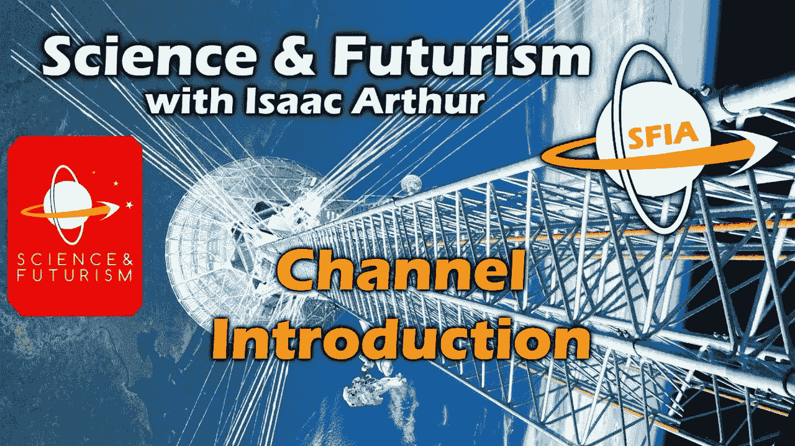

# 我们最喜欢的 5 个技术和未来主义播客

> 原文：<https://medium.com/hackernoon/our-5-favorite-technology-and-futurism-podcasts-bba1fbb7b949>

如果你喜欢科幻小说，你一定对未来主义、[科技和我们要去的地方感兴趣，否则你不会在这里。](https://hackernoon.com/tagged/technology)

[的未来](https://hackernoon.com/tagged/future)令人着迷，尤其是随着指数级技术的加速发展。人工智能、遗传学、太空、机器人学……这个世界发展的速度超出了任何人的理解，尽管我们尽力了。

在 FringeFM 我们对此充满热情，并期待技术进步如何改善我们所有人的生活。虽然我们认为我们推出了一个非常好的播客，但如果你对更多未来的焦点节目和讨论感兴趣，我们还想推荐一些其他很棒的节目。

我们试图展示尽可能多的关注未来的创新者和思想领袖，但我们总是想要更多。如果你还没有听完我们所有的 [FringeFM 剧集](https://fringe.fm)，我们建议你先听完。

但除此之外，这里有一些关注未来的播客和书籍，它们对我们团队个人产生了最大的影响。

# 我们最喜欢的 5 个科技和未来主义播客

# 1.艾萨克·亚瑟的科学与未来主义

不久前，我们邀请了《流苏 FM》的主持人艾萨克·亚瑟。这一集是一个爆炸，我们涵盖了一吨的材料，从星际旅行的未来，对费米悖论的误解，我们可能会住在戴森圆柱而不是地球化行星的原因，人类身体，思想和工作的进化将如何进步等等。

如果你喜欢这些话题，你会喜欢[艾萨克的播客](https://itunes.apple.com/us/podcast/science-futurism-with-isaac-arthur/id1224204194)和/或 [Youtube 频道](https://www.youtube.com/channel/UCZFipeZtQM5CKUjx6grh54g)。在节目中，艾萨克深入分析了未来的技术项目/前景，以澄清一些主题，如殖民太空(各种恒星，月球或火星)，建造太空电梯和其他太空发射技术，探索费米悖论和外星生命的可能性等等。不能高度推荐这一点，只要确保您观看伴随内容的美丽视频。

## 2.思维与机器

奥古斯特·布拉德利是《头脑机器》的主持人，我们计划很快让他加入《流苏乐队》。M & M 有点像 FringeFM，虽然通常以单一、深入的话题为特色。奥古斯特强调了许多增强现实和虚拟现实、区块链、人工智能和空间，并在前沿技术咨询公司工作。他是这个节目的粉丝和朋友，我们认为我们的观众会喜欢他，因为我们也喜欢他的播客。

你可以在 Youtube 或 [iTunes](https://itunes.apple.com/us/podcast/mind-machine-future-tech-futurist-ideas-futurism/id1276405231) 上订阅《头脑与机器》[，随你选择。](https://www.youtube.com/c/MINDandMACHINE)

## 3.指数智慧

在这个关注科技、未来主义和人类长寿的动态播客中，Peter Diamandis 和 Dan Sullivan 打出了精彩的组合拳。我承认，在设想 FringeFM(以 3.5 倍的速度收听)时，我在 3 天内狼吞虎咽地看完了《指数智慧》的全部 50 集。

迪亚曼蒂斯是 XPrize、人类长寿研究所、行星资源(一家失败的小行星采矿初创公司)和许多其他改变游戏规则的组织的创始人，他非常有激情和动力，寻求活到 700 岁。他的搭档丹·沙利文也不差，这位 70 多岁的高管教练专注于帮助顶级球员提高比赛水平。即使在 73 岁的时候，丹仍然每天努力锻炼，优化他的健康，并不断测试血液，计划至少达到 156 岁。

播客分享了他们对未来的各种想法，实现极端长寿的技术，大多数人不知道的尖端科学，相当多的个人辅导/增强，以及我们作为一个物种的发展方向。[我们建议尽快订阅 iTunes。](https://itunes.apple.com/us/podcast/exponential-wisdom/id1001794471)

## 4.[未来思想家](https://medium.com/u/283cc1e3f6ef?source=post_page-----bba1fbb7b949--------------------------------)播客

最近我们邀请了[尤维·伊万诺娃](https://medium.com/u/2c3f8d37744a?source=post_page-----bba1fbb7b949--------------------------------)和[迈克·吉利兰](https://medium.com/u/85b194fcbcd3?source=post_page-----bba1fbb7b949--------------------------------)、[主持人在 FringeFM](https://fringe.fm/15-the-nature-of-consciousness-power-of-psychedelics-and-future-of-humanity-with-mike-gilliland-and-euvie-ivanoka-of-the-future-thinkers-podcast/) 上进行未来思想家的播客。《未来思想者》是一个关于技术、社会和意识进化的节目，在一个有趣和发人深省的播客中融合了元和技术的进步，我们强烈推荐。

迈克和欧维都看好区块链和艾，看好他们的个人发展，并超越传统规范的束缚，让这对搭档创造了一个引人注目的访谈节目，谈论人类未来的重大话题。如果你喜欢 FringeFM，你也会喜欢这个播客。

## 5.当然，[流苏 FM](https://fringe.fm)

FringeFM 是一个播客，探索人类理解的边缘，并着眼于塑造我们共同未来的技术、趋势和社会规范。在这里，世界顶尖人物分享了他们对改变我们所知生活的指数技术的融合、方向和伦理的见解和预测。

想象一下，有着相似才能的嘉宾参加的冗长的 TED 演讲，但是能够讨论更广泛的话题，并且不受限制地探索有争议的领域，只要它采用格式。每一集都很有趣，引人入胜，让你停留更长时间，对未来感到兴奋，并有兴趣采取行动。

您可以在我们的网站上的任何 Android 应用程序/平台上订阅 FringeFM。

# 额外收获:我们最喜欢的关于未来的非小说类书籍

## [*《德乌斯人:明日简史》*](https://amzn.to/2J68ikn) 尤瓦尔·哈拉里著

作为哈拉里第一本书《智人》的续篇，《德乌斯人》是一本写得非常好、发人深省的书，讲述了当我们超越血肉之躯进化时，人类的未来。了解过去是一回事，预测未来完全是另一回事，然而我们要说尤瓦尔·诺亚·哈拉里做出了惊人的努力，任何人都可以从中学习并享受其中。[今天在亚马逊](https://amzn.to/2J68ikn)上买一本，或者[从 Audible](https://www.audible.ca/pd/Homo-Deus-Audiobook/B075LJSSP1?ref=a_search_c3_a_list_product-0&pf_rd_p=65c74350-6dfb-47fa-85fd-1459a4762abd&pf_rd_r=NC6K5H2D4XEWVWWW43GQ&) 上获得一本免费的有声读物，无论哪种方式都是值得的。

## [*不可能的物理:加来道雄对相位器、力场、传送和时间旅行的科学探索*](https://amzn.to/2C4EExT)

不可能什么都不是，或者至少这是加来道雄在他的《不可能的物理学》一书中明确证明的。这本书分析了未来可能的技术，并将它们归类为 1、2 或 3 级不可能，即目前不可能但可能在未来 50-100 年内实现的事情，可能实现的事情以及需要重写我们对物理的理解才能实现的事情。这本书非常有趣，它提醒我们，只要你下定决心，你几乎可以做任何事情。[今天就在亚马逊](https://amzn.to/2C4EExT)上买一本或者带听觉试用的[免费有声读物](https://www.audible.ca/pd/Physics-of-the-Impossible-Audiobook/B072316ML7?ref=a_search_c3_a_list_product-0&pf_rd_p=65c74350-6dfb-47fa-85fd-1459a4762abd&pf_rd_r=VWFW5DTMC3QPR3AXMZP6&)。

## [*富足:未来比你想象的更好*](https://amzn.to/2NyDgow) 彼得·迪亚曼迪斯著

彼得·迪亚曼蒂斯非常令人敬畏，在《富足》这本书里，他提出了一个令人信服的理由，那就是未来将是惊人的。忘掉主流媒体兜售的恐惧、不确定性和怀疑。《富足》是一本值得一读的好书，它会给你启发和教育，是一记精彩的组合拳。[你可以在亚马逊上买一本](https://amzn.to/2NyDgow)或者[在 Audible 上用免费的 tria](https://www.audible.ca/pd/Abundance-Audiobook/B071487PQX?ref=a_search_c3_a_list_product-1&pf_rd_p=65c74350-6dfb-47fa-85fd-1459a4762abd&pf_rd_r=Y4FDFKQTD781KAV8W671&) l 抓取一个免费的音频版本。

**像这样？你也可以看看我们的指南，看看** [**最佳健康/长寿聚焦播客**](https://fringe.fm/our-favorite-4-health-longevity-and-human-optimization-podcasts/) **和** [**最佳空间聚焦播客**](https://fringe.fm/our-4-favorite-space-focused-podcasts/) **。**

## 由[流苏乐队](https://fringe.fm)为您带来

在 [FringeFM](https://fringe.fm) 我们探索人类理解的边缘，审视塑造我们共同未来的技术、趋势和社会规范。

在这里，世界顶尖人才分享他们的激情项目，以及基因组学、太空旅行、互联设备、人工智能和其他指数级技术的进步如何融合在一起，创造明天的未来。

**注:** [这是一篇来自 FringeFM 的转帖。](https://fringe.fm/our-favorite-4-technology-and-futurism-podcasts/)

*如果你从这篇文章中得到了一些可操作的或有价值的东西，或者对圆桌会议感到兴奋，请点击* ***并在*** *下方“鼓掌”。*