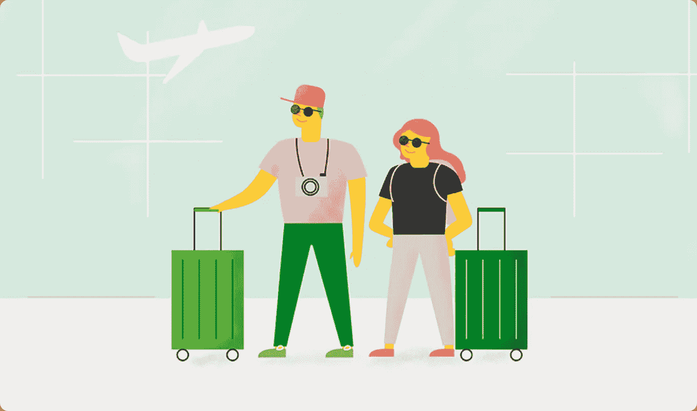
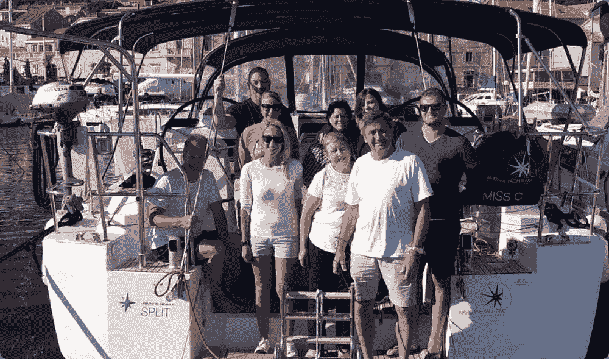
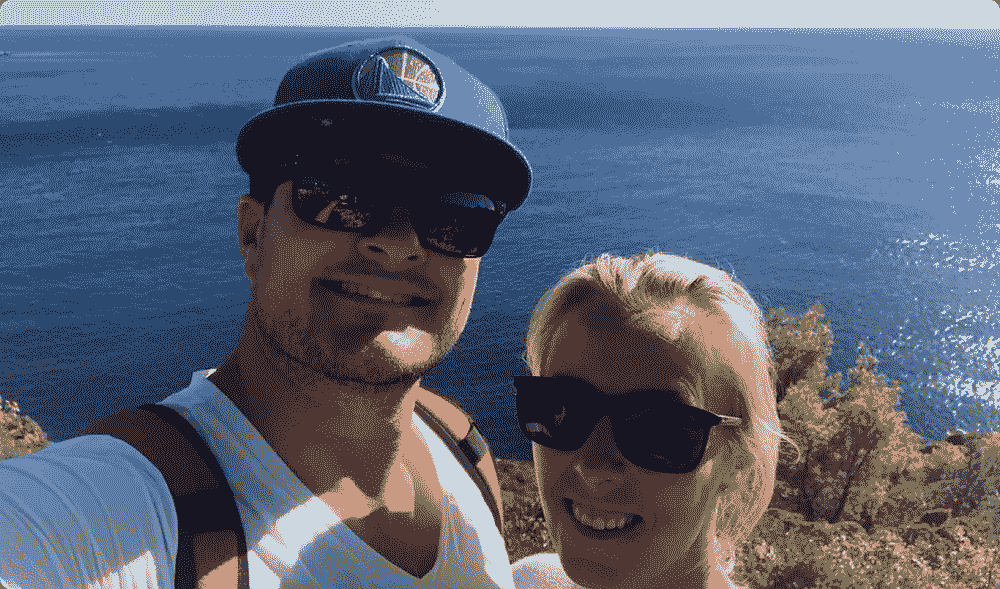
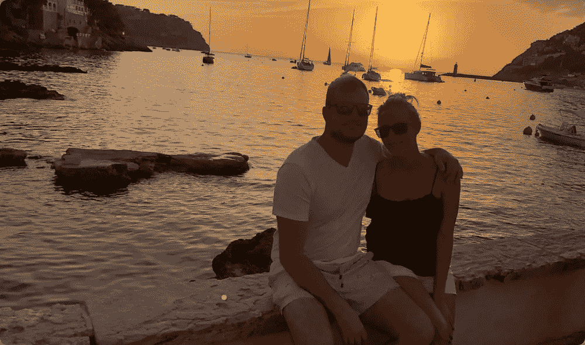
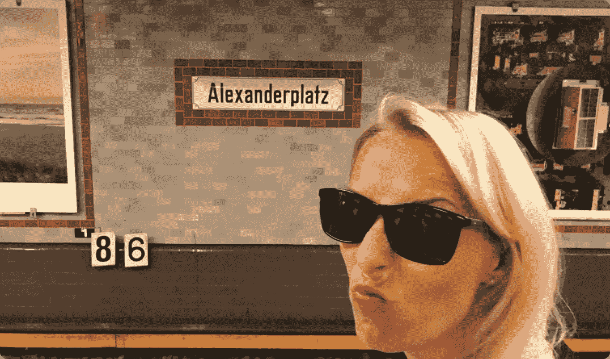
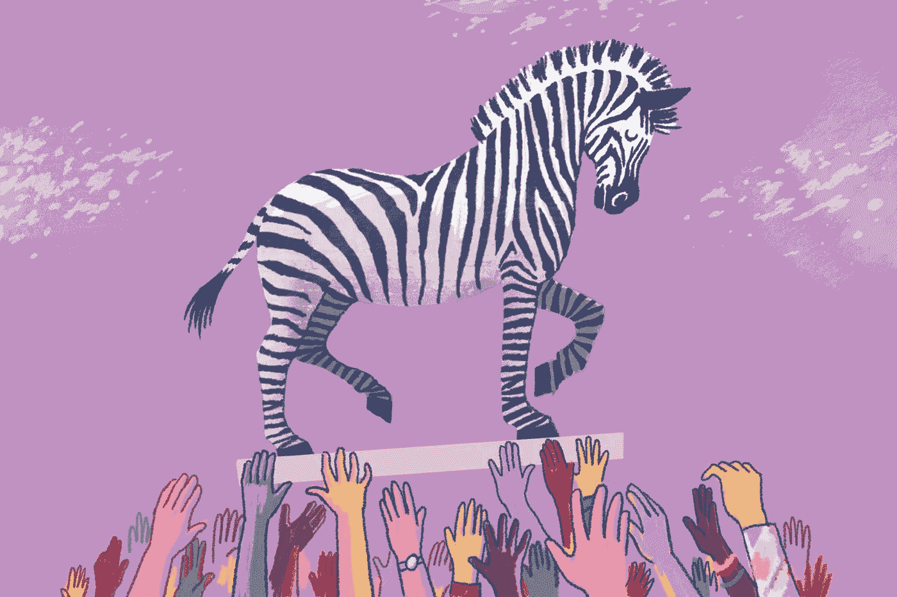

# 年度旅行保险困境

> 原文：<https://medium.com/hackernoon/our-annual-travel-insurance-dilemma-4fa04fa7d68b>

每年我和我的伴侣[都会去欧洲旅行](https://hackernoon.com/tagged/travel)看望朋友和家人，沉浸在无边的文化中，去新的地方旅行……有些地方我们去过，我们总是吃得很饱。今年将是我们在不到 3 年的时间里的第 5 次旅行。

我们通常会休息 4-6 周，这样我们就可以有最多的休息时间和家庭时间。我们还把以前见过的地方混合在一起，同时尝试添加至少一个我们俩以前都没去过的新目的地。

Trip 2018 — Croatia, Mallorca, Munich to name a few places.

通常在我们出发前 4-5 个月就开始计划这次旅行。签证、注射、航班、酒店、AirBnB、租车、朋友时间、家庭时间、药物、渡轮、当地货币和旅游保险[都必须在我们出发前安排或预订。在我们出发前，除了旅游保险，每一项都要经过仔细的比较、检查、购买和再检查。我们在](https://hackernoon.com/tagged/insurance) [Skyscanner](https://medium.com/u/37819ae0aadf?source=post_page-----4fa04fa7d68b--------------------------------) 、 [Webjet](https://medium.com/u/196f8dfd510c?source=post_page-----4fa04fa7d68b--------------------------------) 、 [Expedia](https://medium.com/u/182a41ad17ec?source=post_page-----4fa04fa7d68b--------------------------------) 、 [trivago](https://medium.com/u/e925f68a8f52?source=post_page-----4fa04fa7d68b--------------------------------) 或 [Airbnb](https://medium.com/u/9046b133b73f?source=post_page-----4fa04fa7d68b--------------------------------) 上花费的时间总共会有几天，但通常在出发前几天，我们会考虑购买旅行保险——以防万一。

在旅行的大部分时间里，什么也没发生，我们玩得很开心。然而，这些年来，我们有各种各样的索赔事件发生，往往是在我们最意想不到的时候。其中包括:

*   [**万事达卡**](https://medium.com/u/10924fd16ff8?source=post_page-----4fa04fa7d68b--------------------------------) **信用卡被盗用:**从我的合作伙伴账户中取走了 800 美元。
*   **错过转接航班:**由于柏林机场起飞时间晚了 2 个小时。这意味着我们错过了去东京的转接航班，我们在盛夏的阿布扎比呆了 24 小时。
*   欢迎来到欧洲臭名昭著的触摸停车。
*   **被盗相机:**从我背包里拿走的。

The face you pull when your credit card is skimmed.

虽然这些事情很糟糕，让你感到恶心，但我们勇敢地面对每一件事，并保持乐观，因为我们知道每次旅行都购买了综合旅游保险。当然，我们应该为这些事件中的每一个投保吗？对吗？

最后一次旅行，我和我的搭档各有一张白金信用卡。我们决定尝试由[安联](https://medium.com/u/5a6e9b7004df?source=post_page-----4fa04fa7d68b--------------------------------)承保的我们银行的免费旅游保险。这是一个很好的卖点，因为它是免费的，而且安装起来相当容易。我们没有真正关注它是“基本”封面还是“全面”封面，因为作为一个半满杯子的人，我倾向于关注它会是一次多么令人惊叹的旅行，而不是它会变得多么糟糕。信用卡保险确实为我们 4-6 周的欧洲旅行节省了 300-500 美元的旅行保险。

我不会逐一讨论每一个事件，但我要强调的是，对于每一个事件，旅游公司要么让索赔变得不切实际，利益不值得努力，要么我们的索赔只占我们预期收入的一小部分。当你阅读条款和细则时，免费保险并没有覆盖那么多，我们没有意识到当我们踏上任何种类的船时，(你好，我在克罗地亚和马略卡航行)都没有被覆盖。

这么说吧，在以前有可索赔事件的旅行中，我成功地索赔了，然而资金在我们回国后几周才到达，他们提供的比我预期的要少。当你在信用卡透支的同一天还要支付租车费用时，这就没什么用了。

在以前的旅行中，我们确实在旅行保险上花了一笔钱，但我们面临着同样的问题。为了得到我期望从任何数字产品供应商那里得到的某种客户服务，我会付比平时多一倍的钱。

为了反映我对上述难题的处理；旅游保险的结构很难处理，很难理解，也很难索赔。这个过程主要是基于纸面的，需要大量的人工干预，因为你经常作为承销商的沟通者与中间商/经纪人交谈，所以你永远不会了解全貌。我和其他在旅游保险公司有过正面、负面和复杂经历的人谈过，但所有人都认为流程应该大大改进。

我上面提到的事故使一生一次的旅行变得糟糕，然而真正的黑眼圈来自于旅行期间和之后与保险公司的交易，如果你遇到事故的话。我知道这一点，因为我必须经历它，从这些经历中，我现在为一家主要的保险公司工作，帮助他们了解他们的用户。

## 每一个问题都有一个机会

旅游保险还处于黑暗时代。

如今，人们热衷于体验，尤其是旅行，而不是像上一代人那样买房或投资。看看 AirBnB 现在提供什么，你会注意到它不再是关于住宿，而是你可以拥有的体验。世界已经从以产品为中心转变为以关系为中心。

主要的保险公司很少完全专注于旅游保险，通常提供一种重新设计的保险产品作为他们的旅游产品，同时收取最高的保费来覆盖他们的风险。没有投资推进旅游保险的原因有几个因素，但季节性是一个主要原因。保险公司可以指望你每月支付汽车保险，风险建模很容易描述。旅游保险是高峰，季节性的，因此更难衡量。(我有一个把这部分弄光滑的想法)。

至于产品的完善、复杂程度或差异点，主要保险公司之间没有真正的差异，因为核心产品由少数公司拥有，提供商在其上构建界面。很少有保险公司会比*更深入地挖掘你要去哪个地区旅游？你什么时候旅行？*和*有多少人要去？*

旅行者关心的是安全、消息灵通、准时，并沉浸在文化、兴趣点和他们在国内得不到的烹饪选择中。他们专注于未来的经历和他们将创造的记忆。

目前形式的旅游保险充其量只是一种模拟产品，使用模拟流程，以网站为幌子。没有什么复杂的，没有个性化的，用户甚至在去东南亚旅行时也经常得到“冰雪覆盖”的保险，或者在你阅读细则时提供飞往瑞士的“邮轮保险”。

虽然现任者正在使用这些恐龙产品，但这实际上是一个快速增长的市场，去年达到 150 亿美元，预计到 2022 年底全球将增长到 280 亿美元。

> 我看到了一个巨大的机会，为安全旅行的未来创造一种新的数字旅行体验，而不仅仅是提供另一种注定令人失望的模拟“一劳永逸”保险产品。

这种体验可以让用户随时了解信息，可持续，透明，并在旅行前，旅行中和旅行后提供价值。*为什么我们去斐济旅行会被雪覆盖？为什么索赔过程复杂，基于纸张，为什么需要这么长时间？为什么不透明？这些事情让我心烦。*

今年夏天，作为一个 insurtech 激情项目，我想我会回到创业领域。我正在建立一个原型，重点是上面提到的一些要点。这将是移动优先，使用今天的技术，如地理定位，使用 REST API 和提取数据进行客户学习和行为学习。它应该易于使用，按需，可持续，集成，没有中间人，最重要的是，建立在增强安全，可靠和知情的旅行体验上。*、*、*、【客户价值】、*不是一个雷达上的词。

保险并不性感，这也不是它的本意——但它应该通过在所需的微妙接触点上给予价值来打动用户。我还将关注每月进行 5 次国内旅行的普通旅行者模式，并致力于根据这种类型的痛点创造一种“隐形”体验。

[这应该是斑马 b-corp，而不是独角兽。](/@sexandstartups/zebrasfix-c467e55f9d96)保险公司不是用来做独角兽的，所以让我们看看这是否可行。可持续旅游是一个巨大的话题，所以让我们看看我们是否可以将它纳入组合中，并提供一部分保费来帮助组织解决这个问题——长滩岛和五渔村想到了。

我会让你知道我的进展，如果有兴趣帮忙，请联系[brett@bretthales.com](mailto:brett@bretthales.com)，我会把你添加到 [Slack](https://medium.com/u/272cd95a3742?source=post_page-----4fa04fa7d68b--------------------------------) 频道。

*顺便说一句，有人可能会认为这是我去年购买的 neobank focus 的副产品，我对此表示赞同。*

我将很快更新一些正在取得的进展。

对我圈子里今年不时帮助过我的人大声说几句，他们是朋友、同事、传声筒、摇摆女王、助手、挑战者、啦啦队员和冒险家伙伴。享受假期。[大胆&坚决](https://medium.com/u/b85c4e4cc972?source=post_page-----4fa04fa7d68b--------------------------------)，[克里斯·萨阿德](https://medium.com/u/2be165b143e?source=post_page-----4fa04fa7d68b--------------------------------)，[克里·伊德之子](https://medium.com/u/96da0c9617d3?source=post_page-----4fa04fa7d68b--------------------------------)，[詹姆斯·卡梅隆](https://medium.com/u/7b46a4246c04?source=post_page-----4fa04fa7d68b--------------------------------)，[布莱恩·库克](https://medium.com/u/b6a7cc88555?source=post_page-----4fa04fa7d68b--------------------------------)，[格尔德·申克尔](https://medium.com/u/678504ef9753?source=post_page-----4fa04fa7d68b--------------------------------)，[基兰·库马尔](https://medium.com/u/a95b157471cd?source=post_page-----4fa04fa7d68b--------------------------------)，[亚历山大·斯维茨基](https://medium.com/u/c3dfe7e1392a?source=post_page-----4fa04fa7d68b--------------------------------)，[萨姆](https://medium.com/u/fe2b9e0b05e0?source=post_page-----4fa04fa7d68b--------------------------------)霍布森[曾志伟](https://medium.com/u/e91379ad8907?source=post_page-----4fa04fa7d68b--------------------------------)，[埃德蒙·保险](https://medium.com/u/e9244811a215?source=post_page-----4fa04fa7d68b--------------------------------)，

我还从瑞安·獾的故事中获得了灵感。[值得一读的](/@ryanbadger/how-insure-and-go-left-me-with-a-20-000-bill-d353491c6386)。