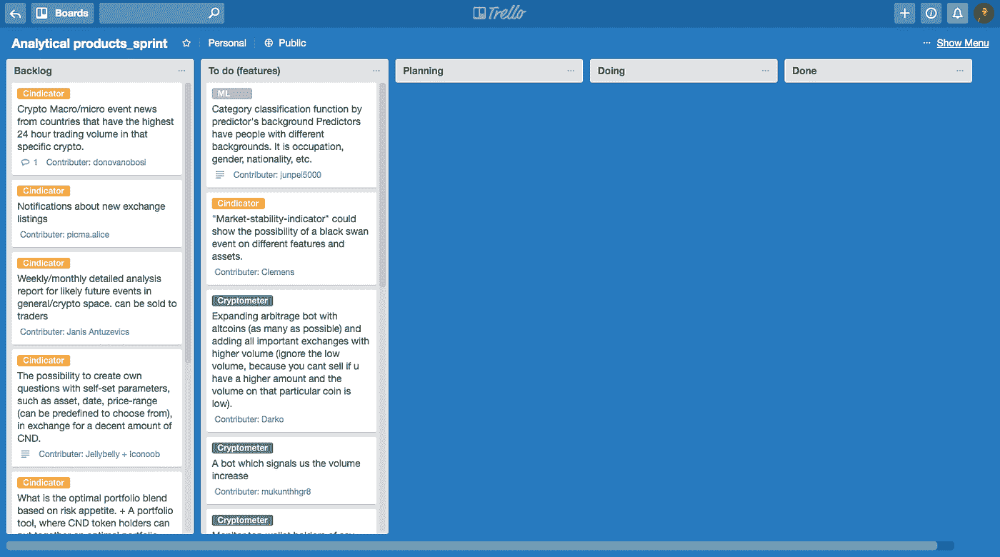

# 我们的首个分析产品 sprint 面向活跃的社区成员和问答环节

> 原文：<https://medium.com/hackernoon/our-first-analytical-products-sprint-for-active-community-members-and-q-a-session-c1b479dc1040>

我们正在为我们的社区发起第二次冲刺——这一次是专门针对我们的分析产品。我们一直在通过 Discord 收集社区成员对改进、新功能、崩溃等方面的反馈。现在我们准备开始了！我们的目标本质上是创造有价值的——更重要的是——令人满意的产品。我们都是 Cindicator 的一部分，因此我们希望与我们的社区一起创造新的功能和产品。

我们想要什么？

*   我们已经从我们的社区收集了涵盖所有现有频道的功能建议；
*   现在是时候让你通过投票选出你最想要的了；
*   在 sprint 开始之前，我们正在为所有参与者(观察者和团队成员)分配一个时间段，让他们为最重要的任务投票；
*   每个参与者将有**三票**。我们添加了 Discord 申请表中列出的与功能相关的任务(这些任务以不同的格式给出)。

冲刺时长:30 天。

开始日期:一月底(在此之前，社区的活跃成员可以提供他们对 sprint 的想法)。

任务投票的开始日期:投票从今天宣布开始(所有的新想法将在第二次冲刺中被考虑，并将被添加到待办事项中)。

**板卡描述**

对于忘记的人和新成员:

*Backlog/ideas* :团队成员在各种 Cindicator Discord 渠道中以开放的格式报告沟通过程中发现的问题和特点。必须列出作者/来源。我们将根据这些报告进行下一轮冲刺。您不需要为本专栏中的功能/想法投票。

*特性*:根据最佳实践，backlog 中所有与特性相关的任务都以严格的格式列在这里(作为团队成员、guru 或非常活跃的令牌持有者的任务)。

*规划*:新 sprint 的所有任务都将转移到这里，这是基于投票数和我们在启动 sprint 之前设定的截止日期。所有没有包含在 sprint 中的任务都将保留在 backlog 中，如果社区投票支持它们，它们可能会包含在下一个 sprint 中。

*执行*:sprint 中已经在执行的任务将被移到这里。

*完成*:该板用于正在上传到生产过程中的特性/缺陷。

关于各种任务/问题的快速沟通将在相关的 Discord 频道上进行。如果你有兴趣加入我们的不和谐频道，参加短跑比赛，请在[https://cindicator.typeform.com/to/OCtoNW](https://cindicator.typeform.com/to/OCtoNW)填写表格。

顺便说一下，领导我们分析产品开发的弗拉德·卡萨科夫将在 1 月 18 日(下周四)我们的第一次问答环节回答大家的问题。

*Vlad 将能够解决您可能对 Cindicator 的分析产品和社区 sprint 以及 Cindicator 的团队合作方法有任何疑问。
请在 1 月 16 日星期二之前将您的问题提交给 qa@cindicator.com。问答环节将通过 Youtube 进行直播。直播的链接将在我们的官方渠道 Discord、Telegram、Twitter 和脸书上发布。*

*让我们让新经济更加智能，*

Cindicator 团队。