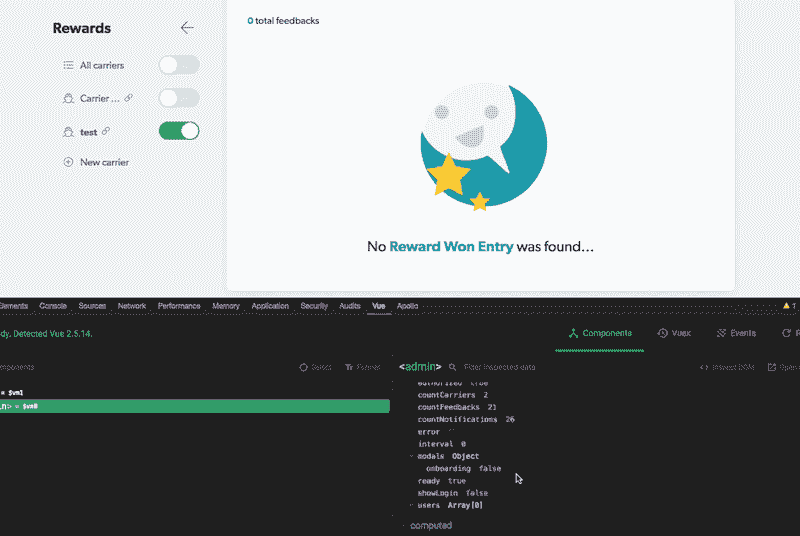
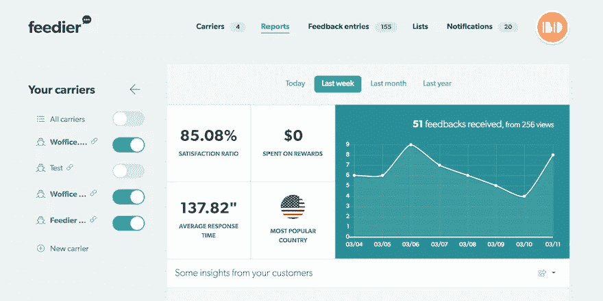
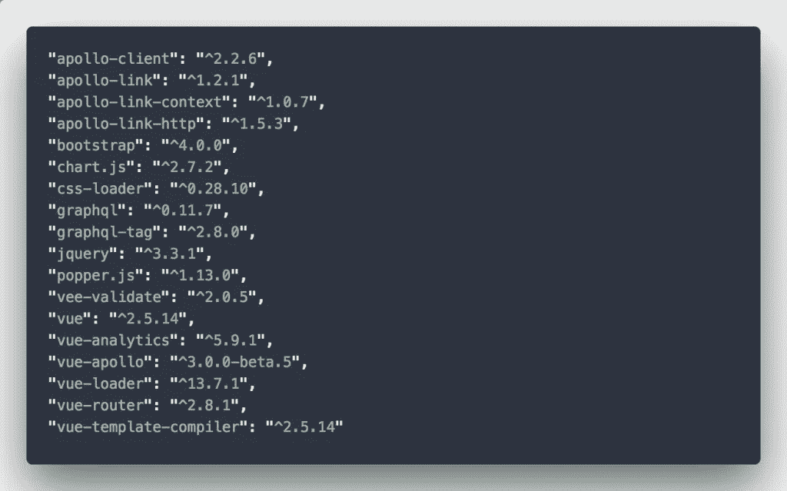
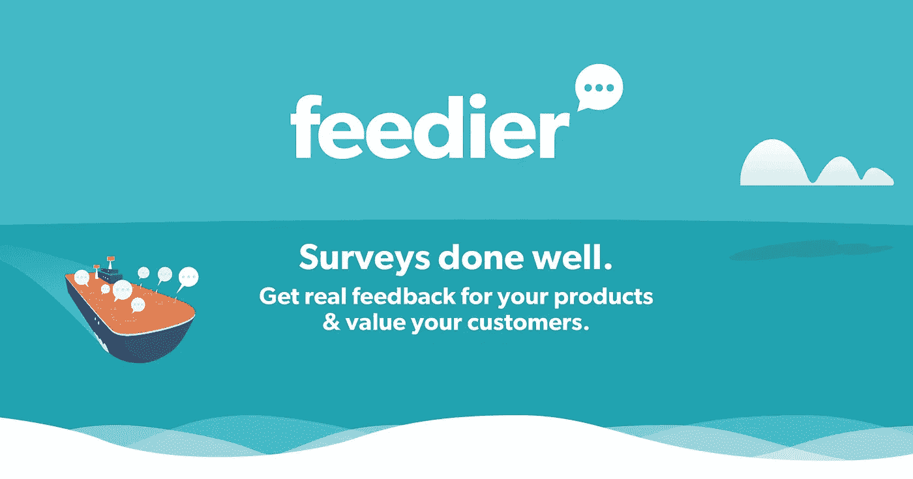

# 我们第一个使用 Vue.js 的 SaaS 应用

> 原文：<https://medium.com/hackernoon/our-first-saas-application-using-vue-js-50d5805feb5f>

*本文最初发表于*[*【alka-web.com】*](http://alka-web.com)

在本文中，我将与大家分享一些我们在使用 [Vue.js](https://vuejs.org/) 构建第一个完整的企业软件 Web 应用程序时采用的**开发实践**。我们经历了漫长的书呆子之旅，制作了**。**

**简而言之，Feedier 让你从顾客那里收集 ***有价值的反馈*** 。我们要求您了解您的客户，并通过我们的奖励和参与计划与他们互动。*品牌独特&愉快调查。重视、参与、尊重&回报您的客户*！🚀**

** [## Feedier -下一代反馈

### Feedier 是一个营销工具，让你通过智能和细分的调查收集反馈。奖励，参与…

feedier.com](https://feedier.com/?utm_medium=article&utm_source=medium&utm_campaign=Blog-Brand-awareness-2018-03-11&utm_content=blogArticleVueJS) 

销售谈得够多了，让我们直入主题吧。

# 一致性很重要

Vue.js 的核心特性之一是对象的生命周期。这些给你完全的控制你想做什么或者什么时候出发。在构建我们的应用程序时，尽管我们有自己的内部最佳实践。构成我们应用程序的 vue 文件开始变长，我们可能很快就会失去线索。开发人员倾向于不同地使用这些挂钩，用于不同的目的，并且会以不同的方式布局它们。
例如，一些开发人员热衷于使用*挂载的*钩子来编写他们的大部分数据/API 相关代码，而其他人会在*创建的*钩子中这样做。因此，您最终会发现文件之间的不一致。从那时起，我们开始感到可怕。

Bottom 线？事先讨论并同意如何组织文件和使用框架的特性。

# 提前规划您的功能

你的申请要被翻译吗？你打算如何处理应用程序中的登录和安全问题？你将如何设计你的数据库？这些是你在输入任何代码之前应该问自己的问题。它们是典型的那种我们倾向于稍后实现的事情，或者倾向于简单地删除，通过这样做，你增加了打破东西的可能性。作为一个经验法则，不要从一开始就拒绝这些人，直接面对他们！

# 不要欺骗自己

如果你开始你的第一个项目，你的团队很可能是由开发人员组成的，或者换句话说，是那些渴望“构建东西”的人，他们很容易忘记主要的目标:让应用程序上市。一旦有了想法，实施起来就很容易，也很吸引人。但是，你的目标会对这样的功能感兴趣吗？它期待在测试版中出现吗？你的客户愿意为这个据说“很棒”的功能付费吗？换句话说，那会是 USP 吗？
你离最初的报价越远，上市日期就越晚。

一个推荐？当然，获得反馈，当每个人都确信功能的有用性和需求时添加功能，但是不要让团队陷入困境。
*我们一直在拖延我们的分阶段开发——它本可以被大幅削减。*

# 让你自己快速使用你的工具

当在一个团队项目中工作时，因为你使用一个工具并不一定意味着你掌握了它。也许它来自于一个队友，也许你曾经习惯于使用它，但有一段时间没有使用它，不管你的原因是什么，你需要让自己跟上速度！当今大多数现代工具更新如此频繁，以至于我们往往会错过重要而令人惊叹的新功能。
重点是，再读一遍文档，要舒服，从长远来看这会节省你的时间。不要匆忙找到一个变通方法，或者在文档中寻找解决方案，从一开始你就会充满信心。

给你举个例子，在我们 Feedier 之旅的开始，我们几乎错过了活动班车，所以我们想出了我们的解决方案。后来我们发现了这一点，所以我们改变了一切。值得这样做，但仍然，它可以节省我们从头做一些麻烦。

# 忘记 console.log

只是透露一些可用的替代方案，以及为什么你会放弃你最喜欢的 *console.log* 技巧。
再次，Vue 提供了其令人惊叹的开发工具——[Vue . js dev tools](https://github.com/vuejs/vue-devtools)——可在 Chrome 和 Firefox 上获得。这个插件给了你极大的灵活性，并且绝对减少了开发时间！其中，它让您能够调整数据值，从 DOM inspector 直接导航到 Vue.js 组件，快速浏览不同的事件，最重要的是，它为您提供数据和计算的属性值。
例如，在构建我们的 *onboarding* 小部件时，我们没有摆弄我们的 API 来模拟一些数据并确保 onboarded 属性始终为 false，而是简单地在浏览器中更改它的值。很简单！

依赖于一堆条件、事件和一些 API 调用来切换布尔值或更改数据变得很容易。

Vue.js dev tool

除此之外，在调试方面，Webpack 也很棒。只需在您的**开发**配置中使用 *eval-source-map* 属性，您就可以获得您的所有。浏览器中可用的 vue 组件以及出现错误时提到的右侧行。一次点击，你就跳到了那一行，尽管所有的东西都被捆绑和编译在引擎盖下。太美了，不是吗？

可以这么说，你拥有一个体面的工作环境所需要的一切。你“*就*得造。

# 规划和布局您的代码架构

作为最现代的 JS 框架，Vue.js 让你有能力将你的代码分割成**个可重用的组件**。这太棒了，这就是为什么在写任何代码之前，你必须问自己:

*   我的代码中有没有任何部分可以和其他数据一起用在其他地方？
*   如果是这样的话，我怎样才能使它变得灵活、易于修改、广泛和可重用呢？

Feedier dashboard preview — could you guess how many components do we have on this page?

然而，在过多的道具和不足的组件之间找到合适的平衡是很困难的。作为一个经验法则，无论如何都要避免用道具来破坏你的组件！
但这还不是全部，你还必须小心冗长的文件，它们会让你的开发体验越来越差。对于我们的 JS 助手文件来说尤其如此。每个助手都在增加，但文件变得无法使用。我们必须将它分解成一堆有意义的文件，从 ES6 导入/导出特性中获益。从一开始就这样做可以节省我们的时间、精力和错误。

# 阻止使用第三方软件包

别搞错了，开源太棒了！构建一个完整的 web 应用程序需要大量的时间和资源，这就是为什么只要有可用的 NPM 软件包，就很容易依赖它来完成您的工作。
安装上周在 Github 上非常流行的最新软件包，或者在 Medium 上的许多文章中提到的、看起来对您的项目有用的软件包，也非常有吸引力。但是……实际上，你必须考虑使用它的真正好处，而不是构建一个简单的手工脚本来完成这项工作。我们的座右铭是:只要有可能，就自己动手！并且只有在大幅度减少工作量的情况下，或者除了这样做之外别无选择的情况下，才可以将工作包回来。

Sample of our core packages

限制你自己使用最重要的插件也可以减少你的整体脚本大小，有助于你的网络应用速度。也就是说，选择正确的工具并避免让自己被成吨的软件包淹没不是一件容易的事！

顺便说一句，如果你想知道 Apollo 和 GraphQL 是关于什么的，看看这篇文章，我们解释了关于 [GraphQL](http://graphql.org/) 的基本细节以及为什么它很重要。绝对值得一读。*长话短说？*如果你仍然想知道如何构建你的 Rest API——停止思考，直接进入 [GraphQL](http://graphql.org/) 服务器，由于这个 [vue-apollo 插件，它与 Apollo 客户端很好地集成在一起。](https://github.com/Akryum/vue-apollo)

 [## 启动并运行 GraphQL、Laravel 和 Vue.js

### 在本文中，我的目标是向您概述我们如何以及为什么将 GraphQL 与 Vue.js 和 Laravel 集成在一起，以实现一个…

codeburst.io](https://codeburst.io/up-and-running-with-graphql-laravel-and-vue-js-698000248448) 

到总结，如果你对你的下一个应用程序有一个很棒的商业想法，不要回避——继续前进！验证你的想法，收集你朋友的反馈，并创建你的商业模式画布。然后，拿出你的 MVP，包括最重要的特性，并从中收集反馈。你只是希望你的用户尽快达到那个啊哈时刻。你有你需要的所有技术建议，我们走吧！

我们希望这篇文章是有帮助的，将帮助任何人拥抱华丽的 Vue.js 为他的下一次创业！

有任何问题或反馈吗？请在下面留下你的评论，我们会很高兴和你聊天的！

如果你喜欢我们的文章，请不要忘记点击[订阅](https://alka-web.us16.list-manage.com/subscribe?u=cd5291c429df8270607277d16&id=42520def8c)获取更多精彩文章👏。你也可以在推特上找到我们。

> 顺便说一下，我们目前处于测试模式，**加入我们的团队，让你的顾客**在[feedier.com](https://feedier.com?utm_medium=article&utm_source=medium&utm_campaign=Blog-Brand-awareness-2018-03-11&utm_content=blogArticleVueJS)感受到价值

**