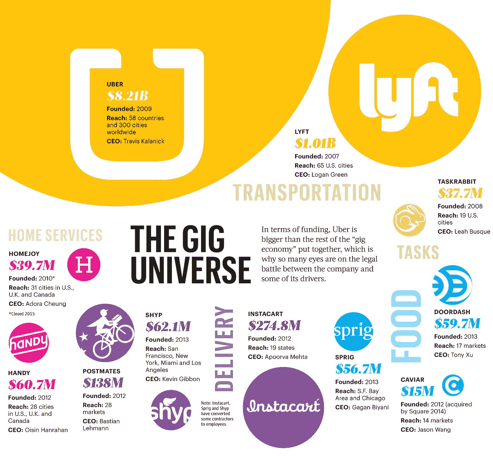
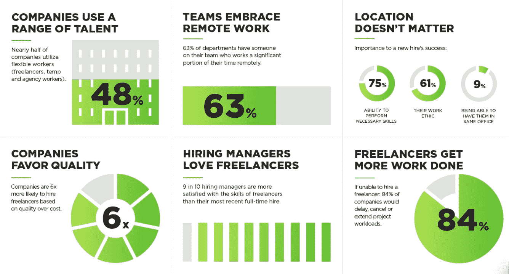
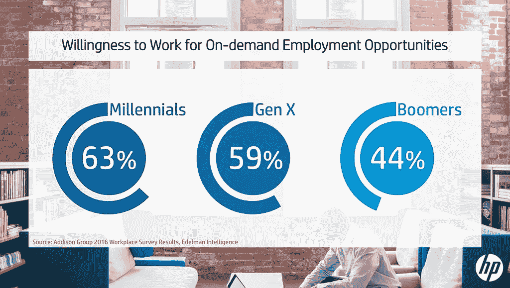
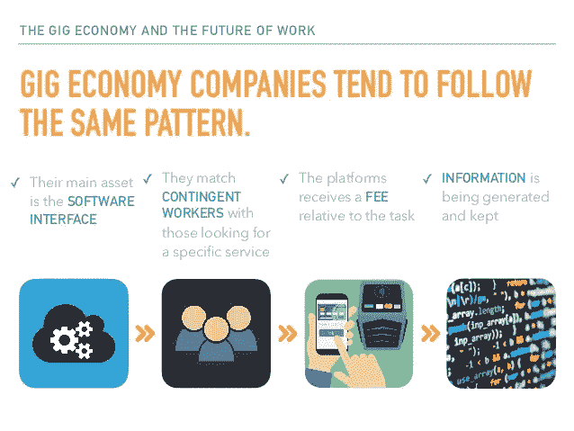
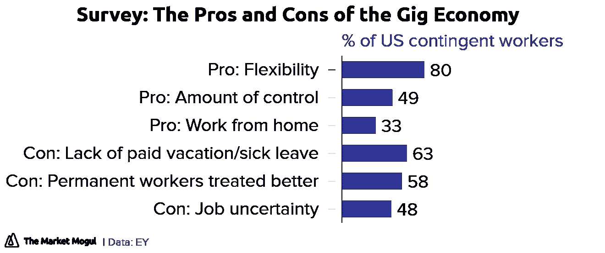

# 我们的工作只会改变，不会消失。

> 原文：<https://medium.com/hackernoon/our-jobs-are-only-going-to-change-not-disappear-9eabb1b8a5ae>

## 人工智能和远程工作如何塑造未来的工作

## 我们的工作只会改变，不会消失。

我们的工作方式每天都在改变，这将是人类将要看到的最大变革。为什么？因为，工作是定义我们的东西。任何改变都会对我们产生巨大的影响！

你去过越南、泰国、印度尼西亚吗？如果你有，你会发现一群年轻人在咖啡馆工作。他们被称为“数字游牧者”。数字游牧民的工作不受地理位置的限制，因此他们可以在工作时自由地周游世界。

在一次越南之行后，我创建了 Indiez，一个社区供电的远程工作平台。当我与数字游牧者交谈时，我喜欢我从他们那里听到的故事，它启发我建立一个平台，使人们能够远程工作于令人敬畏的项目。

近年来，像 Indiez 这样的公司层出不穷。显而易见，由技术推动的“零工经济”的兴起是即将到来的就业场景变化的最大驱动力。

老实说，零工经济并不是什么新鲜事物。它存在于 200 年前，当时每天都有一些枪骑兵被军队逮捕。他们没有向任何国王宣誓，是“自由的”。因此，术语“自由职业者”。

但是今天，随着科技的发展，同样的概念已经延伸到几乎所有的工作岗位。

> **零工经济是一种临时职位很常见的环境，组织与独立工作者签订短期合同。**

根据 Intuit 和 Emergent Research 的联合研究，到 2021 年，估计将有 920 万美国人从事零工经济，高于 2016 年的 380 万人。超过 200%的增长为美国和其他国家的市场带来了巨大的机遇。

与此同时。关于“零工经济”有各种各样的猜测。

有人说这是工作的[未来](https://hackernoon.com/tagged/future)！

他们喜欢这个概念，迫不及待地想等到零工经济把每个人从大型官僚机构的雇员中解放出来。而另一些人则担心这是最新形式的劳动剥削，肯定会消耗我们所有人，将我们推入贫困的深渊。

就像经济中发生的任何变化一样，随着零工经济的扩张，有人赢有人输。

HBR 的一篇文章指出——拥有专业技能、深厚专业知识或受欢迎经验的员工在零工经济中胜出。他们可以要求有吸引力的报酬，获得有挑战性和有趣的工作，并有能力安排自己的工作生活。

在零工经济中最挣扎的人是公司员工，他们的技能是普通的、商品化的或需求较少的。

虽然这提供了一些视角，但在本文中，让我们进一步探索塑造零工经济的各种力量？这真的是工作的未来吗？更重要的是，这对你我这样的人来说意味着什么？

# **零工经济不再只是初创公司的专利**

越来越多的财富 500 强公司和像三星这样的全球巨头转向在线自由职业平台，如 Upwork 和 PeoplePerHour，寻找设计师、[营销](https://hackernoon.com/tagged/marketing)人员、IT 专家和其他知识工作者。例如，目前 Upwork 与 20%的财富 500 强公司合作。

从更广的层面来看，这表明了整体价值观的转变。

传统上，雇佣和留住人才一直是大公司的核心关注领域之一。还有知识产权要保护，文化要维护。

但是随着价值观的转变，大公司开始欣赏更多的“可渗透的边界”,并将自由职业者视为来自更广阔世界的新思想和“知识转移”的来源。有像 Pilot.co、托普塔尔和市场工作者这样的公司在促进这一点。

Future Workforce Report 2017 by Upwork

然而，企业参与零工经济的更大原因是，就成本和时间而言，零工经济更有效率。像三星这样的公司，已经接受了自由职业模式，观察到 60%的成本节约和 64%的管理时间减少，因此他们真的相信这种模式是工作的未来。

# **千禧一代在零工经济中占很大比例**

到 2020 年，千禧一代将占美国劳动力的 75%。《千禧经济报告》指出，近一半(44%)的受访千禧一代有副业。这份报告强调了一个事实，千禧一代正在寻找给他们自由、灵活性和成就感的职业。

无论主要动机是选择自己的时间和在家工作，在谋生的同时环游世界，成为自己的老板还是其他，无数的千禧一代都选择放弃传统的全职工作，在零工经济中赚钱。

# 独立的知识工作者

独立的专业人士往往是他们领域的专家。独立专业人士通常在掌握了自己的技能后，就会打破传统的工作结构，他们没有雇主或雇员——他们直接为客户工作以获取利润。

如今，推动经济发展的是数百万拥有自己企业的微型企业家，而不是少数大型企业。知识工作者的虚拟工作正迅速成为零工经济的新常态。

他们对自己的工作负责，并担任多种工作角色。例如，现在有可能有人同时为麦肯锡和 BSG 工作——这在以前是不可能的。

# 人工智能的兴起

据推测，未来十年，劳动力市场将会发生变化。机器人和人工智能将执行任何枯燥、肮脏或危险的工作。

对于零工经济来说，这意味着很大一部分平凡的工作将不复存在。

我们可以预计人工智能将取代财务规划师、行政人员和会计师等。目前的工作在不久的将来消失的威胁的增加只意味着一件事——十年后，每个人都将被迫成为“企业家”。

虽然这可能是也可能不是一件好事。它清楚地指出了形成零工经济一部分的人数的增加。

虽然可以想象，人类将自动失业，但至少在不久的将来，能够重新装备和旋转的零工可以期待继续找到越来越多的工作。将会有更新的需求形成，而根据这些需求进行塑造的能力将决定在人工智能和零工经济的兴起是两个主要驱动力的世界中的成功。

还将需要人工智能智能[工具](https://hackernoon.com/tagged/tools)来将相关工人与需要他们的组织相匹配。越来越多的公司将在这个领域工作。

# 你得到你所支付的

即使在零工经济中，你如何对待你的同事决定了一切。像 HomeJoy(家庭清洁)、SnapGoods(设备租赁)和 SpoonRocket(快餐送货上门)这样的公司已经倒闭了，因为显然他们的首席执行官从来没有学到一个古老的商业秘密，即“一分钱一分货”。

员工的素质对成功至关重要，取决于员工的待遇和报酬。如果公司没有向员工表示忠诚，他们也没有得到任何回报。

幸运的是，我们看到了一些潜在的解决方案。

一个是 2013 年推出的股票摄影网站 Stocksy United，除了提供令人惊叹的图片，它还是一个工人所有的合作社。不像许多价值数十亿美元的“独角兽”初创公司付给员工微薄的报酬，股票会员摄影师保留了他们作品销售的大部分收入。该公司的收入在 2015 年翻了一番，达到 790 万美元，其中一半以上是版税。

Etsy 是一个在线销售平台，将专业工匠与客户联系起来，是另一家似乎提供公平交易的公司，Etsy 从每笔销售中收取 3.5%的合理费用。相比之下，优步收取每笔费用的 25-30%。由 Talmon Marco 创建的 Juno 正在通过更好地对待司机来与优步竞争，包括提供更高的工资和股票期权。

# 对工作保障的担忧

“零工经济”本质上意味着未来几十年劳动力的“优步化”。每一项可以外包的服务都将根据需求进行外包。

一切都将根据交付内容定价，这使得几乎每个人都成为临时服务提供商。显而易见，过去的工作保障已经一去不复返了。退休前没有就业保障。

零工经济把一个工人的劳动当作是另一个被送入公司机器的矿石。工人们只有在完成一份报告，或者设计一个标志，或者打扫别人的房子的时候才能得到报酬。这就好像一个明星四分卫只有在触地得分时才能得到报酬，或者一个厨师是按餐付费的。没有年薪或月薪。

它把我们带回到零敲碎打的工资经济时代，这种经济在前几个世纪更为普遍。听起来没那么聪明？是吗？

政府正在努力寻找一些解决办法。一种可能性是“便携式安全网”,其中每个企业将为其每个工人贡献一笔“福利费”,按该企业工作的小时数按比例计算。员工可以将自己的“个人安全账户”从一个工作转移到另一个工作。

虽然这似乎是一种可能性，但也可以很容易地与“区块链”集成，这仍然是一个尚未开发的东西。时至今日，在这方面，临时工的安全几乎被忽视了。

结论—

约翰·哈格尔在他的一篇关于零工经济的详细文章****中引用了这句话——我们正处于一个新兴和不断发展的零工经济的最早期阶段。****

**随着时间的推移，它可能会从专注于常规任务(因为它们被机器人取代)演变为更好地专注于创造性工作。这反过来将导致从短期交易定义的工作转变为在丰富、基于信任和持续关系的背景下追求的工作。**

****简而言之，零工经济可能会成为一个肥沃的温床，帮助我们所有人实现更多的潜力，并为市场提供不断扩大的价值。****

## **启动？好好做！加入 100 多位与 Indiez 一起打造成功产品的了不起的创始人。**

## **[在这里了解我们更多— Indiez.io](http://www.indiez.io?utm_source=Blog&utm_medium=medium_bottom_inline_link&utm_term=Gig_economy_article)**

****