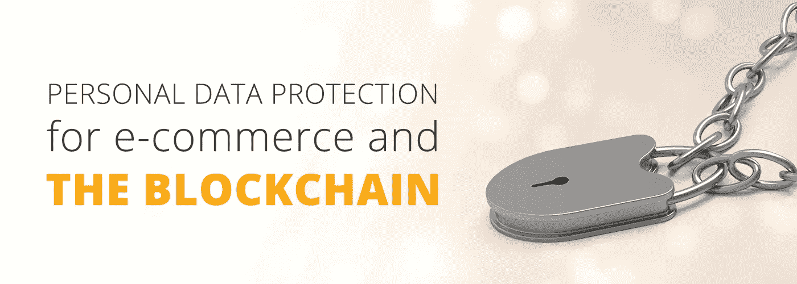
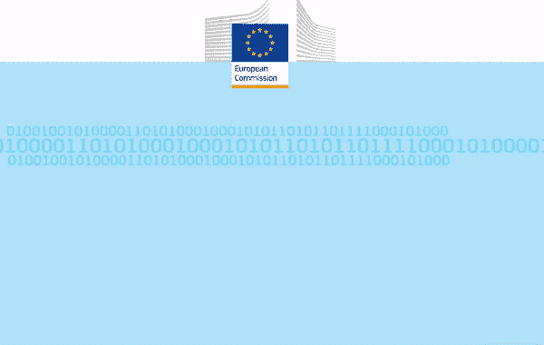

# 我们的以太坊区块链数据保护解决方案。

> 原文：<https://medium.com/hackernoon/our-solution-for-data-protection-over-the-ethereum-blockchain-8d9918ea8efc>

## 我们的以太坊区块链数据保护解决方案。

数据保护是 BitBoost 的一个严肃话题。我们正在使用我们的区块链解决方案来增强人们的能力，对我们来说，这也意味着随时让人们重新控制他们的个人数据，不在未经他们同意的情况下存储这些数据，也不将其用于非预期目的。此外，我们已经在以太坊区块链上实施了我们的数据保护解决方案。

我们应该开始声明我们没有存储任何来自卖家或买家的信息。每个用户只需要提供一个密码来创建他们自己的个人钱包，一个字母数字地址和别名作为他们唯一的 ID。有了这个钱包、地址和别名，用户将能够充分使用我们位于区块链的市场，而且他们只会向卖家提供他们的个人信息，而且只是为了送货的目的。这些信息绝不会以不加密的方式存储或传输，因此包括我们在内的任何第三方都无法访问这些信息。

然而，与中央分类账系统相比，区块链的信息管理带来了一些新问题。首先，存储在区块链中的所有信息对于网络中的每个节点都是可用的。这意味着存储和管理信息的责任是分散的，根据节点的位置，可能会应用不同的数据保护权限。在我们的案例中，我们适用欧盟法律及其[通用数据保护条例](https://en.wikipedia.org/wiki/General_Data_Protection_Regulation)，或 GDPR。这可能是全球最先进的数据保护法律，因此对任何区块链公司来说，遵守它就足够了。我们想就此事谈几点看法。

The new european data protection law will bring stronger rules to protect customer rights.

首先，重要的是要明白区块链是有意使用假名的。每一个使用网络的节点都是通过一个地址来识别的，用户不需要为了任何目的而分享自己的个人信息。这是一个非常有用的功能:在区块链中，我们将只存储地址之间的交互，保护用户的个人信息，这些信息总是在用户手中。

这里的问题是，GDPR 认为假名数据仍被视为个人数据(包括区块链中可能的公钥)。它还明确指出，如果任何人都可以识别收集和组织匿名数据的特定用户，则应该启用进一步的保护。区块链可能就是这种情况。例如，如果我们可以在公开的区块链中跟踪一个节点所做的购买，它的位置和花费的钱，我们可能可以跟踪它背后的人(同样可以很容易地通过列表和位置应用到卖家)。

为了防止这种情况，我们正在对区块链的假名特征实施加密系统。这样，存储在区块链中的所有个人信息都将受到保护，并且只与相关方共享。BitBoost 无法检查此信息，任何其他用户也无法检查。仲裁人，一个由卖方选择的解决争议的第三方个人，将拥有破译交易的钥匙，而且只是在很短的时间内，而且只是为了仲裁的目的。

最后，我们应该谈谈“擦除权”。根据欧盟法律，在以下情况下，用户有权要求从互联网上删除其个人信息:

1.  就最初收集/处理个人数据的目的而言，该个人数据不再是必需的。
2.  当个人撤回同意时。
3.  当个人反对处理，并且没有压倒一切的继续处理的合法利益时。
4.  个人数据被非法处理(即违反 GDPR)。
5.  为了遵守法律义务，必须删除个人数据。
6.  处理的个人数据属于一个孩子。

并非在所有情况下，擦除权都意味着被遗忘的权利，尽管围绕这一适用于区块链的主题存在一些争议，但我们可以引用[区块链和数据保护指南](https://www.hlengage.com/_uploads/downloads/5425GuidetoblockchainV9FORWEB.pdf)(由 Hogan Lovells 于 2017 年发布)中的一般建议:“什么构成了“擦除”仍有待讨论。一些数据保护机构发现不可逆加密构成了擦除。在区块链环境中，擦除在技术上是不可能的，因为系统是为防止擦除而设计的。然而，智能合同将包含管理访问权限的机制。因此，智能合同可用于撤销所有访问权限，从而使内容对其他人不可见，尽管不会被删除”。

在我们的例子中，数据访问由智能合同和加密技术共同管理。虽然没有智能合同的许可，仲裁人无法访问加密数据，但买方和卖方都可以随时访问他们共享的任何内容。这样，生成的数据在任何时候都只能由创建它的人使用。对我们来说，这是保护以太坊公共区块链中存储的数据的最佳方式。

总而言之，我们在区块链的个人数据管理方法很简单:我们希望将管理个人数据的权力还给用户。无论是我们还是第三方都不能对个人数据做不允许的事情。这种方法与大型数字公司的方法截然不同，在大型数字公司中，数据(也就是我们的信息)已经成为最有价值的出售和交易资产，甚至没有得到产生这些数据的人的完全有意识的同意，也没有对他们进行补偿！我们发现这种做法是不道德的，我们希望建立一个新的、去中心化的互联网，这些做法将被排除在数字业务之外。如果我们成功了，我们将开启一个新的互联网时代。那是肯定的。

*原载于 2018 年 3 月 16 日*[*【www.bitboost.net】*](https://www.bitboost.net/blog/our-solution-for-data-protection-over-the-ethereum-blockchain/)*。*