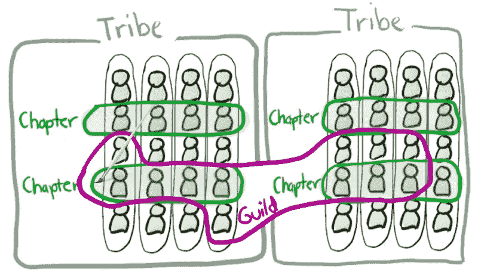
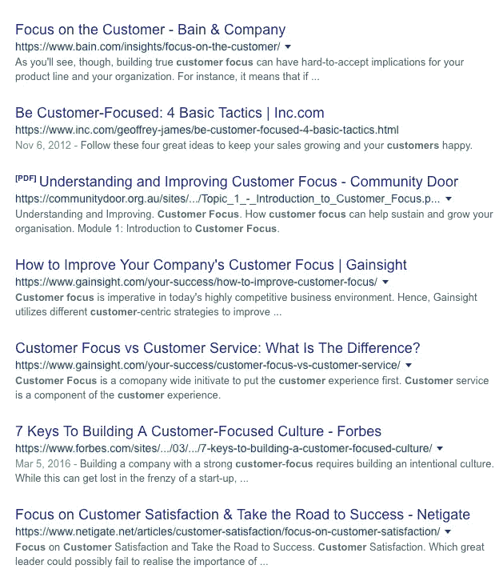
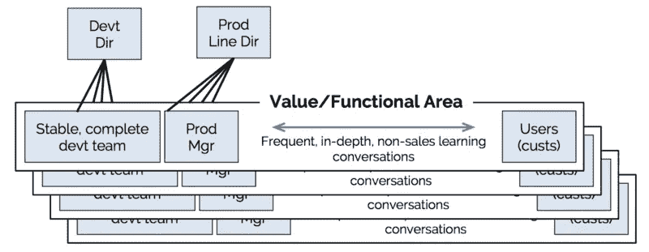

# 输出结果，而不是代码库

> 原文：<https://medium.com/hackernoon/outcomes-not-codebases-5fe81e21be52>

建立一个成功的产品和工程组织的最大挑战之一是团队结构。团队结构决定了可以培养的协作、可能出现的瓶颈以及团队自主运行的能力，而不会踩到彼此的脚趾和蚕食产品[战略](https://hackernoon.com/tagged/strategy)的成果。

更复杂的是，有多种方式来建立团队——例如，有很多宣传和过度采用的 Spotify 模式，有围绕主题专业知识的安排(例如代码库)，有盗版指标(AARRR)，然后以一种使你非常独特的组织能够成功而不是被视为千篇一律的团队的方式来构建它们——我经常选择后者，因为让我们面对它，你的组织是独特的。

The Spotify model — so hot right now.

但事情并不总是这样——我继承的组织大部分时间都专注于代码库，虽然它很容易将同事归入功能筒仓，但它很少能产生预期的结果——围绕客户。在谷歌上粗略搜索一下，就会发现大量指导、教育和训练组织以客户为中心的文献。如果内部团队没有为客户考虑，那么为什么他们努力争取的结果会为客户产生结果呢？

A Google search around focussing on the customer — pretty popular reading.

围绕代码库进行组织也导致了责任的分担，人们互相绊倒，责任在某个地方消失了。不清楚谁拥有什么结果，什么时候有问题要问，也不清楚谁能简洁地回答。例如，在一个拥有网站和本地应用的汽车市场中，谁拥有购车角色？网站还是原生应用？答案是两者都有，这是个问题。

在组建团队以取得成功时，我很少想到 T4 的 Spotify 模式。我知道业内的其他人也采用了这种方式，因为这似乎是正确的做法，如今，团队、部落、分会和行会是每个招聘人员词汇的一部分——但这还不足以成为理由。听了一些关于它的谈话，也有一些谣言在流传，说它实际上是一种营销策略，从未真正在中国内部使用过。Jurriaan 还就这种模式是否超越了音乐之外的垂直领域，以及完全自主的交易是否值得采纳提出了一些很好的观点。

然而，我坚信的是产品和工程团队成果的**共同所有权**和以客户成果为先的**对客户的深度关注**。

Credit to Rich Mironov for articulating what end-to-end ownership looks like.

将上述结构(关键部分是与客户进行频繁、深入的**非销售学习对话**)与矩阵化的跨职能团队(开发运营、工程、设计、数据)进行分层，这样您就有了一个可以拥有自己成果的团队*和*来成功实现有意义的客户成果。

下一次，当你想知道谁拥有什么结果以及为什么它对客户很重要时，不管你是在 B2C 还是 B2B 游戏中，看看你的团队是如何设置的。它们的设置方式决定了团队的关注点，而团队关注的内容决定了你能够实现哪些客户成果——既然企业是为了服务客户而存在的，那么这就是你应该组织的唯一成果。