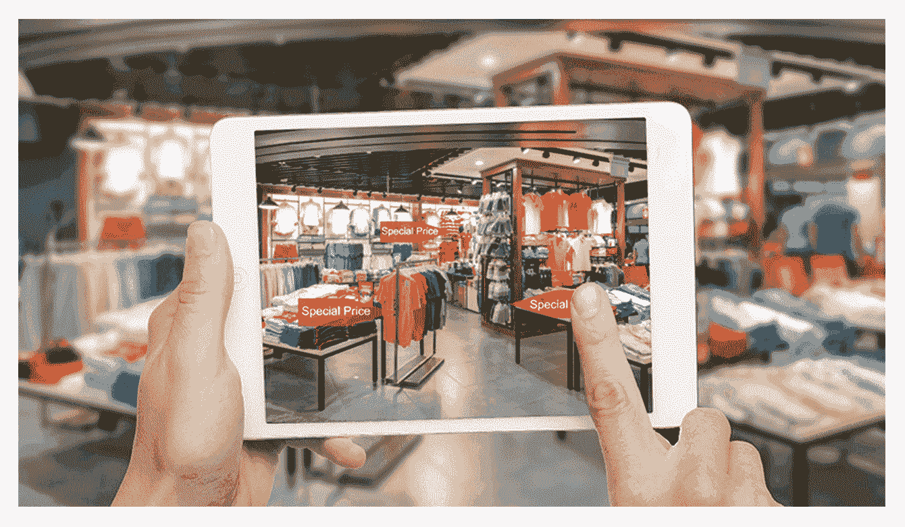

# 零售行业出色的 AR 体验

> 原文：<https://medium.com/hackernoon/outstanding-ar-experiences-in-the-retail-sector-2963f674bca2>

增强现实(AR)在过去几年中获得了很大的吸引力。根据研究公司国际数据公司(IDC)的数据，2018 年花费在增强现实和虚拟现实(VR)上的资金将达到 178 亿美元。

> IDC 设备和 ar/VR 项目副总裁 Tom Mainelli 表示:“基于手机的 AR 可能会在短期内获得最大的兴奋，许多公司已经在尝试 AR 应用和服务”。

# 投资 AR

一些著名的 IT 巨头正在向 AR 项目投资数百万美元，表明了对 AR 沉浸式功能的强烈信念。谷歌已经推出了用于在 Android 上构建增强现实应用的平台 [ARCore](https://www.theverge.com/2017/8/29/16219696/google-arcore-augmented-reality-platform-announce-release-pixel-samsung) 。苹果推出了为 iOS 设备开发 AR 的平台 [ARKit](https://developer.apple.com/videos/play/wwdc2017/602/) 。ARKit 将数字对象与真实场景融合在一起。例如，微软等其他软件公司正在开发自己的解决方案，如 Hololens。这个领域的初创公司已经达到了超过 6.5 亿美元的融资额 Augment 1.8M 万，VividWorks 1.7M 万，say duck 100 万。脸书已经为 Oculus 支付了 20 亿美元。

上面提到的这些公司都看到了 AR 可以带来的巨大前景，如果智能应用，AR 也可以对零售业产生巨大的影响。

# 快速统计

零售业可能是最能够利用 AR 提供的沉浸式体验的行业。

根据衡量 AR 对零售业影响的报告 [Retail Perceptions](http://ikusmer.blog.euskadi.eus/wp-content/uploads/2016/12/The-impact-of-augmented-reality.pdf) ，61%的购物者更喜欢在提供 AR 的商店购物。

接受调查的人表示，最受欢迎的增强现实购物项目是:

*   60%的家具
*   55%的服装
*   39%的杂货
*   35%的鞋子
*   25%化妆
*   25%的珠宝
*   22%的玩具

使用增强现实应用程序:

*   77%的购物者希望看到产品特征，如颜色或风格
*   65%的人希望了解产品信息
*   55%的人说增强现实让购物变得有趣

考虑到这些统计数据，AR 对于零售商来说似乎是值得投资的，以试图增加销售额，保留现有客户，并获得新客户。

# AR 给零售商带来的好处

增强现实增强了购物体验，并为零售商如何与客户互动提供了全新的视角。让我们看看 AR 如果整合到零售格局中能带来什么好处。

好处№1:通过 AR，零售商可以创建带有预览选项的沉浸式产品目录。没有实体商店的在线零售商可以使用 ar 产品目录来克服没有展厅的缺点。他们可以构建 AR 应用程序来显示所有提供的产品。

好处№2: AR 提供符合用户需求的可定制 UX 内容。在服装、配饰和化妆品领域，品牌可以让顾客虚拟试穿他们的产品。承包商、建筑师和设计师可以让客户在做出最终选择之前预览大量的设计选择。使用 AR，客户可以看到所有选项，并在可视化产品后更容易做出决定。

好处 3: AR 可以降低产品退货率，节省退货费用，因为客户可以在购买前决定他们是否喜欢商品。

好处№4: AR 可以让店内导航变得简单、信息量大，让购物者不会迷路或困惑。沉浸式 AR 技术让客户快速找到他们需要的东西，为客户提供产品信息，并增加购买次数。AR 移动应用程序可以帮助用户创建购物清单，找到通过商店到他们想买的东西的最短路线，并引导客户找到他们清单上的所有产品。

好处№5: AR 技术可用于创建产品的强大演示，以轰动的交互体验吸引人类的情感。演讲者可以要求他们的观众通过他们的设备观看演示，并在移动屏幕上看到逼真的产品渲染。此外，AR 产品模型可以通过电子邮件和社交媒体渠道使用基本的移动应用程序呈现给潜在客户。

好处№6:就营销而言，如果通过 ar 驱动的应用程序观看，广告牌或任何简单的产品图片都可以创建自己的故事。许多人，尤其是千禧一代和 x 世代，都希望用 AR 技术体验广告，因为苹果和谷歌已经推出了他们的 AR 工具。

# 增强现实的用例

# 乐高牌塑料锁定式积木

著名的乐高公司让客户通过乐高数字盒子信息亭(Lego Digital Box kiosk)想象他们组装产品时的样子，这显示了一个伪 3D 图像。用户只需要拿一个乐高盒子，放在信息亭前面，就可以立即看到信息亭显示器上显示的产品。这增加了产品的参与度，并促使游客购买。更重要的是，[乐高 AR 工作室](https://www.forbes.com/sites/andyrobertson/2017/12/01/new-lego-augmented-reality-app-is-the-best-open-world-lego-video-game/#67e4813e498a)让像[口袋妖怪 Go](https://steelkiwi.com/blog/what-pokemon-go-can-do-your-business/) 这样的游戏栩栩如生。AR-Studio 应用程序提供了大量的应用内购买，很可能会彻底改变儿童玩乐高的方式。

# 宜家家居（瑞典公司）

家居装饰供应商宜家制作了一个 AR 目录，让顾客在购买前使用智能手机或平板电脑来查看一件家具在家中的外观。凭借其在线和常规目录，宜家是 ar 应用如何与营销策略相结合的一个很好的例子。

顾客可以通过 IKEA Place 查看产品，这是第一个使用苹果 ARKit 的应用程序。在 IKEA Place，顾客可以观看 2000 多种产品的 3D 效果图，包括沙发、扶手椅和储物单元，然后在应用程序中订购他们想要的产品。Inter IKEA Systems B.V .的数字化转型负责人 Michael Valdsgaard 预计 AR 销售额将大幅提升，并希望到 2020 年在线销售额达到 59 亿美元。2016 年，在线销售额达 16 亿美元。

# 汽车销售

AR 已经在改变汽车经销商销售车辆的方式。具有 AR 体验的移动应用程序允许购物者获得非停车场汽车的 3D 视图，或者坐在沙发上看看最新款。[到 2021 年，英国 72%的经销商](https://www.choicequote.co.uk/news/motortrade/augmented-reality-will-become-vital-to-car-sales-213798)将使用 AR 技术帮助他们销售车辆。

我们以大众为例。这个受欢迎的德国汽车品牌已经在他们的平面营销中使用了 ar 功能，即在广告牌上。客户可以将大众 AR 应用指向广告牌，看看新甲壳虫是如何突然出现在他们的手机屏幕上的。

大众集团的研究与 Metaio Gmbh 一起开发了 MARTA(移动增强现实技术援助)系统，以显示真实和虚拟零件的三维关系。MARTA 是一种新的服务信息显示系统，尤其适用于 XL1，它为服务技术人员提供平板电脑上的信息，包括各个零件的标签和清晰的工作说明。

埃德蒙兹 iOS 应用程序让用户看到他们想要购买的车辆是否适合他们的车库。一点 AR 让购物变得既有用又有趣。现在 ARCore 已经存在，埃德蒙兹也想让他们的 Can it fit？Android 平台的应用程序。然而，在转向 Android 之前，他们仍然专注于改善 iOS 体验。

# 将增强现实带入零售业

沉浸式 AR 体验的需求越来越大。企业应该保持警惕，利用增强现实提供的功能来改善他们以产品为中心的活动。AR 可以带动客户购买产品。它增加了便利性，并帮助客户做出更明智的决策，同时为现代零售商提供了一个强大的工具，使人们无论身在何处都能在屏幕上看到真实产品的逼真展示。

如果您有一个具有 AR 功能的应用程序的想法，[与我们联系](https://steelkiwi.com/contacts/),我们将分配一个熟练的开发团队，将沉浸式 AR 体验融入您的零售业务。

同时，阅读[我们如何从零开始创造项目。](https://steelkiwi.com/blog/how-we-create-projects-scratch/)