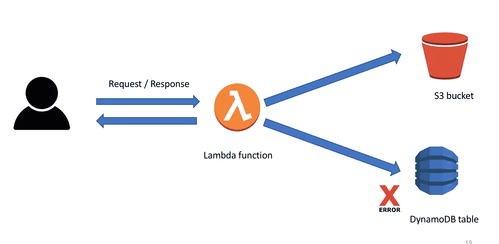
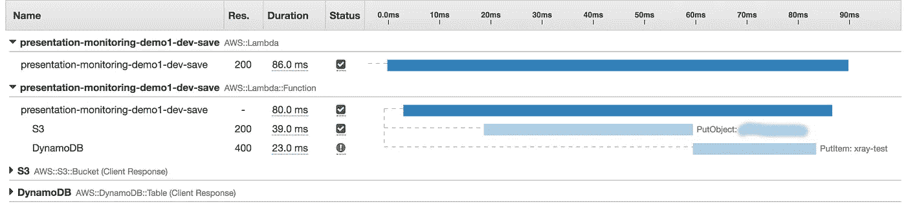
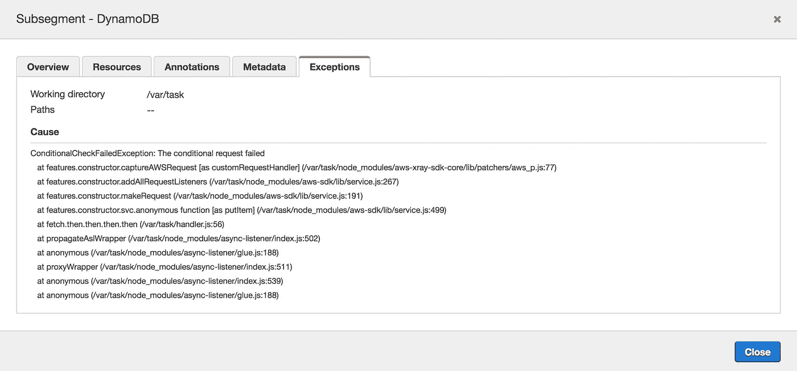
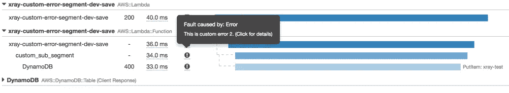
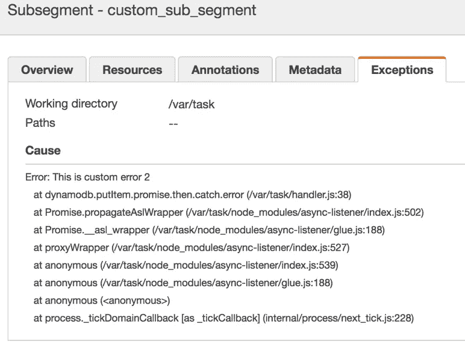
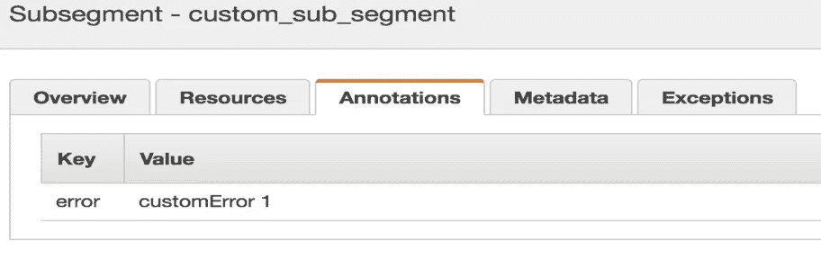

# 克服 X 射线对 Lambda 调试的问题

> 原文：<https://medium.com/hackernoon/overcome-x-rays-issue-for-debugging-892498b14346>

Twitter 称，追踪是可观察性的支柱之一。 [AWS](https://hackernoon.com/tagged/aws) X 射线帮助您了解分布式应用的概况，找到瓶颈并调整其关键路径。此外，它还为您提供了跟踪请求的能力，因此您可以看到任何单个请求在进入您的应用程序时经历了哪个过程。AWS X-Ray 可能是调试无服务器应用程序的强大工具，但是它仍然不成熟，还有很多需要改进的地方。其中之一是关于它的调试能力和它如何显示错误。

我将用一个简单的无服务器应用程序来解释我的观点，如下所示:

Architecture of my example application

[Lambda](https://hackernoon.com/tagged/lambda) 函数下载图像，保存到 s3 桶中，并将 context.awsRequestId 记录到 Dynamodb 表中。然而，后一部分是一个容易出错的操作:Lambda 函数随机选择一个重复的分区键，随后 Dynamodb 抛出 ConditionalCheckFailedException。如果错误直接从 AWS 资源发出，通常会显示在子段的异常部分。错误跟踪看起来是这样的:

AWS::Lambda::Function segment is generated by lambda function and error is reflected in the trace

By clicking on DynamoDb subsegment, you can see the error trace in the Exceptions part

但情况并非总是如此；x 射线不会将您的自定义错误传播到跟踪中。这些类型的错误可能经常发生在应用程序的不同部分，随后，您将看到您的跟踪没有错误，异常部分为空，即使发生了错误！这种无错跟踪并没有给你带来太多的帮助，为了调试，你应该仔细检查你的日志。我联系了 X 射线支持部门，他们已经意识到了这个问题，希望他们将来能解决这个问题。然而，我想出了一个变通办法，目前，这是克服这个问题的唯一方法:如果您创建自定义子段，您可以传播您的自定义错误！然后，您可以注入一个错误对象或附加一个注释。以下是您可以使用的片段:

它使您的错误跟踪看起来像这样:

Custom error is injected into the custom segment and is visible in the trace

If you inject an error object into your custom subsegment, you are able to see the trace

You can put your error type as annotation, and then you can filter out races based on their error type

现在，您可以在过滤器表达式的帮助下搜索有问题的跟踪:

1.  您可以筛选出带有特定注释的跟踪，例如:annotation . error = " customer error 1 "

2.您可以借助复杂的关键字过滤出具有下游问题/错误的跟踪，例如:service(" service-name "){ error = true }

您可以选择将服务名留空。

这种解决方法有一个缺点；您应该总是创建一个额外的子段来包含您的错误，这使它看起来像一个肮脏的工作区。但是让我们期待 AWS 尽快解决这个问题吧！

请注意:

1.  x 射线[将](https://en.wiktionary.org/wiki/categorizes)客户端(4xx 系列错误)归类为错误，服务器端错误(5xx 系列错误)归类为故障。
2.  2.您可以查看 [X-Ray SDK for Nodejs](https://docs.aws.amazon.com/xray-sdk-for-nodejs/latest/reference/) 来找出创建子分段的不同方法

你可以在这里看到我和 x 光支持团队[的全部对话。](https://forums.aws.amazon.com/thread.jspa?threadID=282800&tstart=0)

感谢阅读。如果您有任何意见或问题，请告诉我。