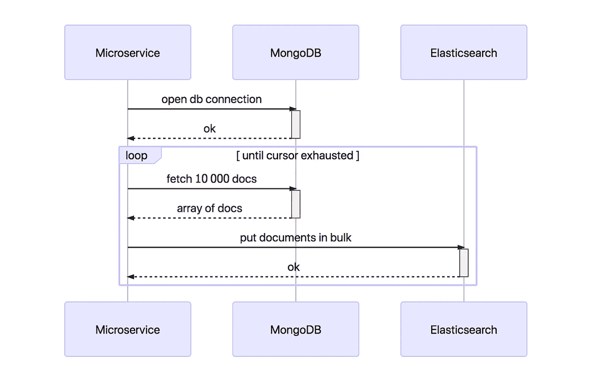
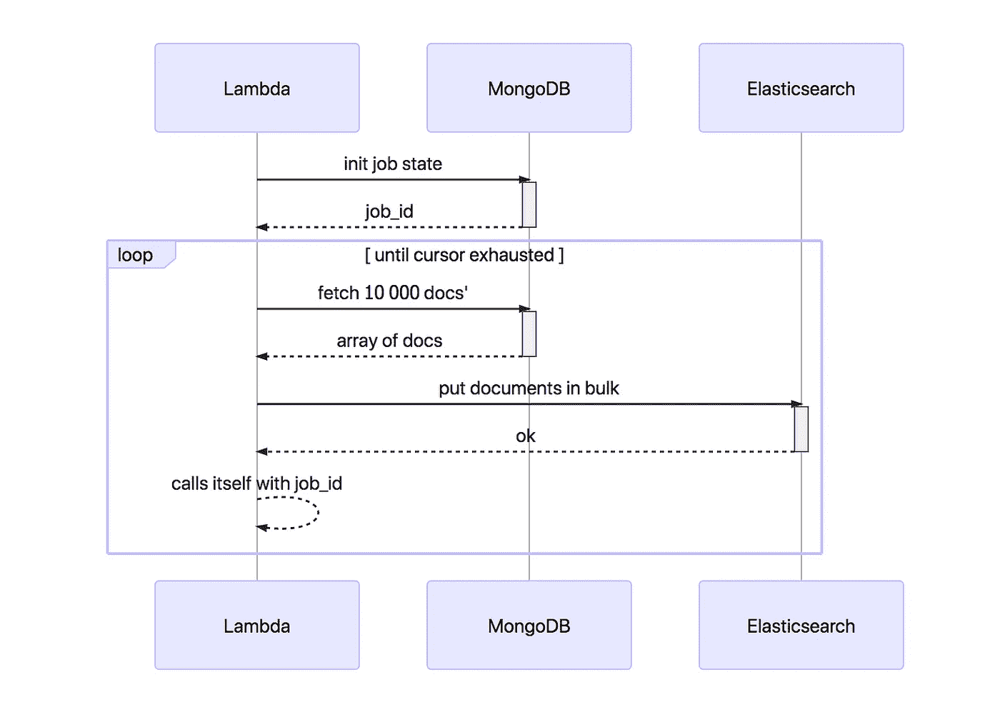

# 如何使用 AWS Lambda 重新索引数百万个弹性搜索文档

> 原文：<https://medium.com/hackernoon/overcoming-5-minute-execution-limit-in-aws-lambda-551d77315cac>


## 或者如何克服 5 分钟 Lambda 执行限制

所以去年 12 月，我以一种无服务器的方式重写了我们的索引微服务。在这个过程中，我不得不将 Elasticsearch 从 2.3 版本迁移到 6.1 版本。

倒不是我急着升级，恰恰相反。但是有一天，弹性云宣布 2.3 版本即将寿终正寝。

你可以想象，跳过几个主要版本会带来突破性的变化，所以从头开始重写微服务是有道理的——这一次是以无服务器的方式。

## 问题、背景、解决方案

从基于队列的(SQS)索引转移到事件驱动的(SNS)索引是一件非常有趣的事情，但是我将在另一篇文章中讨论。

首先，你什么时候把数据库里的数据重新索引到 Elasticsearch？

1.  更改索引映射。你添加一个新字段，改变一个旧字段的类型。
2.  ES 集群中断。发生这种情况时，没有新数据写入搜索索引

在这两种情况下，您都需要从数据库中获取大量文档，并尽快将所有内容刷新到 Elasticsearch。

让我们看看当你有一个有状态的长时间运行的微服务时重新索引的老方法。



The old way: long-running microservice

问题出在“循环”中，这可能需要几个小时来迭代所有文档。兰巴只跑了 5 分钟。你没有国家。

一件好事是 SQS 支持 Lambda。但是今天，[还在路线图上](https://www.reddit.com/r/aws/comments/7a5anz/we_are_the_aws_lambda_serverless_team_ask_the/dp79f6d/)。那么，如果我们暂时将状态保存在数据库本身中会怎么样呢？不是真正的无服务器方式，但一切都是一个权衡。

顺便说一下，我用[美人鱼](https://mermaidjs.github.io/mermaid-live-editor/)生成了上面的序列图。

## 递归 Lambdas

最后，我创建了一个集合来记录重新索引的进度。更像是一份工作清单，包括:

*   查询选择器:打开 MongoDB 游标的起点
*   进度:成功和失败的操作数
*   **最后一个重新索引文档的 ID**:这个很重要

想法是启动 1 Lambda 来重新索引第一批文档，比如说 10 000 个。

它创建一个 id 为的作业，将数据放入 es 并递归调用自己。

下一次迭代通过作业 id 知道查询选择器，并且**追加最后一个重新索引的文档的** ID。所以可以从最后执行的地方开始。

这听起来很复杂，所以让我们重温一下流程。



The new way: recursive Lambda function

一些技巧使这成为可能:

*   按`_id`对你的查询进行排序:这是一个索引字段，排序起来很便宜。根据具体情况，日期字段可能更合适
*   排序查询允许可预测的迭代:每下一次执行查询由`selector` + `{_id: {$gte: lastDocumentId}}`。关于分页的更多信息，请参见文章[我们做错了分页](https://hackernoon.com/guys-were-doing-pagination-wrong-f6c18a91b232)
*   在重索引期间禁用 ES 索引刷新；但不要忘记重新启用它*(默认为 1s)*

```
PUT /index_name/_settings
{ “index” : { “refresh_interval” : “-1” } }
```

## 视窗网际网路名称服务

因此，这看起来可能很麻烦，但这是旧的索引微服务中唯一不明显的要迁移的部分。

这提供了一个重新思考实现的机会，可以在大约 15 分钟内重新索引数百万个文档。

因为你经常得到一个新的 Lambda 容器，所以有一点机会捕捉内存泄漏，这在以前是一个问题。

不要忘了 AWS X 射线，它与 Lambda 配合得很好。在对 Mongo / S3 / ES 的调用中发现了如此多的性能瓶颈。

最后，你得到了所有无服务器的额外津贴，尽情享受吧！