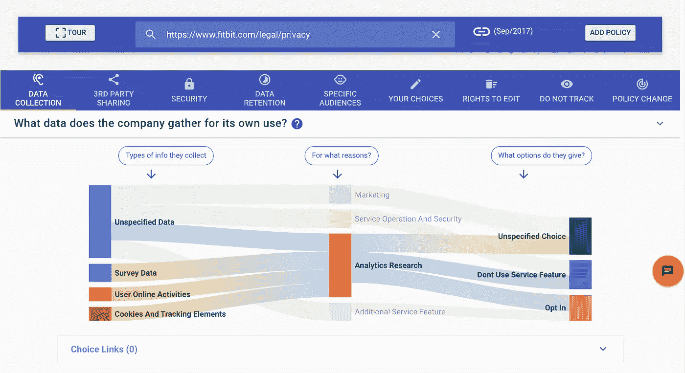

# 我们对隐私政策进行了人工智能的彻底检查，你再也不用阅读它们了！

> 原文：<https://medium.com/hackernoon/overhauling-privacy-policies-with-ai-511908f8eff8>

***总结:*** *这是我们如何建造***的背景故事。有一篇* [*的连线文章*](https://www.wired.com/story/polisis-ai-reads-privacy-policies-so-you-dont-have-to/) *已经讲了这个项目。这篇文章提供了我们的幕后故事。**

*每当有人问我在做什么，我发现没有什么比 YouTube 上一个 9 小时的系列视频更好的了，这个视频拍摄了一个演员阅读亚马逊 Kindle 的条款和条件。*

> *是的，你没看错:9 个小时。*

*这是预告片:*

**这是一个* [*的链接，以完整的系列*](https://www.youtube.com/watch?list=PLZgelsh0ssH9_eZqf5iKKq0TU1X-fw57X&v=6QZml7sPbVU) *。**

*希望你在这个早期阶段仍然和我在一起，你没有迷失在 YouTube 推荐的无休止的类似视频中，例如人们花几个小时阅读[谷歌](https://youtu.be/emD9u9LfRMY?t=960)、[脸书](https://youtu.be/X_BbapCRNts?t=461)和[应用](https://youtu.be/F01j5q-mNzY?t=389) e 的隐私政策。*

*实际上，隐私政策——同样令人讨厌的条款和条件——是本文的主题。*

*您想过阅读我们每年使用的所有服务政策需要多长时间吗？根据 2008 年[麦当劳和克兰纳](http://lorrie.cranor.org/pubs/readingPolicyCost-authorDraft.pdf)的一项研究，那将是 **201 小时**。*

*因此，在这份没有报酬、令人疲惫不堪的工作和其他事情之间做出选择，难怪人们更愿意花时间来实现他们的年度锻炼目标，阅读一本有趣的书，或者只是放松一下。这甚至是当他们听到隐私政策里面可怕的故事时(像[这个](http://fortune.com/2017/04/19/bose-headphones-privacy/)和[这个](http://uk.businessinsider.com/people-are-freaked-out-that-unrollme-sold-email-data-to-uber-2017-4))。*

*研究人员试图使这些政策更简单，主要是通过人工方法，比如网站提供他们政策的标准化版本，受营养标签的启发。依靠群众智慧的方法也得到了很好的牵引(像“[服务条款；没看](https://tosdr.org/)“项目)。然而，由于涉及到大量的人工劳动和人类专业知识，这些尝试没有规模。*

# *修正隐私政策:背景故事🛠*

*两年前，我和我的同事为一个关于隐私声明未来的研讨会写了一篇[论文](https://infoscience.epfl.ch/record/218659)。在这篇文章中，我们提出了一个愿景，通过一个名为 *PriBot* 的聊天机器人将隐私政策转化为对话。*

*让我们承认:2016 年是聊天机器人的一年，我们——无耻地——被炒作所驱使。毕竟最好的接口[就是没有接口](http://www.nointerface.com/)。对吗？*

*我们的想法是，你可以向 PriBot 询问任何隐私政策，就像你向 Siri 询问象牙海岸的首都一样。PriBot 随后会根据策略本身实时做出响应。*

# *快速进带⏩*

*二十个月后，我们在一篇新的[研究论文](https://pribot.org/files/Polisis_Technical_Report.pdf)中实现了我们的愿景，在论文中，我们首次展示了我们如何实现隐私政策自动问答的目标。这是[哈姆扎·哈库斯](http://hamzaharkous.com)(你真诚的)[卡西姆·法瓦兹](http://kassemfawaz.com)[雷米·勒布雷特](http://lebret.ch)[弗洛里安·肖布](https://www.si.umich.edu/people/florian-schaub/)[康格·申](http://web.eecs.umich.edu/~kgshin/)和[卡尔·阿伯](https://people.epfl.ch/karl.aberer)之间的合作。*

> *作为我们的第一个研究成果，我们正在向公众介绍 PriBot，通过一个聊天机器人，你现在就可以在[pribot.org/bot](https://pribot.org/bot)与之交谈:*

**

*PriBot in action*

*在构建 PriBot 的过程中，我们有一个令人惊讶的副产品，它甚至有可能产生更广泛的影响:**我们使用机器学习建立了一个自动分析隐私政策的通用系统。我们称之为 *Polisis。****

**Polisis* 让你对隐私政策有所了解，比如收集的数据、与第三方共享的信息、公司实施的安全措施、你的选择等等。所有这些都无需阅读保单本身的任何一行。*

> *我们也将在[pribot.org/polisis](https://pribot.org/polisis)发布 Polisis。你也可以下载它的 [Chrome 扩展](https://chrome.google.com/webstore/detail/polisis/bkddolgokpghlbhhkflbbhhjghjdojck/)或者 [Firefox 插件](https://addons.mozilla.org/en-US/firefox/addon/polisis/)来分析网站。*

**

*Polisis in action*

*据我们所知，Polisis 是第一个提供如此深入的隐私政策自动分析的系统。*

# *这是给谁的？👩‍⚖️🕵️‍👨‍💻*

*我们设想了三种受众:*

*   ***一般用户:**我们将 PriBot 和 Polisis 设计为对他们使用的网站的隐私方面感兴趣的一般用户非常直观。*
*   ***监管机构:**我们设想支持 Polisis 的技术可用于监管机构对隐私政策的大规模分析。例如，在我们的[论文](https://pribot.org/files/Polisis_Technical_Report.pdf)中，我们用 Polisis 展示了隐私认证公司(如[TRUSTe](https://www.trustarc.com/about/)——现在的 TrustArc)是如何高度纵容企业的。*
*   ***研究人员:**很多研究都是基于应用程序和网站的代码、嵌入式脚本或者它们在网络上分享的内容，以自动化的方式对它们进行研究。拼图中缺失的一块是这些应用在其隐私政策中承诺了什么。我们希望我们的工作能从政策的角度赋予研究者新的洞察力。*

*为了实现这一目标，我们很乐意与监管机构、研究人员和整个行业合作。如果你感兴趣，请随时联系我们。*

# *没有神奇的药丸*

***现在到了研究部分！***

*你可能会说:“难道你不能通过组合一些 API 或开源项目来实现上述目标吗？IBM Watson 不是在回答“Jeopardy！“问题？你为什么不能使用商业服务，比如微软 QnA Maker T1？*

*答案是，这样的系统不是灵丹妙药。如果他们接受了特定领域的培训，比如保险问题，他们可能很难胜任其他人的工作。如果他们接受的是一般领域的培训，那么在测试具体问题时，他们会感到痛苦。*

*想象一下问这样一个问题:“*你收集我的地址信息吗？*“围绕隐私政策。几乎每个 QA 系统都会倾向于回答“*供您参考，我们努力解决您的问题*”而不是“我们使用您的位置来定制我们的服务”显然，第二个是更好的答案。然而，这并不容易得到。*

*让事情变得更难的是，没有关于隐私政策的问题和答案的公共数据集等待训练。因此，解决这个问题的传统方法是行不通的。*

# *分级方法💤*

*我们走了另一条路。我们专注于解决隐私策略中自动标记分段的问题，产生了*polis*。然后我们利用这个解决方案来解决 QA 问题，生产了 PriBot。在高层次上，我们自动标记片段的方法如下:*

*   ***无监督学习步骤:**我们首先在我们收集的 130K 隐私策略上训练了一个[单词嵌入](https://en.wikipedia.org/wiki/Word_embedding)模型。*
*   ***监督学习步骤:**然后，我们训练 22 个分类器的层次结构(每个分类器是一个神经网络)，用于标记策略的不同方面。对于这一部分，我们依赖于[可用隐私项目](http://usableprivacy.org)中有价值的 OPP-115 数据集。*

***剧透**:如果你只是阅读这些步骤，并且你试图重现结果，那将导致一个可怕的表现。我们的[论文](https://pribot.org/files/Polisis_Technical_Report.pdf)详细讨论了魔鬼，从数据预处理到分类器选择等等，导致了很高的准确率。*

*我们如何从分类转移到 QA？*

*假设你有一个问题“你分享我的信息吗？”。为了得到答案，我们首先将策略分成[个小的独立部分](http://www.aclweb.org/anthology/S16-2016)。每个片段都是一个候选答案。然后，我们根据答案与问题的相似性对答案进行排序。*

*相似性是通过查看哪些答案收到与问题“接近”的标签来衡量的。为了获得这些标签，我们通过我们的分类层次结构传递问题和答案。如何定义“接近”也很重要。例如，问题通常很宽泛。你不想让用户失望，因为答案很接近，但是很普通。因此，我们想出了一种新的相似性算法来解决这个问题(详情见[论文](https://pribot.org/files/Polisis_Technical_Report.pdf))。*

# *我们喜欢的例子*

*希望现在您愿意尝试我们的工具。前往 pribot.org 的看他们两个的行动。*

## *为了在对 PriBot 进行压力测试时获得灵感，您可以查看以下示例。*

*在这里，PriBot 是有效的，尽管问题和答案之间没有共同的词语:*

**

*…或者当我们粗心大意，拼错了几个关键单词时(为此你可以感谢[子词嵌入](https://arxiv.org/pdf/1607.04606.pdf)):*

**

*当潜在答案有矛盾时，PriBot 也会通知用户:*

**

*…面对不相关的问题时，它尽量不显得愚蠢:*

**

## *同样，你也可以试一试 polis,下面是几个例子:*

*根据 Fitbit 的政策，您可以大致了解该公司收集了哪些数据。通过点击“分析/研究”，您可以看到为此目的收集的所有数据，以及您获得的选项。*

**

*在第二个选项卡中，您还可以看到 Fitbit 与第三方共享健康信息。将鼠标悬停在链接上，您将获得来自策略本身的确切证据。*

**

*如果策略允许您选择减少数据收集，您可以在专用选项卡中看到这些选择，以及选择加入或选择退出的链接。*

**

*最后，如果在策略中没有关于某个方面的信息，我们给出为什么会这样的解释。*

**

*我们希望您喜欢使用这些服务，并欢迎您的反馈。我们很清楚这项技术的局限性。因此，我们并不声称这些结果具有法律约束力或完全准确。*

*然而，我们相信这是在让隐私政策变酷的道路上向前迈出的一大步(我很想用‘再一次’来结束这句话，但它们以前从来都不酷😀 )!*

*感谢您的阅读！您可能也有兴趣在我的媒体页面上查看我的其他文章:*

* [## Hamza Harkous —中等

### 阅读哈姆扎·哈库斯在媒介上的作品。瑞士 EPFL 博士后；在隐私、NLP 的交叉点上工作…

medium.com](/@hamzaharkous) 

…或我的网站:

 [## 哈姆扎·哈库斯的网站

### 哈姆扎·哈库斯的个人网站

hamzaharkous.com](http://hamzaharkous.com)*