# 使用 Python 进行探索性数据分析概述

> 原文：<https://medium.com/hackernoon/overview-of-exploratory-data-analysis-with-python-6213e105b00b>

## 探索性数据分析在数据科学和机器学习的工作中发挥着作用。


Photo on [Unsplash](https://unsplash.com/search/photos/analysis?utm_source=unsplash&utm_medium=referral&utm_content=creditCopyText)

在这篇文章中，我将借助`pandas`和`matplotlib`简要介绍 Python 中的探索性数据分析(EDA)。

让我们现在开始。

# 什么是探索性数据分析？

据 [**百科**](https://en.wikipedia.org/wiki/Exploratory_data_analysis) :

> 在统计学中，探索性数据分析(EDA)是一种分析数据集以总结其主要特征的方法，通常采用可视化方法。可以使用或不使用统计模型，但 EDA 主要是为了查看数据可以告诉我们什么，而不仅仅是正式的建模或假设测试任务。

你可以说 EDA 是统计学家讲述故事的方式，在这里你探索数据、发现模式并说出见解。通常你手头有一些问题，你试图通过执行 EDA 来验证这些问题。


Photo on [Unsplash](https://unsplash.com/search/photos/analysis?utm_source=unsplash&utm_medium=referral&utm_content=creditCopyText)

# 使用 Python 进行探索性数据分析(EDA)

有多个库可用于执行基本的 EDA，但我打算在这篇文章中使用 [**pandas**](https://pandas.pydata.org/) 和 matplotlib。Pandas 用于数据操作，matplotlib 用于绘制图表。[**Jupyter Nootbooks**](http://jupyter.org/)编写代码和其他发现。Jupyter notebooks 是数据分析和科学家的日记，这是一个基于网络的平台，你可以混合 Python、html 和 Markdown 来解释你的数据见解。

好了，说够了，是时候探索数据并找到它了。我正在使用的数据属于一个虚构的超级商店。我们将找到几个问题的答案，比如销售最好的日子是哪一天，什么时间最合适，这样就可以相应地安排员工。

如果你没有安装 jupyter，运行命令`pip install jupyter`安装它

如果你使用的是 Python 的 [**Anaconda**](https://anaconda.org/) 版本，那么 Jupyter 和 Pandas 就已经在那里了。我强烈推荐使用它，因为它是专门为数据分析或数据科学的人设计的。

通过运行命令`jupyter-notebook.`启动 Jupyter 记事本

该命令输出如下所示:

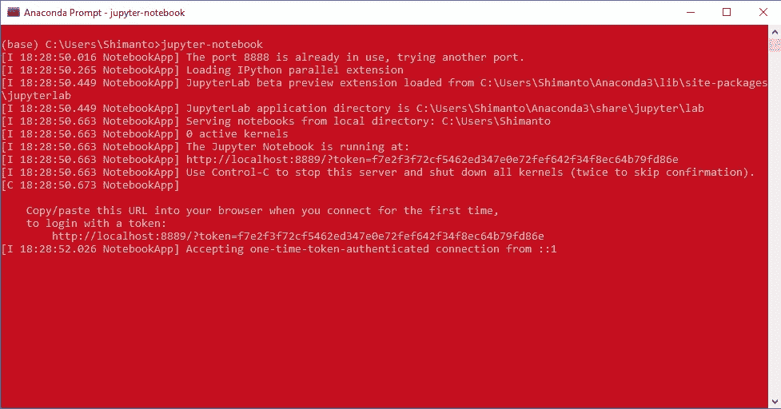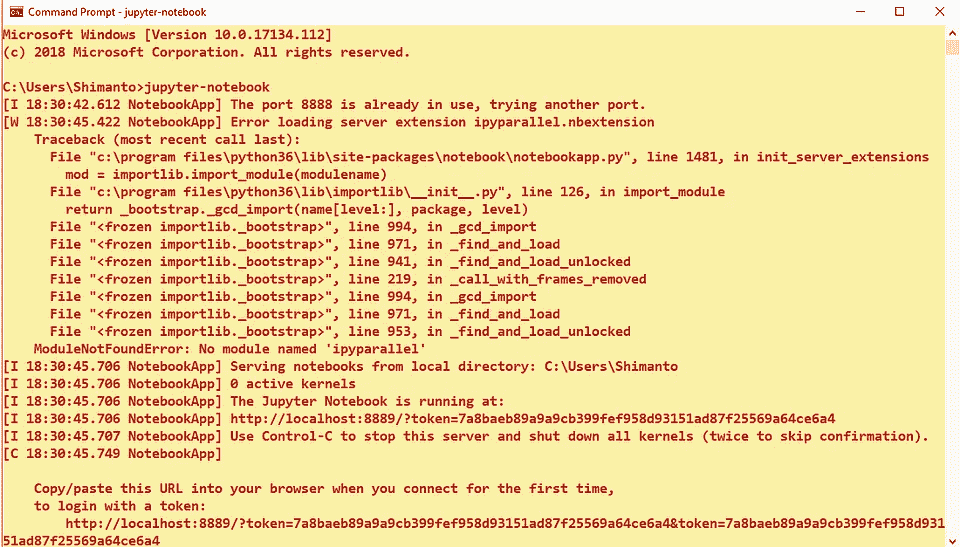

Anaconda prompt & command prompt

它将在您的默认浏览器中打开一个界面。创建一个新的笔记本并命名，你会看到如下内容:

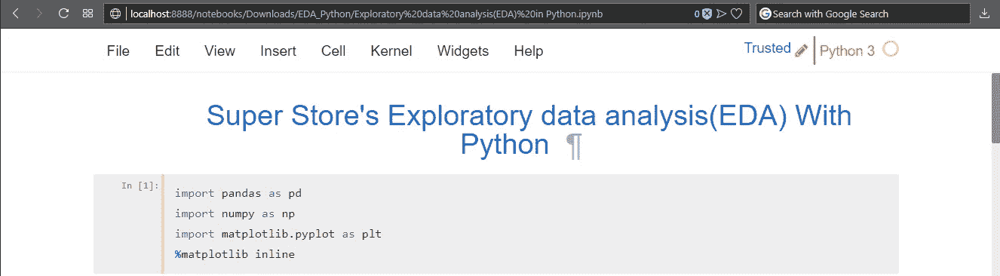

您可以在单元格中添加 Markdown 格式的文本，然后在下一个单元格中开始编写代码。Jupyter 笔记本有`*.pynb`分机。这不是 Jupyter 101 帖子，你可能会在网上找到很多，但我会尽我所能解释。

在第一个单元格中，我刚刚添加了一个关于我将要做什么的标题。你可以在这里添加任何东西，甚至是你的 [**自拍照**](https://2static.fjcdn.com/pictures/Horrible+selfie_a9f326_5690097.jpg) 但是最好把东西放上去，这有助于笔记本读者了解你在谈论什么。

好的，首先我们需要获取数据。数据以 CSV 格式提供。在必要的导入之后，我将调用`pandas`的`read_csv`方法来读取 CSV 文件。

```
import pandas as pd
import numpy as np
import matplotlib.pyplot as plt
%matplotlib inline
```

如果你注意到我加了`%matplotlib inline`。它的作用是在你的页面上绘制内联图。你很快就会看到它是如何发生的。接下来，阅读 CSV 和必要的数据清理。

```
df = pd.read_csv('data.csv')
df['Amount'] = df['Amount'].str.replace('$','').str.replace(',','')
df['Amount'] = pd.to_numeric(df['Amount'])
```

首先，我删除了$符号，然后将字符串字段转换成数字，一旦完成，我们应该在`float`中有数据，因为我们要在这个字段上执行数学运算。通过点击`Shift+Enter`运行单元，将出现如下内容:

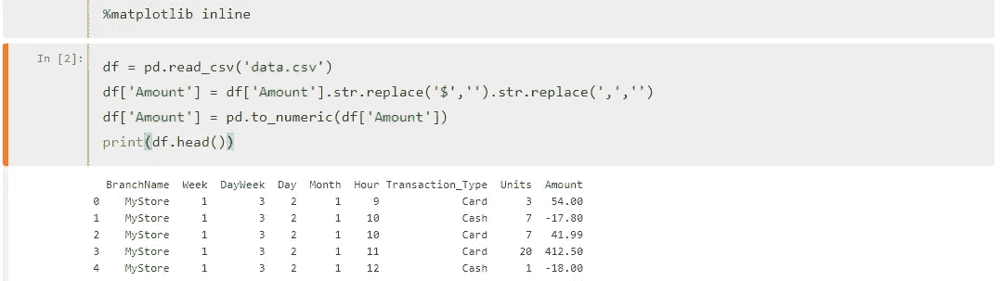

还有一点，我认为`BranchName`字段是不必要的，因为我们只有一个商店的数据，所以让我们删除它！

```
df.drop('BranchName',axis=1, inplace=True)
df
```

它将删除该列，`inpace=True`使其从现有的`DataFrame`中删除，而不重新分配它。再次运行，它显示如下数据:

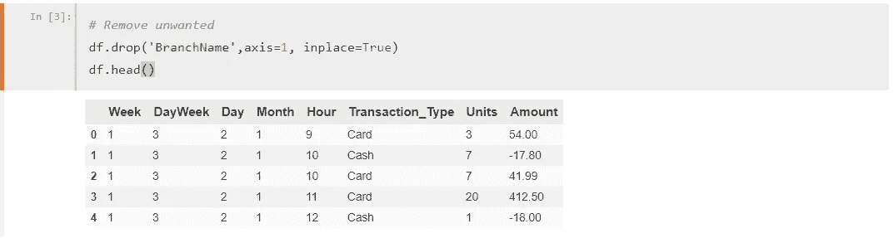

好了*操作清理*完成了，让我们深入数据，寻找真知灼见！

我们要做的第一件事是找出记录的数量和特性或列的数量。为此，我将执行`df.shape`。当我这样做时，我发现了以下情况:

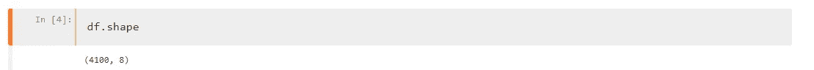

这是什么意思？它实际上是**行 x 列**。所以这里有 **4100** 总记录和 **9** 列，你也可以计算上面的列数。

好吧，我确实得到了总记录和列的概念，但是..我需要这些数据的详细摘要，为此我将运行`df.describe()`,当我运行时输出:

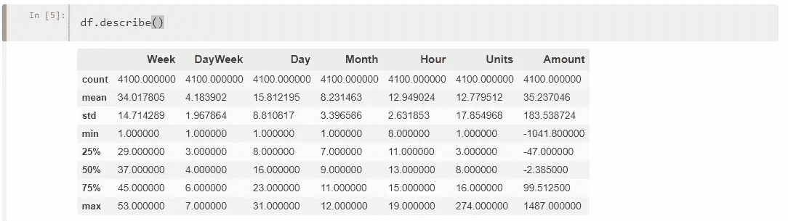

好的，这里有一些有趣的信息。如果您看到`count`，它显示的记录数与这里的`4100`相同。您可以看到所有列都有相同的计数，这意味着那里没有缺失的字段。你也可以检查一个单独的列数，比如说`Units`，然后输出如下图:

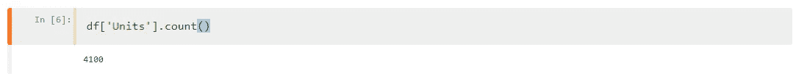

你将了解数据是如何获得的，什么是均值、最小值和最大值，以及标准差和中值。百分点也在那里。标准差是一个非常有用的工具，可以用来计算数据是如何分布在平均值之上还是之下。值越高，越不可靠，反之亦然。比如`Amount`的`std`是`183.5`，而均值在`35`左右。另一方面，`Units`的平均值是`12.7`，而`std`是`17.85`。哦，只是澄清一下，std 是标准差的简称，不是*性传播疾病*，只是想澄清一下，以免你认为我们的数据没有抓住某些疾病。

我们来看看`Amount`的分布

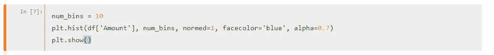

它输出:

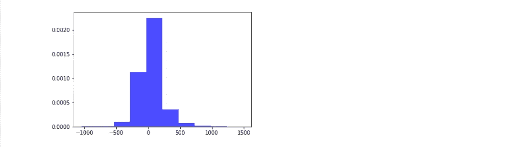

好吧，忽略这个巨人..钉一会儿，注意基线很大，从`-1000`到`1000` +

让我们按月、日和小时找出销售额。

# 按月销售

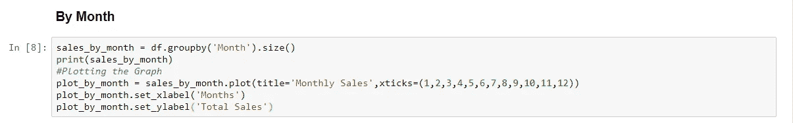

您可以使用`.size()`只获取特定列的聚合值，或者使用`.count()`获取每一列的聚合值。因为我们只需要`Month`所以我用了它。绘制图表，你会发现:

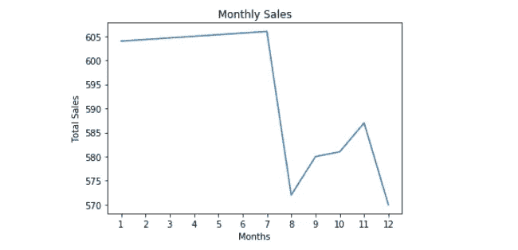

直到七月，生活是美好的，但后来发生了一些事情，在八月有一个急剧下降，然后工作人员努力工作了三个月，然后事情又死了。

让我们白天看看

# 白天销售

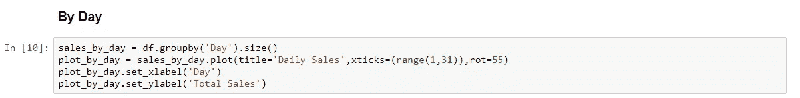

输出是:

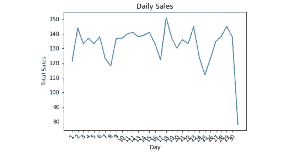

销售在月底大幅下降，否则会不断打嗝，第 18 天是相当不错的。

# 按小时销售

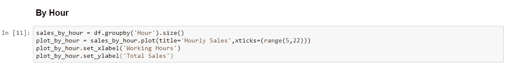

它输出:

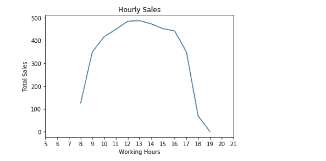

好的，看起来下午的顾客比关门和营业时间的顾客多。

# 结论

直到现在，我现在可以走了。你可以找到更多的洞察，但是你可以使用探索性的数据分析来研究如何从这个数据集中找到洞察，就像我上面想的那样。在该数据中有一个字段`Transaction Type`，你的任务是找出每种交易类型的销售数量。让我们知道进展如何。

一如既往，这个帖子的代码可以在 [**Github**](https://github.com/harunshimanto/Super-Store-s-Exploratory-data-analysis-EDA-in-Python) 上找到。

你可以[告诉我](https://www.linkedin.com/in/harun-ur-rashid6647/)你对此的看法，如果你喜欢写作，点击拍手👏按钮。

感谢大家。