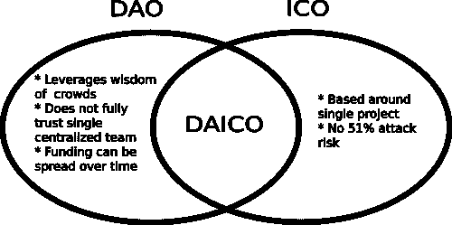

# DAICO 众筹模式概述

> 原文：<https://medium.com/hackernoon/overview-of-the-daico-crowdfunding-model-c611d55d4365>

2017 年，首次硬币发行(ico)[主导了](https://www.forbes.com/sites/outofasia/2017/12/18/icos-in-2017-from-two-geeks-and-a-whitepaper-to-professional-fundraising-machines/)加密货币领域，许多众筹项目筹集了数百万美元的投资者资金。随着开发者和投资者都试图利用炒作，围绕 ico 的炒作和讨论变得狂热起来。ico 被吹捧为一种更民主的项目融资方式，使区块链企业得以成立，而没有与风险资本家和银行相关的麻烦。然而，随着 ico 越来越受欢迎，欺诈者开始利用该系统。抽水和转储计划，庞氏骗局，以及一些 ICO 骗局开始出现。所有这些导致投资者信心下降，政府监管增加。

为了阻止欺诈者劫持 ICO 空间并对加密市场的保真度产生负面影响，一种新的众筹模式已经创建。以太坊区块链的创始人 Vitalik Buterin 在以太坊研究论坛上发表了一篇文章，详细介绍了一种加密货币众筹的新方法。这篇名为[“DAICOs 的解释”](https://ethresear.ch/t/explanation-of-daicos/465)的帖子描述了一种针对区块链企业的新众筹协议，该协议将结合分散自治组织(DAO)和 ICO 的特点。Buterin 认为，这个新模型大大改进了 ICO 模型的缺点，同时又不太复杂。

# 看看戴科模型

在 ICO 期间，这家总部位于区块链的企业为 ICO 流程创建了一个智能合同，用于管理投资者资金的收集。本合同不控制资金的使用或投资者对项目整体实施的贡献。该合同在筹资结束后终止，投资者等待代币在交易所上市，以便他们可以抛售或交易代币。在 DAICO 模式中，这种不健康的趋势被完全消除了。在 DAICO 中，企业和投资者是一个整体团队的一部分，双方在一个相当平衡的数字组织框架中相互负责。

DAICO 众筹的过程始于 DAICO 合同的创建，该合同由总部位于区块链的企业的开发团队设计。一旦创建完成，该合同就会发布，DAICO 就可以开始了。DAICO 合同有两个主要作用，它们是:

1.管理众筹过程

2.控制众筹过程中所筹资金的使用。

正是这第二个功能，使 DAICO 合约超越了大多数 ICO 智能合约。众筹结束后，DAICO 合同继续有效，而 ICO 合同仅用于管理众筹过程。DAICO 合同的这两个主要功能基于合同的两个部分，即贡献模式和 TAP 模式。

图片来源:[https://ethresear.ch/t/explanation-of-daicos/465](https://ethresear.ch/t/explanation-of-daicos/465)

# 贡献模式

这种模式包含了关于众筹过程将被执行的机制的所有信息。关于投资者如何以法定货币或乙醚的形式提供股权以换取项目的加密货币令牌的确切细节在合同的这一部分中有所规定。根据区块链项目负责人的偏好，可以指定不同类型的贡献模式。一些可用的选项包括白名单、荷兰式拍卖、有上限和无上限代币销售。当 DAICO 合同的出资模式部分终止时，投资者将不再能够在项目中投资。贡献模式的终止是自动激活 tap 模式的信号。此外，一旦贡献模式被终止并且 tap 模式被激活，代币变得可交易。

# 轻敲模式

如果贡献模式可以比作 ICO 结构，那么 tap 模式就是 DAICO 聚合的 DAO 一半。DAICO 合同的 tap 模式包含指导投资者资金使用的所有模式。现在是代币持有者的投资者和项目开发商签订 DAO 协议。投资者可以投票决定向开发团队发放多少资金。投资者还可以投票决定开发团队将优先考虑项目实现的哪个方面。

tap 模式的架构并不只是将所有权力交给投资者，因为项目开发人员还可以防止对项目的蓄意破坏。这是通过减少龙头数量或停用 DAICO 并启动一个新的来实现的。

tap 模式包含两个不同的投票类别，它们是:

1.Tap 启动

令牌持有者(投资者)启动 tap，激活并批准向开发团队发放资金。这使得团队能够处理 DAICO 投票决定的项目实施过程的任何部分。

2.DAICO 合同停用

如果任何一方(即投资者或开发商)对项目开发的进度不满意，他们可以投票取消 DAICO。剩余的未用完的乙醚将根据投资者在 DAICO 中的投资比例返还给投资者。

# DAICO 模式的优势

ICO 模型肯定有许多缺陷，破坏了该模型希望实现的目标。DAICO 是分散式众筹项目概念的一个新尝试，旨在解决这些缺陷。以下是 DAICO 模型的一些潜在好处。

1.更好地利用投资者资金，改善投资者和开发商之间的关系。

2.消除加密货币众筹流程集中化的趋势。

3.提高了区块链初创公司在众筹期间和之后的安全性。

如果 DAICO 被证明是加密货币众筹难题的解决方案，那么这将是一个受欢迎的发展。这种模式有可能净化加密货币众筹流程，并提高投资者对区块链初创公司的信心。

# 【DAICO 的商业考虑

在 FundYourselfNow，我们已经在一年前的白皮书中提出了与 DAICO 极其相似的东西([https://cryptodigestnews . com/fundyourself now-using-区块链-to-improve-crowd funding-5ce 12 BF 4c 5a 8](https://cryptodigestnews.com/fundyourselfnow-using-blockchain-to-improve-crowdfunding-5ce12bf4c5a8))。有些操作问题使 DAICO 的实施变得很困难，这是我们最初没有想到的。

1.  **投票注意事项**

目前的现实是，投资 ico 的大多数投资者都是短线交易者，而不是长线投资者。我们估计大约 70–90%的 ICO 投资者将在项目的第一年出售他们的代币。这就引出了几个问题？

a)当初始投资者在交易所抛售其 ICO 代币时会发生什么。出于投机目的在公开交易所购买代币的交易者应该获得什么权利？

如果交易者拥有与初始投资者同等的特权，那么这很容易被滥用。该公司可以回购他们自己的代币，使整个投票过程变得无关紧要，因为他们总是持有多数票。另一种情况可能是，一个更富有的竞争对手可能会购买大量代币，扰乱项目投票&迫使 DAICO 中的乙醚释放回他们自己。

b)如果我们不允许交易者拥有同样的特权，那么就会出现另一个问题。剩下的第一批投资者将对项目和资金产生巨大的影响。突然之间，这些最初投入 10%资金的初始集团控制了整个项目资金，这对做 DAICO 的公司来说是不公平的。例如，如果代币的价格跌破代币的价格，他们可以强行投票，将资金抽出来赚钱。

**2。快速变化的商业环境**

一旦创业公司真正开始做产品并从用户那里获得真实的反馈，由于商业环境的变化，他们转向新的商业模式和想法并不罕见。

ICO 基金非常类似于种子基金，很多时候，他们实际做的事情与他们在白皮书中写的非常不同。

创业公司将有一个重要的额外成本，即拥有一个沟通团队来管理投资者的预期，并让人们对重大变革进行投票。投票有效地降低了创业公司相对于大公司的一个关键优势，即适应市场条件并做出相应改变的速度。

请在下面留下你的评论！

渴望了解更多关于 FundYourselfNow 的信息吗？在我们的 [*电报*](https://t.me/fundyourselfnow) *群上加入我们的众筹革命对话，或者在* [*推特上关注我们。*](https://twitter.com/fundyourselfnow)