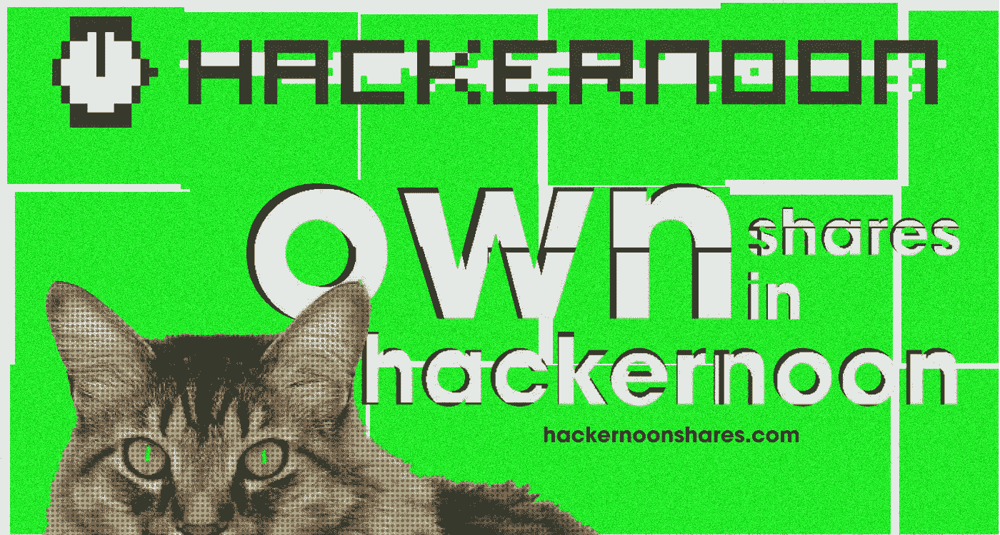
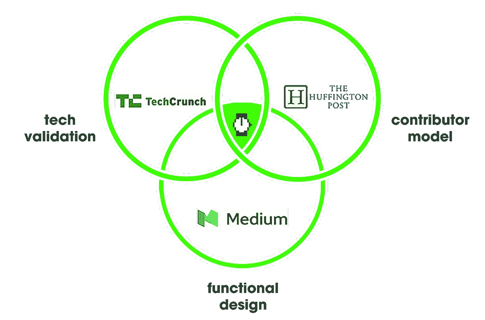

# 拥有黑客正午的股份！

> 原文：<https://medium.com/hackernoon/own-shares-in-hacker-noon-1a77d5f7bfe8>

## Hacker Noon 的股权众筹在不到两天的时间里从 91 位投资者那里获得了 22.4 万美元。

考虑一下[发推特说好话](https://ctt.ac/VbU3f)，或者[霍德林分享《黑客正午》](http://bit.ly/HNshares)。

Hacker Noon 第一次筹集资金，我们从社区中筹集资金。 [**今天参与黑客正午的股权众筹！**](http://bit.ly/HNshares)

我们想奖励早期投资者和信徒。周一下午和 Hacker Noon 发起的活动提供股价折扣，直到周五(11/9)晚上 11:59。

## 感谢我们的几位早期投资者:[加里·谭](https://twitter.com/garrytan/status/1060002140020596738)、[、**雷贝·惠勒、**、](https://twitter.com/Rebe_CR/status/1060166819129028609)、**、**、[埃尔文·罗德里格斯](https://twitter.com/elving/status/1059919036228796418)、[、**杰弗里·马乌古**、](https://twitter.com/GeoffreyMahugu/status/1059767222472712192)、**、**、[、**卡森·吉本斯、**、](https://twitter.com/carsoncgibbons/status/1059871205136744453)、、[普拉哈拉德·贝拉瓦迪](https://twitter.com/prahaladbelavad/status/1059755079396257792)、

**真正让《黑客正午》脱颖而出的是**我们是独立的** & **社区驱动的**。我们生活在公司博客和《纽约时报》之间美丽的互联网空间里——提供由真正的科技专业人士撰写的真实而自由的故事和观点。**

****

**我们通过一个精干的团队使 Hacker Noon 成为科技媒体的主要内容，并且我们已经准备好扩张。我们的目标是**建立一个新的基础设施**，为人们使用和想要使用 Hacker Noon 的方式进行优化。如果没有这个新的基础设施，你所知道的 Hacker Noon 可能会不复存在。**

## **[**帮助我们成为科技专业人士发表文章的最佳场所。**](http://bit.ly/HNshares)**

> ****什么是股权众筹？****
> 
> **2015 年的《就业法案》使股权众筹成为可能。现在，私人公司可以以低至 100 美元的价格向公众出售真正的股票。我们通过 StartEngine 运行[我们的股权众筹基金。他们的首席执行官霍华德·马克斯是一名资深的黑客 Noon 特约撰稿人。](http://bit.ly/HNshares)**

# **[今天拥有黑客正午的股份。](http://bit.ly/HNshares)**