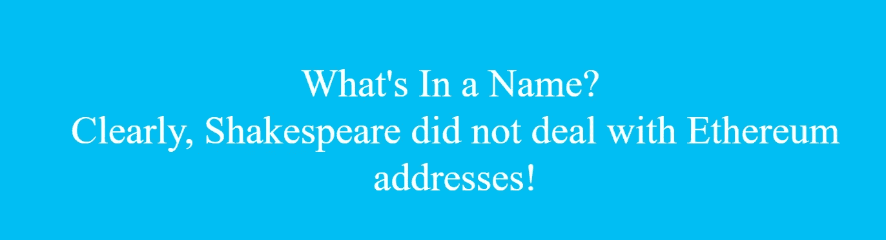
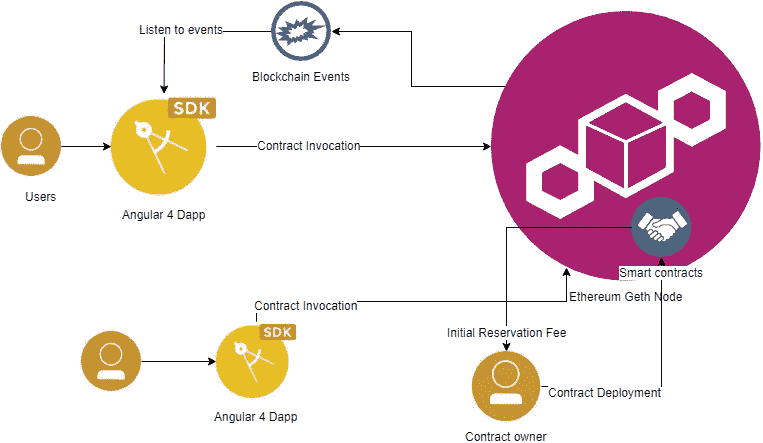
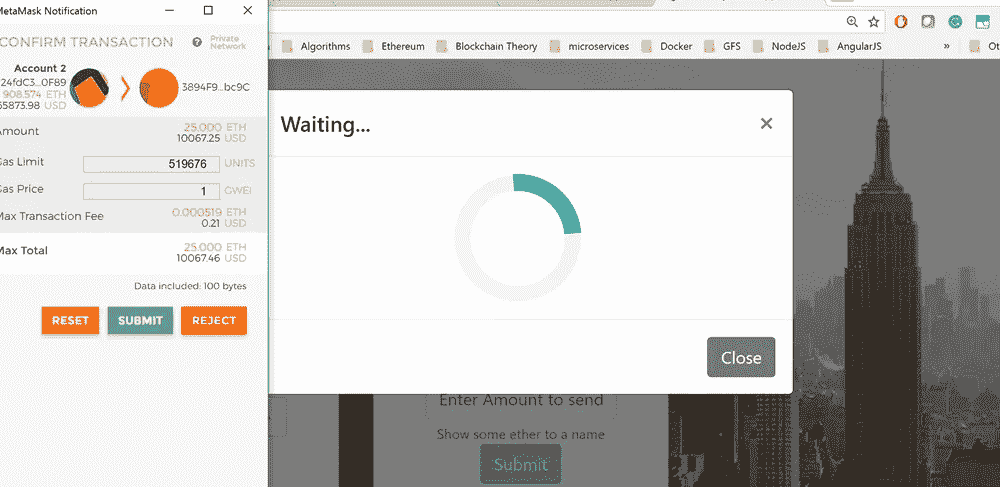

# 在区块链中打造你的身份

> 原文：<https://medium.com/hackernoon/own-your-identity-in-blockchain-747a91100b39>



你试过在[以太坊](https://hackernoon.com/tagged/ethereum)上转移面团(乙醚)吗？

如果是的话，那么你就会知道记住你的债权人的钱包地址是多么痛苦。如果你能用她的名字转移以太，那该有多酷。

如果你能做这样的事情

dnscontractinstace . sendethertoname(" Hitesh "，10 Ether)，无论 Hitesh 的所有者是哪个地址，都将获得记入其钱包的 10 Ether。

所以在这篇文章中，我们将在以太坊中构建命名服务的同时，尝试学习 solidity 和 [DApp 开发](https://hackernoon.com/tagged/dapp-development)的构建模块。

我们今天要写一些智能合同，允许我们在以太坊中保留我们的名字作为我们的身份，然后使用这些名字进行交易。也就是说，这篇文章不是以太坊或固体或松露入门介绍。

## 就这样？不…我们还会做以下事情-

> 看看你如何能在一个你喜欢的名字上出价。
> 
> 对一个名字出价最高。投标存储在合同中。
> 
> 如果您是域名所有者，请接受出价。
> 
> 撤回你的出价—撤回模式
> 
> 发送以太到一个名字而不是一个地址。

## 就这样吗？？？

不，还没有，我们还会做很多外围功能，即-

> 向合同创建者发送初始预订费。
> 
> 检查名称字符并限制您可以保留的名称大小。
> 
> 检查恶意契约代码不能一遍又一遍地调用你的撤销函数来清空你的契约余额。

最后，我们会-

> 用 truffle 写 JS 测试用例，测试契约代码。
> 
> 编写一个有角度的 4 [DApp](https://hackernoon.com/tagged/dapp) ，它与 Metamask 集成在一起，以使用我们编写的契约代码。

高水平拱形图



Architecture Diagram

你需要什么来开始-

您自己的私有 Geth 节点或 Ganache 或连接到 Ropsten 的能力

节点 Js

角度 cli

松露

Remix 或以太坊钱包，用于快速和肮脏的测试

# 足够的前奏，让我们进入代码…

首先是一个带有状态枚举和基本结构的库，我们将在我们的合同中使用

现在出现了[设计](https://hackernoon.com/tagged/design)问题，你将如何在一个合同中存储所有的投标。使用一个阵列是有限制的，而且汽油的花费是疯狂的。我们将为每个名称创建一个投标容器，它将保存为名称和所有者提交的所有投标的映射。

我们将代表一个出价

并持有针对特定名称(容器)的所有投标

该代码在 Github 中被大量评论，请查看，我已经在 gist 中删除了大部分内容。

我们还有一个 util 契约，它允许你把一个字符串转换成字节。我们还有 ProtectReentry 契约，它试图阻止契约代码一遍又一遍地调用您的代码。为了简洁起见，我在本文中省略了它们。

最后，主合同本身。

## 现在让我们写一个测试用例，测试所有这些…

这只是测试案例中的一个，你会在资源库中找到很多。

它基本上保留了披头士使用帐户[2](nameOwner)。然后，一号叫牌者和二号叫牌者之间发生了一场竞价战。最后，投标人让步，撤回了他的投标。我们最后检查在测试执行的这一点上合同中设置的总以太网。您可以轻松地检查个人余额或接受出价，并在名称所有权转移后查看结果。

最后，我们还构建了一个非常基本的 Angular Dapp 来与部署的智能契约进行交互。Dapp 与 Metamask 集成在一起，允许您对进入以太坊网络的交易进行签名。任何操作，如保留一个名字，对名字投标等，都必须得到钱包的批准。



您需要在 Metamask 中创建或导入您的帐户才能使用此功能。另外，如果你像我一样使用私有节点，你需要用一个特殊的标志来启动它

```
 --rpccorsdomain="chrome-extension://nkbihfbeogaeaoehlefnkodbefgpgknn
```

守则中的一个未决问题是，到目前为止，投标还没有结束。因此，任何被出价超过的竞标者都可以从合同中提取资金，但如果你是某个名称的最高出价者，而所有者没有接受你的出价，你的资金就被锁定在合同中:(

我们将在下一篇文章中尝试解决这个问题。我正在考虑在投标中增加一个投标周期。在投标期结束时，即使出价最高的投标人也可以取出他的资金。所以会有一个锁定，但是一旦你被出价超过或者出价期限到期，你就可以自由地把以太拿出来。

完整的源代码存放在我的 github repo [这里](https://github.com/hiteshjoshi1/dns-dapp)。请检查一下，玩玩它。喜欢就开始吧。干杯！

考虑到人们已经按照这些思路开发了商业软件，请看[这个](https://ens.domains/)。如果你想更进一步，拉取请求和协作请求总是受欢迎的。

就是这样，伙计们！

在 [LinkedIn](https://www.linkedin.com/in/hitesh-joshi-a9928613/) 上联系我，或者在 [Twitter](https://twitter.com/joshi_ji) 上关注我。