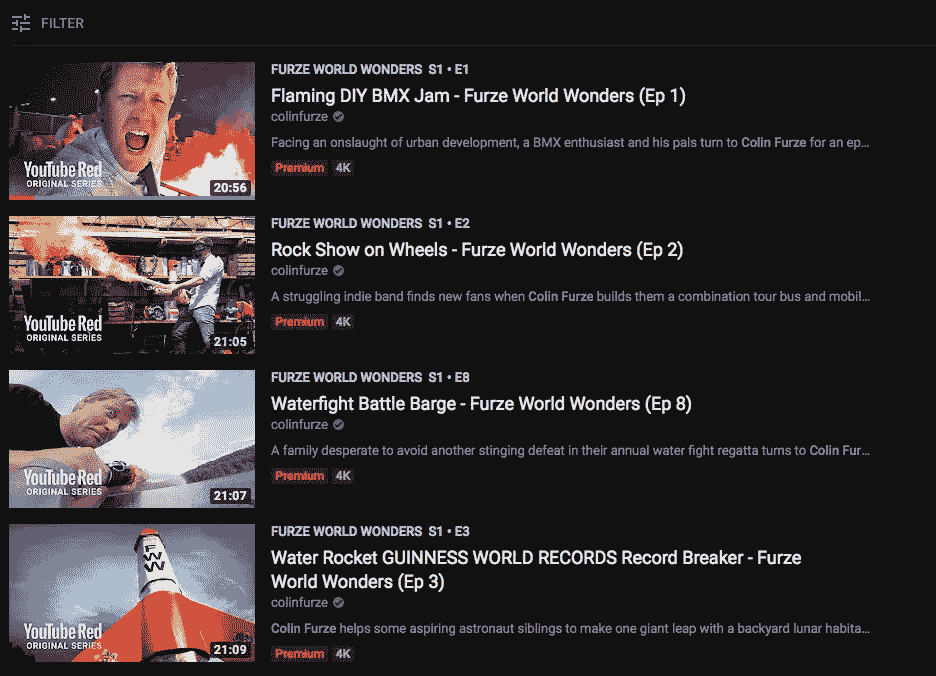

# P-YAN 评论 YouTube Premium(英国)

> 原文：<https://medium.com/hackernoon/p-yan-reviews-youtube-premium-uk-573c5b7c6948>

所以 3 个月前我收到通知，我可以试用 YouTube Premium 3 个月。我想这就是在美国被正式称为 YouTube Red 的东西，现在在英国也可以看到。

我知道我的 YouTube 使用率很高，比起看电视，我更喜欢它。这些天，我想看的任何电视节目都会在网上。看到我花在 YouTube 上的时间令人震惊，但这是有意义的，因为我们都在朝着 100%的在线媒体发展。对我来说，我对游戏、烹饪、编码和其他东西有特别的兴趣，所以 YouTube 对我来说很棒。

所以我想这将是一个很好的机会来检验一下，看看是否值得。#ProTip —设置提醒，以免在免费试用结束后忘记离开；

Always forget that I have this useful app!

# 功能有多好？

## 无广告区

有趣的是，大多数应用程序的最大“特征”之一是为无广告区付费。事实上，我们讨厌广告，但我们知道企业需要广告。不管这是真是假，这是一种常见的商业模式。可怜的广告创作者，他们的作品被当成垃圾邮件，他们得到的尊重就像交通督导员发停车罚单一样多…

无论哪种方式，如果你没有生活在岩石下，有一个叫 Ad-block 的东西可以免费做这个功能。只有非技术性的临时用户和/或有意支持其收入的内容创建者的支持者才不会使用广告屏蔽。

只要你不使用拦截器，很难说这有多有用。大多数广告在五秒钟后就可以跳过，即使有更长的广告，大多数人也会找些别的事情做，看看另一页或者去喝点什么。广告有人们想象的那么讨厌吗？比如付钱让它摆脱烦人？很难说…

***有用评级:2.5/5****——反正有很多广告拦截用户，广告也不像电视广告那么烦人或冗长……*

## 背景播放

这实际上是 imo 的一个很好的特性。很多时候我想听晦涩的游戏配乐或播客，而不得不打开应用程序真的很烦人。

YouTube 彻底改变了内容创作者使用其平台的方式。一切都是为了易于使用，易于共享…因此，根据这一理念，这一功能符合该模型，令我惊讶的是，它并不在该模型中。

似乎他们想尽办法阻止它，甚至很可能添加了代码，以确保没有第三方应用程序可以侵入它并使它工作。如果一个应用程序做到了这一点，他们会赚很多钱。

***有用性评分:4/5****——非常想要的功能，尤其是听音乐和播客。*

## 视频下载

对于这些评论，我认为重要的是要记住，概括什么对每个人都是最好的是不好的，因为每个人都有不同的需求和不同的口味。

因此，在这种情况下，如果你花大量时间在没有 wifi 的地方通勤或旅行，将内容下载到手机将是一个很好的功能。或者你的手机没有 4G 合约，所以你可以先在家里下载，然后在火车上看。

Extra option in dropdown menu

我通过伦敦地铁上下班，所以这个功能对我来说很棒。我喜欢这样一个事实，我可以在家点击下载并让它在后台完成，然后在我的通勤期间为我准备好视频。

New downloads section in library tab

与背景播放不同，这是一个值得付费的功能。不是每个人都会觉得它对他们有用，它迎合了重度用户的需求。

也许他们可以在某些订户发布新内容时，通过自动定制下载来扩展这一功能？一种 YouTube Tivo…

**有用评级:5/5** —通勤者的梦想！我会为这个功能付费…但不会*那么多！

## YouTube 优质内容独家新闻

有趣的是，这也是他们特性列表的底部。没有人真正评价它，也许他们也没有很高的评价。

这允许访问由知名内容创作者制作的某些 YouTube 独家节目。

Recently I have been getting into the British mechanic Colin Furze and his crazy machines

然而，由于一些未知的原因，似乎很难找到这个内容。没有付费内容的标签，当你点击“电视节目和电影”时，它只显示付费内容？

YouTube premium content is nowhere to be seen?

YouTube 也开始像网飞一样购买电视节目的独家经营权。到目前为止，评论都认为这些节目不太好。

随着《冲动》(Impulse)和《眼镜蛇凯》(Cobra Kai)这两部电视剧成为 YouTube Originals 品牌的一部分，情况开始出现转机。看看 YouTube 在投资挑选节目方面能走多远会很有趣，但就像网飞一样，如果做得正确，它真的会有很好的结果。

但是不用说，你必须让你的内容容易被用户找到，这是显而易见的。作为一个高级用户，我从来没有发现过他们的产品有任何形式的推广，或者让我觉得很突出。

**:1/5—有潜力，但需要更好的推广和展示。**

# *未来？*

*在 YouTube 上，有一件事对我来说很明显，那就是它有点无处不在。它太大了，要做太多的事情。这使得他们很难成功地树立自己的品牌。我可以看到有 4 个类别，这些品牌需要明确的区分。*

***YouTube…用户内容**？—我不知道该怎么称呼它，但基本上这就是最初的 YouTube，人们可以在这里查找任何东西，订阅和观看内容。从用户界面的角度来看，至少它应该有自己的部分与其他品牌分开。*

***YouTube Music** (Spotify 风格的内容)——允许用户听歌、看音乐视频、上传自己的东西、制作混音。也许创建一个单独的应用程序只听？*

***YouTube Live** (Twitch.tv 风格内容)——直播节目、播客、体育、赛事和游戏流应该有自己的板块。*

***YouTube Originals** (网飞风格内容)——所有的电影、节目和他们自己的 YouTube 原创内容都放在这里。*

*事实上，这些都是糊在一起，使事情很难推广。他们所有的内容被合并在一起，现在你只能找到你想要的，如果你知道它是什么的话。*

# *最后的想法——这不值得*

*现在在英国，你可以以每月 6 英镑的价格买到网飞。所以相比较而言，充 12 简直是疯了。对于一个提供较少优质内容的服务，你实际上只是为两个有用的功能付费，背景播放和下载。这真的让我大吃一惊，他们是如何达到这个价位的，尤其是考虑到有多少用户使用他们的网站，可以转化为付费客户。*

*此外，我很困惑，因为在我的帐户部分，它给出了一个更疯狂的价格 16？经过一番研究后，我发现因为我是通过 iTunes 购买试用版的，所以价格要贵 4 英镑！涨幅 25%！究竟是什么…？*

**

*Billing through iTunes is 25% more expensive then their already expensive price!*

*有趣的是，在第一个月左右，当我不经常通勤时，我真的不怎么使用这些功能。只是说明这个有用没用真的要看你的情况了。*

*总的来说，我认为如果是 5，我可能会选择它，因为我是一个每个工作日通勤的重度用户。但对于他们的价格，这真的是一厢情愿的想法。YouTube Red 在美国已经有一段时间了，从他们收集的数据来看，他们仍然认为这个价位是个好价钱？奇怪。*

*祝大家这周愉快，我要退订了！该死，我会想念那个下载功能…*