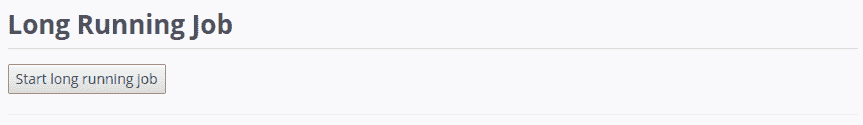

# 使用 Ruby on Rails 轻松管理视图中长时间运行的流程

> 原文：<https://medium.com/hackernoon/painlessly-managing-long-running-processes-in-your-views-using-ruby-on-rails-a83f57b51c31>

在 Rails 的 [Ruby](https://hackernoon.com/tagged/ruby) 中，目前还没有方便的或者自然的方式将信息从后端直接传输到视图中。当试图在后端传输关于长时间运行的进程的进度的信息时(例如图像的处理)，这尤其不方便。可以简单地使用 JavaScript 每隔几秒/几分钟发出一次 XHR/获取请求来请求更新的信息，但这与其说是一个实际的解决方案，不如说是一种变通方法。

这个问题已经被其他开发人员探索过了(例如[托马兹·格里什凯维奇在他关于“长生不老药”的单调](https://tg.pl/drab)的工作中)，普遍的共识似乎是使用 WebSockets 或 SSEs 来轻松可靠地将信息从后端实时转发到前端。

虽然 Ruby on Rails 确实为 WebSockets 提供了一个名为 Action Cable 的框架，但它并没有提供一种方便的方式来在流程状态改变时进行前端修改(这需要编写一个新的前端和后端代码集合)。此外，还需要为每个用户创建和管理单独的频道，以便将信息传递给他们。总的来说，这个过程是漫长的，需要标准化。

为了解决这些问题，Ruby on Rails 有一个前端框架叫做 [fie](https://fie.eranpeer.co) ，它通过一个永久的 WebSocket 连接在视图和后端之间同步应用程序的状态。如果你还没有使用过 [fie](https://fie.eranpeer.co) ，你可以使用“[快速入门](https://fie.eranpeer.co/start)将它安装到你的应用程序中，然后按照我之前发布的一个简单的教程进行操作，这个教程的标题是“[在没有 JavaScript 的情况下使用 Ruby on Rails 制作幻灯片”。](https://hackernoon.com/make-a-slideshow-using-ruby-on-rails-in-50-lines-of-code-and-no-javascript-9fdf0a88ec9d)

The Result

让我们深入研究如何在[域](https://fie.eranpeer.co)中模拟和管理长时间运行的流程。

你可能已经知道[命令器](https://fie.eranpeer.co/guide#commander)，它们被 [fie](https://fie.eranpeer.co) 使用，就像 Ruby on Rails 使用控制器一样。然而，由于长时间运行的进程是由位于 [fie 的](https://fie.eranpeer.co) commanders 外部的活动作业框架处理的， [fie](https://fie.eranpeer.co) 有另一个名为`[Manipulator](https://fie.eranpeer.co/guide#manipulator)`的特性，它为您的类注入了操纵用户视图状态的能力，就像 commander 一样。

通过将`[Manipulator](https://fie.eranpeer.co/guide#manipulator)`包含在您的类中，您为它们提供了对基本 [fie](https://fie.eranpeer.co) commander 方法的访问，这些方法包括用于查看和更改共享状态的`state`、`execute_js_function`用于从后端执行 JavaScript 函数，以及`commander_exists?`用于验证您想要操作其状态的 commander/client 是否仍然存在。

重新创建上面 GIF 中显示的示例的第一步是在控制器中定义实例变量(或整体状态),如下所示:

如您所见，创建了两个实例变量，并将用于以下目的:

*   `@long_job_progress`跟踪我们模拟的长时间运行的作业的进度，在初始化时该进度为 0/100。
*   `@is_long_job_running`，验证长时间运行的作业当前是否正在运行。如果我们不跟踪作业是否已经在运行，我们就有让相同的作业同时运行多次的风险，特别是如果视图不阻止用户出于这样或那样的原因多次触发它。

在控制器中初始化状态后，下一步是创建视图，向用户显示长时间运行的作业的进度:

根据作业是否已经运行，视图可能会显示两种情况中的一种(在`@is_long_job_running`实例变量中表示)。

1.  如果作业已经在运行，用户将会看到一个进度条，它等于`@long_job_progress`实例变量的当前值和最大值 100。因此，随着`@long_job_progress`值的改变，进度条也会改变。
2.  如果作业已经完成或尚未开始，用户将只看到一个按钮，提示他们开始长时间运行的作业。如果用户点击按钮，命令方法`start_long_job`将被触发。

由于该按钮当前正在触发我们的 commander 中一个名为`start_long_job`的方法，并且它还不存在，我们将创建它。它应该是这样的:

首先，如果作业当前正在运行，该方法简单地退出(通过空返回)。否则，`@long_job_progress`的值被重置为 0，并且通过将`@is_long_job_running`的值修改为真来将长作业设置为正在运行。然后，实际的作业通过它的`perform_later`方法被设置为异步运行。我们还将指挥官的标识符`@connection_uuid`传递给作业，以便指挥官可以操纵我们的指挥官/视图的状态。

现在让我们创建我们一直在等待的零件，实际的**作业**(在 app/jobs 文件夹中):

首先需要注意的是，我们包含了从`Manipulator`到`include Fie::Manipulator`的模块，以便能够访问修改作业状态所必需的方法。

一旦我们包含了`Fie::Manipulator`，下一步就是定义我们的作业的执行方法，该方法接受命令/视图的标识符`connection_uuid`作为参数。为了让`Fie::Manipulator`中包含的方法起作用，我们需要将实例变量`@fie_connection_uuid`定义为等于我们想要操作其状态的 commander/view 的`connection_uuid`。这样做之后，我们可以创建一个名为`is_job_finished`的 lambda 文本，它将告诉我们作业的进度是否超过 100。

根据作业是否已完成运行(意味着客户端断开连接或作业以≥ 100 的进度完成)，作业将完成两个操作之一。

1.  如果客户端仍处于连接状态(通过`commander_exists?`方法验证)并且作业仍在运行(通过调用`is_job_running`验证)，`@long_process_progress`的值增加 10，等待 1 秒后，作业再次运行。用户会看到他们的进度条变得更加完整。
2.  否则，`@is_long_job_running`的值被设置为假，这将通知应用程序的所有其他部分作业已经完成运行。当他们的进度条再次转换成按钮时，用户会看到这一点。

你可以在 https://fie.eranpeer.co/showcase#long-running-job 的[试试这个例子。](https://fie.eranpeer.co/showcase#long-running-job)

> 访问项目页面:[https://fie.eranpeer.co](https://fie.eranpeer.co)或[https://github.com/raen79/fie](https://github.com/raen79/fie)
> 
> 联系我或提问:[eran.peer79@gmail.com](mailto:eran.peer79@gmail.com)或[https://gitter.im/rails-fie](https://gitter.im/rails-fie)