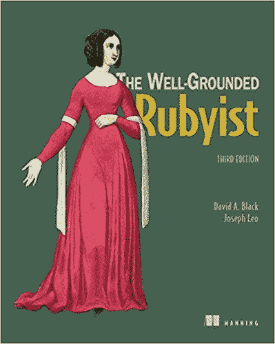

# 与一个非常有基础的 Rubyist 配对:大卫·a·布莱克访谈

> 原文：<https://medium.com/hackernoon/pairing-with-a-very-well-grounded-rubyist-interview-with-david-a-black-b8566cc3fe8f>

无论从哪方面来看，大卫·a·布莱克都是一位有成就的音乐家。他是**的作者，也是一名国际知名的软件开发人员、演讲者和活动组织者。他是 Ruby 标准库的贡献者，也是 Ruby Central，Inc .的创始人之一。**

*在 2U，我很幸运有机会和大卫一起工作，并把他称为我的搭档。最近，我和他坐在一起，进一步了解他的背景，他对 Ruby 社区的贡献，以及一些鲜为人知的事实。*

# ***你是如何发现红宝石的？***

*2000 年 11 月初，我在旧书店 Borders 看计算机部分。由迪夫·托马斯和安迪·亨特所著的《红宝石编程》一书刚刚出版。我在货架上看到的，很好奇这个“红宝石”是什么东西。我把它从架子上拿下来，打开，然后就爱上了它。*

*《鹤嘴锄》是第一本关于 Ruby 的英文书籍(已经有很多日文书籍了)，日本以外的 Ruby 社区很小，人们可以通过英文邮件列表和论坛很容易地认识其他人——我应该补充一点，许多日本 Ruby 爱好者，包括 Matz，都定期参加。记住，这是在 Ruby on Rails 之前；这个世界还没有来敲我们的门！尽管我认为社区会继续欢迎新的 ruby 爱好者。*

# *你最喜欢 ruby 的哪些特性？*

*这听起来很老套，但我最喜欢的“特色”是社区。我不再像过去那样纠结于此，但多年来，它一直是支持、友谊和灵感的巨大源泉。至于语言特性，很难确定哪些是我最喜欢的，但是我一直被 Ruby 对象的强大功能所吸引，singleton 类就是一个例子:每个对象(除了少数例外)都从它的类和模块祖先中获得它的功能，但是也可以用它特有的行为来修饰。对我来说有一些深刻的东西。我就不说了。*

# ***你认识马茨很久了。有好的马茨故事吗？***

*我告诉你我最喜欢的。早在 1995 年，我为 Linux 杂志写了一篇文章。一两年后，他们寄给我一份日文版的杂志，里面有我的文章。现在向前闪 5 到 6 年。我在一个会议上和 Matz 聊天，那时我已经认识他好几年了。"你为 Linux 杂志写了一篇关于 HyperNews 的文章吗？"他问我。“是的。”“我想是的，”他说。“我把它翻译成了日语。”*

*所以在我们真正相遇的几年前，我们就在出版领域相遇了！*

# *你的书的新版《扎实的 Rubyist》即将出版。你能告诉我那件事吗？*

**

*曼宁出版社将于 7 月出版第三版，对此我非常兴奋！这次我有一个合著者，我的好朋友乔·利奥。Joe 是 Def Method 的创始人和总裁，他正致力于用 Ruby 2.5 更新这本书。我们期待着新一波的读者群——想到这本书已经有近九年的历史记录，还会不断吸引新的 ruby 爱好者，真是太好了。*

*这本书是 MEAP (Manning Early Access Program)的一部分，这意味着你可以提前[看到章节](https://www.manning.com/books/the-well-grounded-rubyist-third-edition)并提供反馈。*

# ***是什么让你辞去学术界的工作，投身于软件开发？***

*这是一种完美的原因风暴，尽管是一种好的风暴。从 13 岁开始，我就把编程作为一种爱好，至少是断断续续的。在我发现 Ruby 之后，这已经变成了一种半专业的追求:到 2001 年，我已经在 Ruby 世界写了一些章节并组织了一些会议，2005 年，我与 Manning Publications 签订了合同，出版我的第一本 Ruby 书籍 *Ruby for Rails* 。说到 Rails——事实上，Rails 在 2004 年发布，在很多方面改变了 Ruby 的面貌，其中之一是，到 2005 年，人们可能对用 Ruby 谋生充满信心。那年秋天，我有一个长达一年的休假期，这是到目前为止最好的休假时间，因为我一整年都没有教学计划。所以在这个夏天，我做了一个决定。这是一个非常重大的决定。我在大学教了 13 年书，而且是终身教职。但是红宝石的诱惑太大了！*

*有趣的是，在我离开教学岗位后的最初几年，我几乎靠培训谋生。我想，一日为师，终生为师。*

# ***你对结对编程有什么想法？***

*长话短说:这是产生好代码的好方法，但是我不认为这是产生好代码的唯一方法。深度聚焦的单独编程，以及代码审查(总是！)，可以产生优秀的代码；有时它会带来配对不会带来的可能性。当我独自一人时，我的大脑以不同的方式工作，我不认为结对编程的存在是永久关闭我大脑那些部分的理由。*

# *你对测试驱动开发有什么想法？*

*我可能会因为这样说而惹上麻烦，但我一直认为自己更相信以测试为中心的开发，而不是测试驱动的开发，至少如果测试驱动被理解为严格的测试优先的话。我想要完整和彻底的测试覆盖，但是我不认为你写的每一行代码在你写之前都必须有一个失败的测试。如果你在测试中领先，你需要尽快赶上。但是有时候，这可能也是我的大脑工作的方式，在我开始写测试之前，我至少需要一些框架来充实。*

*然而，严格的测试优先开发能够以一种非常强大的方式清理蜘蛛网。以及“乒乓”式的配对(你写一个测试，我让它通过；我写下一个测试，等等。)可能是我最喜欢的结对编程模式。*

*请注意，有时候在编写代码之前编写一整套测试是有意义的。Hal Fulton 和我在为 Ruby 编写 scanf 时就是这么做的，这是一个私有代码项目，成为了 Ruby 标准库的一部分。只需尝试用任何语言编写 scanf，而不需要事先进行大量测试，您就会有一种感觉了！*

# *你有电影研究的博士学位。你有没有发现你的电影背景适用于软件？*

*不是直接的——但是当我开始培训程序员时，我的教学经验确实有所帮助。我的学术背景也意味着我带着丰富的写作经验进入这个新的职业，包括一本书以及许多学术文章和书籍章节。在 [2U](https://www.youtube.com/watch?v=aI4ZVlyrRZc]) ，我深深地沉浸在在线教育工程中，我的教授背景为这项工作增添了另一个有趣的维度。*

*真正不可思议的是，《T4》第三版的合著者乔·利奥，这位有着扎实基础的评论家，拥有 NYU 大学电影研究的硕士学位——我也是在这个系获得博士学位的。我远在他的时代之前！*

# ***关于编程行业，你有什么想改变的吗？为什么？***

*有很多事情，但我将集中在一个。我在业内读到和听到很多关于年龄歧视的事情。我一直很幸运；我在 45 岁左右开始以编程和培训为生，但没有年龄偏见的问题。但我看到了足够多的证据，知道这是一个非常现实的问题。我从不隐瞒自己的年龄——我的出生日期和年份都在 LinkedIn 上——我只能希望，雇佣我显然没有导致任何公司倒闭的事实，可能会成为未来其他公司的榜样。*

# *有你崇拜的程序员吗？*

*当然，有很多我钦佩的人。出于某种原因，我想到的第一个回答这个问题的人是已故的伟大的吉姆·威里奇。他是一个鼓舞人心的人，是我见过的拥有时间和专业知识的最慷慨的人之一。他当然因为 Rake 而被人们记住，但从 2000 年到 2014 年他过早去世，他也是 Ruby 世界结构中至关重要的一部分。*

*我将把我对这个问题的回答作为对吉姆的敬意。我非常想念他。*

# *关于你，有什么鲜为人知的事实？*

*我并不把它作为一个大秘密，但是很多人可能不知道我是一个受过专业训练的大提琴手。高中毕业后，我在苏格兰住了两年，学习大提琴。奇怪的是，在很少玩了几年后，我现在又开始玩了。敬请期待！*

> *纽约市的高级、首席或主要开发人员？[跨步招人](https://www.stridenyc.com/careers)！想要提升你的技术团队？[看我们怎么做](https://www.stridenyc.com/our-work)！[www.stridenyc.com](http://www.stridenyc.com/)*

**原贴于* [*跨步博客*](https://www.stridenyc.com/blog/pairing-with-a-very-well-grounded-rubyist-interview-with-david-a.-black) *。作者:* [*琳达·冈萨雷斯*](https://www.linkedin.com/in/lingonzalez/)*