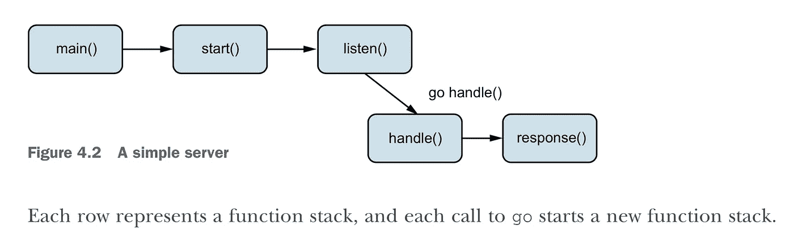
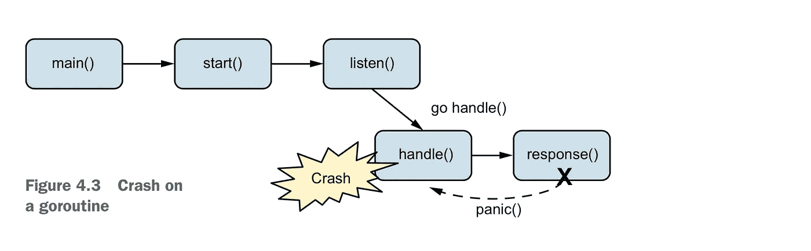
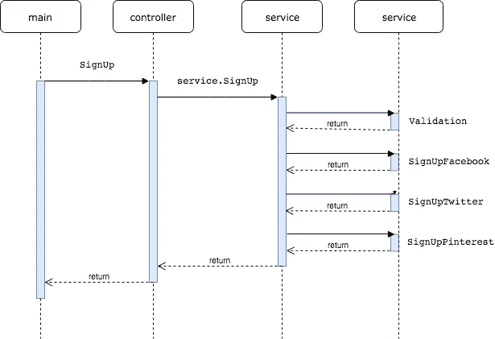
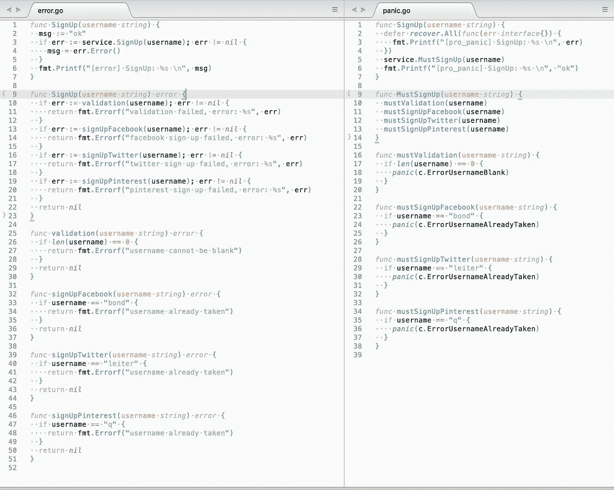

# 像专业人士一样恐慌

> 原文：<https://medium.com/hackernoon/panic-like-a-pro-89044d5a2d35>

## 高级 Go 紧急编程


I do it cause I need to…

## 先决条件

本文期望你已经熟悉了`golang`、`panic`、&、`recover`函数以及任何其他具有`exceptions` ( `try-catch`)概念的编程语言。

## 介绍

你可能已经在[的小围棋书](https://www.openmymind.net/The-Little-Go-Book/)里看到过这样的东西:

> Go 处理错误的首选方式是通过返回值，而不是异常

也许你已经看过 go wiki 上的“ [CodeReviewComments](https://github.com/golang/go/wiki/CodeReviewComments#dont-panic) ”页面，上面写着:

> 不要使用 panic 进行正常的错误处理。使用错误和多个返回值

还有，你可能已经看过“[有效围棋](https://golang.org/doc/effective_go.html#panic)”的文章，其中说:

> 向调用者报告错误的通常方式是将错误作为额外的返回值返回

此外，你可能已经在戴夫·切尼的博客文章“[为什么 Go 会有例外](https://dave.cheney.net/tag/panic)”上看到过，文章说:

> 当你在围棋中惊慌失措时，你会吓坏，这不是别人的问题，而是人类的游戏

可能感觉恐慌是在自己的项目中最好避免的事情…
但这是否意味着没有人使用恐慌？
一起来看看吧！让我们对流行的`go`项目运行下一个命令，看看恐慌是否是没有人使用的东西:

```
grep "panic(" -r --include=*.go . | wc -l
```

结果:

```
+-------------+-----------------+
| name        | count of panics |
+-------------+-----------------+
| [go](https://github.com/golang/go)          |            4050 |
| [kubernetes](https://github.com/kubernetes/kubernetes)  |            4087 |
| [gin](https://github.com/gin-gonic/gin)         |              46 |
| [prometheus](https://github.com/prometheus/prometheus)  |             693 |
| [terraform](https://github.com/hashicorp/terraform)   |            1161 |
| [echo](https://github.com/labstack/echo)        |              14 |
| [dep](https://github.com/golang/dep)         |             157 |
| [gorilla mux](https://github.com/gorilla/mux) |               9 |
| [mysql](https://github.com/go-sql-driver/mysql)       |               5 |
| [pq](https://github.com/lib/pq)          |              46 |
+-------------+-----------------+
```

嗯…

## 如何与之共存

乍一看，文档、书籍和文章说不要使用恐慌，这可能会让人感到困惑，但现实是另一回事，我们可以在任何地方看到恐慌…

希望你会同意恐慌不是简单地说“使用或不使用”的想法。

因此，让我们尝试更深入地了解恐慌的光明面和黑暗面的界限在哪里，为什么 github 上有这么多恐慌，为什么所有的书籍和文档都不喜欢恐慌。

## 什么是恐慌

[官方文件](https://golang.org/pkg/builtin/#panic)说:

> panic 内置函数停止当前 goroutine 的正常执行

“[panic Andre recover](https://github.com/golang/go/wiki/PanicAndRecover)”维基页面说:

> panic 和 recover 函数的行为类似于其他一些语言中的异常和 try/catch

而“[以身作则](https://gobyexample.com/panic)”也说:

> 恐慌通常意味着出现了意想不到的问题。大多数情况下，我们使用它来快速失败在正常操作期间不应该发生的错误

好的…现在感觉恐慌就像其他语言中的异常，这解释了前面提到的 github 项目中的大量恐慌。

但是如果你看过戴夫·切尼的博客文章“[为什么 Go 会有例外](https://dave.cheney.net/tag/panic)”，你可能会看到:

> 你可能会认为恐慌和呕吐是一样的，但是你错了

这意味着恐慌和其他语言中的`throw exception`有一点点不同，有自己的优点和缺点。

## 优势

1.  像其他语言中的`throw exception`一样，停止程序执行并将堆栈展开到顶层函数调用。
2.  不需要处理多个返回值，不需要写无聊的检查:`if err != nil { // handle error }`。
    因此——代码更容易阅读。

## 不足之处

1.  如果你不做`recover`，将会停止程序。
2.  当`go`执行展开堆栈时，它会收集整个调用堆栈的信息，这可能会很慢。
3.  函数`recover`返回`interface{}`，您必须对获得的值执行类型检查，这可能会很慢(尤其是在反射的情况下)。而且不像其他语言中的`catch`确定`exception`。
4.  在`goroutine`死机的情况下，功能`recover`不会停止死机。这也不是其他语言中的传统方式。

## 何时使用恐慌

现在很明显，恐慌是锋利的*工具，你在使用它之前必须三思。并解释了简介部分提供的所有注意事项。

又“[有效走](https://golang.org/doc/effective_go.html#panic)说:

> 一个可能的反例是在初始化期间:如果库真的不能自我设置，那么恐慌是合理的

如果你遇到由于某些情况而无法继续执行的情况，你可能会惊慌地停止程序。

## 又多了一个使用恐慌的理由

我相信，如果您正在构建具有复杂业务逻辑和分层架构(此外，支持领域驱动设计)的 reach 应用程序，您必须使用 panic。你可能讨厌我，但我相信这是唯一不会陷入错误处理和拥有清晰业务逻辑的方法。

## 到处都是恐慌

首先，引言部分提供的数字意味着我们总是必须处理恐慌(即使我们没有在代码中明确使用恐慌)
因为下游的某些东西可能会恐慌，甚至语言本身也可能会恐慌，为了避免程序停止，我们必须有恐慌处理程序(`recover`)。
如果项目有用户界面(从用户/其他服务获取命令/请求，并提供结果/响应),这也非常重要，因为我们必须始终以确定的消息格式提供结果/响应，即使是在未处理的严重错误的情况下。
所以在`main.go`中，我们必须有这样的东西:

```
func main() {
    defer func() {
        if r := recover(); r != nil {
            // handle panic
        }
    }()
    // ...
}
```

这只是一个简单的例子，但是你可以在这里阅读更多关于`defer-recover` [的内容。](https://blog.golang.org/defer-panic-and-recover)

同样重要的是，承认你必须有`defer-recover`，以防你开始新的`goroutine`，否则你将无法处理`goroutine`带来的恐慌。
您可能会在“处理错误和恐慌”一章的“[练习](https://www.amazon.com/Go-Practice-Techniques-Matt-Butcher/dp/1633430073)”一书中读到更多相关内容，这里我将提供一些最有趣的图片:



Normal flow.



Panic.

## 语法糖

一旦你开始更频繁地使用恐慌，你也必须更频繁地执行`recover`，并且有目的地以稍微愉快的方式去做，你可以使用类似于[恢复](https://github.com/thepkg/recover)的包。此产品包背后的主要思想是简化紧急恢复，并提供以以下方式执行恢复的机会:

您可能会发现这种语法与其他语言中的传统方式`catch exception`非常相似，但是这种方法的主要目标是简单明了，并且易于阅读、理解和预测代码块的行为。

## 比较

让我们比较两种方法:1 —返回错误，2 —死机。
为了比较，让我们用一个简单的例子:假设我们有:
1) `facade` —在 facebook、twitter 和 pinterest 上创建用户的服务。调用 facade 服务，检查错误并打印结果。
序列图看起来是这样的:



## 实施#1

在这里你可以看到控制器中的超级简单函数`SignUp`，它调用`service.SignUp`然后检查服务错误并打印结果(一切都清晰、简单和直接)。

众所周知，这段代码习惯于处理`go`中的错误。而且很棒！

但是说到服务，你会发现很多重复的代码，感觉好像有什么地方出错了…

(这里可以找到源代码[)。](https://github.com/cn007b/eop/tree/master/src/app/examples/error)

## 实施#2

这里你可以看到控制器中同样的函数`SignUp`，它调用`service.MustSignUp`然后执行`recover`(通过[恢复](https://github.com/thepkg/recover)包)并打印结果(同样的流程)。
如果你看一看服务，你可能会发现现在它看起来更短更简单，更容易阅读和理解这样的业务逻辑。

但是这个代码在`go`是被禁止的，原因如前所述…

(你可以在这里找到源代码[)。](https://github.com/cn007b/eop/tree/master/src/app/examples/pro_panic)

## 真的很糟糕吗

从技术上来说，这两种实现是相同的，并提供相同的功能、相同的错误和相同的结果(你可以在这里查看)。
但是关于代码量，很明显第二个更简单，你可以在下图中看到:



此外，第一个实现没有`recover`，但它应该有，因为每个用户友好的项目都必须有 recover，这意味着第一个实现将有更多的代码。

## 它慢吗

对这样的小例子进行基准测试可能看起来很傻，但无论如何，让我们看看它看起来如何，并找出我们是否有倾斜的数字:

```
+---------------------------------+----------+----------+
| case                            | imp. #1  | imp. #2  |
+---------------------------------+----------+----------+
| error: username cannot be blank | 53000 ns | 45000 ns |
| error: username already taken   | 51000 ns | 46000 ns |
| ok                              | 32000 ns | 34000 ns |
+---------------------------------+----------+----------+
```

看起来在出错的情况下会更快，但在成功的情况下— `recover`会产生一些开销…
请注意，所有提供的数字都以纳秒为单位表示时间，
这意味着:对于这种特殊的情况，我们在两种方法之间没有太大的区别…

(你可以在这里找到与这个基准测试[相关的源代码)。](https://github.com/cn007b/eop/blob/master/src/app/main.go)

## Go 2 草稿

你可能已经知道在`go 2`中，错误处理将通过`check-handle`组合得到改进(如果没有，请[看一看](https://go.googlesource.com/proposal/+/master/design/go2draft-error-handling-overview.md))，它将以真正优雅的方式简化一切！但是它有助于构建复杂的分层应用程序吗？
答案是肯定的，对于像我们这样非常简单的应用程序(控制器服务)，但不幸的是，对于大型应用程序，尤其是支持域驱动设计的应用程序来说`check-handle`没有用，
我相信您仍然必须使用 panic…

## 结论

这篇文章的重点是要表明恐慌只是一种工具，你不必害怕这种工具，你必须知道何时以及如何使用恐慌…
一旦你知道了这种工具的优点和缺点，你就可以决定是否使用它。

## 附言（同 postscript）；警官（police sergeant）

你可以在这里找到演示项目的分层架构(不是 DDD，而是许多层),这是建立在恐慌无处不在的想法，也许它会是说明性的。

此外，您可以在这里找到更多使用这两种方法的例子`errors vs panic` 。

如果您不喜欢恐慌，您可能会发现另一种方法如何以另一种方式简化错误处理。