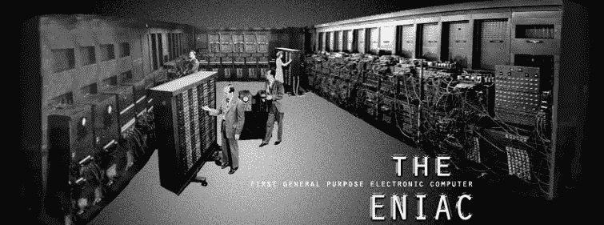
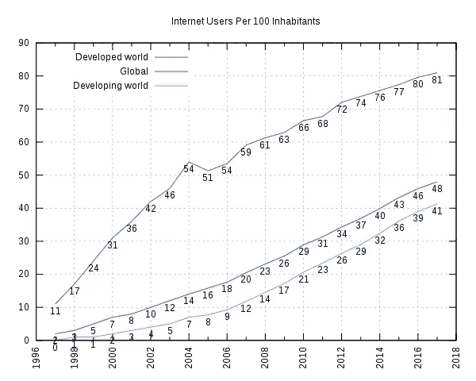
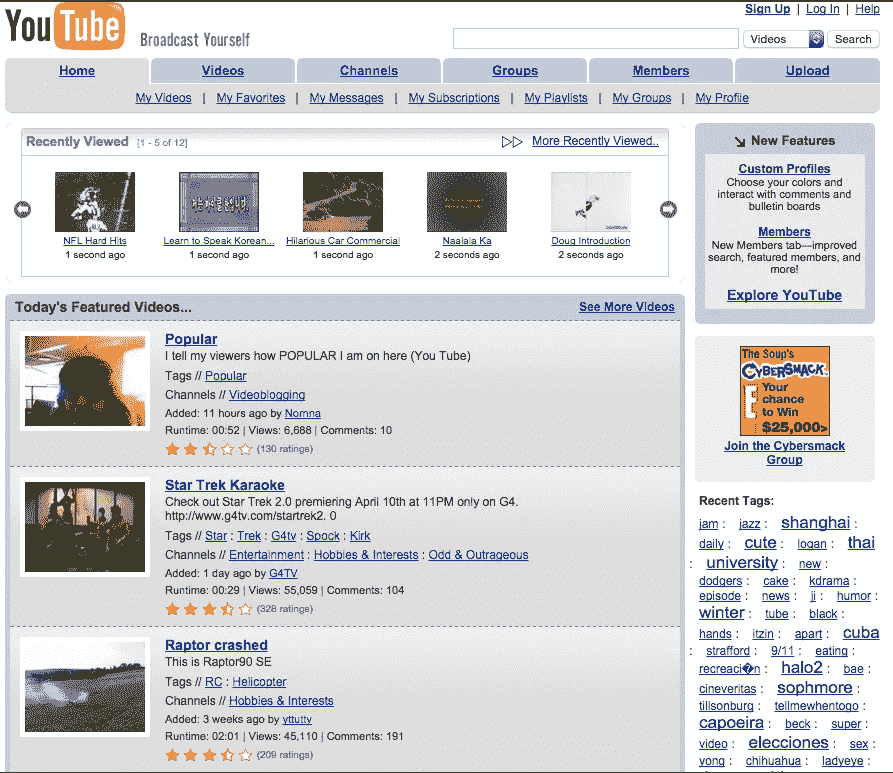
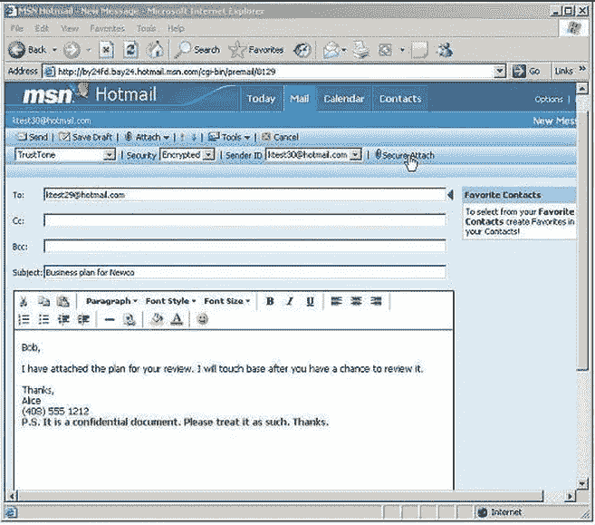
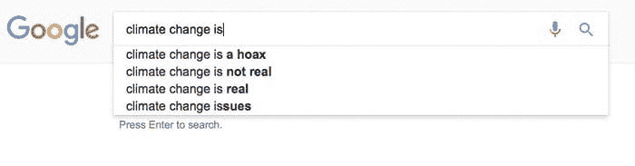
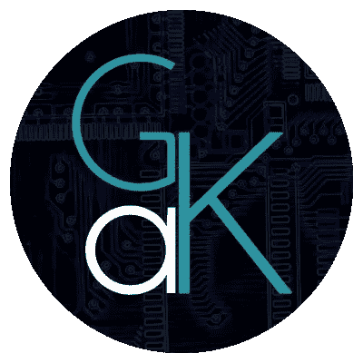

# 范式转变:从 Web1.0 到 Web3.0

> 原文：<https://medium.com/hackernoon/paradigm-shift-from-web1-0-to-web3-0-6b7bfae72a69>

# 介绍

> 亲爱的读者:
> 
> 这是我参加的[状态社区竞赛](https://blog.status.im/announcing-status-community-competitions-inaugural-contest-db7769c767b7)。
> 
> 大约在 2016 年底，我开始了解区块链科技。2017 年 10 月，在相信我知道的已经足够公开表达我的观点后，我决定发一个帖子 ***批评*** 如何每个人都想在任何地方使用区块链，甚至在不存在的用例上。
> 
> 从那以后，我一直在写关于区块链的技术问题，试图简化复杂的术语并向公众解释。
> 
> 这个帖子会不一样。我不会去研究任何区块链的行话，也不会试图解释以太坊或任何其他加密货币是如何工作的。
> 
> 相反，我将首先提醒你关于网络的历史，直到今天。
> 
> 然后，我将在不久的将来创造一个故事，区块链技术已经以如此无缝的方式融入我们的生活，就像 2018 年的互联网一样。
> 
> 如果你只是想阅读我对未来的虚构幻想，请随意跳到最后一节“超越 web 3.0——展望未来”
> 
> 享受吧。

# Web1.0

ENIAC was as big as a room

与今天的掌上电脑(你正在阅读这篇文章的智能手机)相反，20 世纪 50 年代左右的电脑是巨大的设备，可以装满整个房间，只有科学家或学者才能使用。“*互联网”、*更别说*“点对点*网络”这个名词，在当时甚至还不是一个概念。

大约在 1969 年，[国防高级研究计划局(DARPA)](https://en.wikipedia.org/wiki/DARPA) 启动了一项名为 [ARPANET](https://en.wikipedia.org/wiki/ARPANET) 的军事研究计划，该计划促进了美国军事研究人员之间超级计算机的共享。阿帕网是今天互联网的前身。

快进到 1993 年，第一款 GUI 浏览器 [NCSA Mosaic](https://en.wikipedia.org/wiki/Mosaic_(web_browser)) 发布。1995 年，网景浏览器发布，标志着互联网开始成为主流。

[https://en.wikipedia.org/wiki/Global_Internet_usage](https://en.wikipedia.org/wiki/Global_Internet_usage)

# Web2.0

网络的下一次迭代带来了谷歌、脸书和亚马逊等企业互联网巨头的崛起。此外，电子银行服务开始变得可用，允许电子跨境支付。像维基百科、YouTube 这样的网站成为了寻找信息的标准场所(*或搞笑视频*)。

向当今热门网站的祖先致敬:

Youtube and MSN Hotmail, try to hold your tears of nostalgia

脸书和社交媒体允许任何人与世界各地的其他人联系，彻底改变了社交关系的建立和维持方式。亚马逊最初是一家图书公司，现在几乎什么都卖，从图书到云服务。谷歌和其他搜索引擎是主要参与者，因为它们允许对每天出现的大量网站进行索引和快速访问。

## Web2.0 为大众带来了以前没有的高效用服务。但是代价是什么？

> “如果你不为产品付费，那么你就是产品”

当使用任何类型的集中式服务时，您会遇到以下情况(这不是一个详尽的列表):

1.  任意更改[服务条款](https://en.wikipedia.org/wiki/Terms_of_service)
2.  服务正在关闭
3.  操纵(例如，扭曲的搜索结果)
4.  审查制度
5.  用于更“个性化”广告的数据“见解”——非常侵犯隐私

Google search suggestions about climate change

> 尽管 Web2.0 产生了大量的效用，但它也将你的“数字权利”委托给了服务提供商。

# Web3.0

> "泰晤士报*03/1/2009 财政大臣*处于第二轮银行救助的边缘."

这是大约 9 年前创建的比特币的[创世纪区块附带的说明。比特币彻底改变了金融。不久之后，人们意识到区块链的用处不仅仅是钱。](https://en.bitcoin.it/wiki/Genesis_block)

使用案例包括:

*   身份服务(域名注册、产权注册)
*   物流(供应链跟踪)
*   众筹
*   投机
*   社会化媒体
*   预测市场
*   物联网
*   投票
*   ……清单还在继续

有必要以一种透明、不可信的方式进行计算，不受审查和权力集中的影响。

通过利用比特币的脚本语言在比特币区块链上存储额外的数据，这种需求在一定程度上得到了所谓的彩色硬币的满足，彩色硬币是建立在比特币之上的层。

> 比特币是开场表演。那是 Web3.0 的开端。

对区块链上更复杂的通用计算的需求最终催生了以太坊等项目，这些项目以智能合约为特色，并创造了术语去中心化应用(DApps)。

在过去的几年里，以太坊的 DApps 有了很大的发展。

智能合约始于简单的代码，目的是在以太坊区块链上存储一些价值，作为存在的证据。

然后，它们开始被用作货币，ERC20 规范成为以太坊网络上创造新货币(代币)的标准。

随之而来的是一系列的创新，如分散自治组织(DAOs)或分散交易所(DEX)的概念。

然而，无论使用案例和潜在优势有多么巨大，当今的 DApps 仍然受到诸多问题的困扰，其中包括:

1.  糟糕的用户体验——没有没受过教育的用户，只有糟糕的 UX。
2.  糟糕的可扩展性——是的，又是 CryptoKitties。以及消耗大量能源的证据。
3.  糟糕的安全性——可以被黑客攻击的东西，如果有足够的收益，就会被黑客攻击(提示:TheDAO，平价钱包)
4.  不存在的隐私——有些人实际上仍然关心那件事。

只要这些问题仍然存在，区块链就不可能有自己的“网景时刻”，而不仅仅是企业家的时髦词汇，cypherpunks 的不信任交易方式和开发商的混乱。

# 超越 web 3.0——展望未来

当“网景时刻”发生时会发生什么？现在，我将带您度过未来典型的一天，在这一天，使用 DApps 是我们日常生活的一部分。

> 注意:我很确定我的故事受到了我曾经读过的一个类似的 reddit 评论的很大影响。我真的很难找到它，但无济于事，所以如果你认为它让你想起了什么，你有一个来源，请让我知道！
> 
> 声明:为了专注于一个社区，我将在我的故事中使用纯以太坊项目，这并不意味着另一个项目能够/不能够实现类似或甚至更好的结果。
> 
> 故事将有以下几个项目(同样，这不是一个详尽的列表):[状态](http://status.im/)、[假人](https://golem.network/)、[雷电](https://raiden.network/)、[阿拉贡](https://aragon.one)、[制造者](https://makerdao.com/)、[基本注意力令牌](https://basicattentiontoken.org/)、[请求网](https://request.network/)、 [Funfair](https://funfair.io/) 。

## 时间是 2040 年。

你早上 8:00 醒来，开始准备早餐。

通知在你的智能手机上弹出，你昨晚放上去渲染的 3D 模型刚刚完成。42 GNT 从你的雷电支付渠道被扣除；1337 台计算机共享它们的计算能力，一起工作来完成你的任务，等等。下个月你不会做任何其他的 3D 设计工作，所以你关闭了支付渠道，为你上个月使用的渲染服务支付了总共 2000 GNT。

你还需要为下一次 DAO 投资做一些与身份相关的文书工作(法律也有所进步，但纸张仍然是王道)。你坐上你的电动车，开始向市政厅驶去。不幸的是，它的电池只有 30%。你的车(堵车的时候；这将永远得不到解决)向分散能源市场提出请求，并以很少的费用从你旁边的汽车获得它所需的电池寿命。

一到达市政厅，你就用你的身份证核实你的身份，并存入 1000 元作为你投资的公司的初始股份。立即允许你对下一个董事会决议进行投票。

接下来，你会得到关于第 20 版[“掌握以太坊”的发布通知，作者安德烈亚斯·安多诺普洛斯](https://www.amazon.com/Mastering-Ethereum-Building-Smart-Contracts/dp/1491971940)。快速浏览到 [OpenBazaar](http://v) 你用乙醚买的。

你有一些空闲时间，所以你决定从事你的自由职业。完成所有订单后，你发送请求(这是`invoice`的新术语),并以 REQ 形式获得你所有辛勤工作的报酬。

然而，REQ 的表现一直不太好，有传言称，它可能会在接下来的一周内波动高达 0.4%(多亏了 Maker 和 Digix，当时大多数加密货币都是稳定的硬币，任何高于 0.25%的波动都被认为是危险的)

使用你最喜欢的 DEX，你可以立即用 REQ 换另一个你喜欢的硬币。一切都在几毫秒内发生，因为由于在利害关系算法证明方面的科学突破，几乎瞬间达成了共识。

现在已经很晚了，所以你决定和朋友出去玩，听听 Gramatik 的最新专辑，你拿着 GRMTK 硬币来支持它。或者，你在你最喜欢的视频托管平台上观看内容，并通过给内容创作者小费来支持他们。或者，如果你是赌博型的，你在游乐场上打开一个命运频道，然后旋转那个被证明是公平的轮盘赌。

上述行为所需的所有交互、支付和通信都是通过状态应用程序进行的，该应用程序与以太坊生态系统无缝集成，其使用规模与微信在“密码天启”之前(约 2034 年，中国采矿业崩溃后)在中国的使用规模相同。由于 ZK-斯纳克法案，所有交易都是保密的。量子计算机仍然需要几十年的时间，Shor 的算法仍然不能分解超过 3 位数的数字。

没有中间人。分散的。免费的。

我们是 Web3 的开端。

# 结论

就是这样！我希望你喜欢历史回顾，以及我想出的小虚构故事。

非常感谢 Status 让我参加这次比赛。祝所有参与者好运。

> 记住我们现在所处的位置，这可能是一个历史转折点。

## 无耻的插头

我来自希腊，主修电子和计算机工程。我对信息安全、现代商业中的区块链研究和应用以及自动驾驶汽车感兴趣。了解更多我在 gakonst.com 做的事情

如果你喜欢这篇文章的内容，并想了解我工作的最新进展，请在[媒体](/@gakonst)和[推特](https://twitter.com/gakonst)上关注我