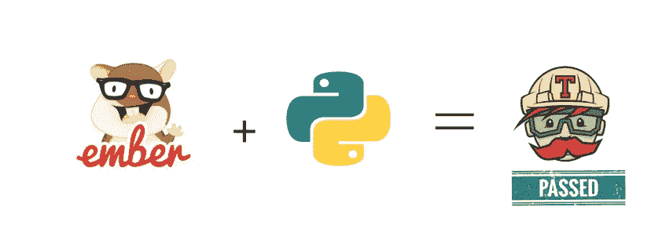
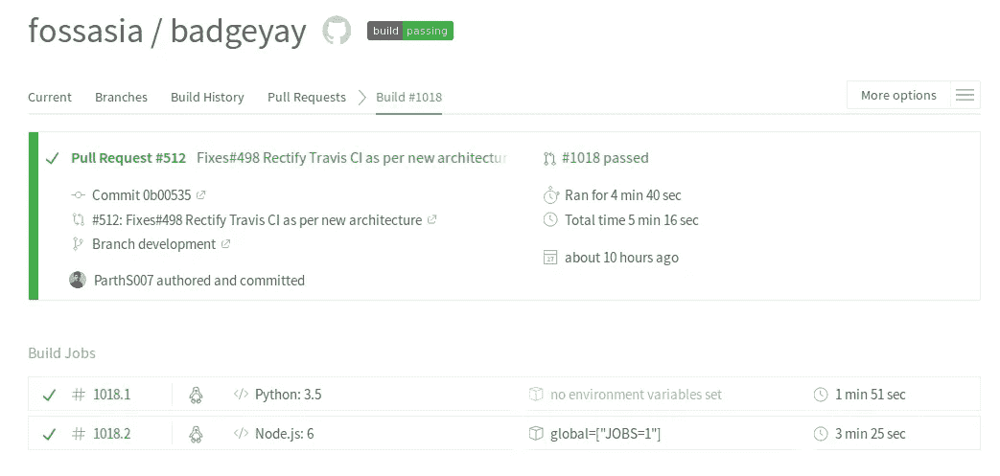

# 在 Travis CI 中并行构建

> 原文：<https://medium.com/hackernoon/parallelizing-builds-in-travis-ci-9d913e5722eb>



Ember JS + Python

一点背景:在过去的几个月里，我一直在开源组织 [FOSSASIA](https://github.com/fossasia) 中做贡献，在那里我从事一个名为 [BadgeYaY](https://github.com/fossasia/badgeyay) 的项目。这是一个徽章生成器，具有简单的 web 用户界面，可以添加数据并生成 PDF 格式的可打印徽章。

[Badgeyay](https://github.com/fossasia/badgeyay) 项目现在分为两部分，Ember JS 的前端和用 Python 编程的 REST-API 的后端。现在，一个具有挑战性的工作是，它应该支持非耦合架构。因此，它应该利用**隔离的**并行构建，在隔离的实例上运行前端和后端测试，即两种不同语言的测试。

在这篇博客中，我将讨论在我的 [Pull 请求中，我如何配置 Travis CI 在](https://github.com/fossasia/badgeyay/pull/512) [Badgeyay](https://github.com/fossasia/badgeyay) 的隔离并行构建中并行运行测试。

首先，让我们了解什么是[并行 Travis CI](https://docs.travis-ci.com/user/speeding-up-the-build/) 构建，以及我们为什么需要它。然后我们将继续配置 travis.yml 文件来并行运行测试。让我们开始，一步一步了解。

为什么并行 Travis CI 构建？

集成测试套件倾向于通过包含前端和后端的整个堆栈来测试更复杂的情况，它们同样倾向于成为最慢的部分，需要不同的时间来运行，有时甚至长达 30 分钟。为了加速这样的测试套件，我们可以利用 Travis build matrix 特性将它分成几个部分。Travis 将根据环境变量决定[构建矩阵](https://docs.travis-ci.com/user/build-stages/matrix-expansion/)，并安排运行两个构建。

现在我们的目标很明确，我们必须配置 travis.yml 来构建 parallel-y。我们的项目需要两个构建包，Python 和 node_js，运行这两个构建包的构建作业将会大大加快速度。现在似乎可以使用 [*矩阵:include*](https://docs.travis-ci.com/user/customizing-the-build/) 特性在一个. travis.yml 文件中运行多种语言。

下面是 [Badgeyay](https://github.com/fossasia/badgeyay) 项目的 [travis.yml](https://github.com/fossasia/badgeyay/blob/development/.travis.yml) 文件的代码片段，以便以并行方式运行构建任务。

```
sudo: required
dist: trusty# check different combinations of build flags which is able to divide builds into “jobs”.
matrix:# Helps to run different languages in one .travis.yml file
 include:# First Job in Python language.
 — language: python3apt:
 packages:
 — python-devpython:
 — 3.5
 cache:
 directories:
 — $HOME/backend/.pip-cache/

 before_install:
 — sudo apt-get -qq update
 — sudo apt-get -y install python3-pip
 — sudo apt-get install python-virtualenvinstall:
 — virtualenv -p python3 ../flask_env
 — source ../flask_env/bin/activate
 — pip3 install -r backend/requirements/test.txt — cache-dirbefore_script:
 — export DISPLAY=:99.0
 — sh -e /etc/init.d/xvfb start
 — sleep 3script:
 — python backend/app/main.py >> log.txt 2>&1 &
 — python backend/app/main.py > /dev/null &
 — py.test — cov ../ ./backend/app/tests/test_api.pyafter_success:
 — bash <(curl -s [https://codecov.io/bash)](https://codecov.io/bash))# Second Job in node js language.
 — language: node_js
 node_js:
 — “6”addons:
 chrome: stablecache:
 directories:
 — $HOME/frontend/.npmenv:
 global:
 # See [https://git.io/vdao3](https://git.io/vdao3) for details.
 — JOBS=1before_install:
 — cd frontend
 — npm install
 — npm install -g ember-cli
 — npm i eslint-plugin-ember@latest — save-dev
 — npm config set spin falsescript:
 — npm run lint:js
 — npm test
```

现在，我们已经添加了 travis.yml 并将其推送到项目存储库。下面是并行构建作业后传递 Travis CI 的屏幕截图。



该工作的相关拉动需求为 https://github.com/fossasia/badgeyay/pull/512

至此，我已经结束了关于在 Travis CI 中并行化构建的讨论。我写这篇文章是为了解决 BadgeYaY 项目中的这个问题。如果你喜欢这篇文章，可以考虑看看我在 GitHub 上的其他作品🙂。

来源: [Travis CI 文档](https://docs.travis-ci.com/user/customizing-the-build/)

PS:非常想要建设性的批评。🙂