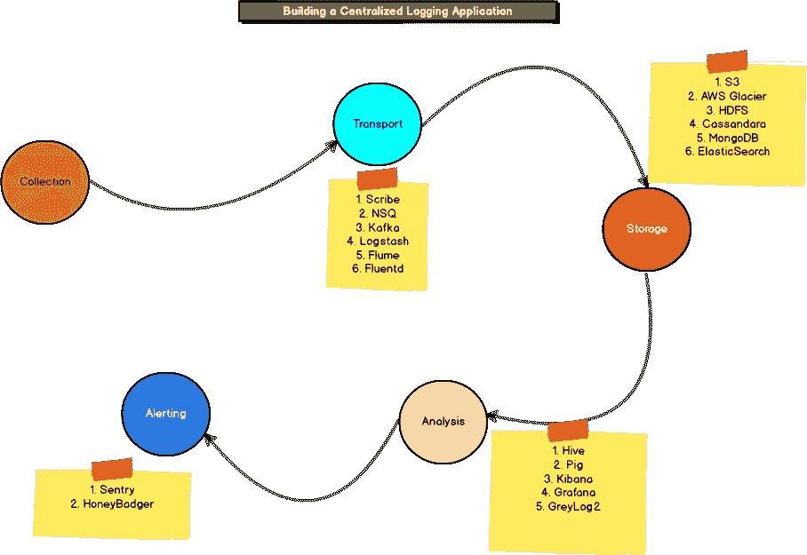

# 第 1 部分:构建集中式日志应用程序

> 原文：<https://medium.com/hackernoon/part-1-building-a-centralized-logging-application-5a537033da0a>

Photo by [Lysander Yuen](https://unsplash.com/photos/BY66BwIa9Bg?utm_source=unsplash&utm_medium=referral&utm_content=creditCopyText) on [Unsplash](https://unsplash.com/search/photos/central?utm_source=unsplash&utm_medium=referral&utm_content=creditCopyText)

日志是任何系统的重要组成部分，当发生错误时，它们可以让您深入了解您的应用程序、您的系统正在做什么以及导致错误的原因。几乎每个系统都以某种形式生成日志，这些日志被写入本地磁盘上的文件中。当您构建企业级应用程序时，您的系统会运行在多个主机上，管理多个主机上的日志可能会很复杂。跨数百台服务器上的数百个日志文件调试应用程序中的错误非常耗时且复杂。解决这个问题的一个常见方法是构建一个集中式日志记录应用程序，它可以在一个中心位置收集和聚合不同类型的日志。

有许多[工具](https://hackernoon.com/tagged/tools)可以解决部分问题，但是我们需要使用所有这些工具来构建一个健壮的应用程序。

集中式日志应用程序共有四个部分——日志收集、传输、存储和分析。我们将深入研究每个部分，看看如何构建一个应用程序。

Flow of Logging Application

# 收藏品

所有的应用程序都以不同的方式创建日志，一些应用程序通过 syslogs 记录日志，而另一些应用程序直接在文件中记录日志。当您看到一个典型的 web 应用程序运行在 Linux 服务器上时，在`/var/log`中会有十几个日志文件，在主目录和其他位置也会有一些特定于应用程序的日志。基本上，不同的应用程序会在不同的地方生成日志。

现在，假设您有一个在服务器上运行的 web 应用程序，如果出现故障，您的开发人员或运营团队需要快速访问日志数据，以便对实时问题进行故障排除，您将需要一个能够几乎实时监控日志文件变化的解决方案。要解决这个问题，您可以遵循复制方法，

*   **复制方式:** 在复制方式中，文件按照固定的时间表被复制到中央服务器。您将设置一个 cron 作业，将 Linux 服务器上的文件复制到中央服务器。当您的站点停机时，一分钟的 cron 作业可能不足以快速排除故障，您将等待复制相关的日志数据。

复制方法有利于分析，如果您需要离线分析日志数据以计算指标或其他批处理相关工作，复制方法可能是一个不错的选择。

# 运输

如果有多台主机在运行，日志数据可能会迅速积累。应该有一种高效可靠的方法将这些数据传输到集中式应用程序，并确保数据不会丢失。

有许多框架可以用来传输日志数据。一种方法是直接插入输入源，框架可以开始收集日志，另一种方法是通过 API 发送日志数据，编写应用程序代码以直接记录到这些源，这减少了延迟并提高了可靠性。

如果您想要提供一些输入源，您可以使用:

*   [Logstash](https://www.elastic.co/products/logstash) —开源日志收集器，用 Ruby 编写
*   [Flume](http://flume.apache.org/) —开源日志收集器，用 Java 编写
*   还有，[fluent d](https://www.fluentd.org/)——开源，用 Ruby 写的

这些框架提供输入源，但也支持本地跟踪文件并可靠地传输它们。这些框架更适合更一般的应用。

要通过 API 记录数据，这通常是将数据记录到中央应用程序的更好方式，可以使用以下框架。

*   [Scribe](https://github.com/facebookarchive/scribe) —脸书的开源软件，用 C++编写
*   [nsq](https://github.com/nsqio/nsq) —开源，用 Go 编写
*   还有，[Kafka](https://github.com/apache/kafka)——你可能听说过 Kafka，这是一个被 Apache 广泛使用的开源软件，用 Java 编写

这是关于传输的，现在让我们看看存储如此大量日志数据的有效方法。

# **存储**

现在我们有了传输工具，日志将需要一个目的地，一个保存所有日志数据的存储器。该系统应该是高度可扩展的，因为数据将不断增长，它应该能够处理随着时间的推移增长。日志数据将取决于您的应用程序有多大，如果您的应用程序运行在多个服务器或多个容器中，它将生成更多的日志。

在决定储物件时，我们需要记住几件事。

*   时间——它应该保存多长时间？:存储系统取决于您希望将数据存储多长时间。如果日志是长期的，不需要立即分析，可以存档并保存在 [S3](https://aws.amazon.com/s3/) 或 [AWS 冰川](https://aws.amazon.com/glacier/details/)上，因为它们为大量数据提供了相对较低的成本。如果你只需要几天或几个月的日志，你可以使用分布式存储系统，比如 [Cassandra](http://cassandra.apache.org/) 、 [MongoDB](http://MongoDB) 、 [HDFS](https://hadoop.apache.org/docs/r1.2.1/hdfs_design.html) 或 [ElasticSearch](https://www.elastic.co/products/elasticsearch) 也可以。最后，如果你想存储几个小时的数据，你也可以使用 Redis。
*   **容量—您的数据会有多大？:** [谷歌](https://hackernoon.com/tagged/google)和脸书在一天内创建的数据量比一个简单的 NodeJs 应用程序一周的数据量要大得多。您选择的存储系统应该是高度可扩展的，并且可以随着数据的增加而水平扩展。
*   访问—您将如何访问日志？:您选择的存储系统还取决于您访问日志的方式。有些存储系统不适合实时分析，例如，AWS Glacier 加载一个文件可能需要几个小时。如果您需要访问数据进行故障排除分析，AWS Glacier 或磁带备份将不起作用。对于交互式数据分析和更有效地处理原始数据，弹性搜索或 HDFS 是一个很好的选择。

# 分析

日志是用于分析和分析的。一旦您的日志存储在一个集中的位置，您需要一种方法来分析它们。有许多工具可用于日志分析，如果您需要一个 UI 来进行分析，您可以解析 ElasticSearch 中的所有数据，并使用 Kibana 或 Greylog2 来查询和检查数据。Grafana 和 Kibana 可用于显示实时数据分析。

# 发信号

这是集中式日志记录应用程序中的最后一个组件。有一个警报系统来提醒我们日志模式或计算出的指标的任何变化是很好的。

日志对于排除错误非常有用。最好是在日志应用程序系统中建立一些警报，它会发送电子邮件或通知我们，然后让某人继续查看日志中的任何更改。有许多错误报告工具可用，您可以使用 Sentry 或 Honeybadger。这些集合了重复的异常，让您了解错误发生的频率。

警报对于监控数百台服务器也很有用，日志将发送不同应用程序的状态，您可以设置警报系统来检查您的系统是启动还是关闭。警报在故障排除、监控和阈值报告中非常有用。Riemann 是非常好的监控和警报软件。

就是这样。

在第 1 部分中，我们讨论了构建集中式日志记录应用程序所需的所有可用软件和组件，在第 2 部分中，我们将开始构建我们的应用程序，从传输开始，我们将了解如何为一个简单的 NodeJS 应用程序设置传输组件，该应用程序将日志发送到中央系统

Show some love.

如果您喜欢这篇文章，请不要忘记表达您的爱，并跟随我接收本系列第 2 部分的更新。

就这样，我将这篇文章。我欢迎对博文技术细节的建议和反馈。像往常一样，我总是期待参与令人惊叹的项目。如果你正在做一些有趣的事情，我们来聊聊吧！你可以在这里评论分享你的想法。请继续关注第 2 部分:)

另外，如果你喜欢你刚刚阅读的内容，请点击绿色的“**推荐**图标，**在 **Twitter 或脸书**上分享**这个资源，这样其他人也可以偶然发现它。

您可以随时通过[**【Linkedin】**](https://www.linkedin.com/in/vikeshtiwari)[**Twitter**](https://www.twitter.com/vikesh002)[**脸书**](https://fb.com/BlackHat002) 或以上 [**邮件**](http://tvicky002@gmail.com) 联系我本人。**在 [**媒体**](https://www.medium.com/@tvicky002) 上关注我的**吧，以后会有更多这样的博客。