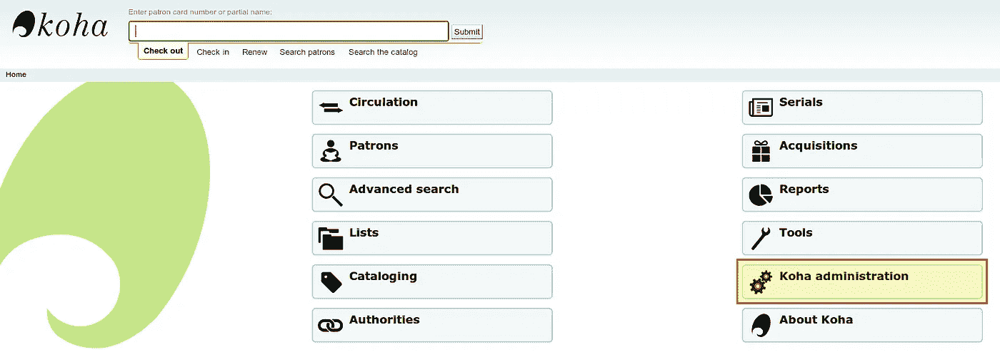
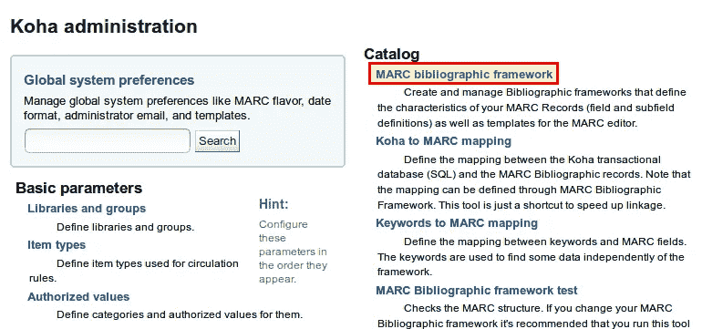
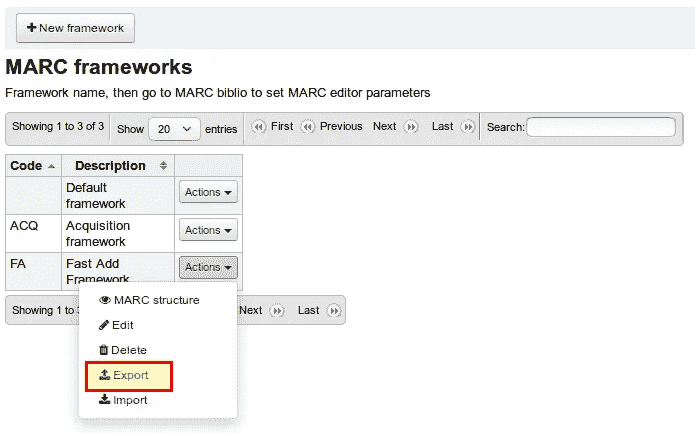
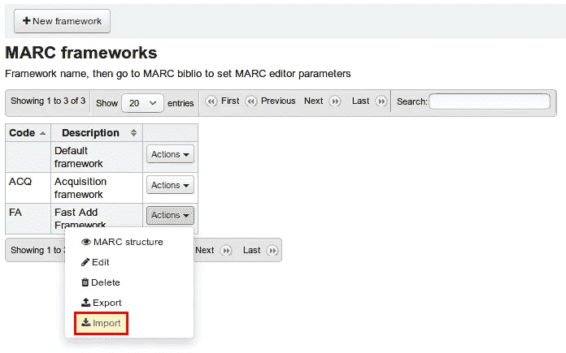

# 第 2 部分:书目框架——如何安装 Koha 并为学校设置它

> 原文：<https://medium.com/hackernoon/part-2-the-bibliographic-framework-how-to-install-koha-and-set-it-up-for-schools-32297cda31b2>


在这个系列的第一部分中，我们已经安装了 Koha。在我们可以记录或借出一本书之前，必须进行一些设置。一个主要的话题是书目框架。我们已经在安装时选择了 3 月 21 日。这是什么，为什么它很重要，以及我们如何为学校调整框架，这就是第二部分的内容。

本文是系列文章的一部分:

*   [第一个库的安装和设置](https://openschoolsolutions.org/how-to-install-and-set-up-koha-for-schools-part-1/)
*   [书目框架](https://openschoolsolutions.org/bibliographic-framework-install-koha-schools/)
*   [基础设置](https://openschoolsolutions.org/part-3-basic-settings-how-to-install-and-set-up-koha-for-schools/)
*   [编目](https://openschoolsolutions.org/part-4-cataloging-how-to-install-and-set-up-koha-for-schools/)
*   [打印标签](https://openschoolsolutions.org/part-5-label-creator-how-to-install-and-set-up-koha-for-schools/)
*   流通和罚款规则
*   连接到 Z.39.50 / SRU 服务器
*   通知和提醒
*   过期通知和费用

# 什么是书目框架？

最好把书目框架想象成用 Koha 记录的书籍或其他媒体的模板。在这个模板中，我们定义了我们希望在系统中包含的数据。这里有一个例子:

*   标题和作者
*   出版商、出版地点和年份
*   ISBN / ISSN
*   年龄限制
*   语言

这个列表可以随意扩展，但是对于学校图书馆来说，我们希望它尽可能简单。这些数据也称为字段。

所以不是每个图书馆都必须想出自己的字段，一个标准在很多年前就被创建了，在 Koha: MARC21 中使用。

# 3 月 21 日

[维基百科](https://en.wikipedia.org/wiki/MARC_standards)对 MARC 的定义如下:

> *MARC(机读编目)是一种书目数据格式。它是 1966 年在美国发展起来的。多年来，出现了许多不同的版本，其中 MARC 21 版本仍被世界各地的图书馆使用。MARC 21 是一种通用格式，可以被各种应用程序读取和处理。它的主要目的是在图书馆之间传递书目数据。*

我们在谈论一个可以被计算机读取的书目数据集。

Koha 也用 MARC21，所以我们要稍微处理一下。MARC21 有很好的介绍。我强烈推荐它，因为它帮助我更好地理解 MARC 21:[理解 MARC](https://www.loc.gov/marc/umb/) 。

MARC21 字段由一个标签(三位数)、两个指示器和一个子字段代码组成。以下是 ISBN 字段的一个示例:

```
020 ## $a 0877547637
```

前三个数字 020 代表 MARC21 字段或标签。两个“##”代表没有为该字段定义的两个指标。ISBN 的子字段 a 后面是$a。最后是 ISBN。根据定义，您也可以在$z 子字段中指定一个无效的 ISBN。

所有 3 月 21 日字段的概述可在此处找到:【https://www.loc.gov/marc/bibliographic/

# 面向学校图书馆的 MARC21

我真的推荐每一个想使用 Koha 的人阅读上面链接的 MARC 介绍，因为它对理解 Koha 如何工作以及如何使用它有很大的帮助。

# 出口框架

既然我们现在已经大致了解了什么是 MARC21 字段，我们希望修改 Koha 中的书目框架。为此，我们使用在第 1 部分中创建的用户登录，打开菜单项 *Koha 管理*。



在那里，我们选择项目 *MARC 书目框架*。



这里是所有书目框架的列表。理论上，我们可以为每种媒体类型创建一个框架，但我们希望它尽可能简单。

我们可以在浏览器中很好地自定义框架，但它与大量的点击和等待相连。因此，我们将导出框架，编辑它，然后再次导入它。

在列表中，我们在*操作→导出*中点击代码为“FA”且名称为“快速添加框架”的框架旁边。(如果缺少快速添加框架，您在安装过程中忘记了检查正确的框……)



# 定制

现在，我们必须用我们选择的电子表格软件打开下载的文件(您可以选择 CSV、Exel 或 Open Document 格式),并按如下方式进行自定义。

在第一个选项卡 **marc_tag_structure** 和第二个选项卡**Marc _ subfield _ structure**中，删除所有带有标签的行:

在第二个选项卡中，我们将隐藏一些更多的字段，以便图书进入的屏蔽变得更加清晰。在隐藏列中，我们为以下标签和子字段输入“ [**5**](https://wiki.koha-community.org/wiki/Hidden_values) ”:

*   020 →除子字段 a 外的所有字段
*   022 →除子字段 a 外的所有字段
*   100 →除子场 a(和 l 可选)之外的所有
*   245 →除子字段 a 和 b 之外的所有字段
*   250 →除子场 a 以外的所有
*   260 →除子场 a、b 和 c 之外的所有场
*   300 →全部
*   500 →除子场 a 以外的所有
*   942 →除子场 c 以外的所有
*   952 →仅细分 2、b、e、f、I、j、l、m、n、q、r、s、u、v、w、y

一旦我们做到了这一点，我们就克服了使用 Koha 的一大障碍。现在要发生的事情更容易🙂

# 导入框架

现在我们必须重新导入我们编辑过的框架。为此，我们点击 *Actions → Import* 并选择我们刚刚编辑过的电子表格文件。在导入过程中，我们的“FA”框架会更新。



# 结论

我们现在已经在 Koha 的配置中设置了一个非常重要的元素——我们的书目框架！几乎一切都是为了记录或导入我们的媒体而设置的。本系列的下一部分将进一步讨论学校的基本设置，以及其他项目类型和用户组的设置。

*最初发表于*[T5【openschoolsolutions.org】](https://openschoolsolutions.org/bibliographic-framework-install-koha-schools/)*。* ***注册*** *订阅我们的时事通讯，获取免费的 PDF 格式，并为您的课堂提供出色的开源应用程序，或者在 Twitter 上关注*[*@ OpenSchoolZ*](https://twitter.com/OpenSchoolZ)*。*