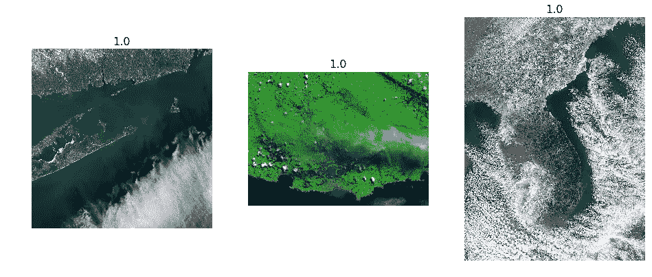
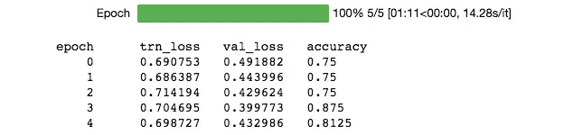

# 第 2 部分:使用深度学习从卫星图像中识别自然灾害

> 原文：<https://medium.com/hackernoon/part-2-using-deep-learning-to-identify-natural-disasters-from-satellite-images-fa82ac434e81>

这篇文章是对实验第一部分 的快速跟进(点击链接重新访问) [**我正试图利用来自**](/@shub777_56374/using-deep-learning-to-identify-natural-disasters-from-satellite-images-94815a7514f4)**[美国宇航局](https://hackernoon.com/tagged/nasa)地球天文台的卫星图像预测自然灾害。**

快速回顾:

1.  我使用 resnet32 模型，使用大约 80 张图片，能够达到大约 75%的准确率。
2.  我想使用数据扩充来拓展这一结果的边界，增加更多的数据和可能更好的模型选择。

从第 1 部分开始。我决定做以下事情:

第一步:尝试确定是否有方法可以添加更多属于这两个类别的图片。经过进一步考虑，我决定不这么做，因为我希望这是一个有限的数据问题。

第二步:改进数据扩充是我的关键策略。我把图片尺寸改成 512 X 512，并把它放大到原来的 2.0 倍。这背后的直觉是，正如我们观察到的模型无法正确识别的图像一样，存在我们希望模型训练的高层次细节。对于这个更高的缩放应该给模型一个更好的机会得到细节的正确性。如果你看下面的图像，它们本身都是令人困惑的，因此被标记为其他野火，更高的变焦应该允许 DL 算法查看图像的细节。

Images of storms and wildfires which were incorrectly classified in the last iteration

步骤 3:改变模型架构。我把自己从 Resnet32 搬到了 resnet50。这背后的直觉是，由于这是一个复杂的问题，训练样本数量有限，我们需要更多的层来考虑更高层次的抽象。

在此之后，我继续进行模型开发 LR finder 的其他步骤，训练最终层，然后重新训练所有层的权重。

我需要改变[学习](https://hackernoon.com/tagged/learning)速率，使其低于学习速率查找器显示的速率，否则，模型就不能达到函数最小值。完成后，下面是最终的结果。

Resnet50 trained on higher zoomed data augmentation training data

瞧啊。我能够达到大约 81.25%的准确率。这比使用 resnet32 的最后一次训练增加了近 600 bps。

# **迷你项目的收获:**

1.  当有疑问时，试着简化事情。尝试去除抽象层次，从基础考虑(一个复杂的问题可能需要一个复杂的解决方案，例如从 resnet32 迁移到 resnet50)
2.  如果你的训练样本可能迷惑一个人，它也可能迷惑一台机器或算法。如果有可能人类会错过——在卫星图像中描绘一场来自野火的暴风雪，那么甚至一台机器也会错过。人类会怎么做？人类需要时间来定义他的结论(低学习率)，进一步查看图像的细节可能会有所帮助(放大图像)

因此，这里的练习再次强调了这样一个事实，即在开发出任何成功的预测算法之前，我们需要很好地了解我们的数据或问题区域。