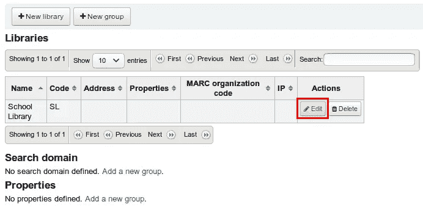
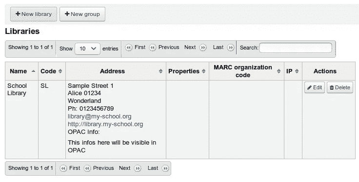
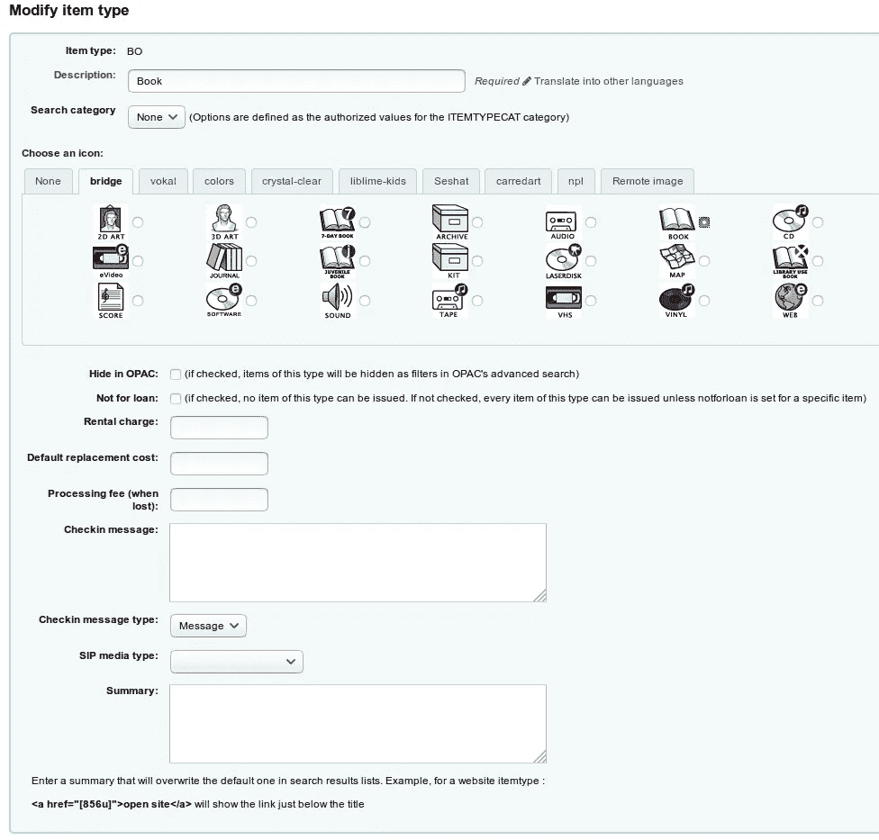
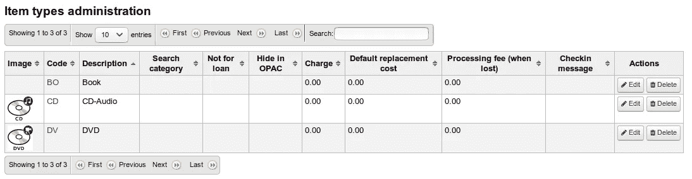
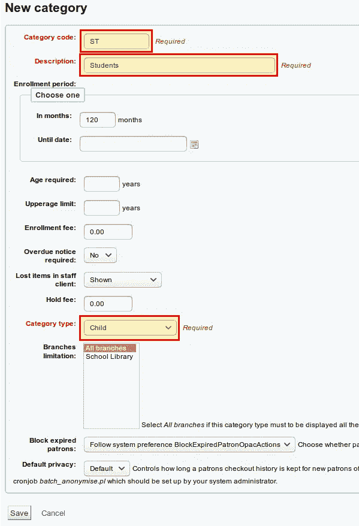
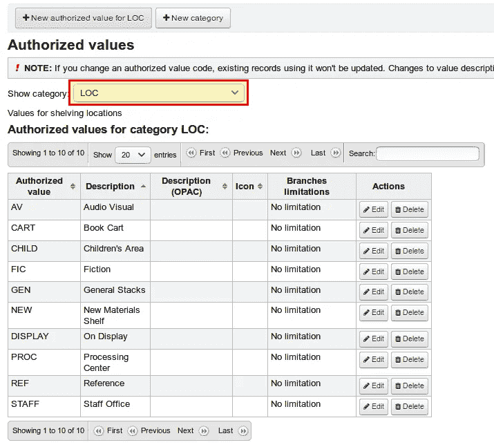
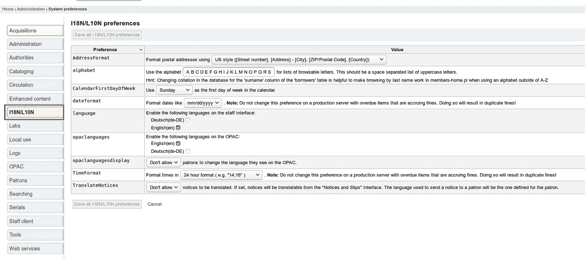

# 第 3 部分:基本设置——如何为学校安装和设置 Koha

> 原文：<https://medium.com/hackernoon/part-3-basic-settings-how-to-install-and-set-up-koha-for-schools-93e7561611a>

在第一部分安装了 Koha，第二部分设置了书目框架之后，今天我们必须在 Koha 中进行一些基本的设置。我们希望为我们的用户和项目创建新的类别，并更改一些系统参数。

本文是系列文章的一部分:

*   [安装和设置第一个库](https://openschoolsolutions.org/how-to-install-and-set-up-koha-for-schools-part-1/)
*   [书目框架](https://openschoolsolutions.org/bibliographic-framework-install-koha-schools/)
*   [基本设置](https://openschoolsolutions.org/part-3-basic-settings-how-to-install-and-set-up-koha-for-schools/)
*   [编目](https://openschoolsolutions.org/part-4-cataloging-how-to-install-and-set-up-koha-for-schools/)
*   [打印标签](https://openschoolsolutions.org/part-5-label-creator-how-to-install-and-set-up-koha-for-schools/)
*   流通和罚款规则
*   连接到 Z.39.50 / SRU 服务器
*   通知和提醒
*   过期通知和费用

# 基本设置

# 图书馆

我们使用第 1 部分中的管理员帐户再次登录，选择***Koha*******管理→基本参数→库和组*** 。在表格中，我们单击“编辑”,现在可以输入有关我们库的更多信息。*

**

*除了邮政地址，我们还可以提供电子邮件地址或其他信息，以便在 OPAC 出现。OPAC 是 Koha 的一部分，用户可以通过馆藏进行查看和搜索，可以说是图书馆网站的公共部分。*

**

# *项目类型*

*在安装过程中，我们已经创建了项目类型“book”。您首先要在 ***Koha 管理→基本参数→项目类型*** 下编辑此项目。在表格中，我们再次单击编辑，可以进行更多设置。通过这种方式，我们可以定义一个映像或确定媒体是否可以借出。如果您愿意，也可以输入租赁费、丢失时的处理费或一般退货单。*

**

*我们现在根据相同的模式创建更多的项目类型。在这里，每个人都必须自己决定他或她需要的物品类型。例如，您可以只有一种类型的书籍，也可以创建多种类型，例如额外创建参考副本。对于学校图书馆，我推荐以下类型:*

*   *书(博)*
*   *数字影碟*
*   *CD 音频(CD)*

*如果你有地图，光盘，…你当然可以创建额外的项目类型。*

**

# *顾客类别*

*现在我们已经创建了条目类型，我们需要为我们的用户创建不同的类别。对于每个用户类别，我们可以单独确定过期项目的流通规则或费用。在安装过程中，我们已经为图书馆员工创建了一个类别。在 ***Koha 管理→顾客和流通→顾客类别*** 下，我们现在设立以下小组:*

*   *图书馆工作人员— (S) →我们已经有了这个类别*
*   *学生(ST)*
*   *父母(P)*

*与“+新类别”我们可以添加一个新的顾客类别。您可以为此类别设置一个固定的到期日期，也可以按月指定一个到期日期。我在这里选择了 10 年，120 个月。如果你愿意，你也可以设置一个最小或最大年龄。在类别下，您必须选择一个默认类别，在本例中为“儿童”。*

**

*我们现在对我们的父类别做同样的事情。这些字段可以自定义，只有在类别项目中，我们选择“成人”。如果你想区分小学生和中学生(例如循环规则)，你需要一个额外的用户类别。*

# *调整授权值*

*如果您希望使用固定值，授权值总是有用的。通常这是项目状态(丢失、损坏等)或位置所需要的。授权值的设置可以在 ***Koha 管理→基本参数→授权值*** 下找到。在下拉菜单中，我们可以选择类别，然后调整值或添加新值。*

**

*我们应该查看以下授权值，并在必要时对其进行更改或补充:*

*   *位置→地点*
*   *编码→集合*
*   *丢失→丢失项目的状态*

# *系统偏好设置*

*使用许多不同的系统偏好设置，我们可以在 Koha 中创建和更改全局设置。这允许你非常个性化地定制 Koha。我们现在将控制和调整一些重要的参数，使其符合我们的目的。以下是最重要的参数:*

# *语言和格式*

*   *数据格式→日期格式*
*   *definecalendarfirsdayofweek→一周的第一天*
*   *opaclanguagesdisplay →只有在安装了多种语言的情况下才有意思*
*   *opaclanguages →只有在安装了多种语言的情况下才有意思*
*   *语言→只有在安装了多种语言的情况下才有意思*

**

# *流通*

*这一点下有很多参数。我们可以保留大部分的默认设置，也可以稍后进行修改。如果我们想要设置年龄限制，例如 DVD 或书籍，必须更改以下参数:*

*   *AgeRestrictionMarker →更改为 FSK | PEGI |年龄*

*然后保存。*

# *赞助人*

*如果需要，我们可以更改以下参数:*

*   *CardnumberLength →用户号码的长度*
*   *minPasswordLength →用户密码的最小长度*

# *目录*

*这里我们只改变一个参数:*

*   *自动条形码→增量 EAN-13 条形码*

# *增强内容*

*以下参数具有在 OPAC 或员工客户端(后端/内部网)显示 Amazon 封面图像的效果:*

*   *AmazonCoverImages →更改为显示*
*   *OPACAmazonCoverImages →更改为显示*

# *联机公用检索目录(online public access catalog)*

*最后，我们可以让 OPAC 适应我们学校的图书馆。还是那句话，参数很多，大部分可以保持原样。但是，如果有必要，我们应该更改其中的一些:*

*   *库名→库的名称*
*   *OpacMainUserBlock→主页的欢迎消息*

# *结论*

*我们已经完成了 Koha 中最重要的基本设置。Koha 现已成立，因此我们可以对我们的第一批图书进行编目和出借。这将是下一部分的主题。然后，我们将处理其他主题，如提醒和费用，用户管理和进口。*

*祝你建立学校图书馆愉快！*

**最初发表于*[*【openschoolsolutions.org】*](https://openschoolsolutions.org/part-3-basic-settings-how-to-install-and-set-up-koha-for-schools/)*。* ***注册*** *订阅我们的时事通讯，获取免费的 PDF 格式，并为您的课堂提供出色的开源应用程序，或者在 Twitter 上关注*[*@ OpenSchoolZ*](https://twitter.com/OpenSchoolZ)*。**