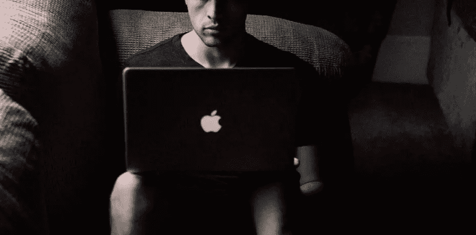

# 第三部分:色情、抑郁和多动症

> 原文：<https://medium.com/hackernoon/part-3-pornography-depression-and-adhd-123e530ca4c1>

根据我的研究，色情使用——比任何其他数字互动都更严重——可能会给大多数人带来最大的认知过度刺激和对刺激的脱敏。这是一个争论的范围，但它可以解释今天更严重的冷漠，多动症和抑郁症，否则很难解释，它可以解释在 2005 年免费色情网站出现后勃起功能障碍的增加。

过度刺激和对刺激的大规模认知脱敏可能会导致更多男性抑郁和自杀，但对女性来说，社交媒体上的同龄人比较可能会使其持平。

随着脱敏，人们可能会在一次观看多个视频后体验到——许多人可能会对生活缺乏刺激和热情。

与过去相比，今天的电视节目、电影和视频游戏可能会提供认知刺激。毫无疑问。但是这些媒体提供的刺激与色情提供的刺激相比就相形见绌了。对于一些男人来说，色情可能是一种很好的脱敏剂——并且会因为减少正常生活中的刺激而产生抑郁。这可能是多动症的一个驱动因素——我们寻求更多的刺激来补偿我们不太刺激的生活。摆脱色情可能是改善一个人生活的大好机会。

回顾研究，看起来色情滥用可能是男性某些问题的根源。在我的书中，我探讨了为什么色情比性更刺激，并导致勃起功能障碍和早泄:

当人们看色情片时，他们通常会一口气看多个视频。通过这样做，他们一次就消耗了不正常数量的新奇性刺激。这种非自然的新奇刺激让男性更频繁地自慰和射精，导致性能量更频繁地枯竭。这就是为什么看色情片时，男性可能会比没有数字辅助的伴侣性交或个人手淫感觉更加疲惫和冷漠。反复观看色情小说的视觉性刺激所带来的巨大精神刺激可能会降低对精神刺激的敏感度，并磨损男性的奖励系统。

一项研究显示，80%的年轻成年男性和 30%的女性似乎经常消费色情，这些数字可能被低估了。许多人可能会感到上瘾，即使他们认识到他们应该停止，也无法停止。脱敏导致的上瘾循环可以解释这种上瘾:我们较少受到色情和正常生活的刺激，这使我们更需要色情的刺激来补偿迟钝和与以前一样的性高潮。

这得到了论文*大脑结构和与色情消费相关的功能连接*的支持。

2014 年 7 月，马克斯·普朗克研究所(Max Planck Institute)的论文(发表在著名杂志《美国医学会杂志》(JAMA)上)报告称，更多的色情使用与更少的大脑灰质容量有关。灰质体积负责对刺激的敏感性——对奖励的接受性。音量越大，敏感度越高，音量越小，敏感度越低，因此抑郁症和多动症的症状越多。在色情文学中，人们不断地将自己暴露在非常强烈的过度刺激中，导致对刺激和奖励的接受能力大大降低。

更多的色情使用和更少的灰质之间的联系可以从基因上得到解释:灰质更少的人可能平均来说更少受到刺激，并且更渴望色情刺激的冲击波。但是我认为这种相关性表明了某种因果关系——更多的过度刺激会降低对刺激的接受能力。

另一种方式也可能奏效:较少的过度刺激可能会带来更多的接受性。这很重要。这意味着我们可以少用色情，进行低刺激的独处。然后，有了更多的接受能力，我们可能会在现实世界中找到更大的刺激(更少的抑郁)，更少需要分心来提供刺激(更少的多动症)。我们可以改善我们的认知状态。

冥想与更多的灰质体积有关。冥想时，人们受到的刺激较少，这可能会提高接受能力，进而对抗抑郁症和多动症的症状。有可能自然地有更多的灰质体积让人们更容易冥想。从更多的灰质体积中获得更多的接受能力，人们可以更容易地维持较少的刺激。但是将我们自己从不必要的过度刺激中分离出来可能会提高我们的接受能力。

问题是，随着色情和数字媒体的过度使用，年轻人可能会反复、强烈地用过度刺激来轰炸自己，削弱对刺激的接受能力。他们可能不会参与恢复刺激敏感性所需的活动，如专注的冥想或甚至基本的无数字帮助的独处，因为所有过度刺激导致的刺激敏感性下降可能会使那些低刺激时期的体验变得困难。

我认为我们与数字媒体(尤其是社交媒体，尤其是色情)的关系的后果，以及重塑这些关系的机会可能被低估了。

应该传播对这些心理健康动态的认识，我们应该努力解决潜在的问题。理解与新数字媒体的关系可以帮助我们做到这一点。生活可能会得到改善。

我们可以更进一步。

火炬，燃烧着生命。

在我的书中，我进行了更深入的研究，并提供了改变一个人行为的建议——以最有效地避免成本和改善。*现在购买从* [*巴诺*](https://www.barnesandnoble.com/w/trapped-in-the-web-an-turner/1129986845) *或*[*indie bound*](https://www.indiebound.org/book/9781732182196)*。*