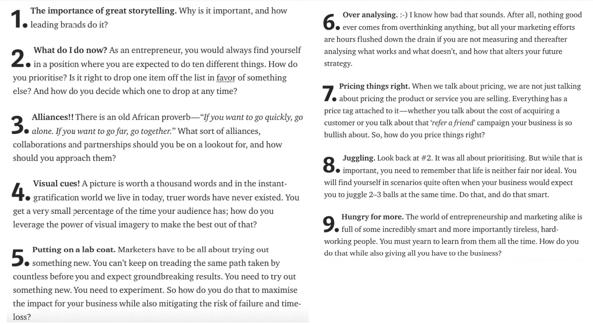
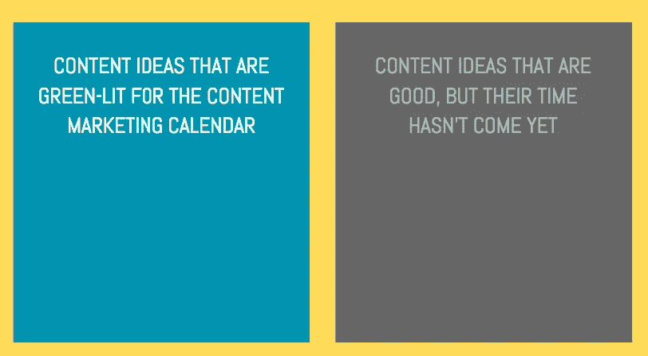
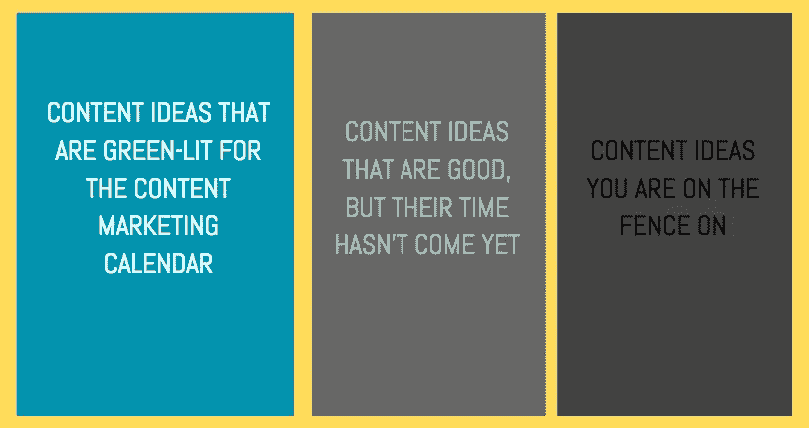
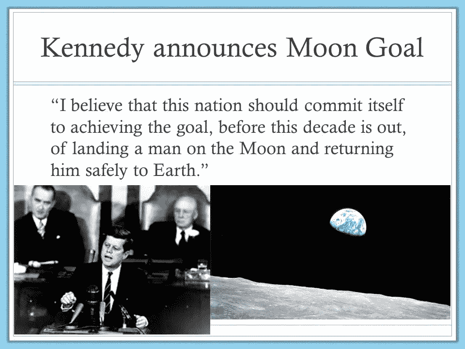

# 第 3 部分—“下一步做什么？”—始终为您的业务制作出色的内容。

> 原文：<https://medium.com/hackernoon/part-3-what-to-do-next-consistently-produce-great-content-for-your-business-cbdd102d38e3>

## 十部分系列的一部分。打破世界顶级企业的优秀内容规则。


Feeling lost on what you should do next? (Photo by [Cristofer Jeschke](https://unsplash.com/photos/Ce3XLxac0f4?utm_source=unsplash&utm_medium=referral&utm_content=creditCopyText) on [Unsplash](https://unsplash.com/search/photos/thinking?utm_source=unsplash&utm_medium=referral&utm_content=creditCopyText))

顾名思义，这是一个系列的第三部分。

在本系列的第一部分中，我们谈到了企业在营销工作中制作优秀内容的需求。如果你想效仿全球顶级营销者和企业的成功，我们列出了一些你可以遵守的基本规则。

[在第 2 部分](https://hackernoon.com/part-2-storytelling-consistently-produce-great-content-for-your-business-aaf4c38a7de9)中，我们处理了实际列表中的第一个项目(*一个我们在第 1 部分详述的列表——这是系列*的介绍)。这一部分着重强调了好的故事讲述对一个企业的优势，并列出一些基本规则，告诉你如何以一种给你的品牌带来急需的推动的方式来讲述故事。

如果你还没有看完这个系列的前两部分，这里有我们刚刚描述的相关故事的链接:

[](https://hackernoon.com/part-1-introduction-consistently-produce-great-content-for-your-business-a70b66c68e05) [## 第 1 部分——简介——始终为您的企业提供优秀的内容。

### 十部分系列的一部分。打破世界顶级企业的优秀内容规则。

hackernoon.com](https://hackernoon.com/part-1-introduction-consistently-produce-great-content-for-your-business-a70b66c68e05) [](https://hackernoon.com/part-2-storytelling-consistently-produce-great-content-for-your-business-aaf4c38a7de9) [## 第 2 部分——讲故事——始终为您的企业创作优秀的内容。

### 十部分系列的一部分。打破世界顶级企业的优秀内容规则。

hackernoon.com](https://hackernoon.com/part-2-storytelling-consistently-produce-great-content-for-your-business-aaf4c38a7de9) 

此外，以下是完整的列表:



The list of items we would be covering in this series. We talked about #1 in part 2 of the series.

既然我们已经讨论了列表中的第一项，今天我们继续讨论第二项。你现在做什么？

# 优先排序

企业家总是优先考虑。你是因为需要为营销团队腾出一些技术带宽而推迟产品发布，还是因为你计划在新版本中推出的功能优先而推迟营销？

决定，决定，决定。有人会问，一家大公司的首席执行官是如何完成任何事情的？几年前，当脸书不断推迟其首次公开募股时，许多人都想知道扎克为什么要这样做，他给出了一个非常明确的解释——*以确保他的员工和他的注意力放在他们认为重要的产品发布上。*

营销人员也不例外。营销人员最容易做出的决定是，当他必须在一个好主意和一个坏主意之间做出选择时——你可以简单地对一个说是，对另一个说不。但是当你面前有两个好点子，但它们走在一起又是水火不相容的时候，你会怎么做。很明显，你不能同时把这两个问题都提出来，就设定谈话的基调和背景而言，这将是一场灾难。即使他们不是你的油/水二人组，你可能仍然需要选择一个，因为完全缺乏带宽。那么如何决定选择什么呢？你如何确保被落下的那一个不被遗忘？

> 顺便说一句，这是我把事情简单化了，举了一个例子，我必须从两个想法/行动项目中选择。运气好的话 *会更像 10 — ***！****

# 制作一个内容日历，然后稍微修改一下

这是任何为你提供内容营销建议的人都会告诉你的最基本的事情之一— *制作内容营销日历*。你绝对需要有一个内容营销日历。它有助于您保持专注，并确保内容的一致性。但是它也可以帮助你区分事情的优先次序。你所需要做的就是在你的内容营销日历上添加一个内容营销入围名单。像这样的东西:



Have a dashboard to shortlist topics that need to be pushed out right away.

你可以像我一样在 excel 上做这个，或者你甚至可以在白板上或者公告板上做这个(*巧合的是这也是我做的事情；excel 是我个人用的，板子是给整个团队用的*。如果你特别喜欢冒险，你可以在这个板块中再添加一个部分，即*给人印象应该有效并且与业务一致的想法，但是就你购买它们的相关性/价值而言，你并不是 100%确信。*



A third bracket for those friends who like to live life dangerously.

这在几个方面有所帮助。首先，你不会觉得被迫推出你不是 100%确定的内容，因为你知道在适当的时候你会这样做。第二，它可以帮助填补那些你想不出任何伟大的内容创意的干旱场景。只需从棋盘的好部分中选择一个'*贴上便条*'，就可以开始了。

> 我有点传统，如果我完全诚实的话，我只是喜欢玩便利贴。但是你也可以使用像 Trello 和 Asana 这样的系统来达到这个目的。

所以这帮助你解决了部分问题。但是我们还没有解决如何区分事情的优先顺序，不是吗？所以，让我们现在就去做吧！

# 你在这个阶段的商业目标是什么？你想要什么样的结果？

在我的一个老故事中，我已经谈到了它的某些方面。所以我在这里就不赘述了，要点如下:

> 你的营销目标需要(1)具体，(2)可衡量，(3)可实现，(4)相关，(5)有时限。

任何经过你盘子的食物都应该根据这些参数进行评估，并给出优先分数。然后你就可以在黑板上根据他们的总分来排列东西。尽可能不偏不倚，记住数据不会说谎。

例如，让我们考虑一个场景，其中业务的目标是让尽可能多的消费者意识到他们的存在。

所以很自然的问题就来了。你是走数字广告路线，还是试图通过社交媒体有机地接触你的观众。在这里的大多数情况下(*当你试图增加知名度*)，你希望你的内容有一个可分享的商数。(*)当人们谈论他们想让自己的内容像病毒一样传播时，这基本上就是他们的意思。*)

所以，你的业务目标是提高品牌知名度→这导致你的目标是你的内容需要有一个可分享的商数→这是你的内容现在需要保持水！任何不符合标准的东西都不符合标准。


So go ahead and slice away. Be ruthless.

# 有什么宏伟的计划？如果你所做的对它有帮助呢？

有一个宏伟的计划是有帮助的，并且永远，永远把它放在你头脑的前面和中心。如果你需要的话，把它用粗体、大字印刷出来，用最花哨的颜色突出显示，并把它放在一个你每天每时每刻都能看到的地方。

我一直认为拥有宏伟计划/目标的最好例子*——是 JFK 在登月竞赛时代的例子。*



Part of Kennedy’s address to the US Congress on May 25, 1961

这是一个目标:*让一个人登上月球，然后* ***让他安全返回地球。***

如果你看看这个星球上最著名的公司，你会发现他们都是从一个宏伟的目标开始的，如果没有，在他们存在的某个阶段也有一个宏伟的目标。

*   微软的:每张桌子和每个家庭都有一台电脑。✔
*   谷歌的:组织全世界的信息，并使其普遍可用和有用✔
*   SpaceX:让人类能够探索和定居火星

只有 SpaceX 仍在为实现这一目标而努力；另外两个人显然成功地做了他们渴望做的事情。SpaceX 目前所做的一切都在朝着这个目标前进。

所以要有一个明确的目标——一个大胆、宏伟、让你充满激情的目标。现在，回到 JFK 的声明，这个声明有更多的内容，这是下一部分，对我们这里的叙述很有用。

> ……但是，同意或希望美国在外层空间采取肯定的立场是没有意义的，除非我们准备好做这项工作并承担使它成功的负担……

这将帮助你优先处理你的任务清单。现在摆在你面前的这个东西对你的大设计有帮助吗？

# 但这不是一个理想的世界

我们刚刚谈论的一切在理论上看起来很棒，也应该很有意义。但事实是我们并不是生活在一个理想的世界里。所以，无论你多么想要或尝试，你都不能总是停留在你能够(*或者甚至能够*)一次只接*一个*任务的场景中。所以，你需要学会同时处理多个项目。但是，即使在这些情况下，优先次序总是必要的，绝对关键的。话虽如此，我们将谈论同时杂耍多个球。不幸的是，对于这个特定的主题，您必须等到本系列的第 9 部分。

在本系列的下一部分，我们将讨论战略联盟，以及它们如何适应内容营销的世界！

# 那下次见！


```
**I help businesses with their growth. Interested in knowing if I can help yours? Drop in a line -** [**mail@abyshake.com**](mailto:mail@abyshake.com)
```