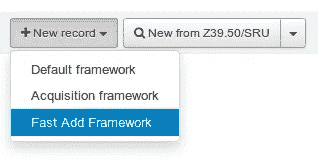
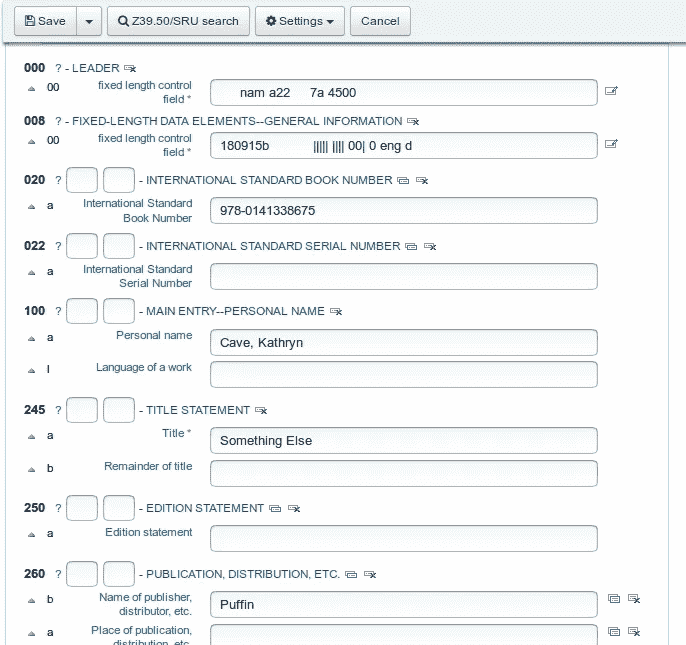
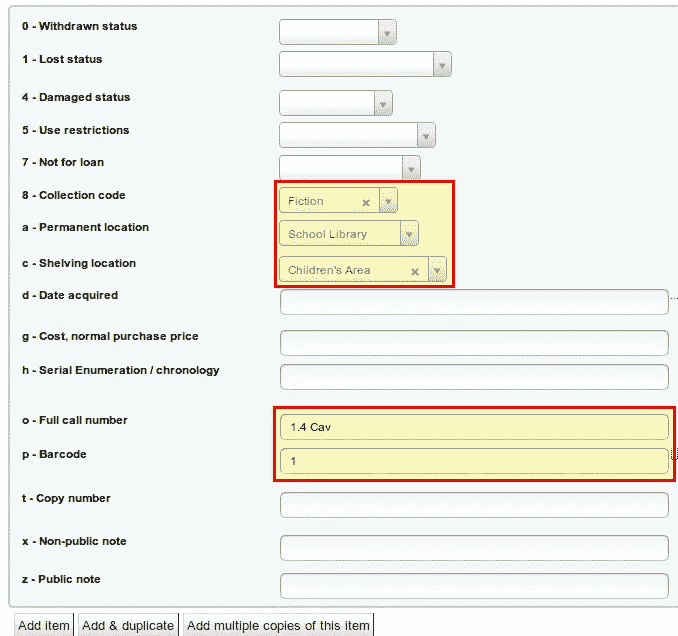
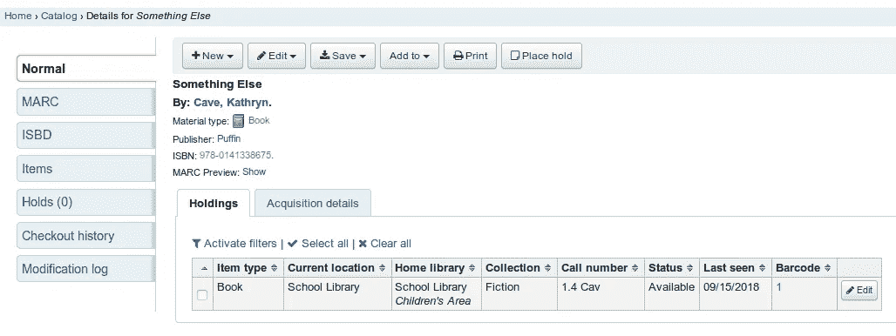

# 第 4 部分:编目—如何为学校安装和设置 Koha 开放式学校解决方案

> 原文：<https://medium.com/hackernoon/part-4-cataloging-how-to-install-and-set-up-koha-for-schools-open-school-solutions-4bd11f528f2a>

经过长时间的休息，我们今天继续“如何为学校安装和设置 Koha”系列。系统安装完成后，书目框架已经建立，基本设置已经完成，本文将处理 Koha 中图书的添加和编目。

本文是系列文章的一部分:

*   [安装和设置第一个库](https://openschoolsolutions.org/how-to-install-and-set-up-koha-for-schools-part-1/)
*   [书目框架](https://openschoolsolutions.org/bibliographic-framework-install-koha-schools/)
*   [基本设置](https://openschoolsolutions.org/part-3-basic-settings-how-to-install-and-set-up-koha-for-schools/)
*   [编目](https://openschoolsolutions.org/part-4-cataloging-how-to-install-and-set-up-koha-for-schools/)
*   [打印标签](https://openschoolsolutions.org/part-5-label-creator-how-to-install-and-set-up-koha-for-schools/)
*   流通和罚款规则
*   连接到 Z.39.50 / SRU 服务器
*   通知和提醒
*   过期通知和费用

# 目录

我们可以在 ***编目→新建记录→快速添加框架*** 下记录一本新书。

出现一个输入界面，我们可以在其中输入所有重要的数据。作为一个例子，我选择了凯瑟琳·凯夫的书《别的什么》。

点击屏幕顶部的“保存”,我们进入下一个输入界面。

# 添加项目

到目前为止，我们已经录制了标题。现在我们可以添加项目到这个标题。在学校图书馆，这通常是一个项目。然而，有时一个标题有几个条目(特别是如果你在系统中包括教科书的话)。

最重要的字段是集合、位置、项目呼叫号码和条形码。其他字段可以另外填写。如果点击该字段并激活系统设置“*自动条形码*”(见本系列第 3 部分)，条形码将自动生成。在集合下显示所有数值，我们也在第 3 部分的“*授权值→ CCODE* ”下设置了这些数值。这同样适用于搁置位置(*授权值→位置*)。

# 签名和系统学

根据图书馆的规模，为你的收藏引入一个系统是有意义的。一个系统描述了如何在图书馆内对图书进行分类和排列。这有不同的系统，一般来说，基于城市图书馆或附近其他图书馆的系统是有意义的。因此，孩子们很快就找到了路，并学会了如何去图书馆。一般来说，为了能够快速定位，系统学应该尽可能简单。

因此，每个类别都有自己的颜色和缩写，我们可以用它们来表示项目的索书号。

签名也有不同的系统和可能性。我们决定将集合中的缩写与作者的前三个字母结合起来。在我们的案例中是“1.4 Cav”，即 3 年后的图画书为“1.4”，作者姓氏的前三个字母为“Cav”。但是也可以分配连续的数字。

点击“**添加项目**”，项目被保存在 Koha 中。

# 结论

我们现在已经为 Koha 添加了我们的第一个标题。遵循同样的模式，现在可以向 Koha 添加更多的书籍或其他媒体。下一部分将处理标签(带条形码)和书脊标签的打印。

*最初发表于*[T5【openschoolsolutions.org】](https://openschoolsolutions.org/part-4-cataloging-how-to-install-and-set-up-koha-for-schools/)*。* ***注册*** *订阅我们的时事通讯，获取免费的 PDF 格式，并为您的课堂提供出色的开源应用程序，或者在 Twitter 上关注*[*@ OpenSchoolZ*](https://twitter.com/OpenSchoolZ)*。*