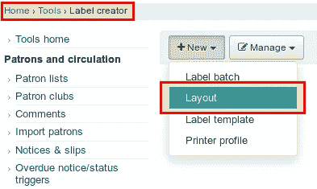

# 第 5 部分:标签创建器——如何为学校安装和设置 Koha

> 原文：<https://medium.com/hackernoon/part-5-label-creator-how-to-install-and-set-up-koha-for-schools-d051815c91fb>

Koha 是我所知道的最好的开源项目之一。这是一个非常灵活的解决方案，需要一些时间来适应。然而，我们已经解决了大部分问题，尤其是[装置(第一部分)](https://openschoolsolutions.org/how-to-install-and-set-up-koha-for-schools-part-1/)和[书目框架(第二部分)](https://openschoolsolutions.org/bibliographic-framework-install-koha-schools/)。在最后一部分，我们已经对一些书进行了编目。然而，在我们开始借书或其他媒体之前，每本书都需要一个条形码。我们还需要建立借款规则。今天我们来谈谈标签创造者。

本文是系列文章的一部分:

*   [第一个库的安装和设置](https://openschoolsolutions.org/how-to-install-and-set-up-koha-for-schools-part-1/)
*   [书目框架](https://openschoolsolutions.org/bibliographic-framework-install-koha-schools/)
*   [基础设置](https://openschoolsolutions.org/part-3-basic-settings-how-to-install-and-set-up-koha-for-schools/)
*   [编目](https://openschoolsolutions.org/part-4-cataloging-how-to-install-and-set-up-koha-for-schools/)
*   [打印标签](https://openschoolsolutions.org/part-5-label-creator-how-to-install-and-set-up-koha-for-schools/)
*   流通和罚款规则
*   连接到 Z.39.50 / SRU 服务器
*   通知和提醒
*   过期通知和费用

# 标签创建者准备

对于我们图书馆中的条形码，我们使用简单的不干胶标签。作为一个例子，我们拿一张有 27 个 55x30mm 毫米标签的 A4 纸。我们想在上面打印我们的条形码，以及书名和书号。对于标签印刷，我们必须创造两样东西:

*   标签的布局，即标签上应该打印什么信息？
*   标签页的模板，即一张纸上有多少个标签？标签的尺寸是多少？距离是多少？

# 创建标签布局

我们首先为我们的标签创建一个布局，在条形码旁边包含我们希望以后包含的所有信息。为此，我们进入**工具→标签创建器**，用**新建→布局**创建一个新模板。

现在我们必须制定不同的规格:

*   布局名称→可以自由选择
*   条形码类型→ EAN13
*   布局类型→书目/条形码(即首先打印标题，然后打印条形码)
*   书目数据→这里我们选择列表字段(即我们可以直接输入 Marc21 标签)。
*   数据字段→ 245a、245b、isbn、issn(我很难按照我想要的方式进行布局，因为数据字段和 Marc21 标签当时可以正常工作)
*   再往下，你可以指定字体大小和类型(这里你必须做一点实验，你想要它是什么样子)。

最后，我们单击保存。

# 创建标签模板

现在我们已经为标签创建了布局，我们必须告诉 Koha 我们的标签页是什么样子的。因此，我们用 **New → Template** 创建一个新模板。

输入掩码中需要以下信息:

*   模板编码和描述→可自由选择
*   单位→ mm 或 cm，这取决于您希望如何表示尺寸(在我们的示例中我采用了 mm)
*   页面高度和宽度→标签纸的高度和宽度(美国为 A4)
*   标签宽度和高度→标签尺寸
*   顶部页边距→从顶部到第一个标签页边距的距离
*   左边距→从左边距到第一个标签边距的距离。
*   顶部和左侧文本边距→文本到标签边缘的距离
*   列数和行数→工作表有多少行和列？
*   列间距→标签间距(右/左)
*   行间距→标签间距(顶部/底部)

最后，再次单击保存。

# 打印条形码

现在，我们已经做好了一切准备，可以打印出已经编目的介质的条形码。为此，我们用 **New → Label batch** 创建一个新的标签批次。

将打开一个新的输入字段，我们可以在其中输入条形码。只要输入字段为空，我们单击下面的**添加项目**，就会打开一个新窗口，在这里我们可以简单地搜索我们介质的条形码。

您可以指定搜索录制副本的时间段。点击搜索后，您将看到搜索结果:

由于我们想要添加所有项目，我们单击上面的**选择所有**，然后**添加选中的**，最后**完成**。现在，我们所有的副本都在输入字段中，我们可以使用**添加项目**将它们添加到我们的标签批次中。

现在，我们可以使用**导出整批**导出我们批次中的所有标签并打印它们。将会打开一个弹出窗口。在那里，我们选择我们的标签布局和模板。此外，我们还可以在工作表中指定稍后开始打印的标签。如果您使用过标签纸，这尤其实用。

最后点击**导出**，我们就可以下载 PDF 格式的打印模板了。

我们的条形码🙂准备好了。我们现在可以把它们打印出来。当打印时，我们必须确保没有页面缩放或自动缩小到打印区域，否则你就不再正确测量。在 Ubuntu 中是这样的:

标题和 ISBN 帮助我们以后把标签贴在正确的书上。

# 结论

Koha 的标签创建工具非常灵活可调。一旦我们创建了我们的布局和模板，以后打印标签不再是一个障碍。我建议在任何情况下都在普通纸上打印一些测试，以便检查标签的距离和布局。在下一部分，我们将继续贷款条件。

*最初发表于*[*【openschoolsolutions.org】*](https://openschoolsolutions.org/part-4-label-creator-how-to-install-and-set-up-koha-for-schools/)*。* ***注册*** *订阅我们的时事通讯，获取免费的 PDF 格式，并为您的课堂提供出色的开源应用程序，或者在 Twitter 上关注*[*@ OpenSchoolZ*](https://twitter.com/OpenSchoolZ)*。*