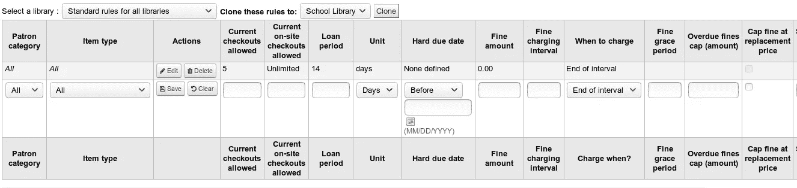
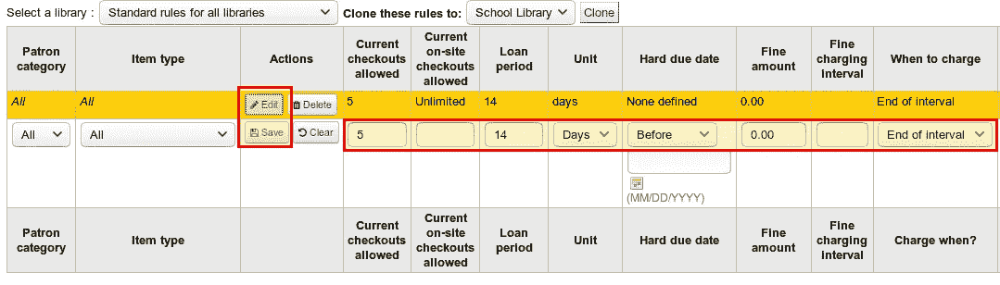
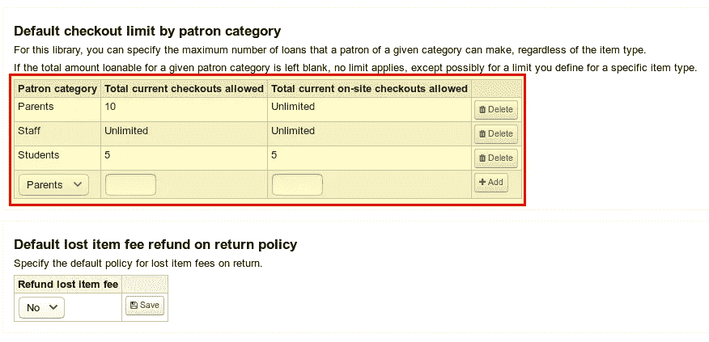
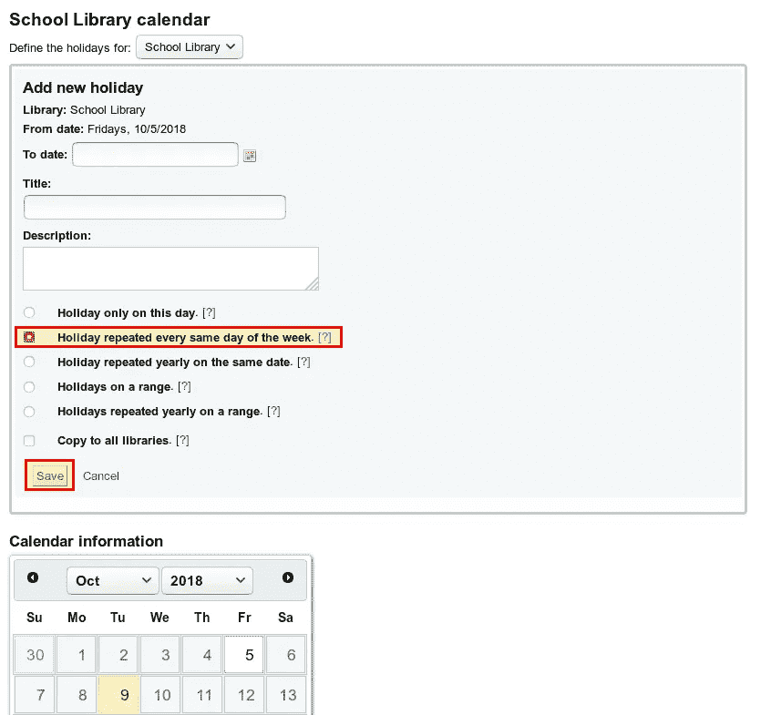

# 第 6 部分:流通和罚款规则——如何为学校安装和设置 Koha

> 原文：<https://medium.com/hackernoon/part-6-circulation-and-fines-rules-how-to-install-and-set-up-koha-for-schools-e4cbd39528ed>

到目前为止，我们已经安装和配置了 Koha，并对第一批媒体进行了编目。条形码被打印出来贴在书上。事实上，一切都在等待我们最终能够向我们的读者检验这些书。还缺少最后一步，这就是今天的重点:流通和罚款规则。这将允许我们决定谁可以借哪一个项目，借多长时间。但是，在第一本书离开图书馆之前，我们还可以在 Koha 决定罚款、续借和更多的事情。

本文是系列文章的一部分:

*   [安装和设置第一个库](https://openschoolsolutions.org/how-to-install-and-set-up-koha-for-schools-part-1/)
*   [书目框架](https://openschoolsolutions.org/bibliographic-framework-install-koha-schools/)
*   [基本设置](https://openschoolsolutions.org/part-3-basic-settings-how-to-install-and-set-up-koha-for-schools/)
*   [编目](https://openschoolsolutions.org/part-4-cataloging-how-to-install-and-set-up-koha-for-schools/)
*   [打印标签](https://openschoolsolutions.org/part-5-label-creator-how-to-install-and-set-up-koha-for-schools/)
*   [流通和罚款规则](https://openschoolsolutions.org/part-6-circulation-and-fines-rules-how-to-install-and-set-up-koha-for-schools/)
*   连接到 Z.39.50 / SRU 服务器
*   通知和提醒
*   过期通知和费用

# 定义流通和罚款规则

## 创建新规则

我们在**管理→流通和罚款规则**下找到流通规则的设置。在这里，我们可以为所有库定义规则，或者只为一个特定的库定义规则。目前我们只有一个图书馆。因此，我们是直接为学校图书馆还是为所有图书馆制定规则并不重要。

默认情况下，已经创建了一个适用于所有人的规则。

首先，我们应该使“所有”的规则适应我们的要求。然后，我们可以为个别用户组(例如学生或家长)创建附加规则。因此，我们点击**编辑**，然后可以调整所有参数:

## 说明

*   *顾客类别* →该规则应适用于哪个顾客类别？
*   *项目类型* →该规则应适用于哪种项目类型？
*   *当前允许借出* →可以同时借出这么多本书。
*   *当前允许的现场检出* →这是关于只能在库中检出的介质。
*   *借出期限* →一个物品可以借出多长时间？
*   *单位* →天或小时，通常为天
*   *硬性截止日期* →适用于教学材料库。在这里，我们可以输入学年结束的日期作为固定到期日。否则留空。
*   *罚款金额* →我们单位的费用金额在此确定(即在我们的案例中是每天的费用)。
*   *精充电间隔* →应该在哪些间隔内计算费用？例如，“1”表示每天，“5”表示每五天一次。
*   *何时收费* →“区间结束”表示在区间结束时计算费用。例如，如果我输入“1”作为间隔，费用将在第一个逾期日之后计算。但是，如果我选择“间隔开始”，则每次开始的间隔都要收费。
*   *罚款宽限期* →到期日后多少天/小时不收费？例如，“2”表示您可以在到期日的 2 天内还书，而无需支付费用。然而，这也取决于您为系统参数*FinesIncludeGracePeriod*选择的设置。
*   *逾期罚款上限(金额)* →最高收费/项目应该多高？
*   *重置价格罚款上限* →最高费用不应超过账面重置价格
*   *天数(天)* →如果用户有过期项目，您可以选择“费用”来阻止用户
*   最大值。暂停持续时间(天) →最大暂停时间(只能以“天”为单位，不能以“小时”为单位)
*   *允许续借(计数)* →用户多久可以续借一次书？
*   *延期期限* →延期多少天/小时？
*   *在*之前没有续订→在这里我们可以确定在到期日前多少天/小时可以续订。如果该字段仍然为空，您可以随时扩展。
*   *自动更新* →在这里我们可以决定是否自动更新物品。
*   *在*之后没有自动续订→多少天后不应该自动续订？
*   *(硬限制)* →同上，只是我们可以在这里输入一个固定的日期。
*   允许暂挂(计数)→允许多少暂挂？
*   *每个记录的保留(计数)* →每个标题/记录应该允许多少个保留？
*   *允许上架* →是否以及如何预订可用书目的各种设置
*   *物品级别保留* →参见上述物品保留的各种设置。
*   *商品请求* →商品是否可以订购以及如何订购的各种设置。
*   *租赁折扣(%)* →如果对某些项目征收租赁费，您可以在此设置折扣。

在我们将一切设置成我们喜欢的之后，我们也点击**保存**。

## 进一步设置

再往下，我们可以选择进行额外的设置，例如，每个顾客类别可以借出多少物品(如果在上面的流通和罚款规则中还没有这样做)。

# 假日

为了计算到期日，Koha 知道我们的图书馆何时关闭是很重要的，例如，因为它是假期或只是周末。为此，我们打开**更多→工具→日历**下的日历，输入学校图书馆关闭的所有日期。

例如，如果我们想将周末定义为结束日，我们单击某个星期六，然后选择一个结束日，该结束日在每周的这一天重复。周日我们也必须这样做。

对于假期，我们也可以选择一个关闭期间，并在顶部输入假期的开始和结束时间。

最后，我们需要确定 Koha 在计算到期日时是否应该考虑关闭天数。这是通过*使用日期模式*系统参数完成的。如果我们想排除关闭日(由于假期，这在学校图书馆很有意义)，我们选择日历*将到期日推到下一个开放日*。

# 结论

我们现在已经设置好了向用户结帐我们的书籍和其他项目的一切。截止日期的计算是正确的，考虑到了我们图书馆关闭的日子。本系列的所有其他部分都是可选的，但是使用 Koha 要容易得多。例如，我们已经在流通和罚款规则中定义了费用，但是它们还没有被计算。还需要进一步的步骤，我将在后面的文章中描述。

*最初发表于*[*openschoolsolutions.org*](https://openschoolsolutions.org/part-6-circulation-and-fines-rules-how-to-install-and-set-up-koha-for-schools/)*。*