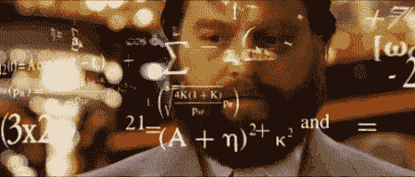
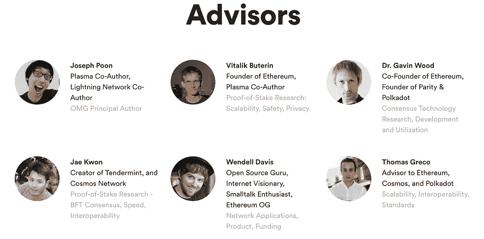
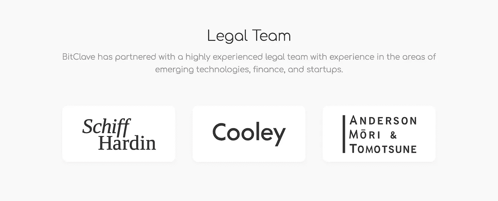
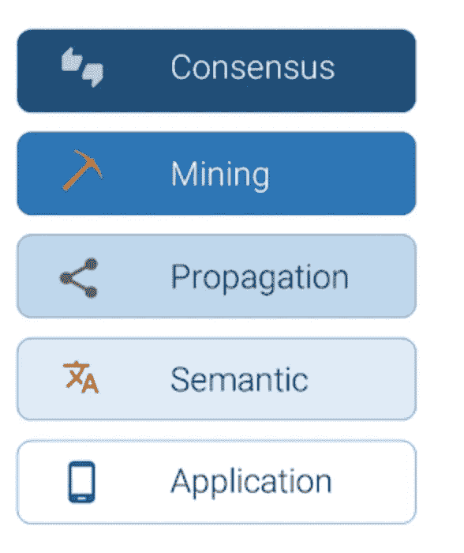

# 第一部分:什么是令牌经济学(Tokenomics)？

> 原文：<https://medium.com/hackernoon/part-i-what-is-token-economics-tokenomics-69bb018c7a96>

这个由四部分组成的系列的目标是为您提供一个分析和创建令牌激励模型的标准框架。您将对加密资产的令牌经济学的主要组成部分(或价值驱动因素)有一个基本的了解。

第一部分:什么是代币经济学？

第二部分:[顶级 Token 经济模型](/@CoreyBlinks/part-ii-top-token-economic-models-1c45ca53446b)

第三部分:[系统性令牌经济问题](/@CoreyBlinks/part-iii-systematic-token-economic-issues-c30f816063fd)

第四部分:[创造象征性激励的指南](https://hackernoon.com/part-iv-a-guide-to-creating-token-incentives-8316f132fae4)

你 ***不要*** 要像上面这个家伙一样，要能够理解并创建你的令牌模型的基础。您需要了解将影响社区长期增长和加密资产价值的主要领域。

什么是代币经济学？在我回答这个问题之前，你应该知道前哈佛大学心理学教授 B.F .斯金纳和他的代币经济理论。

他的代币经济理论是我定义代币经济学领域的基础。

好吧…什么是代币经济学？

‪Token 经济学是分配令牌来修改(或激励)特定行为，以创建强大的社区，其根本目标是创建有价值的加密资产。‬

任何影响加密资产价值的东西都属于象征经济学范畴。

**关键领域:**

1.  **团队**

人是 ICO 项目中最重要的部分。这个项目背后的团队是决定他们的硬币是否有机会被广泛采用的关键。该团队应该在解决方案或问题方面具有专业知识，并且在职业生涯中有过成功的经历。确保寻找团队成员和顾问比例至少为 1 比 1 的团队[。理想情况下，一个项目(或基金会)应该有更多的团队成员(全职工作，而不是“兼职”顾问。](/@mccannatron/guide-to-launching-an-initial-coin-offering-ico-94587af2c8d5)

****:****

********

**这不是整个团队。我无法在这一页上写下整个团队。***

******:******

********

****这不是整个团队。我无法在这一页上写下整个团队。*****

********

****你会注意到他们有一个“全明星”法律团队，他们是秘密资产。库利在诉讼战中代表 Tezos 的创始人。这表明 Bitclave 的团队正在进行长期思考，并正在采取关键步骤来实现法律合规性(国际性)。****

******2。应用交互层******

****大多数区块链应用程序位于最低的交互层，即应用层。一些代币，如货币硬币，如比特币或 Monero，将包括除应用层以外的所有交互层。像 Brave、Bitclave 等流行的分散式应用程序(Dapps)只位于应用层。关于交互层的详细信息，请阅读 David Xiao 的帖子:[“区块链的四层”](/@coriacetic/the-four-layers-of-the-blockchain-dc1376efa10f)。****

********

****“前四层包含我们所认为的区块链，而应用层允许覆盖层、API、应用程序等。”——肖大卫****

****通常，最多样化的交互层在应用层。这四个核心层是标准的，大多数创新将发生在应用层，因为它与最终用户打交道。分散式 Airbnb 的激励模式 Bee Token 看起来与 Dash 有很大不同，后者使用 Masternode 激励结构来吸引矿工。****

******共识** —创建新区块或更改区块链的基础****

******采矿**——在工作证明或赌注模型中铸造新硬币或代币****

******传播** —决定信息如何在网络中的节点之间传输****

******语义** —将加密资产转移到不同的节点****

******应用** —面向最终用户的前端应用****

****一旦你弄清楚了你的区块链应用接触的交互层，这将使你更好地理解哪些行为应该受到激励。这对你选择的激励模式有直接影响。****

******3。代币和预算分配&筹款目标:******

****我决定把这三个方面放在一起，因为把它们作为一个整体来讨论更容易。下面我列出了我所看到的代币分配策略和资金使用的大致百分比。****

******令牌分发:******

****创始团队:15% — 25%****

****为未来使用和员工预留:20% — 30%****

****私人和/或公开销售:25% — 50%****

****社区管理(空投/奖金计划):10% — 15%****

******预算分配:******

****研发:30% — 60%****

****销售和营销:15% — 20%****

****网络成本:10% — 15%****

****运营:10% — 15%****

****会计、法律和合规:2.5% — 5%****

*******这些都是粗略的范围，你应该自己做研究*******

****无论是在熊市还是牛市，ICO 的筹资目标都应该是可以实现的。2017 年初，ICOs 的筹款目标超过 5000 万美元。2018 年，融资最成功的 ico 往往在 1500 万美元或以下。关键是在分配代币和预算时，要考虑到所有关键利益相关者(社区、基金会和个人)的利益。****

****还有，给团队和顾问的代币有锁定期吗？长期思维项目往往会让创始人、员工和顾问承诺 6-12 个月的象征性锁定期和 4 年的股权授予期。****

******其他关键问题:******

1.  ****硬币会被预先开采吗？****
2.  ****你会有无限的代币供应吗？****
3.  ****你的代币会在交易所出售吗？如果是，什么时候，哪个交易所会出售你的代币？****
4.  ****您的团队和顾问会有令牌锁定期吗？****

******4。社区管理(公共关系&品牌推广)******

****许多拥有强大技术团队的项目通常缺乏社区情商和同理心，以及建立长期信任的恰当的讲故事技巧。一些非常有前途的项目已经忘记了公关，也从来没有专注于控制围绕其品牌的叙事。ICO 项目是技术品牌项目。具有最强社区的项目往往具有更稳定和更隐秘的资产价值。我最讨厌的是看到社区经理和创始人在处理社交媒体互动时表现出微弱的情绪智商。****

****我想问的一个问题是:“他们会那样和他们的母亲说话吗？”。如果答案是否定的，那么他们很可能做错了。****

******5。产品和商业模式******

****这家公司将如何赚钱？与没有可用原型的项目相比，脱离测试网络并具有工作原型的项目更有可能在短期和长期内更有价值。这一部分不言自明。****

********

****[Storj 的](http://storj.com/)商业模式是向消费者出售云存储空间，并免费补偿存储租赁者(向网络提供存储空间)。****

********

****[币安的](https://www.binance.com/)商业模式是使用他们的硬币来促进他们平台上的加密货币交易(即降低交易费用)。大多数 ICO 项目在发布 ICO 后都没有可用的产品。一些项目，如 EOS 或 Cardona，由于它们试图解决的问题的范围，需要一年或更长时间来开发。一个有可用产品的项目，从长远来看，会有更强的社区参与进来。你的社区将能够向其他人展示，并让更多的人参与到社区中来。****

******6。真实世界使用案例和战略合作伙伴关系******

****您的硬币将如何在您的平台上使用？你的平台可以不用硬币吗？从短期和长期来看，持有和消费代币的动机是什么？****

****随着时间的推移，加密资产的价值会增加，这是一个陈旧的用例。您的代币必须在为使用他们的硬币提供短期和长期激励之间取得平衡。ICOs 创建的战略合作伙伴关系提供了更多的背景，并将使 ICOs 的潜在用例成为现实。向交易所和银行机构发放贷款或折价 XRP 代币，以此推动它们的采用。****

******7。法律******

****SEC 和其他政府机构今年(2018 年)一直忙于发出传票和关闭欺诈 ico 和未注册的令牌化证券。你的 ICO 项目应该尽一切努力尽可能符合法律。聘请律师事务所或证券交易委员会的法律专家，并与他们合作，以确保你是合法合规的。****

****在第一部分中，我讨论了代币经济学的关键组成部分。在第二部分，我将讨论我最喜欢的令牌经济模型。感谢 Blackchain 校对了这篇文章。如果你对我的分析有任何建议，欢迎分享。我不是财务顾问，这也不是投资建议。如果您有兴趣了解更多关于 crypto 的知识。点击这里订阅我的简讯[，了解最新的密码行业更新。](http://coreyblinks.us15.list-manage.com/subscribe?u=48cdd549c54b81d4997b8c821&id=5834195179)****

******捐赠以资助进一步的加密经济分析:******

****BTC:1 lpyw 83 ytw 4 jqudvvlw 9 H2 VWF 8 sygu 8 equ****

****ETH:0x 0a 164 f 29 a2 d 08158 cc 04 ACB 35 e 17 CBE 9 bfffa 13 a****

****NEO:acvzku 3 gwxku 7 aexetbaeugntzskrv 9****