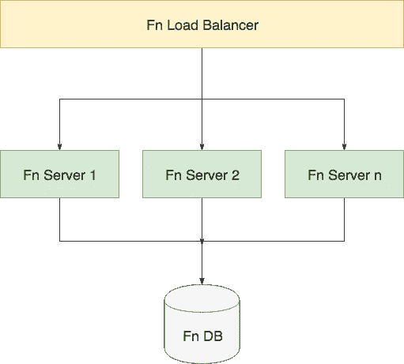
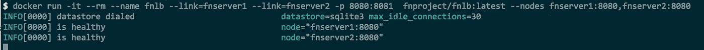

# 第二部分:Fn 负载平衡器

> 原文：<https://medium.com/hackernoon/part-ii-fn-load-balancer-585babd90456>


Photo by [Aziz Acharki](https://unsplash.com/@acharki95?utm_source=medium&utm_medium=referral) on [Unsplash](https://unsplash.com?utm_source=medium&utm_medium=referral)

**目录**

*   [第一部分:Fn 项目入门](https://hackernoon.com/playing-with-the-fn-project-8c6939cfe5cc)
*   **第二部分:Fn 负载均衡器(本帖)**

如果你正在寻找启动和运行 [Fn 项目](https://fnproject.io)，看看这个系列的第一篇文章。在这篇文章中，我将讨论 Fn 负载平衡器——它是什么，如何在本地运行它，以及如何将其部署到 Kubernetes 集群。

T[Fn 负载均衡器](https://github.com/fnproject/lb)的用途是智能地将流量路由到 Fn 服务器集群。这不是一个简单的循环路由，因为它有一些逻辑来根据传入的请求确定将流量路由到哪些节点。例如，如果您的函数在 node2 上是“热”的，负载平衡器将确保它被路由到该节点，而不是没有加载该函数的另一个节点。这样你可以获得更好的性能。

查看下面的简单图表，了解负载平衡器如何与 Fn 服务器和 Fn 数据库相适应。



Fn Load Balancer diagram

负载平衡器还会收集有关整个集群的信息，并显示节点列表及其状态，因此您可以使用这些信息通过添加更多 Fn 服务器来扩展集群，或者通过减少集群中的服务器数量来扩展集群。

# 本地运行

让多个 Fn 服务器在负载均衡器后面启动并运行并进行试验的最快方法是使用 Docker 在您的机器上本地运行它。

你要拉跑的图像叫做`fnproject/fnlb`。在撰写本文时，最新的版本/标签是`0.0.268`。

让我们试着运行几个 Fn 服务器和一个负载平衡器。我们将在容器中运行 Fn 服务器和负载平衡器——我们将负载平衡器链接到 Fn 服务器实例，以便它可以发现它。

如果您不想手动复制/粘贴本节中的命令，您可以获得下面的脚本—该脚本将自动启动 N 个 Fn 服务器容器和一个 Fn 负载平衡器。

> **注意**:确保在你计划运行上面脚本的同一个文件夹中运行`fn start`。原因是，Fn 可以为我们创建数据库文件。如果不这样做，启动 Fn 服务器容器时会出现错误。

首先运行几个 Fn 服务器容器。我们不需要向主机公开任何端口，因为我们将通过负载平衡器访问 Fn 服务器:

```
docker run -it --rm --name fnserver1 -v $PWD/data/fn.db:/app/data/fn.db  -v /var/run/docker.sock:/var/run/docker.sock fnproject/fnserver:latest
```

同样，在新的终端窗口中运行第二台 Fn 服务器。**确保从相同的文件夹运行第二台服务器，因为它们需要共享相同的数据库**:

```
docker run -it --rm --name fnserver2 -v $PWD/data/fn.db:/app/data/fn.db  -v /var/run/docker.sock:/var/run/docker.sock fnproject/fnserver:latest
```

> **注意**:如果你不想打开多个新的终端窗口，你可以在每个 Docker 命令中添加`*-d*`来以分离模式运行容器。我更喜欢在尝试时查看所有容器的日志。

最后，让我们运行负载平衡器，并链接到我们正在运行的 Fn 服务器:

```
docker run -it --rm --name fnlb --link fnserver1 --link fnserver2 -p 8080:8081 fnproject/fnlb:latest --nodes fnserver1:8080, fnserver2:8080
```

我们使用`--link`将容器链接在一起——这使得 Fn 服务器容器可以使用它们的名称(`fnserver1`和`fnserver2`)从 Fn 负载平衡器容器访问。我们还将端口 8080 暴露给主机，并将其链接到容器内部的端口 8081(即端口 1b 可从容器内部访问)。

如果一切正常，您应该会看到负载平衡器容器的以下输出，告诉您两个 Fn 服务器都在运行，状态良好，并且可以从负载平衡器访问:



Fn load balancer with 2 Fn servers

让我们试试这个！由于负载平衡器暴露在端口 8080 上，我们可以简单地运行`fn` CLI 命令来部署应用程序(我们可以为负载平衡器使用不同的端口，然后设置`FN_API_URL`环境变量来指向实际的主机和端口)。

此时，您可以创建和部署几个新功能:

```
fn init --runtime go testapp1
fn init --runtime go testapp2
fn init --runtime go testapp3cd testapp1
fn deploy --local --app testapp1
cd .. cd testapp2
fn deploy --local --app testapp2
cd ..cd testapp3
fn deploy --local --app testapp3
cd ..
```

然后尝试调用它们，查看调用是否被路由到两个 Fn 服务器实例。我使用这个命令从多个终端窗口连续调用端点:

```
while true; do sleep 1; curl [http://localhost:8080/r/testapp3/testapp3](http://localhost:8080/r/testapp3/testapp3); echo $(date);done
```

确保您替换了 app 和 func 名称(testappX ),最终您应该看到日志从两个 Fn 服务器实例输出。

## 管理端点

Fn 负载平衡器还公开了一个可在路径`/1/lb/nodes`上访问的管理端点，并支持`PUT`、`DELETE`和`GET`方法。使用`PUT`您可以动态地将一个节点添加到负载平衡器维护的节点列表中，`DELETE`方法将删除一个指定的节点，而使用`GET`您可以获得一个节点及其状态的列表。您可以想象实现某种使用特定事件从负载平衡器添加/删除节点的监视器。

# 在 Kubernetes 上运行

我们如何复制一个类似的设置，但不是在本地运行，而是在 Kubernetes 上运行？

Fn 负载平衡器支持 Kubernetes 操作模式，可以通过传入`-db=k8s`标志来激活该模式——在该模式下，`--nodes`标志将被忽略，您将能够使用标签和标签选择器来挑选运行 Fn 服务器的 pod。您可以手动创建在 Kubernetes 上部署所有这些所需的文件，但好消息是 Fn 团队已经为您完成了这项工作！

有一个 [Fn 舵图可用](https://github.com/fnproject/fn-helm)，你可以用它在你的 Kubernetes 集群上安装 Fn。

上面链接中的 Helm chart 还将在您的集群上安装 MySQL 和 Redis 的一个实例，以及 UI 和 Fn 流——因此您可以通过一个 Helm 命令获得完整的处理。

关于如何安装它的说明在[这里](https://github.com/fnproject/fn-helm)，但简而言之，一旦你安装了 [Helm](https://helm.sh) ，你运行以下命令来初始化 Helm，克隆 repo，安装图表依赖项，最后安装 Fn 图表:

```
helm init
git clone git@github.com:fnproject/fn-helm.git && cd fn-helm
helm dep build fn
helm install --name myfn fn
```

安装完成后，您还会看到如何设置指向负载平衡器的`FN_API_URL`环境变量的说明。如果您正在使用 Docker for Mac，您可以访问`http://localhost:80`上的负载平衡器。

如果您正在查看 Fn 负载平衡器(作为部署`fn-fnlb-depl`的一部分而创建的 pod)的日志，您应该会看到一系列活动，表明检测到了新的 pod，并且应该有一行如下所示:

```
time="2018-05-21T22:31:49Z" level=info msg="is healthy" node="10.1.0.23:80"
```

并指示 Fn 负载平衡器能够连接到 Fn 服务器。

如果你使用的是属于 Mac Docker 的 Kubernetes，最好的事情是 Fn 负载平衡器服务可以通过`[http://localhost:80](http://localhost:80,)`访问:

```
$ curl localhost:80/version
{"version":"0.3.455"}
```

注意:如果您将它部署到一个“真正的”集群，您可以通过运行`kubectl get svc`并检查`EXTERNAL-IP`列来查找`fn-fn-api`服务的外部 IP。

## 连接 Fn CLI

答假设您没有任何 Fn 服务器在本地运行，您将在尝试运行 Fn CLI 命令时得到一个错误。例如:

```
# Try to get the list of apps
$ fn list apps
ERROR: Get [http://localhost:8080/v1/apps](http://localhost:8080/v1/apps): dial tcp [::1]:8080: connect: connection refused
```

由于我们在本地主机端口 80 上公开了 Fn 负载平衡器，因此我们可以通过设置环境变量`FN_API_URL`或运行带有前置变量的 CLI 来将其与 CLI 连接起来:

```
FN_API_URL=[http://localhost:80](http://localhost:80) fn list apps
```

因为我们还没有部署任何东西，所以上面的命令将返回“没有找到应用程序”。将`FN_REGISTRY`设置到 Docker hub 存储库中，然后部署前面的 testapp1:

```
FN_API_URL=http://localhost:80 fn deploy --app testapp1
```

> **注意**:我们必须设置 FN_REGISTRY，因为我们不会像以前那样将应用程序部署到“本地”FN 服务器上。我们将实际构建映像并将其推送到 Docker hub，这样运行在 Kubernetes 集群中的 Fn 服务器就可以提取并运行它。

最后要做的事情是尝试运行部署的函数。您可以列出我们为获得完整端点(例如`http://localhost:80/r/testapp1/testapp1`)而部署的应用程序的路由，或者使用 Fn CLI 调用如下函数:

```
$ FN_API_URL=[http://localhost:80](http://localhost:80) fn call testapp1 testapp1
{"message1":"Hello World"}
```

# 结论

在本文中，我讨论了 Fn 负载平衡器，以及如何在本地设置它以进行开发和尝试，以及如何在 Kubernetes 集群上使用 Helm chart 部署它。

利用前一篇文章中的知识，您可以创建自定义的 Fn 服务器映像(包括自定义的扩展)，然后在 Kubernetes 集群中部署和运行它，或许还可以向最终用户公开该功能，并允许他们使用您的平台来部署他们的服务。

# 感谢阅读！

欢迎对本文的任何反馈！你也可以在 [Twitter](http://twitter.com/pjausovec) 和 [GitHub](http://github.com/peterj) 上关注我。如果你喜欢这个并且想在我写更多东西的时候得到通知，你应该订阅[我的简讯](https://tinyletter.com/pjausovec)！