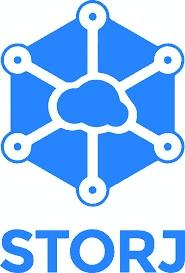
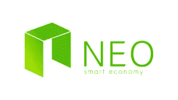
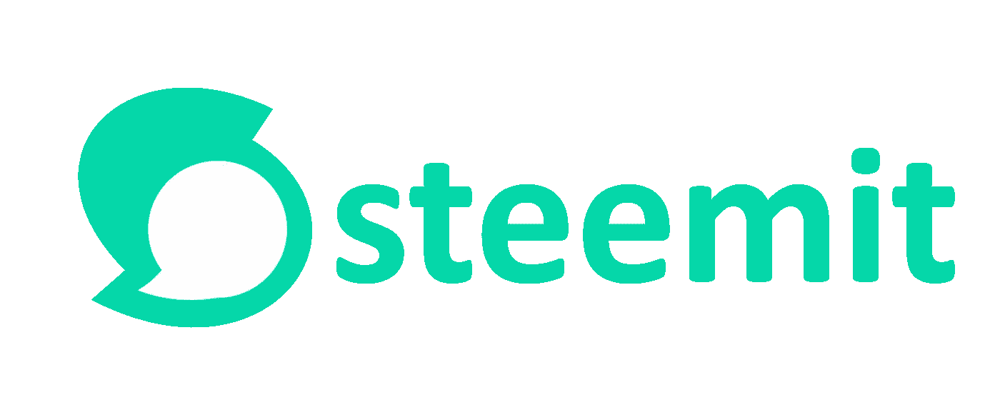
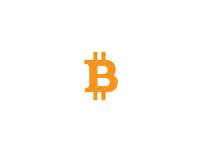

# 第二部分:顶级令牌经济模型

> 原文：<https://medium.com/hackernoon/part-ii-top-token-economic-models-1c45ca53446b>

这篇文章的目标是介绍不同的代币激励模型和共识协议，这些模型和协议很好地平衡了各个利益相关者(矿工、代币持有者、终端用户等)。)兴趣和激励积极的行为。

**岗位#1:** [什么是代币经济学？](/@CoreyBlinks/part-i-what-is-token-economics-tokenomics-69bb018c7a96)

**帖子#2:** 顶级经济模型

**岗位#3:** [系统性令牌经济问题](/@CoreyBlinks/part-iii-systematic-token-economic-issues-c30f816063fd)

**帖子#4:** [创建代币奖励的指南](/hackernoon/part-iv-a-guide-to-creating-token-incentives-8316f132fae4)

下面我将深入介绍 Storj、NEO、Steemit 和比特币的代币模型。现在，这些区块链没有完美的代币激励模型，但是，他们在提高代币激励模型的标准方面做得很好。

Logo Credit: [https://bitcoinsaltcoins.com/genaro-and-storj-labs-announce-collaboration-and-product-integration/](https://bitcoinsaltcoins.com/genaro-and-storj-labs-announce-collaboration-and-product-integration/)

**共识模型:**可检索性证明

**代币数量:** 1

**投票令牌:**无

**交易令牌:** 1

**区块奖励:**无

**交易费用:**是

Storj 是我最喜欢的区块链项目之一，因为它解决了一个系统性的区块链问题，即数据存储，这是他们的关键经济激励。在区块链上保存数据非常昂贵，成本很高。Storj 的目标是成为去中心化网络的收存箱。Storj 的共识模型是可检索性的证明。与需要专业采矿 ASIC 芯片的工作证明或利益证明共识模型不同，存储区块链只需要持续的互联网连接和笔记本电脑或 PC 上的可用存储来托管来自其网络的数据文件。一旦分散存储变得更加流行，可能就需要专门的设备。他们的共识模型——可检索性证明——会进行双重检查，并确保网络上的所有存储节点都对其数据空间可用性保持诚实。存储在网络上的数据是加密和分片的——每个节点都不知道自己保存了什么数据和谁的数据。

Logo Credit:[https://neo.org/logo?culture=en-us](https://neo.org/logo?culture=en-us)

**共识模型:**委托的利害关系证明—拜占庭容错

令牌数量: 2

**投票令牌:** NEO

**交易令牌:** NEOgas

**街区奖励:**否

**交易费用:**是(极低)

近地天体是区块链的基础设施。NEO 的团队希望支持智能经济，并解决链上治理问题和吞吐量限制(以太坊和比特币面临的问题)。他们通过建立委托股权证明模型来做到这一点，在该模型中，NEO 持有者可以投票选举最值得信赖的区块开采者，而不允许硬分叉。他们只有两个代币，主要的代币是 NEO，用于与区块链就重大问题进行表决。主令牌不是交易加密货币。他们的 NEOgas 代币是一种“计息”代币，通过持有 NEO 代币更长时间来获得。代币持有者因不忠诚而臭名昭著——你会责怪他们吗？有了 NEOgas，代币持有者就有动力建立一个受信任的存档网络。令牌持有者和节点的激励是一致的，并被激励做出有关 NEO 未来的决策，这可能会使基础技术更好，加密资产价值更稳定(和有价值)。

Logo Credit:[https://steemit.com/steemit/@abdellkarim/welcome-to-the-new-steemit-the-new-steemit-logo-and-other-changes](https://steemit.com/steemit/@abdellkarim/welcome-to-the-new-steemit-the-new-steemit-logo-and-other-changes)

**共识模型:**委托股权证明

**代币数量:** 3

**平台令牌:** STEEM

**交易令牌:** Steem 美元

**投票令牌:** Steem Power

**区块奖励:**无

**交易费用:**否

Steemit 是一个类似于 reddit 的社交网络，占区块链交易的最大比例之一。它位于应用层。如前所述，由于终端用户特定行为的复杂性，应用层令牌激励模型通常与行业(甚至 dapps)不同。Steemit 最好的方面是它有一个名为 Steem Power 的令牌，这是一个投票令牌，并不表示为一个实际的令牌。抱歉造成了混乱。Steem 代币持有者持有其主要 STEEM 代币的时间越长，就被赋予越多的 STEEM 权力、投票权。这激励了所有关键利益相关者更加忠诚，并使最忠诚的令牌持有者在决定 Steem 的长期战略方面更有影响力。因此，Steem 吸引了相信其平台的代币交易者，并使其代币价值成为比大多数代币更强的价值储存手段。

Logo Credit: [https://dribbble.com/shots/1411041-Bitcoin-Logo](https://dribbble.com/shots/1411041-Bitcoin-Logo)

**共识模式:**工作证明

**代币数量:** 1

**交易令牌:** 1

**交易费用:**是的

**投票令牌:**否

**格挡奖励:**是

**交易费用:**是

比特币，有最好的激励模式。尽管如此，该平台的主要好处是由矿工感受和实现的——比特币诞生了整个区块链和 DAG 行业。关于他们的代币经济学，有趣的一点是，它是一种不断给予的礼物。比特币已经并将继续拥有大量的硬分叉，其美妙之处在于，与任何其他加密货币相比，它单枪匹马地让更多人进入了加密货币领域。它确实有一些巨大的谬误，因为矿工规定了所有的软件更新，并保持块大小较小，因此，保持比特币的价值膨胀。

在第二部分，我将讨论我最喜欢的令牌经济模型及其原因。在第三部分，我将讨论系统的代币经济问题。感谢 Blackchain 校对了这篇文章。如果你对我的分析有任何建议，欢迎分享。我不是财务顾问，这也不是投资建议。如果您有兴趣了解更多关于 crypto 的知识。点击此处订阅我的简讯[，了解最新的密码行业更新。](http://coreyblinks.us15.list-manage.com/subscribe?u=48cdd549c54b81d4997b8c821&id=5834195179)

**捐款资助进一步的密码经济分析:**

**BTC:**1 lpyw 83 ytw 4 jqudvvlw 9 H2 VWF 8 sygu 8 equ

**ETH:**0x 0a 164 f 29 a2 d 08158 cc 04 ACB 35 e 17 CBE 9 bfffa 13 a

**NEO:**acvzku 3 gwxku 7 aexetbaeugntzskrv 9