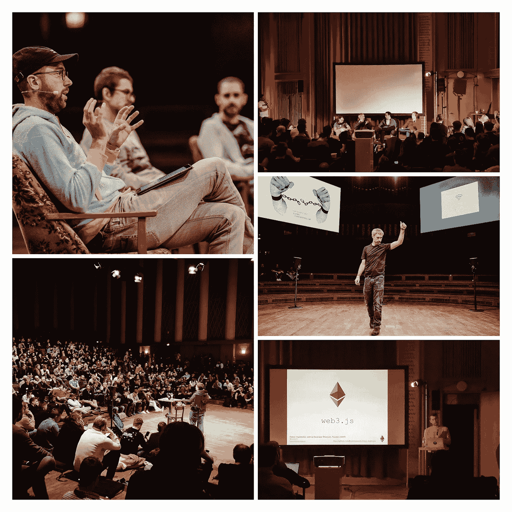
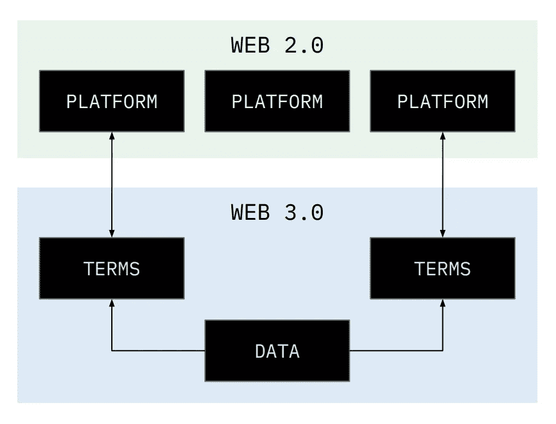
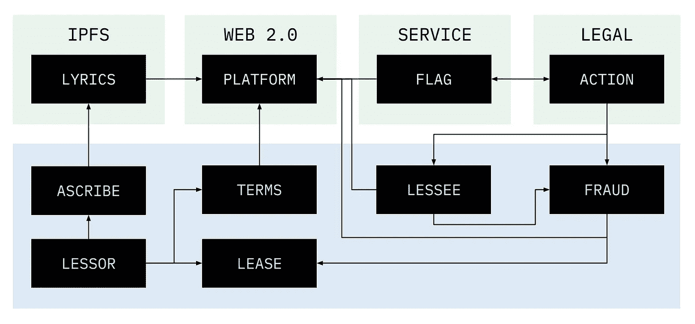

# 部分分权的组织

> 原文：<https://medium.com/hackernoon/partially-decentralized-organizations-fed25bdfcaa2>

是时候让区块链和加密货币社区反对不切实际的应用了。每个人似乎都不能停止谈论治理，尤其是难以捉摸的，“[分权自治组织](https://blockchainhub.net/dao-decentralized-autonomous-organization/)，或道。在*最纯粹的*道中，任何有网络和资金的人都可以参加。参与像[比特币](https://hackernoon.com/tagged/bitcoin)网络一样是伪匿名的。[第一次试刀被砍](https://www.coindesk.com/information/what-is-a-dao-ethereum/)。如果比特币网络治理有任何迹象的话，一个希望处理分布式账本之外的任何有意义的事情的纯粹的 DAO 有一条崎岖的道路要走。

让互联网基础设施去中心化和不可阻挡是我引以为豪的一件事。自治组织和链上治理可能会更远，需要先进的隐私保护状态转换和自主权身份。如果说我们从加密货币中学到了什么，那就是新用户很困惑。增加更多的技术和机制不会固定你的采用率。

尽管阿拉贡团队正在努力工作，初创公司仍然需要在传统世界中有一些立足点。像 [0x](https://0xproject.com/) 和 [MakerDAO](https://makerdao.com/) 这样的惊艳项目，远不是一个 DAO 模式。他们的目标是使用令牌进行治理。区块链空间的所有项目都广泛利用现有的互联网基础设施。更别提最近令人愤怒的 Infura 曝光事件。

在创业公司向月球进军之前，他们需要问自己:我今天能让他们掌握的这项技术最重要、最有用的应用是什么？这篇文章建议，“部分分权的组织”(PDO)是区块链项目和初创公司过渡时期的最佳架构。为什么？

1.  等待技术—分析瘫痪
2.  节约使用 Web3 更好的用户体验
3.  利用现有机构—更快地进入市场

# 等待技术

Web3 Summit Oct. 22–24 2018 in Berlin

Web 3.0、区块链和加密货币社区由世界级的社会思想家、开发人员和艺术家组成，这里仅举几个例子。他们正在创造我们这个时代保护个人权利和自由的最重要的工具。Web3 被大型企业或国家利益集团吸收为货币、监控和权力聚合的利益攸关。许多人似乎没有意识到战场是一个创造性和注意力驱动的经济，我们是在为我们的思想而战。

在他们的追求中，Web3 的战士们正在为个人创造不可阻挡的技术基础设施，就像前面提到的 DAO。他们面临着许多意识形态或技术不能完美融合的挑战。这导致暂时的僵局和延迟部署。等待像零知识证明(ZKPs)、可信硬件或紧迫的用户体验(UX)问题这样的技术可能需要几年时间才能让普通用户接受。考虑到区块链技术的现状，为普通互联网用户辩论一种包容的、有意义的治理形式是徒劳的。我们根本没有技术来改造社会。还没有。

那么我们能做什么呢？

# 谨慎使用 Web3

我们必须坚持下去，为用户提供对其数据和平台选择的主权。使用混合方法，我们可以利用 Web 2.0 的易用性和可提供性，以及平台级参与者的彻底透明性和责任性。我们需要从一种*增量*和*模块化*的心态来接近 Web3 的理想，而不是建立一个经济或投票机制的聚宝盆。

这个简单的图表概括了 Web3 的愿景:个人是他们自己的光数据库。他们拥有自己的数据，并按照自己的方式分享。该模型允许探索多种不同的治理机制*按菜单*。不喜欢你被对待的方式？通过取消链上以前的服务条款(TOS)并同意新的条款，转移到不同的平台。想参与治理？放弃 TOS 合同，开始新的平台。这是“软件”产品。每个人都应该写一个简单的文本 TOS 并仔细阅读。*买者自负*仍然适用。糟糕的演员呢？

# 利用现有机构

我们现有的基础设施可能*设计得很差*，但还没有*坏*。Web3 可以在一定程度上促进网上信任的协调。为了渗透到社会中，我们必须提供一键式界面，利用现有的金融、法律和企业基础设施。我们将用我们个人的数据主权和关于数据使用条款的不变契约来改变社会和这些机构，维护 Web3 的理想。

例证:现有的*创造*知识产权许可的机构将会消失，并完全在线处理，但*立法*和*部分*争议解决形式不会消失。

利用现有的网络基础设施和民间机构将是区块链创业公司走向市场战略的重要组成部分。

# lisyns——一个 IP PDO

Lisyns 正在保护音乐产业中个人的权利。他们的第一个版本“莎士比亚”，帮助用户自动许可歌词。Lisyns 还必须防范欺诈。这将需要一种混合的、细致入微的方法。利用极端的极简设计，该团队制定了以下标准:

1.  任何出租人都可以自己创作歌词，但必须提供一份保证书
2.  出租人为歌词设定了不超过债券的条款
3.  承租人根据条款付款
4.  双方共享平台和网络费用
5.  承租人和平台可以标记欺诈内容

Off-chain (green) — On-chain (blue)

## 最坏的情况

有人在网络上散布欺诈性歌词。一个独立运行的服务检测欺诈，收取少量费用，通知权利持有人对承租人采取法律行动。他们被要求撤下任何带有欺诈性歌词的衍生作品。承租人通知律师事务所，他们从一个基于区块链的平台收到了欺诈性歌词的许可证。

分散解决方案:

*   针对受质疑期限制的作品提出欺诈索赔。
*   Lisyns 和其他平台暂时取消了欺诈歌词的所有许可证。
*   挑战期允许任何用户投入少量保证金，并投票 ***支持*** 或 ***反对*** 索赔。如果多数人投票*支持*索赔，违约承租人的债券将被收回并分配给正确投票的多数人。歌词被从承租人的账户中移除，并且账户被标记。
*   承租人可以 Sybil 攻击，在许多帐户下投票。每一票都是有担保的，承租人的原始担保也岌岌可危。
*   这个游戏有一个[焦点](https://en.wikipedia.org/wiki/Focal_point_(game_theory)),如果投票继续，自私的第三方寻求利用少数方的债券规模，欺诈的承租人将处于不利地位。

完美吗？不太可能，但很接近。原创内容创作者的最后一道防线是接近 Lisyns 和其他上市平台，迫使他们根据 DMCA 规则取消许可。这默认了传统行为，并且通常导致原始内容创建者没有金钱奖励。

滥用权力呢？以真正的部分分散式组织(打地鼠)的方式。用户可以自由地将他们拥有的内容和许可证带到最适合他们的平台上。如果违规内容声明无效，那么平台应该毫无疑问地捍卫他们列出歌词和出售许可证的权利。

## 最坏的 Web 2.0 场景

每个人都在愉快地买卖许可证，直到他们最喜欢的平台“Bicence”开始收取高得令人发指的费用。大家慢慢迁移到一个新的平台。谢天谢地，他们拥有自己的内容、许可证、交易历史和声誉。所有值钱的东西都被保存在区块链号上。

## 奖金

这个架构类似于大多数项目，比如 0x，它提供了一个在以太坊上交易令牌的协议。有几个平台建立在 0x 之上，每个平台都受益于来自所有其他平台的全球链上流动性。如果要制定一个知识产权许可协议，这将是一个很好的起点😉

# 结论

直接跳到一个完全去中心化的世界，没有政府，每个公司都是伪匿名和自治的，这可能有点令人震惊。然而，随着时间的推移，随着越来越多的价值在网上交易，越来越精简、越来越不官僚的机构将会兴起并盛行。这毕竟对底线更好。客观地看，到 2021 年，全球零售额仍将低于 20%[,而到 2019 年](https://www.statista.com/statistics/534123/e-commerce-share-of-retail-sales-worldwide/)，中国的零售额将仅为 T2 的 1/3。随着 Web3 运动的推进，我们将需要在我们对去中心化和自治的渴望与良好的用户体验和现实世界的应用之间取得平衡。我们绝不能再失去任何阵地，绝不能停止为保护个人自由而战，但我们必须更聪明地工作，而不是更努力地工作。我们先不要重新发明轮子。

如果你热衷于建立真正的企业，使用适量的区块链，忠于 Web3 精神，请联系我们。

【medium.com/@mattdlockyer
[twitter.com/mattdlockyer](https://twitter.com/mattdlockyer)
[linkedin.com/in/mattlockyer](https://linkedin.com/in/mattlockyer)

消费者区块链项目现状的最新想法:

 [## 限量代币

### 使用一个假设的品牌，我将探索一种更好的方法来利用创建令牌的对等网络。

hackernoon.com](https://hackernoon.com/limited-edition-tokens-ed00891c18aa)  [## 免费的钱和免费的代币

### 许多为区块链项目发行的代币一文不值。

hackernoon.com](https://hackernoon.com/money-for-nothing-and-tokens-for-free-1a280159e138)